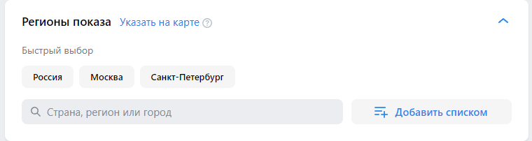
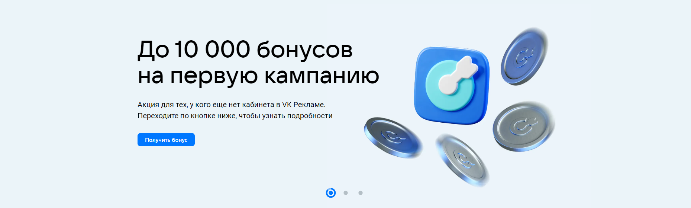
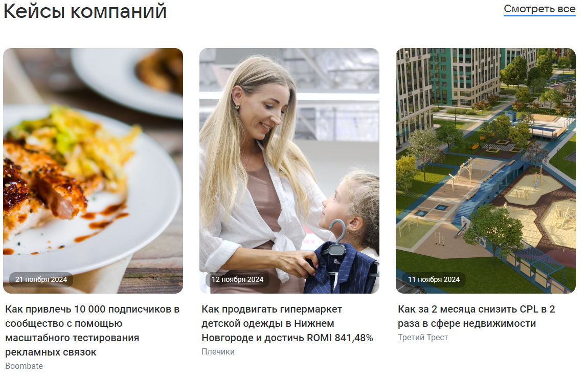
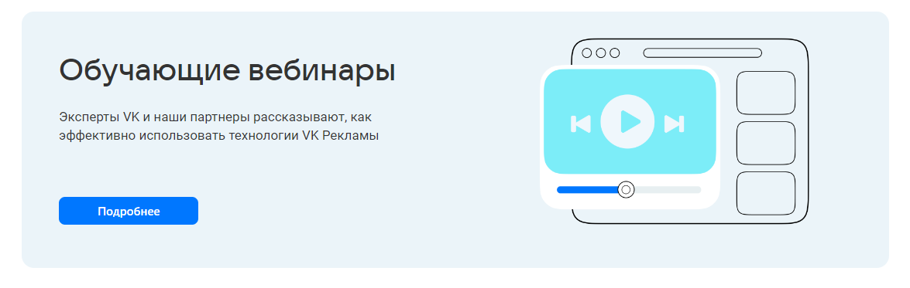
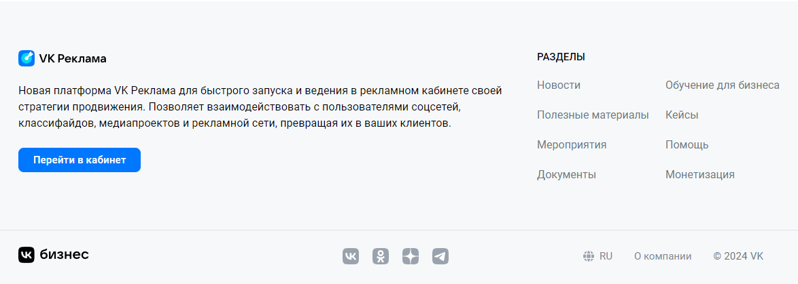
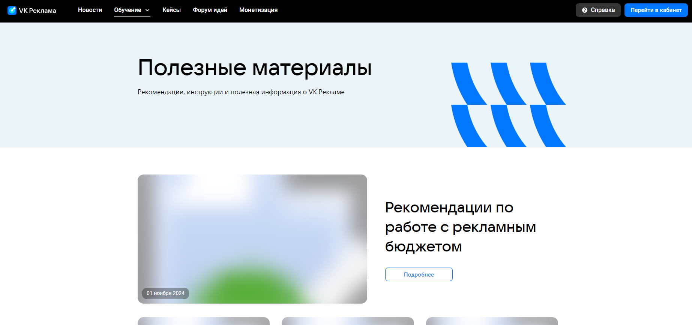
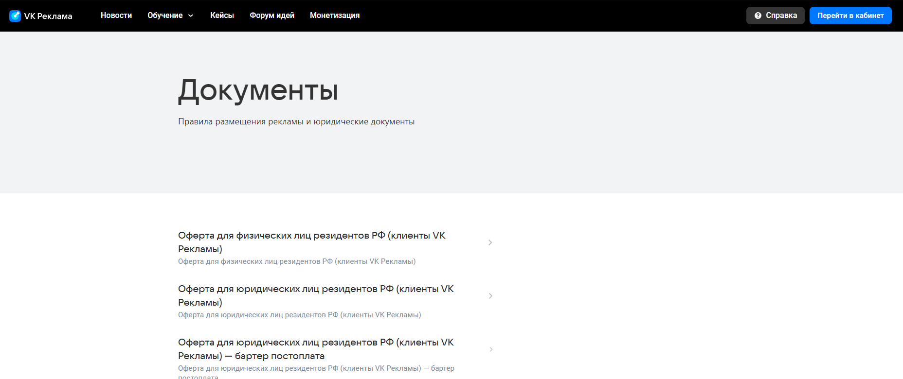
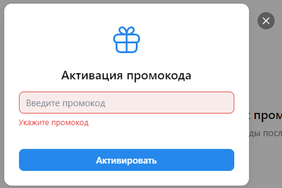

# Кампании
## Общее
1. Если у пользователя нет рекламных компаний, отображается надпись "Создайте первую рекламную кампанию" и кнопка "Создать кампанию".

2. Если у пользователя есть кампании, то они будут отображаться в списке

## Создание кампании
### Настройки кампании
При нажатии на кнопку "Создать кампанию" открывается страница создания кампании. На ней представлены нижеперечисленные элементы.

1. Боковая панель кампании содержит
    + Список кампаний, включая текущую
    + Итоговый бюджет кампании в рублях
2. Панель навигации с этапами создания кампании: "Настройки кампании", "Группы объявлений", "Объявления"
3. Слева от панели навигации содержится лимит объявлений и знак вопроса
    + При наведении на знак вопроса появляется поп-ап с дополнительной информацией

        

4. Заголовок с названием кампании
    + При нажатии на заголовок открывается [поле](#4-инпут-с-названием) для редактирования названия кампании
        
    + При нажатии на три точки в правой части контейнера появляется кнопка "Скопировать существующую" 

        

        - Нажатие на кнопку приведет к открытию блока выбора кампании, в котором представлены следующие элементы:
            + Выпадающий список с выбором кампаний
            + Если кампаний нет, то в списке будут отображаться надпись "Ничего не найдено"
            + Если кампании есть, то они появятся в этом списке
            + Кнопка "Отменить копирование", нажатие на которую приведет к возврату в раздел создания кампании

            

5. Раздел "Целевые действия"
    + При наведении на знак вопроса рядом с названием раздела появляется поп-ап с подсказкой

        
    
    + В данном разделе можно выбрать цель для рекламной кампании. Более подробное описание представлено ниже
    + При выборе конкретной цели кнопка с текущим вариантом подсвечивается голубой рамкой. Под списком вариантов появляются дополнительные поля
6. Раздел "Узнваемость и охват"
    + При наведении на знак вопроса рядом с названием раздела появляется поп-ап с подсказкой

        

    + В данном разделе можно выбрать формат рекламы. Более подробное описание представлено ниже
    + При выборе конкретного формата кнопка с текущим вариантом подсвечивается голубой рамкой. Под списком вариантов появляются дополнительные поля
7. Кнопка "Продолжить" внизу контейнера
    + Нажатие на кнопку приведет к переходу в раздел "Группы объявлений", если все поля были заполнены корректно. Рядом появится кнопка "Сохранить как черновик"
    + Если какие-то поля были пропущены или заполнены неверно, то рядом с кнопкой появится красная надпись с указанием количества ошибок
        - Нажатие на кнопку приведет к появлению поп-апа с информацией о том, в каких полях были допущены ошибки

            

    + При переходе на этап "Группы объявлений" предыдущий этап "Настройка кампании" помечается зеленой галочной в хедере, а номер текущего этапа "Группы объявлений" становится синим. В левой части контейнера также появится кнопка "Назад"

### Целевые действия
1. Сайт
    - Поле для ввода ["Ссылка на сайт"](#3-инпут-ссылка-на-сайт)
        + Если домен указан верно, то внизу появляются все поля, которые указаны ниже

        

    - Поле ввода "Важные детали и отличия от конкурентов"
        + Максимальное количество вводимых символов - 300. Все последующие символы будут обрезаться
    - Выпадающий список "Целевое действие" с опциями "Клики по рекламе" и "Показы рекламы"
    - Чекбокс "Учитывать офлайн-конверсии"
    - Чекбокс "Оптимизация бюджета кампании". При выборе чекбокса добавляются следующие поля:
        + Выпадающий список "Стратегия ставок" с опциями "Минимальная цена" и "Предельная цена"

        

        + При выборе пункта "Предельная цена" появляется инпут ["Максимальная стоимость клика"](#2-инпут-бюджетмаксимальная-стоимость-показов)
        
        

        + Группа полей "Бюджет" будет отображаться независимо от выбранного варианта выпадающего списка. Включает в себя следующее:
            - Инпут для ввода бюджета. На него действуют те же ограничения, что и на прошлый инпут
            - Выпадающий список с вариантами "За день" и "За все время"
    - Два инпута ["Даты проведения"](#1-группа-инпутов-даты-проведения). Является обязательной к заполнению, если в прошлом списке выбран вариант "За все время"
    
2. Каталог товаров
    - Группа радиокнопок "Объект рекламы" с вариантами "Сайт", "Мобильное приложение", "Сообщество ВКонтакте", "Магазин на маркетплейсе"
    - Далее рассмотрим только вариант "Сайт", так как остальные требуют взаимодействия со сторонними сервисами
    - Поле ["Рекламируемый сайт"](#3-инпут-ссылка-на-сайт)
    - Выпадающий список "Каталог товаров" 
        + Если в каталоге пользователя нет товаров, в выпадающем списке будет надпись "Ничего не найдено" и кнопка "Создать каталог"
        + Если у пользователя есть каталоги, то они отобразятся в этом списке
        + Если нажать кнопку "Создать каталог" то появится форма создания
    - Чекбокс "Тип кампании" с вариантами "Привлечение потенциальных клиентов" и "Динамический ретаргентинг"
    - Остальные поля совпадают с целевым действием "Сайт"
3. Лид-формы и опросы
    - Группа радиокнопок "Объект рекламы" с вариантами "Лид-форма" и "Опрос"
    - Если выбрать вариант "Лид-форма", то появятся нижеперечисленные элементы
        + Выпадающий список "Лид-форма"
            - Если у пользователя нет лид-форм, то будет надпись "Ничего не найдено" и кнопка "Создать лид-форму"
            - Если у пользователя есть лид-формы, то они появятся в этом списке
            - Если нажать кнопку "Создать лид-форму" то появится форма создания
        + Чекбокс "Сплит-тест". Активация чекбокса приведет к появлению полей, которые описаны далее
        + Выпадающий список "Лид-форма" (аналогичен предыдущему списку)
        + Кнопка "Добавить еще одну"
            - Нажатию на кнопку приведет к добавление еще одного списка 
            - Всего можно создать 4 лид-формы, каждая из которых будет являться обязательной
            - Напротив двух последних списков будет иконка крестика, нажатие на которую приведет к удалению списка
        + Выпадающий список "Целевое действие". При выборе лид-формы доступен только вариант "Получение лидов". Список при этом неактивен
        + Инпут ["Даты проведения"](#1-группа-инпутов-даты-проведения)
    - Если выбрать вариант "Опрос", то появятся нижеперечисленные элементы
        + Выпадающий список "Форма опроса"
            - Если у пользователя нет опросов, то будет надпись "Ничего не найдено" и кнопка "Создать опрос"
            - Если у пользователя есть опросы, то они появятся в этом списке
            - Если нажать кнопку "Создать опрос" то появится форма создания
        + Чекбокс "Целевое действие"
        + Поле "Количество респондентов". Если ввести менее 10 нажать кнопку "Продолжить", то поле подсветится красным и появится красная надпись "Количество респондентов должно быть не меньше 10"
        + Поле ["Бюджет"](#2-инпут-бюджетмаксимальная-стоимость-показов). Под полем находится информационное сообщение о минимальном бюджете, который рассчитывается исходя из числа респондентов
        + Инпут ["Даты проведения"](#1-группа-инпутов-даты-проведения)
        + Информационное сообщение "Кампания остановится автоматически, когда будет достигнуто заданное количество респондентов"

Остальные целевые действия не будут рассмотрены, так как они требуют взаимодействия со сторонними сервисами.

### Узнаваемость и охват
1. Баннерная реклама
    - Группа кнопок "Формат объявления" с вариантами "Все форматы" и "Новые форматы скоро" (кнопка недоступна для выбора)
    - Чекбокс "Объект рекламы" с вариантами "Сайт", "Сообщество ВКонтакте" и "Мобильное приложение"
    - Далее рассмотрим только вариант "Сайт", так как остальные требуют взаимодействия со сторонними сервисами
    - Поле ввода ["Ссылка на сайт"](#3-инпут-ссылка-на-сайт)
    - Выпадающий список "Целевое действие" с единственными вариантом "Показ рекламы". Список неактивен
    - Чекбокс "Оптимизация бюджета кампании". Активация чекбокса приводит к появлению нижеперечисленных полей
        + Выпадающий список "Стратегия ставок" с вариантами "Максимум показов", "Предельная цена" и "Фиксированная ставка"
        + Инпут ["Цена за 1000 показов"](#2-инпут-бюджетмаксимальная-стоимость-показов)
            - Значение по умолчанию - 70 ₽
            - Если ввести значение меньше и нажать кнопку "Продолжить", то поле подсветится красным и появится красная надпись "Цена должна быть больше или равна 70 ₽"
        + Поле ["Бюджет"](#2-инпут-бюджетмаксимальная-стоимость-показов)
        + Чекбокс "Распределение бюджета" c вариантами "Равномерное" и "Быстрое"
    - Инпуты ["Даты проведения"](#1-группа-инпутов-даты-проведения)
    - Чекбокс "Настройка частоты показов для кампании"
        + При активации появляется группа с выпадающими списками "Показов на пользователя"
        + В первом выпадющем списке содержатся варианты от "До 1 раза" до "До 30 раз"
        + Во втором выпадающем списке содержатся варианты "За 1 день", "За 7 дней" и "За 30 дней"
2. Видеореклама
    - Группа кнопок "Формат объявления" с вариантами "Все видеоформаты", "Ролик в видео (in-stream)" и "Новые форматы скоро" (кнопка недоступна для выбора)
    - Чекбокс "Объект рекламы" с вариантами "Сайт", "Сообщество ВКонтакте" и "Мобильное приложение"
    - Далее рассмотрим только вариант "Сайт", так как остальные требуют взаимодействия со сторонними сервисами
    - Все поля совпадают с полями раздела "Баннерная реклама" за следующими исключениями:
        + При выборе пункта "Все видеоформаты" выше:
            - Выпадающий список "Целевое действие" будет содержать единственный вариант "Показы рекламы" и будет неактивен
            - Поле ["Цена за 1000 показов"](#2-инпут-бюджетмаксимальная-стоимость-показов) будет иметь занчение по умолчанию 100 ₽
            - Если ввести значение меньше и нажать кнопку "Продолжить", то поле подсветится красным и появится красная надпись "Цена должна быть больше или равна 100 ₽"
        + При выборе пункта "Все видеоформаты" выше:
            - Выпадающий список "Ролик в видео (in-stream)" будет содержать варианты "Показы рекламы" и "Просмотр рекламы"
            - При выборе пункта "Показы рекламы":
                + Поле ["Цена за 1000 показов"](#2-инпут-бюджетмаксимальная-стоимость-показов) будет иметь значение по умолчанию 240 ₽
                + Если ввести значение меньше и нажать кнопку "Продолжить", то поле подсветится красным и появится красная надпись "Цена должна быть больше или равна 240 ₽"
            - При выборе пункта "Просмотр рекламы":
                + Поле ["Цена за 1000 показов"](#2-инпут-бюджетмаксимальная-стоимость-показов) будет иметь значение по умолчанию 0,2 ₽
                + Если ввести значение меньше и нажать кнопку "Продолжить", то поле подсветится красным и появится красная надпись "Цена должна быть больше или равна 0,2 ₽"
3. HTML5 баннер
    - Кнопки "Формат баннера":
        + Кнопки "240px * 400px", "100% * 90px", "300px * 600px" для десктопных версий
        + Кнопки "100% * 300px", "100% * 100px", "300px * 250px" для мобильных версий
    - Поле ["Рекламируемый сайт"](#3-инпут-ссылка-на-сайт)
    - Все поля совпадают с полями раздела "Баннерная реклама"
    - Единственное исключение - поле ["Цена за 1000 показов"](#2-инпут-бюджетмаксимальная-стоимость-показов)
        + Будет иметь значение по умолчанию 50 ₽
        + Если ввести значение меньше и нажать кнопку "Продолжить", то поле подсветится красным и появится красная надпись "Цена должна быть больше или равна 50 ₽"

4. Премиальное размещение
    - Группа кнопок "Формат объявления". Далее рассмотрим поведение сайта при выборе каждого варианта
    - Кнопка "Билборд"
        + Чекбокс "Для каких устройств" с опциями "Все устройства", "Десктопные" и "Мобильные"
        + Остальные элементы совпадают с элементами раздела "HTML5 баннер"
        + Единственное исключение - поле ["Цена за 1000 показов"](#2-инпут-бюджетмаксимальная-стоимость-показов)
            - Будет иметь значение по умолчанию 380 ₽
            - Если ввести значение меньше и нажать кнопку "Продолжить", то поле подсветится красным и появится красная надпись "Цена должна быть больше или равна 380 ₽"
    - Кнопка "В Дзене"
        + Чекбокс "Для каких устройств" с опциями "Десктопные" и "Мобильные"
        + Остальные элементы совпадают с элементами раздела "HTML5 баннер"
        + Единственное исключение - поле ["Цена за 1000 показов"](#2-инпут-бюджетмаксимальная-стоимость-показов)
            - Будет иметь значение по умолчанию 300 ₽
            - Если ввести значение меньше и нажать кнопку "Продолжить", то поле подсветится красным и появится красная надпись "Цена должна быть больше или равна 300 ₽"
    - Кнопка "В Новостях в Дзене"
        + Чекбокс "Для каких устройств" с опциями "Все устройства", "Десктопные" и "Мобильные"
        + Остальные элементы совпадают с элементами раздела "HTML5 баннер"
        + Единственное исключение - поле ["Цена за 1000 показов"](#2-инпут-бюджетмаксимальная-стоимость-показов)
            - Будет иметь значение по умолчанию 250 ₽
            - Если ввести значение меньше и нажать кнопку "Продолжить", то поле подсветится красным и появится красная надпись "Цена должна быть больше или равна 250 ₽"
    - Кнопка "На весь экран"
        + Чекбокс "Для каких устройств" с опцией "Десктопные"
        + Остальные элементы совпадают с элементами раздела "HTML5 баннер"
        + Единственное исключение - поле ["Цена за 1000 показов"](#2-инпут-бюджетмаксимальная-стоимость-показов)
            - Будет иметь значение по умолчанию 300 ₽
            - Если ввести значение меньше и нажать кнопку "Продолжить", то поле подсветится красным и появится красная надпись "Цена должна быть больше или равна 300 ₽"
    - Кнопка "240px × 100%" полностью аналогична по действию кнопке "На весь экран"

### Группы объявлений
При переходе на вкладку "Группы объявлений" открывается страница, которая состоит из нижеперечисленных элементов.
1. Название группы
    - При клике по названию открывается [поле для его редактирования](#4-инпут-с-названием)
    - При нажатии на три точки рядом с названием появится выпадающее меню, которое содержит следующие опции:
        + "Дублировать группу". При нажатии на эту кнопку на боковой панели появится копия текущей группы

            
        
        + "Удалить группу"
            - Нажатие на эту кнопку приведет к появлению модального окна с предупреждением об удалени группы и кнопками "Удалить" и "Отмена"
            - Нажатие на кнопку "Удалить" приведет к удалению группы объявлений. При этом она также исчезает из списка в левой панели
            - Нажатие на кнопку "Отмена" приводит к закрытию модального окна
        + "Добавить объявление"
            - Нажатие на эту кнопку приведет к появлению на боковой панели объявления текущей группы, затем произойдет переход к его настройкам
2. Контейнер "Стратегия вставок"
    - Выпадающий список "Стратегия ставок" содержит единственное значение "Минимальная цена" и неактивен
    - Кнопка "Настроить даты проведения"
        + При клике кнопка скрывается и открываются два инпута ["Даты проведения"](#1-группа-инпутов-даты-проведения)
        + Также при клике справа от инпутов появляется крестик, нажатие на который приведет к закрытию инпутов и появлению кнопки "Настроить даты проведения"
    - Кнопка "Настроить время показа". При клике кнопка скрывается и открываются нижеуказанные элементы
        + Кнопки "Мое время", "Будни", "Рабочее", "Выходные", кнопка корзины
        + Таблица времени показа с номерами недель в столбцах и днями недели в строках

            

            - При нажатии на ячейку с галочкой происходит снятие галочки
            - При нажатии на пустую ячейку в ней ставится галочка
            - При нажатии на день недели, строка с этим днем недели заполняется галочками, если она до этого была с пустыми ячейками, и наоборот
            - При нажатии на номер недели, столбец с этим номером недели заполняется галочками, если он до этого был с пустыми ячейками, и наоборот
            - При нажатии на кнопку с иконкой коризнкой снимаются все галочки
            - При нажатии на кнопку "Будни", "Рабочее", "Выходные", галочки расставляются в соответствии с выбранными кнопками:
                + "Будни" - галочки ставятся в ячейках с понедельника по пятницу
                + "Рабочее" - галочки ставятся в ячейках с понедельника по пятницу с 8 по 19 неделю
                + "Выходные" - галочки ставятся в ячейках с субботы по воскресенье
                + Для остальных вариантов активируется кнопка "Мое время"
            - Нажатие на крестик справа от таблицы приведет к закрытию инпутов и появлению кнопки "Настроить время показа"
        + Чекбокс "Учитывать местное время"
        + Чекбокс "Учитывать праздники"
3. Контейнер "Регионы показа"
    - Клик по названию контейнера приведет к сворачиванию контейнера
    - Клик по стрелке в правой части контейнера приведет к сворачиванию контейнера
    - Кнопка "Указать на карте"/"Выбрать из списка" справа от названия контейнера
        + Клик на кнопку приводит к смене элементов контейнера
    - Если активирована кнопка "Указать на карте", то контейнер содержит следующие элементы:

        

        + Кнопка меняет надпись на "Выбрать из списка"
        + Интерактивный виджет карты
        + Инпут "Места"
            - При вводе двух и более символов появляется выпадающий список с доступными местами
            - При начале ввода появляется крестик в правой части инпута, нажатие на который приводит к его очистке
        + Кнопка "Добавить списком"
            - Клик по кнопке приводит к открытию модального окна, которое содержит в себе текстовое описание и инпут для загрузки файлов
        + Контейнер со списком мест
            - Если ни одно место не было добавлено, то контейнер пуст, в нем отображается информационное сообщение
            - При добавлении мест они будут отображаться в виде списка с указанием количества выбранных областей

                
            - В правой части контейнера находится кнопка "Очистить все", клик на которую приведет к очистке списка
            - Справа от каждой позиции спсика находится крестик, нажатие на который приводит к удалению позиции
        + Выпадающий список "Тип места" с вариантами "Любое", "Посещали недавно", "Регулярно бывает"
4. Контейнер "Расширение аудитории"
    - Клик по названию контейнера приведет к сворачиванию контейнера
    - Клик по стрелке в правой части контейнера приведет к сворачиванию контейнера
    - Содержит в себе чекбокс "Расширить аудиторию"
    - Клик по чекбоксу доступен только с условием, указанным в поп-апе с информацией

        
5. Контейнер "Демография"
    - Радиокнопки с выбором пола: "Любой", "Мужской", "Женский"
    - Два выпадающих списка "Возраст"
        + Первый список содержит диапазое значений от 12 до 75
        + Второй список содержит диапазон значений от того, которое указано в первом списке, до 75
    - Выпадающий список "Возрастная маркировка" с вариантами "0+", "6+", "12+", "16+", "18+"
    - Чекбокс "Социальная реклама"
6. Контейнер "Интересы и поведение". Содержит группу кнопок "Интересы", "Ключевые фразы", "Сообщества", "Музыканты"
    - При активации любой кнопки появлятся дополнительный контейнер
        + Справа от названия содержится иконка мусорного бака, нажатие на которую приводит к удалению контейнера
    - Если активирована кнопка "Интересы" добавляются следующие элементы:
        + Выпадающий список "Введите название", в котором можно выбрать любое количество вариантов
        + Кнопка "Добавить исключение", нажатие на которую приведет к появлению аналогичного списка
        + Справа от этого списка будет иконка крестика, нажатие на которую приведет к его закрытию
    - Если активирована кнопка "Ключевые фразы", добавляются следующие элементы:
        + Поле ввода "Ключевые фраза"
            - Если найдены совпадения с введенными буквами, то слева под инпутом появляется кнпока "Показать похожие"
            - При клике на кнопку появляется список с фразами, каждую из которых можно добавить в инпут нажатием на нее
            - При клике на кнопку "Отмена" список закрывается
            - При клике на кнопку "Добавить все" в инпут добавляются все фразы из списка
        + Поле ввода "Минус-фразы"
            - Если введенная фраза фигурирует в предыдущем поле, появляется надпись с предупреждением

                
        + Инпут "Период поиска"
        + Если ввести ключевые фразы в поле "Ключевые фразы", то появится информационное сообщение с предложением создать аудиторию с данными ключевыми фразами и кнопкой "Создать аудиторию"

            

            - Если нажать на кнопку "Создать аудиторию", то создастся аудитория с данными ключевыми фразами
    - Если активирована кнопка "Сообщества", то добавляются следующие элементы:
        + Инпут ввода сообщества
            - При вводе букв в инпут под ним появляется выпадающий список сообществ с похожими названиями
            - Нажатие на крестик в правой части инпута приведет к его очистке
        + Кнопка "Добавить списком". Клик на кнопку вызывает появление выпадющего списка с опциями "Сообщества ВКонтакте" и "Группы ОК"
            - Клик на любую из этих кнопок вызывает появление модального окна с нижеперечисленными элементами
            - Поле ввода ID/ссылок
            - Поле для загрузки CSV или TXT файла
            - Кнопка "Добавить сообщество", нажатие на которую приводит к добавлению сообщества в список
        + Список добавленных сообществ
        + Кнопка "Удалить все", нажатие на которую приводит к очистке списка
        + Напротив каждого добавленного сообщества находится крестик, нажатие на который приводит к удалению сообщества из списка
        + Сообщение с предложением создать аудиторию (см. "Ключевые фразы")
    - Если активирована кнопка "Музыка", то добавляются следующие элементы:
        + Инпут ввода музыкантов. По поведению аналогичен инпуту для ввода сообществ
        + Список добавленных музыкантов, аналогичный предыдущему пункту
        + Сообщение с предложением создать аудиторию (см. "Ключевые фразы")
7. Контейнер "Аудитории"
    - Выпадающий список с аудиториями
        + Если по запросу не нашлось аудиторий, то появится надпись "Ничего не нашлось"
        + Если нажать на кнопку редактирования рядом с найденной аудиторией, то откроется окно редактирования аудитории
        + Если выбрать аудиторию, то она добавится в список выбранных аудиторий
        + Если нажать на крестик рядом с выбранной аудиторией, то она уберется из списка выбранных аудиторий
    - Кнопка "Добавить исключения"
        + Клик по кнопке приведет к появлению выпадающего списка, аналогичного списку в прошлом пункте
        + Клик по крестику справа от списка приведет к закрытию списка
    - Кнопка "Собирать аудиторию"

        

        + Клик по кнопке приводит к появлению выпадающего списка выбора событий с вариантами "Показы", "Клики", "Показы видео на 25%", "Показы видео на 50%", "Показы видео на 75%", "Показы видео на 100%"
        + Клик по крестику справа от списка приводит к его закрытию
        + Если в список был добавлен хотя бы один элемент, снизу добавится еще один выпадающий список с выбором аудитории
        + Кнопка "Добавить аудиторию"
            - Клик по кнопке приводит к добавлению выпадающего списка выбора событий, по поведению аналогичного предыдущему
8. Контейнер "Устройства"
    - Чекбокс "Десктопные"
    - Чекбокс "Мобильные"
9. Контейнер "Параметры URL" содержит группу радиокнопок с указанными ниже параметрами:
    - "Добавлять UTM-метки автоматически"
        + При выборе этого параметра ниже будет содержаться поле для ввода без возможности редактирования содержимого
    - "Добавлять UTM-метки вручную"
        + При ыборе параметра ниже будет содержаться поле для ввода, а также ссылка "Список доступных параметров", переход по которой приводит на страницу справки
    - "Не добавлять UTM-метки"
10. Контейнер "Места размещения" содержит чекбокс "Автоматический выбор мест размещения"
    - Если чекбокс выбран, то контейнер не содержит других элементов
    - Если чекбокс снят, то ниже содержится группа чекбоксов "ВКонтакте", "Одноклассники", Проекты VK", "Рекламная сеть" с подгруппами чекбоксов
11. Кнопка "Добавить еще группу" 
    - Клик по кнопке приводит к появлению новой группы в списке слева и переходу к ее редактированию
12. В правой части экрана содержится контейнер "Целевая аудитория"

    

    - Текст с указанием размера целевой аудитории
    - Прогресс-бар с указанием охвата
    - Текст с указанием количества показов и кликов
    - Если аудитория будет слишком широкой или слишком узкой, то в контейнере будет содержаться кнопка "Как исправить", клик на которую приведет к открытию всплывающего окна с подсказкой
13. Кнопка "Назад", клик по которой приведет к переходу во вкладку "Настройки кампании"
14. Кнопка "Сохранить как черновик"
15. Кнопка "Продолжить", клик по которой приведет к переходу во вкладку "Объявления"

### Объявления
При переходе на этап "Объявления" открывается страница создания объявления, состоящая из указанных ниже элементов:
1. Название объявления
    - Если нажать на название объявления, то появится поле для ввода названия объявления
    - Если нажать на три точки рядом с названием, то появятся опции:
        + "Дублировать объявление"
            - Если нажать на эту кнопку, то на боковой панели будет создан дубликат объявления
    - "Удалить объявление"
        + Если нажать на эту кнопку, то появится модальное окно с предупреждением о удалении объявления и кнопками "Отмена" и "Удалить"
        + Если нажать на кнопку "Удалить", то объявление будет удалено
        + Если нажать на кнопку "Отмена", то модальное окно закроется
2. Предпросмотр объявления, который содержит нижеперечисленные элементы
    - Форма объявления
        + Кнопка "Выбрать логотип"
        + Инпут "Заголовок"
        + Инпут "Короткое описание"
        + Инпут "Длинное описание".
        + Инпут "Текст рядом с кнопкой".
        + Инпут ["Ссылка на сайт"](#3-инпут-ссылка-на-сайт)
        + Выпадающий список "Надпись на кнопке"
        + Инпут "Медиафайлы"
        + Инпут "О рекламодателе"
    - Кнопка "Добавить еще объявление"
    - Если нажать на кнопку, то на боковой панели появится еще одно объявление
3. В футере отображается кнопка "Опубликовать". Так как публикация требует взаимодействия с платежными средствами, она не будет рассмотрена

## Часто используемые поля ввода
### 1. Группа инпутов "Даты проведения"
- При нажатии на любой инпут появляется окно календаря

    

- Нажатие на иконку крестика во втором инпуте приведет к его очищению
- Взаимодействие с этой же иконкой в первом инпуте не дает эффекта

### 2. Инпут "Бюджет"/"Максимальная стоимость показов"
- Максимальное количество вводимых цифр - 13. Все последующие цифры будут обрезаться
- При попытке ввести любые другие символы курсор будет перемещаться на одну позицию вправо при каждом нажатии клавиши

### 3. Инпут "Ссылка на сайт"
- Нажатие кнопки "Продолжить" при пустом поле приведет к появлению сообщения "Обязательное поле" и смене цвета поля на красный

    

- Нажатие кнопки "Продолжить" при неверном формате домена приведет к появлению сообщения "Неверный формат URL" и смене цвета поля на красный

    

- Рядом с инпутом расположена кнопка, нажатие на которую приведет к переходу на указанный сайт

### 4. Инпут с названием
- При попытке ввести название длиной меньше трех символов галочка меняет цвет на серый

    

- При вводе названия, которое удовлетворяет указанному выше условию, галочка становится синей

    

- Название сохраняется при клике за пределами инпута или при клике на иконку галочки
