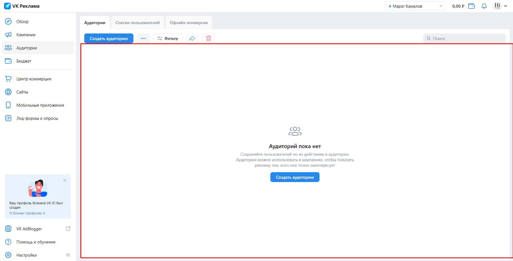
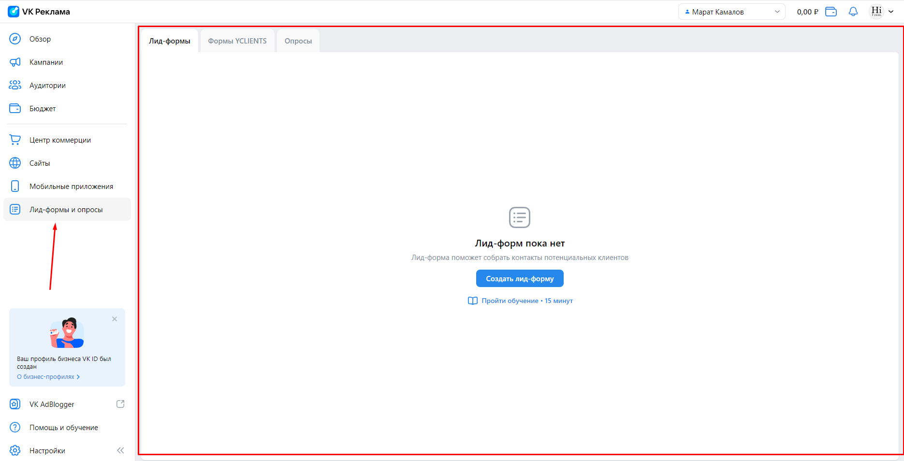
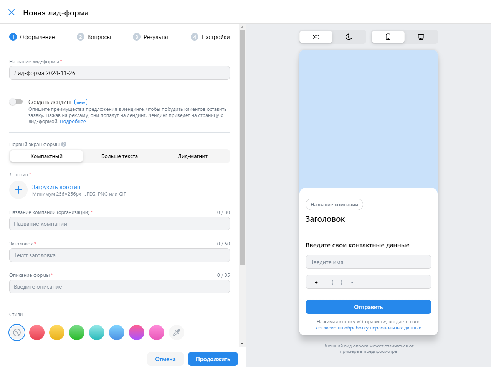
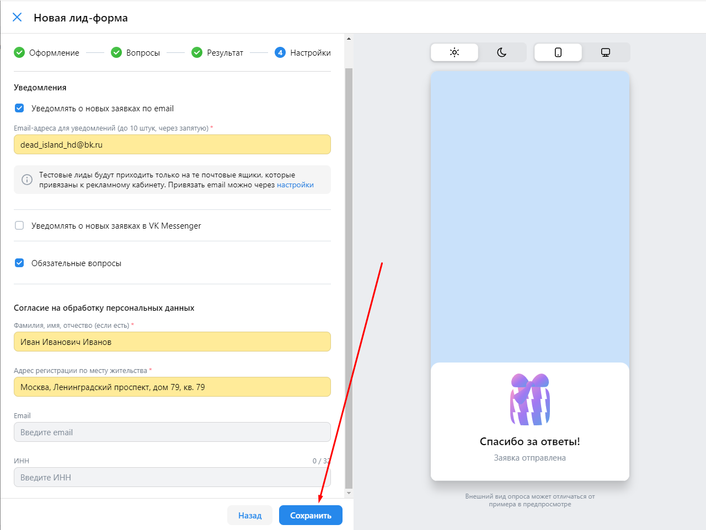

# [Чек лист для ads.vk.com](https://ads.vk.com)

## [Аудитории](https://ads.vk.com/hq/audience)

### При нажатии по вкладке "Аудитории" происходит отображение данных об аудиториях

### При нажатии по вкладке "Списки пользователей" происходит отображение данных списках пользователей

### При нажатии по вкладке "Офлайн-конверсии" происходит отображение данных об офлайн-конверсиях

### При нажатии на кнопку "Создать аудиторию" справа появляется боковое меню "Создание аудитории"

### При нажатии на кнопку "Добавить источник" к боковому меню добавляется ещё одно меню "Включить источник"

### При вводе ключевого слова в поле с ключевыми словами появляется зелёная надпись "Показать 9 похожих" 

### При нажатии на кнопку "Показать 9 похожих" открывается меню с похожими ключевыми словами

### При нажатии на кнопку "Добавить" ключевые слова добавляются в поле с ключевыми словами

### При вводе минус-слова в поле с минус-словами ничего не появляется

### При нажатии кнопки "Сохранить" текущее меню закрывается, и пользователь возвращается на одно меню назад, где присутствуют указанные им ключевые словами, минус-слова и срок

### При нажатии кнопки "Сохранить" текущее меню закрывается, и пользователь возвращается на страницу с аудиториями, где присутствует созданная аудитория с указанными пользователем именем 

### При нажатии кнопки-крестика в меню создания аудитории текущее меню просто закрывается без дополнительных модальных окон, если пользователь не осуществлял никакой пользовательский вввод данных

### При нажатии кнопки-крестика в меню создания аудитории открывается модальное оконо с подтверждение закрытия, если пользователь осуществлял пользовательский вввод данных

### При нажатии кнопки-крестика в меню с ключевыми фразами текущее меню просто закрывается без дополнительных модальных окон, если пользователь не осуществлял никакой пользовательский вввод данных

### При нажатии кнопки-крестика в меню с ключевыми фразами открывается модальное оконо с подтверждение закрытия, если пользователь осуществлял пользовательский вввод данных

### При нажатии по кнопке "Прервать" происходит выход из текущего меню

### При нажатии по чек-боксу происходит выбор соответствующей аудитории, а также становятся активными кнопки "Поделиться" и "Удалить"

### При клике по кнопке "Поделиться" происходит открытие меню "Открыть доступ"

### При клике по кнопке "Удалить" открывается модальное окно с подтверждением желания удалить аудиторию 

### При клике по кнопке "Удалить" внутри модального окна происходит удаление аудитории 

### При нажатии на кнопку "Загрузить список" справа появляется боковое меню "Загрузить список"

### При нажатии на кнопку "Загрузить список" справа появляется боковое меню "Загрузить список пользователей"

## [Лид-формы](https://ads.vk.com/hq/leadads/leadforms)

### При нажатии по вкладке "Лид-формы и опросы" происходит отображение данных о лид-формах

### При нажатии на кнопку "Создать лид-форму" справа появляется боковое меню "Новая лид-форма"

### При выборе пункта "Больше текста" в меню "Первый экран формы" поле "Описание формы" меняется на "Длинное описание (не более 2 переносов строк подряд)" 

### При выборе пункта "Лид-магнит" в меню "Первый экран формы" поле "Длинное описание (не более 2 переносов строк подряд)" меняется на радиокнопки с двумя вариантами - "Скидка" или "Бонус"

### При выборе радиокнопки  "Бонус" поле "Размер скидки" меняется на "Описание бонуса"

### При нажатии на кнопку-плюсик справа появляется боковое меню "Медиатеке"

### При загрузке изображения оно начинает отображаться в нижней части страницы. И далее при клике на это изображение оно выберется в качестве логотипа компани

### При попытке перейти к следующему шагу без заполнеиня всех обязательных полей (обязательные поля помечены красной звёздочкой) незаполненные обязательные поял подсвечиваются красным

### При успешном переходе к следующему шагу по нажатию кнопки "Продолжить" открывается меню с вопросами. При нажатии по кнопке "Добавить вопрос" добавляется вопрос

### При нажатии на кнопку "Добавить контактные данные" открывается модальное окно "Контактная информация"

### При выборке какого-либо чек-бокса из списка "Контактная информация" и нажатии кнопки "Добавить" происходит добавление 

### При нажатии кнопки "Продолжить" происходит переход в меню "Результаты"

### При нажатии на чек-бокс "Уведомлять о новых заявкая по e-mail" происходит добавление поля "e-mail адреса для уведомлений (до 10 штук, через запятую) "

### При нажатии на чек-бокс "Обязательные вопрос" происходит открытие модального окна "Сделать все вопросы обязательными" с подтверждением желания сделать все вопросы обязательными

### При успешном переходе к следующему шагу по нажатию кнопки "Продолжить" создаётся лид-форма

