**Для всех кейсов, в которых осуществлтся переход на страницу, так же проверяется соответствие URL и заголовку на странице, если в кейсе не указано иное.
Пример в проверке Хедера.**

## Хедер (без авторизации)

- Хедер.
    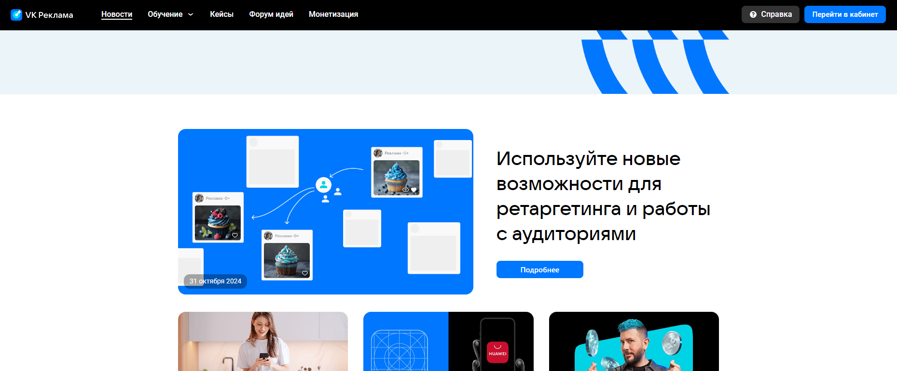
    - При нажатии на логотип происходит переход на https://ads.vk.com/. 
    Проверить соответсвие URL и наличиие секций слайдера, "Кейсы компаний", "Обучающие вебинары" по заголовкам. 
    - При нажатии на кнопку "Новости" происходит переход на https://ads.vk.com/news.
    Проверить соответсвие URL и наличиие заголовка "Новости". 
    - Дропдаун "Обучение".
    
        - При нажатии на кнопку "Полезные материалы" происходит переход на https://ads.vk.com/insights.
        Проверить соответсвие URL и наличиие заголовка "Полезные материалы".
        - При нажатии на кнопку "Мероприятия" происходит переход на https://ads.vk.com/events.
        Проверить соответсвие URL и наличиие заголовка "Полезные материалы".
        - При нажатии на кнопку "Видеокурсы" происходит переход на https://expert.vk.com/catalog/courses/ в новой вкладке.
        Проверить соответсвие URL и наличиие банера и строки поиска.
        - При нажатии на кнопку "Сертификация" происходит переход на https://expert.vk.com/certification/ в новой вкладке.
        Проверить соответсвие URL и наличиие заголовка "Сертификация по рекламе специалистов и агентств".
    - При нажатии на кнопку "Кейсы" происходит переход на страницу https://ads.vk.com/cases.
    Проверить соответсвие URL и наличиие заголовка "Кейсы".
    - При нажатии на кнопку "Форум идей" происходит переход на https://ads.vk.com/upvote.
    Проверить соответсвие URL и наличиие заголовка "Форум идей" и строки поиска.
    - При нажатии на кнопку "Монетизация" происходит переход на https://ads.vk.com/partner в новой вкладке.
    Проверить соответсвие URL и наличиие заголовков "Зарабатывайте на вашем контенте", "Развивайте бизнес с технологиями VK", "Используйте подходящие вам форматы".
    - При нажатии на кнопку "Справка" происходит переход на https://ads.vk.com/help.
    Проверить соответсвие URL и наличиие заголовка "Справка" и строки поиска.
    - При нажатии на кнопку "Перейти в кабинет" происходит переход на https://id.vk.com/auth.

## Футер (без авторизации)

- Футер.
    
    - При нажатии на логотип происходит переход на https://ads.vk.com/.
    - При нажатии на кнопку "Новости" происордит переход на https://ads.vk.com/news.
    - При нажатии на кнопку "Полезные материалы" происходит переход на https://ads.vk.com/insights.
    - При нажатии на кнопку "Мероприятия" происходит переход на https://ads.vk.com/events.
    - При нажатии на кнопку "Документы" происходит переход на https://ads.vk.com/documents.
    - При нажатии на кнопку "Обучение для бизнеса" происходит перПроверить соответсвие URL и наличиие заголовка "Новости". еход на https://expert.vk.com/ в новой вкладке.
    - При нажатии на кнопку "Кейсы" происходит переход на страницу https://ads.vk.com/cases.
    - При нажатии на кнопку "Помощь" происходит переход на https://ads.vk.com/help.
    - При нажатии на кнопку "Монетизация" происходит переход на https://ads.vk.com/partner.
    - При нажатии на кнопку "Перейти в кабинет" происходит переход на https://id.vk.com/auth.
    - При нажатии на логотип "VK Бизнес" происходит переход на https://vk.company/ru/company/business/ в новой вкладке.
    - При нажатии на логотип соцсети "ВКонтакте" происходит переход на https://vk.com/vk_ads в новой вкладке.
    - При нажатии на логотип соцсети "Одноклассники" происходит переход на https://ok.ru/group/64279825940712 в новой вкладке.
    - При нажатии на логотип соцсети "Дзен" происходит переход на https://dzen.ru/vk_ads в новой вкладке.
    - При нажатии на логотип мессенджера "Телеграм" происходит переход на https://t.me/vk_ads в новой вкладке.
    - При нажатии на иконку выбора языка открывается дропдаун выбора языка.
    
    - Дропдаун выбора языка.
        - При выбора другого языка (с русского на английского) происходит перезагрузка страницы с контентом на выбранном языке. Проверить, что надпись на кнопке "Перейти в кабинет" поменялась на "SIgn in".
    - При нажатии на кнопку "О компании" происходит переход на https://vk.company/ru/ в новой вкладке, если был выбран русский язык.
    - При нажатии на кнопку "О компании"("About us") происходит переход на https://vk.company/en/ в новой вкладке, если был выбран английский язык.

## Пагинация (Новости, Полезные материалы, Кейсы)
- Пагинация.
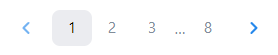
    - При нажатии на кнопку со стрелочкой вправо происходит переход на следующую страницу (если не последняя).
    Проверить гет параметр пагинации в URL. 
    Проверить, что первый элемент на странице поменялся.
    - При нажатии на кнопку со стрелочкой влево происходит переход на предыдущую страницу (если не первая).
    Проверить гет параметр пагинации в URL. 
    Проверить, что первый кейс на странице поменялся.
    - При нажатии на кнопку с номером страницы происходит переход на соответствующую страницу.
    Проверить соответствие гет параметра пагинации в URL номеру выбранной страницы. 
    Проверить, что первый кейс на странице поменялся.

## [Главная страница (лендинг)](https://ads.vk.com/)

- Главная страница.
    - Карусель.
    
        - Карусель переключается по истечению 7 секунд.
        - При нажатии на навигацию внизу карусели происходит переключение на соответствующую секцию.
         - При нажатии на кнопку "Получить бонус" в первой секции происходит переход на https://ads.vk.com/promo/firstbonus.
         - При нажатии на кнопку "Запустить рекламу" во второй секции происходит переход на https://id.vk.com/auth.
         - При нажатии на кнопку "Подробнее" в третьей секции происходит переход на https://adblogger.vk.com/for-advertisers.
    - Кейсы компаний.
    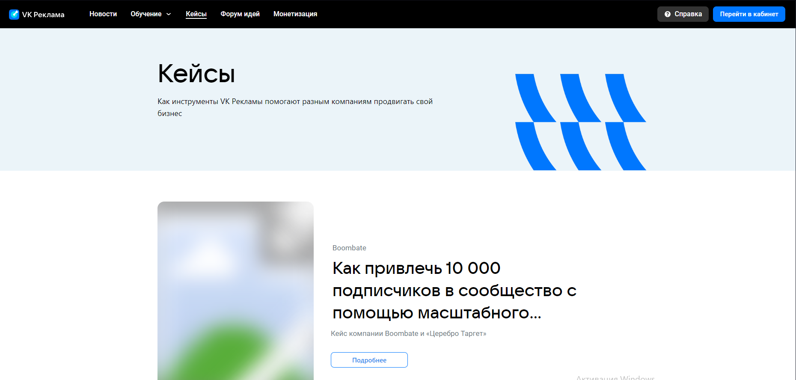
        - При нажатии на кнопку "Смотреть всё" происходит переход на https://ads.vk.com/cases.
        - При нажатии на любой из кейсов происходит переход на страницу соответствующего кейса.
        Проверить соответсвее заголовков до перехода и после.
    - Обучающие вебинары.
    
        - При нажатии в любое место на секции происходит переход на https://ads.vk.com/events.
    - Новости.
    
        - При нажатии в любое место на секции происходит переход на страницу соответствующей новости.
        Проверить соответствие заголовков до перехода и после.
    
## [Новости](https://ads.vk.com/news)

- Новости.

    - При нажатии на новость происходит переход на страницу соответствующей новости.
    Проверить соответствие заголовков до перехода и после.

## [Полезные материалы](https://ads.vk.com/insights)

- Полезные материалы.
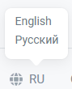
    - При нажатии на материал происходит переход на страницу соответствующего материала.
    Проверить соответствие заголовков до перехода и после.

## [Мероприятия](https://ads.vk.com/events)

- Мероприятия.

    - При нажатии на мероприятие происходит переход на страницу соответствующего мероприятия.
    Проверить соответствие заголовков до перехода и после.
    - Страница мероприятия.
    
        - При нажатии на кнопку "Перейти" происходит переход на https://expert.vk.com со страницей соответствующего мероприятия в новой владке.

## [Кейсы](https://ads.vk.com/cases)

- Кейсы.

    - При нажатии на кейс происходит переход на страницу соответствующего кейса.
    Проверить соответствие заголовков до перехода и после.

## [Форум идей](https://ads.vk.com/upvote)

- Форум идей.

    - При нажатии на заголовок предложение происходит переход на страницу соответствующего предложения.
    Проверить соответствие заголовков до перехода и после.
    - При нажатии на иконку цепи ссылка а предложение копируется и появляется поп-ап сообщение "Ссылка скопирована"
    
    - При нажатии на иконку сообщения показываются комментарии к идее, если таковые есть.
    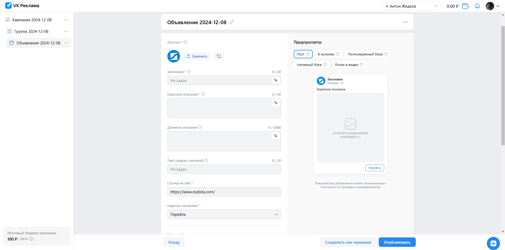
    - Предложить идею.
    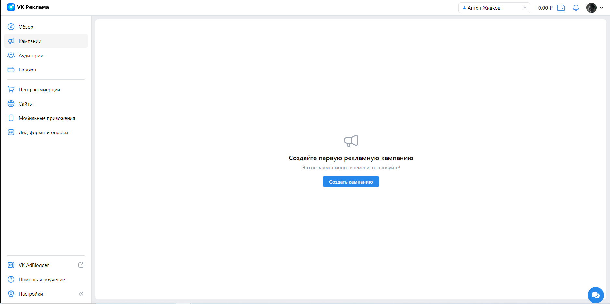
        - При нажатии на кнопку "Предложить идею" открывается модальное окно.
        - Модальное окно.
        
            - При нажатии на кнопку "Ок, понятно" модальное окно закрывается. 
            - При нажатии на иконку крестика модальное окно закрывается. 
            - При нажатии вне модального окна оно закрывается.
    - Поиск и фильтры.
    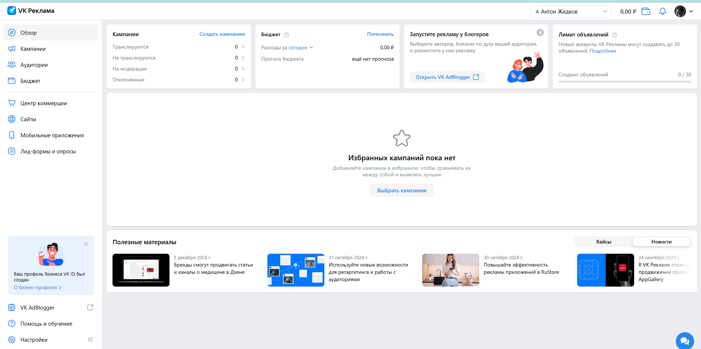
        - При вводе в строку поиска названия существующего предложения оно будет высвечено первым по запросу. 
        Проверить соответствие названия первого предложения.
        Сбросить поиск по завершению проверки.
        - При вводе в строку поиска id существующего предложения оно будет высвечено первым по запросу. 
        Проверить соответствие id первого предложения.
        Сбросить поиск по завершению проверки.
        - При вводе в строку поиска случайного набора символов появляется сообщение "Не нашлось идей".
        Сбросить поиск по завершению проверки.
        
        - При нажатии на кнопку "Сбросить фильтры" все фильтры и поиск будут сброшены.
        - При нажатии на выбор темы, появляется соответствующий дропдаун.
        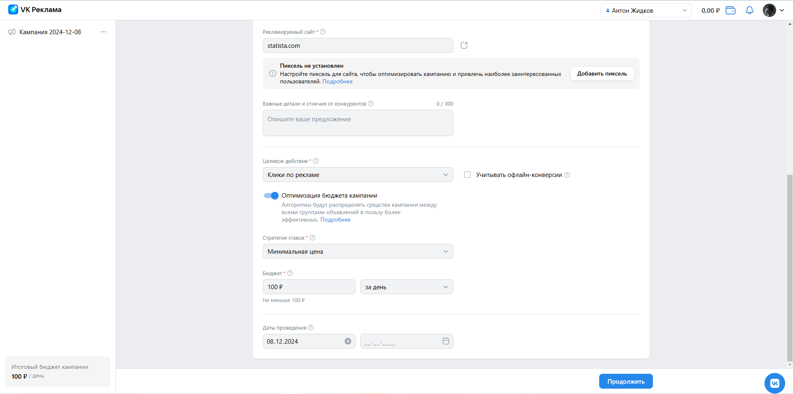
        - При выборе темы показываются только те предложения, которые ей соответствуют.
        Проверить наличие выбранной темы в первый 5 предложениях.
        Сбросить фильтр по завершению проверки.
        - При нажатии на выбор статуса, появляется соответствующий дропдаун.
        
        - При выборе статуса показываются только те предложения, которые ему соответствуют.
        Проверить наличие выбранного статуса в первый 5 предложениях.
        Сбросить фильтр по завершению проверки.
    
## [Монетизация](https://ads.vk.com/partner)

- Монетизация.
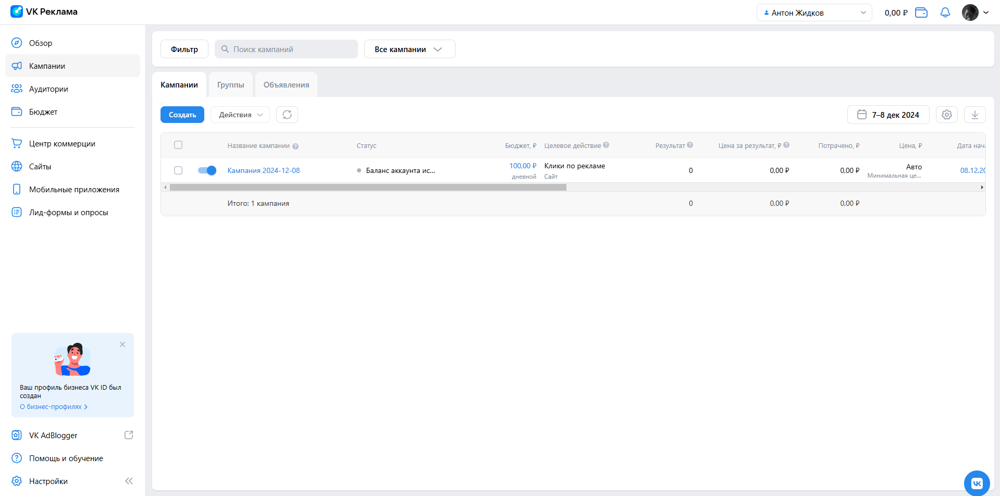
    - При нажатии кнопку "Перейти в кабинет" происходит переход на https://id.vk.com/auth.
    - При переключении свитча "Для сайтов - для приложений" меняются банеры.
    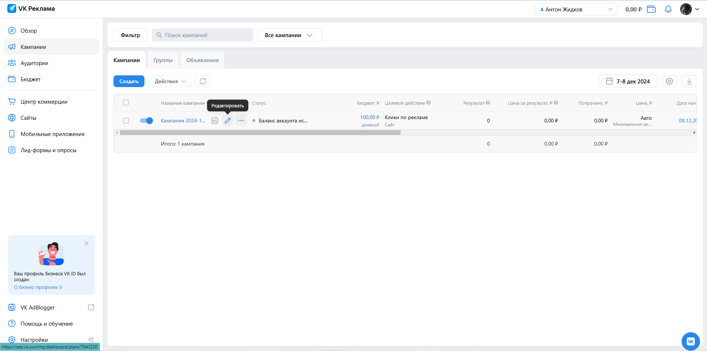
    - Форма обратной связи.
    
        - Поля имя и email являются обязательными.
        - Никаких требований к заполнению не предъявляется.
        - После отправки формы появляется сообщение "Спасибо, ваша заявка принята".
        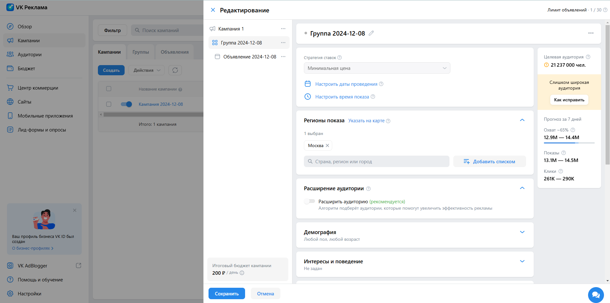

## Авторизация

- Авторизация происходит при нажатии на кнопку "Перейти в кабинет" после аутентификации через VK ID при выборе профиля.

## Регистрация

- Регистрация происходит при нажатии на кнопку "Перейти в кабинет" после аутентификации через VK ID, если кабинет ещё не создан или при выборе пункта создать профиль.

- [Регистрация.](https://ads.vk.com/hq/registration)
    - Хедер.
    
        - При нажатии на кнопку с именем и фамилией появляется дропдаун с кабинетами.
        
        - Дропдаун с кабинетами.
            - При наведении на ID появляется надпись "Скопировать ID".
            
            - При нажатии на надпись "Скопировать ID" появляется надпись "Готово!".
            
            - Если кабинеты отсутствуют, то при нажатии на кнопку "Все кабинеты" происходит переход на [страницу регистрации](https://ads.vk.com/hq/registration).
        - При нажатии на кнопку с аватаркой профиля появляется дропдаун с профилем.
        
        - Дропдаун с профилем.
            - При нажатии на кнопку с профилем происходит переход на [страницу профиля VK ID](https://id.vk.com/account/#/main).
            - При нажатии на кнопку выйти происходит редирект на https://ads.vk.com/.
    - Свитч выбора языка.
        
        - При переключении на English текст на странице меняется на английский. Проверить, что вместо заголовка "Добро пожаловать в VK Рекламу" появился заголовок "Welcometo VK Ads".
        
        - При нажатии на кнопку создать кабинет происходит переход на [страницу регистрации кабинета](https://ads.vk.com/hq/registration/new). Проверить URL и наличие заголовка "Регистрация кабинета".
    - Регистрация кабинета.
        - При нажатии на кнопку "Назад осуществляется переход на [страницу регистрации](https://ads.vk.com/hq/registration).
        
        - При выборе типа аккаунта "Рекламодатель" доступна регистрация как физическим, так и юридическим лицом.
        
        - При выборе типа аккаунта "Агентство" доступна регистрация только как юридическое лицо.
        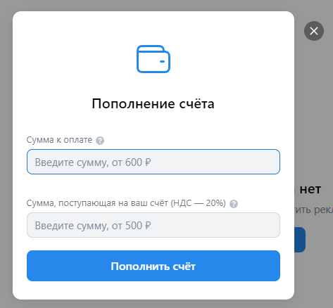
        - При выборе страны "Россия" и типа аккаунта "Юридическое лицо" доступна только валюта "Российский рубль".
        
        - При выборе типа аккаунта "Юридическое лицо" и любой страны, кроме "Россия",  доступен выбор валюты "Доллар США" или "Евро"
        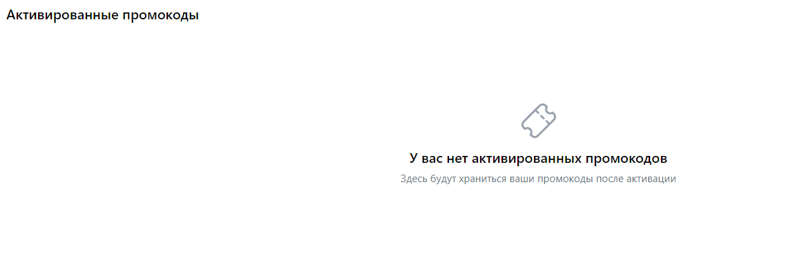
        - При выборе типа аккаунта "Физическое лицо" и любой страны, кроме России, Республики Беларусь, Казахстана и Таджикистана, выводится сообщение, что создать рекламный кабинет не получится. Проверить, что кнопка "Создать кабинет" отключена.
        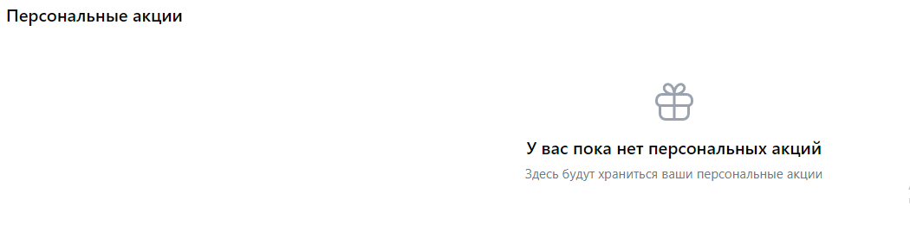
        - При выборе типа аккаунта "Физическое лицо" из России появятся дополнительные поля для указания ИНН и ФИО.
            - Валидные данные для ИНН - 12 цифр.
            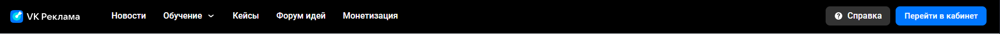
            - При вводе менее 12 цифр выводится сообщение "Напишите не меньше 12 символов". 
            
        - При выборе типа аккаунта "Физическое лицо" для всех доступных стран доступна только валюта "Российский рубль".
        
        - Инпут Email.
            - Валидные данные - валидный адрес электронной почты, например example@mail.ru (соответствует формату электронной почты).
            
            - При вводе не валидных данных выводится сообщение "Некорректный email адрес".
            
            - Если оставить поле пустым, выводится сообщение "Обязательное поле"
            
        - Кнопка "Создать кабинет"
            - Если введены валидные данные происходит переход на https://ads.vk.com/hq/overview.
            Проверить наличие заголовка "Добро пожаловать в VK Рекламу!".
            - Если не указана почта, фокус сместится на инпут почты и выводится сообщение "Обязательное поле".
            - Если не выбран чекбокс "Создавая кабинет, вы принимаете условия" выводится сообщение "Обязательное поле".
            

## [Сайты](https://ads.vk.com/hq/pixels)

- Сайты.
    - Если пикселей нет, то будет надпись "Нет привязанных пикселей трекинга" и кнопка "Добавить пиксель".
    
    - Добавление пикселя.
    
        - Выбор добавление пикселя через "Домен сайта" или "ID Пикселя".
        - Домен сайта.
            - При вводе несуществующего домена, появляется сообщение "Нет такого сайта".
            - При вводе существующего домена и нажатии на кнопку "Добавить пиксель", повляется сообщение, что пиксель создан.
            Проверить наличие сообщения. 
            Проверить, что пиксель с таким ID Добавился. 
            Удалить пиксель для консистентности.
            
    - При наличии пикселя и при нажатии на ссылку "Настроить" на пикселе происходит переход на https://ads.vk.com/hq/pixels/{ID пикселя}/events.
    Проверить правильность перехода по URL и по названию пикселя в верхнем блоке.
    
    - События. 
    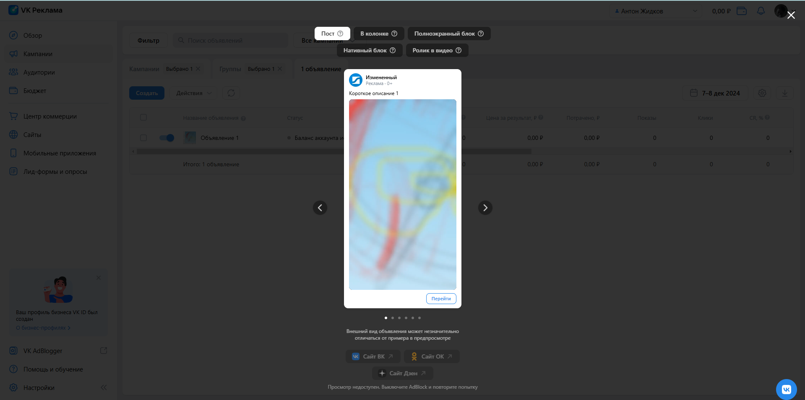
        - При нажатии на кнопку "Добавить событие" открывается модальное окно "Добавить событие".
        
        - Добавление события.
            - Выбор добавить событие вручную или в визуальном конструкторе.
            - Вручную.
                
                - Узазать название события.
                - Выбрать из дропдауны категорию события.
                - Выбрать из дропдауна условие наступления.
                - Указать содержимое URL.
                - Доролнительно указать ценность.
                - При нажатии на кнопку "Добавить событие" обновляется https://ads.vk.com/hq/pixels/{ID пикселя}/events.
                Проверить наличие собыьия с указанным Именем.
        - При нажатии на иконку кебаб-меню открывается меню с пунктами "Создать компанию", "Создать Аудиторию", "Редактироват".
        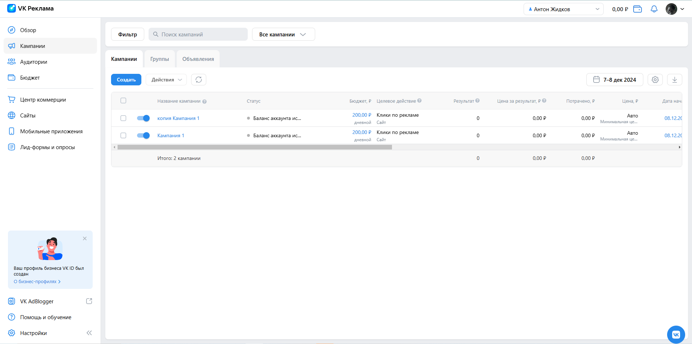
        - Редактирование события.
            - Изменить название события.
            - Изменить категорию события.
            - Изменить условие наступления.
            - Изменить ценность.
            - При нажатии на кнопку "Изменить событие" обновляется https://ads.vk.com/hq/pixels/{ID пикселя}/events.
            Проверить наличие собыьия с указанным/змененным Именем.
            Проверить соответствие изменённых параметров.
        - Поиск события.
            - При вводе символов в поисковую строку отображаются только те события, которые удоблетворяют поисковому запросу.
            Проверить соотвеетсятвие зашоловков событий запросу.
    - При нажатии на вкладку "Аудиторные теги" происходит переход на страницу https://ads.vk.com/hq/pixels/{ID пикселя}/tags.
    - Аудиторные теги.
    
        - При нажатии на кнопку "Создать аудиторный тег" открывается модальное окно.
        Проверить наличие заголовка "Новый аудиторный тег".
        - Создание аудиторного тега.
        
            - Вветсти название тега.
            - При нажатии на кнопку "Создать" модальное окно закрывается и обновляется hthttps://ads.vk.com/hq/pixels/{ID пикселя}/tags.tps://ads.vk.com/hq/pixels/{ID пикселя}/tags.
            Проверить наличие добавленного тега.
