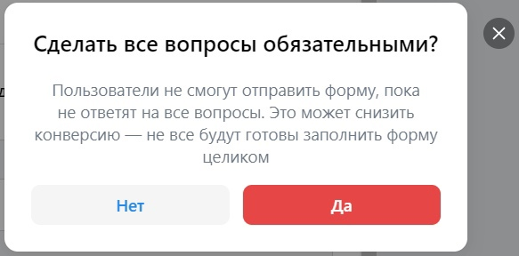
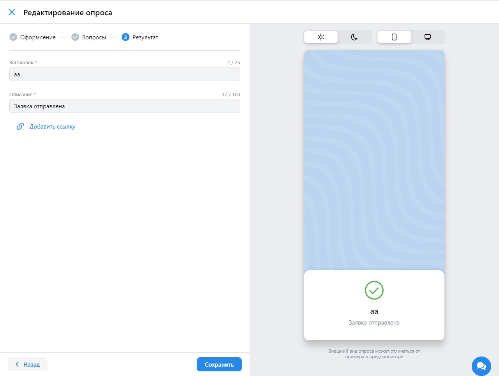

## Вкладка "Лид-формы и опросы"

### Лид-формы

* При нажатии на вкладку "Лид-формы и опросы" открывается [страница лид-форм и опросов](https://ads.vk.com/hq/leadads/leadforms)

* При нажатии на кнопку "Создать лид-форму" справа появляется боковое меню "Новая лид-форма"

* В меню присутствуют:
  * Заголовок "Новая лид-форма"
  * Прогресс-бар "1.Оформление - 2.Вопросы - 3.Результат - 4.Настройки"
  * Обязательное поле "Название лид-формы"
  * Свитчбокс "Создать лендинг"
  * Меню "Первый экран формы" с 3 вариантами: "Компактный", "Больше текста", "Лид-магнит".
  * Обязательное поле ввода для файла "Логотип"
  * Обязательное поле "Название компании (организации)" (макисмум 30 символов)
  * Обязательное поле "Заголовок" (макисмум 50 символов)
  * Обязательное поле "Описание формы" (макисмум 35 символов)
  * Меню "Стили", в котором есть варианты: "Без цвета", 7 цветов на выбор (Красный, Жёлтый, Зелёный, Голубой, Синий, Градиент, Розовый), инструмент "Пипетка" для выбора собственного цвета
  * Поле ввода для файла "Обложка"
  * Кнопка "Выбрать из медиатеки"
  * Кнопка "Продолжить"
  * Кнопка "Отмена"
  * Кнопка "Крестик"
* При нажатии на область вне окна, оно закрывается
* При нажатии кнопки "Крестик", оно закрывается
* При нажатии кнопки "Отмена", оно закрывается
* При выборе пункта "Больше текста" в меню "Первый экран формы" поле "Описание формы" меняется на "Длинное описание" (макисмум 350 символов)
* При выборе пункта "Лид-магнит" в меню "Первый экран формы" поле "Описание формы" меняется на Radio с двумя вариантами: "Скидка", "Бонус"
* При выбранном варианте "Скидка" появляется обязательное поле "Размер скидки" и свитчбокс с 2 вариантами: "₽" и "%"
* При выбранном варианте "Бонус" появляется обязательное поле "Описание бонуса" (максимум 30 символов)
* Если во время ввода превысить максимум символов поля, то появляется надпись ошибки "Превышена максимальная длина поля"
* Если использовать более 2 переносов строки подряд в поле "Длинное описание", появится ошибка "Используйте перенос строки не больше 2 раз подряд"
* При изменении данных в форме, изменения отображаются в превью слева от формы
* Если выбрать в свитчбоксе вариант "%" и ввести более 100 в поле "Размер скидки", появится ошибка "Укажите скидку не более 100%"
* Если ввести 0 в поле "Размер скидки", появится ошибка "Значение должно быть больше нуля"
* В поле "Размер скидки" можно ввести только численные значения

* При нажатии на "Продолжить" и пустых обязательных полях появляется надпись ошибки "Обязательное поле", если все обязательные поля заполнены происходит переход к странице "Вопросы"

* В меню присутствуют:
  * Заголовок "Новая лид-форма"
  * Прогресс-бар "1.Оформление - 2.Вопросы - 3.Результат - 4.Настройки"
  * Кнопка "Добавить вопрос"
  * Список "Контактная информация"
  * Кнопка "Добавить контактные данные"
  * Кнопка "Продолжить"
  * Кнопка "Назад"
  * Кнопка "Крестик"

* При нажатии на кнопку "Добавить вопрос" появляется форма добавления нового вопроса

  
* В форме присутствуют:
  * Кнопка "Мусорная корзина"
  * Поле "Вопрос"
  * Дропдаун "Тип вопроса" с 3 вариантами: "Выбор одного ответа", "Выбор нескольких ответов", "Ответ в произвольной форме"
  * 2 поля "Ответ"
  * Кнопка "Добавить ответ"
  * Дропдаун "Ответ из шаблона" с 3 вариантами: "Ничего из перечисленного", "Затрудняюсь ответить", "Другое (свой ответ)"
* При нажатии кнопки "Мусорная корзина" форма вопроса удаляется
* При выборе варианта "Ответ в произвольной форме" в дропдауне "Тип вопроса" поля "Ответ" убираются
* При нажатии кнопки "Добавить ответ" добавляется ещё одно поле "Ответ"
* При выборе варианта из дропдауна "Ответ из шаблона" добавляется соответствующее неактивное поле "Ответ"
* Если в списке полей "Ответ" более двух элементов, на них всех появляется кнопка "Крестик", которая при нажатии удаляет соответсвующее поле
* При нажатии кнопки "Добавить контактные данные", появляется окно с возможностью выбора нескольких вариантов из списка: "Имя", "Электронная почта", "Номер телефона", "Cсылка на соцсеть", "День рождения", "Город" и кнопкой "Добавить"
* При нажатии кнопки "Добавить" в список "Контактная информация" добавляются соответствующие варианты
* На каждом элементе списка "Контактная информация" есть кнопка "Мусорное ведро"
* При нажатии кнопки "Мусорное ведро" соответствующий элемент списка
* Если в списке "Контактная информация" нет ни одного элемента появляется ошибка "Минимальное количество полей: 1"
* Если в этом окне и последующих нажать кнопку "Назад", то мы перейдем на предудыщую страницу

* Если в этом окне и последующих нажать кнопку "Крестик" или на область вне окна, то выйдет окно сохранения черновика

* Если в окне "Вопросы" нажать кнопку "Продолжить" и оставить пустым поле "Вопрос" и поля "Ответ", то появится ошибка "Вопрос должен быть не пустым и содержать минимум 2 ответа", в другом случае происходит переход к странице "Результат"

* В меню присутствуют:
  * Заголовок "Новая лид-форма"
  * Прогресс-бар "1.Оформление - 2.Вопросы - 3.Результат - 4.Настройки"
  * Обязательное поле "Заголовок" (максимум 25 символов)
  * Поле "Описание" (максимум 160 символов)
  * Кнопка "Добавить сайт"
  * Кнопка "Добавить телефон"
  * Кнопка "Добавить промокод"
  * Кнопка "Продолжить"
  * Кнопка "Назад"
  * Кнопка "Крестик"
* При нажатии на кнопку "Добавить сайт" появляется поле "Ссылка на сайт"
* При нажатии на кнопку "Добавить телефон" появляется поле "Телефон для заказа"
* При нажатии на кнопку "Добавить промокод" появляется поле "Промокод"
* Если в поле "Ссылка на сайт" ввести некорректный URL, то появится ошибка "Невалидный URL"
* Если в поле "Телефон для заказа" номер не начинается с "+", содержит что-то кроме цифр или имеет менее 7 цифр, то появится ошибка "Телефон должен начинаться с + и содержать только цифры"
* Если во время ввода превысить максимум символов поля, то появляется надпись ошибки "Превышена максимальная длина поля"
* При нажатии на "Продолжить" и пустых обязательных полях появляется надпись ошибки "Обязательное поле", если все обязательные поля заполнены происходит переход к странице "Настройки"

* В меню присутствуют:
  * Заголовок "Новая лид-форма"
  * Прогресс-бар "1.Оформление - 2.Вопросы - 3.Результат - 4.Настройки"
  * Чекбокс "Уведомлять о новых заявках по email"
  * Чекбокс "Уведомлять о новых заявках в VK Messenger"
  * Чекбокс "Обязательные вопросы"
  * Обязательное поле "Фамилия, имя, отчество (если есть)" (максимум 255 символов)
  * Обязательное поле "Адрес регистрации по месту жительства" (максимум 255 символов)
  * Поле "Email"
  * Поле "ИНН" (максимум 32 символов)
  * Кнопка "Сохранить"
  * Кнопка "Назад"
  * Кнопка "Крестик"
* Если нажать на чекбокс "Обязательные вопросы", появится окно "Предупреждение"

* Если нажать на чекбокс "Уведомлять о новых заявках по email", появится поле "Email-адреса для уведомлений"
* Если в поля для Email-ов ввести некорректный email, то появится ошибка "Некорректный email адрес"
* Если во время ввода превысить максимум символов поля, то появляется надпись ошибки "Превышена максимальная длина поля"
* При нажатии на "Продолжить" и пустых обязательных полях появляется надпись ошибки "Обязательное поле", если все обязательные поля заполнены происходит переход к странице "Лид-форм и опросов"

### Опросы

* При нажатии на вкладку "Опросы" открывается [страница опросов](https://ads.vk.com/hq/leadads/surveys)

* При нажатии на кнопку "Создать опрос" справа появляется боковое меню "Новый опрос"

* В меню присутствуют:
  * Заголовок "Новый опрос"
  * Прогресс-бар "1.Оформление - 2.Вопросы - 3.Результат"
  * Обязательное поле "Название"
  * Обязательное поле ввода для файла "Логотип"
  * Обязательное поле "Название компании (организации)" (макисмум 30 символов)
  * Обязательное поле "Заголовок опроса" (макисмум 50 символов)
  * Обязательное поле "Описание опроса" (макисмум 350 символов)
  * Меню "Стили", в котором есть варианты: "Без цвета", 7 цветов на выбор (Красный, Жёлтый, Зелёный, Голубой, Синий, Градиент, Розовый)
  * Кнопка "Вопросы"
  * Кнопка "Крестик"
* При нажатии на область вне окна, оно закрывается
* При нажатии кнопки "Крестик", оно закрывается
* Если во время ввода превысить максимум символов поля, то появляется надпись ошибки "Превышена максимальная длина поля"
* При изменении данных в форме, изменения отображаются в превью слева от формы

* При нажатии на "Вопросы" и пустых обязательных полях появляется надпись ошибки "Обязательное поле", если все обязательные поля заполнены происходит переход к странице "Вопросы"

* В меню присутствуют:
  * Заголовок "Новый опрос"
  * Прогресс-бар "1.Оформление - 2.Вопросы - 3.Результат"
  * Одна форма добавления вопроса
  * Кнопка "Добавить вопрос"
  * Кнопка "Добавить стоп-экран"
  * Кнопка "Результат"
  * Кнопка "Назад"
  * Кнопка "Крестик"

* При нажатии на кнопку "Добавить вопрос" появляется форма добавления нового вопроса

  
* В форме присутствуют:
  * Кнопка "Мусорная корзина"
  * Кнопка "Дублировать"
  * Кнопка "Добавить условие показа" (отсутствует у самого верхнего вопроса)
  * Поле "Вопрос"
  * Дропдаун "Тип вопроса" с 4 вариантами: "Выбор одного ответа", "Выбор нескольких ответов", "Ответ в произвольной форме", "Шкала"
  * 2 поля "Ответ"
  * Кнопка "Добавить ответ"
  * Дропдаун "Ответ из шаблона" с 4 вариантами: "Ничего из перечисленного", "Затрудняюсь ответить", "Другое (свой ответ)", "Свой вариант"
* При нажатии кнопки "Мусорная корзина" форма вопроса удаляется
* При нажатии кнопки "Дублировать" форма вопроса дублируется
* При нажатии кнопки "Добавить условие показа" появляются дропдауны "Показать вопрос, если ответ на" и "содержит любой из"
* Дропадун "Показать вопрос, если ответ на" содержит все вышестоящие вопросы
* Дропадун "содержит любой из" содержит все ответы на вопрос, выбранный в дропдауне "Показать вопрос, если ответ на"
* В дропадуне "содержит любой из" можно выбрать несколько вариантов
* Если в дропадуне "содержит любой из" не выбрано ни одного варианта, то появляется ошибка "Выберите хотя бы 1 вариант ответа"
* При выборе варианта "Ответ в произвольной форме" в дропдауне "Тип вопроса" поля "Ответ" убираются
* При выборе варианта "Шкала" в дропдауне "Тип вопроса" поля "Ответ" убираются, появляется дропдаун "Диапазон с выбором диапазона шкалы, имеющий варианты "1-5", "1-10" и "0-10"
* При нажатии кнопки "Добавить ответ" добавляется ещё одно поле "Ответ"
* При выборе варианта из дропдауна "Ответ из шаблона" добавляется соответствующее неактивное поле "Ответ"
* Если в списке полей "Ответ" более двух элементов, на них всех появляется кнопка "Крестик", которая при нажатии удаляет соответсвующее поле

* При нажатии на кнопку "Добавить стоп-экран" появляется форма добавления стоп-экрана

* В форме присутствуют:
  * Кнопка "Мусорная корзина"
  * Дропдаун "Завершить опрос, если ответ на"
  * Дропдаун "содержит любой из"
  * Обязательное поле "Заголовок экрана" (максимум 25 символов)
  * Обязательное поле "Описание" (максимум 160 символов)
* При нажатии кнопки "Мусорная корзина" форма стоп-экрана удаляется
* Дропадун "Завершить опрос, если ответ на" содержит все вышестоящие вопросы
* Дропадун "содержит любой из" содержит все ответы на вопрос, выбранный в дропдауне "Показать вопрос, если ответ на"
* В дропадуне "содержит любой из" можно выбрать несколько вариантов
* Если в дропадуне "содержит любой из" не выбрано ни одного варианта, то появляется ошибка "Выберите хотя бы 1 вариант ответа"
* Если не заполнить все поля в форме, появится ошибка "Необходимо заполнить все поля"

* Если в этом окне и последующих нажать кнопку "Крестик" или на область вне окна, то выйдет окно сохранения черновика
* Если в этом окне и последующих нажать кнопку "Назад", то мы перейдем на предудыщую страницу

* Если в окне "Вопросы" нажать кнопку "Результат" и оставить пустым поле "Вопрос" и поля "Ответ", то появится ошибка "Вопрос должен быть не пустым и содержать минимум 2 ответа", в другом случае происходит переход к странице "Результат"

* В меню присутствуют:
  * Заголовок "Новый опрос"
  * Прогресс-бар "1.Оформление - 2.Вопросы - 3.Результат"
  * Обязательное поле "Заголовок" (максимум 25 символов)
  * Поле "Описание" (максимум 160 символов)
  * Кнопка "Добавить ссылку"
  * Кнопка "Запустить опрос"
  * Кнопка "Назад"
  * Кнопка "Крестик"
* При нажатии на кнопку "Добавить ссылку" появляется поле "Ссылка"
* Если во время ввода превысить максимум символов поля, то появляется надпись ошибки "Превышена максимальная длина поля"
* При нажатии на "Запустить опрос" и пустых обязательных полях появляется надпись ошибки "Обязательное поле", если все обязательные поля заполнены происходит переход к странице всех опросов
