## Вкладка "Аудитории"

* При нажатии на вкладку "Аудитории" открывается [страница аудиторий](https://ads.vk.com/hq/audience)
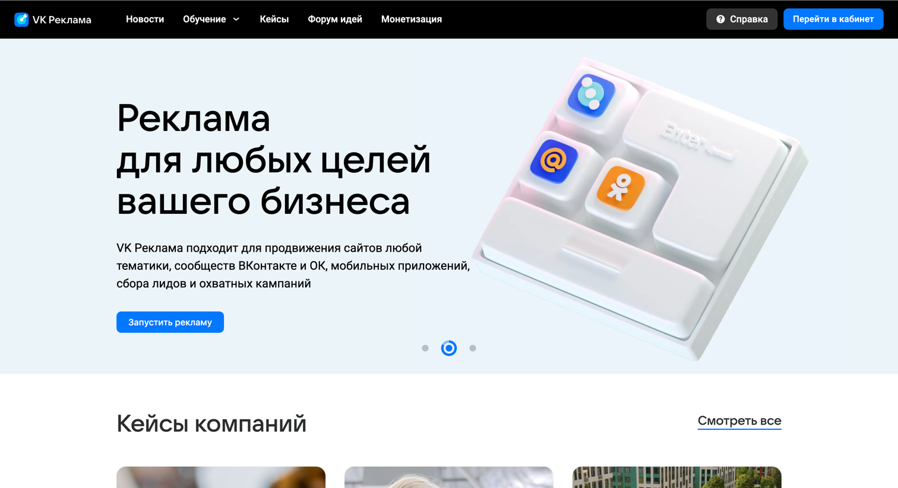

* При нажатии на кнопку "Создать аудиторию" справа появляется боковое меню "Создание аудитории"

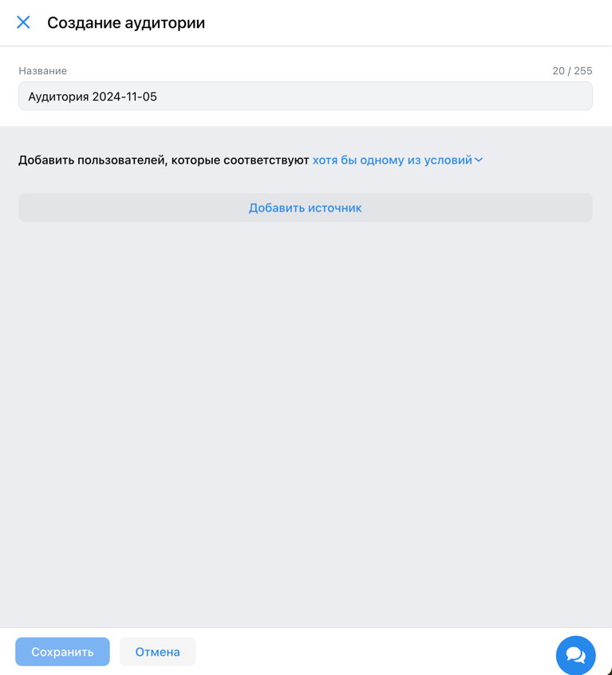

* В меню присутствуют:
  * Заголовок h2 "Создание аудитории"
  * Надпись "Добавить пользователей, которые соответствуют"
  * Дропдаун "хотя бы одному из условий"
  * Кнопка "Сохранить"
  * Кнопка "Отмена"
  * Кнопка "Крестик"

* При нажатии на кнопку "Добавить источник" к боковому меню добавляется ещё одно меню "Включить источник"

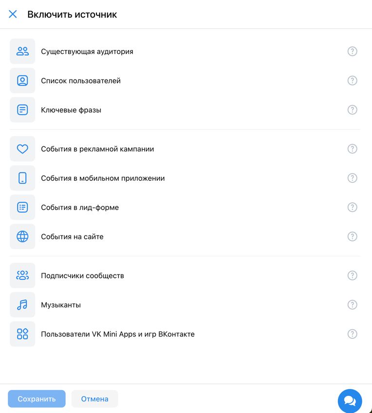

* В меню присутствуют:
  * Заголовок h2 "Включить источник"
  * Вкладки: "Существующая аудитория", "Список пользователей", "Ключевые фразы", "События в рекламной кампании", "События в мобильном приложении", "События в лид-форме", "События на сайте", "Подписчики сообществ", "Музыканты", "Пользователи VK Mini Apps и игр ВКонтакте"
  * Кнопка "Сохранить"
  * Кнопка "Отмена"
  * Кнопка "Крестик"

* При нажатии на вкладку "Ключевые фразы" окно "Включить источник" заменяется на меню "Ключевые фразы" с инпутами "Название", "Ключевые фразы", "Минус фразы", "Период поиска"

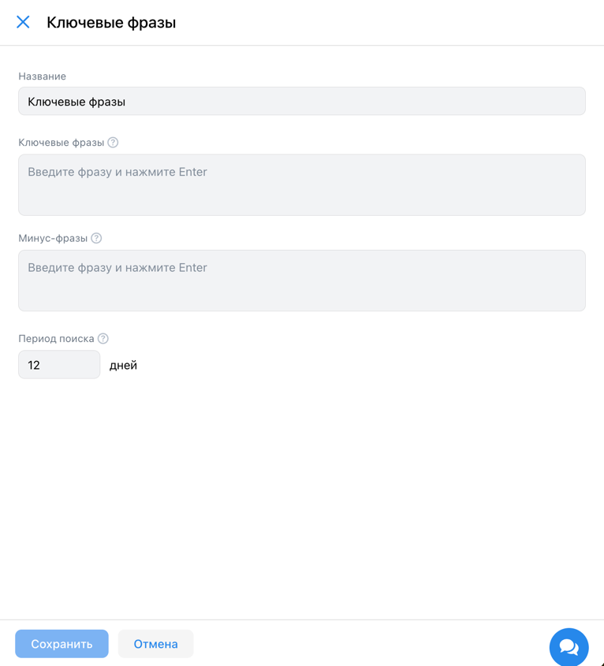

* В меню присутствуют:
  * Инпут "Название"
  * Textarea "Ключевые фразы"
  * Textarea "Минус-фразы"
  * Числовой инпут "Период поиска" с надписью "дней"
  * Кнопка "Сохранить"
  * Кнопка "Отмена"
  * Кнопка "Крестик"

* Кнопка "Сохранить" не активна если не заполнены текстовые поля "Ключевые фразы" или "Минус фразы"
* При заполнении хотя бы одного из полей "Ключевые фразы" или "Минус-фразы" и нажатии кнопки сохранить, окно закрывается и в списке аудиторий отображается аудитория с заголовком "Ключевые фразы" и заполненными полями
* При вводе в инпут "Период поиска" число меньше или равное 0, то оно автоматически заменится на 1
* При вводе в инпут "Период поиска" число больше 30, то оно автоматически заменится на 30
* При нажатии на кнопку "Отмена" окно закрывается

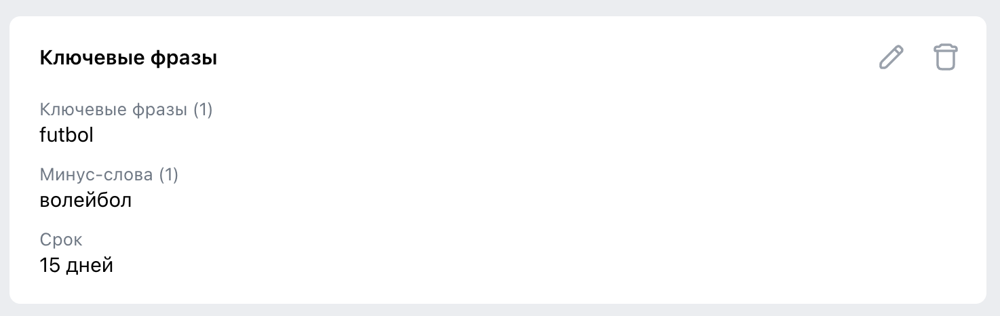
* При нажатие на кнопку удаления появляется надпись "Удалить источник?" и две кнопки "Отменить" и "Удалить" 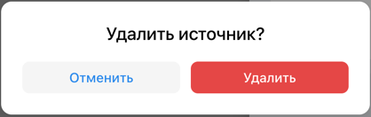
  * При нажатии на кнопку "Удалить" происходит удаление источника
  * При нажатии на кнопку "Отменить" происходит отмена удаления источника
* При нажатии на кнопку "Редактировать" к боковому меню добавляется еще одно меню "Ключевые фразы" с заполненными инпутами "Название", "Ключевые фразы", "Минус фразы", "Период поиска" 
* При нажатии на кнопку "Крестик" появляется модельное окно с заголовком h2 "Прервать создание?"
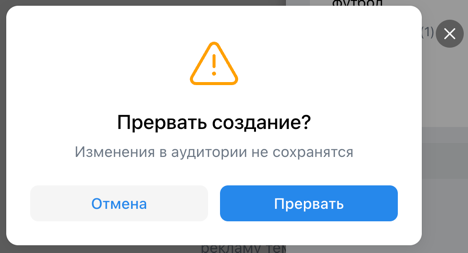
* В модальном окне присутствуют:
  * Заголовок h2 "Прервать создание?"
  * Кнопка "Отмена"
  * Кнопка "Прервать"
  * Кнопка "Крестик"

* При нажатии на кнопку "Отмена" окно закрывается
* При нажатии на кнопку "Крестик" окно закрывается
* При нажатии на кнопку "Прервать" окно закрывается и аудитория не редактируется или не создается

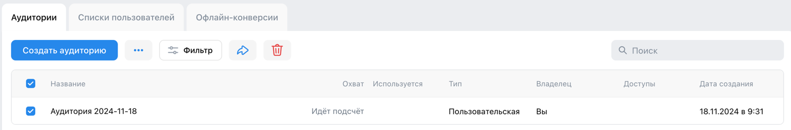
* Кнопки "Поделиться" и "Удалить" не активны, если не выбрана аудитория

* При нажатии на кнопку "Поделиться" появляется меню "Открыть доступ"
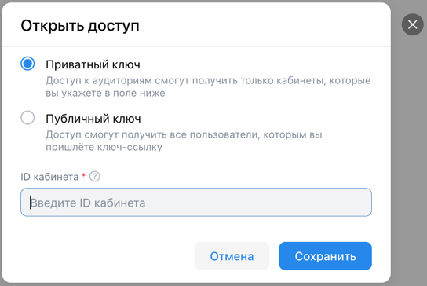
* В меню присутствуют:
  * Заголовок h2 "Открыть доступ"
  * Чекбокс "Приватный ключ"
  * Чекбокс "Публичный ключ"
  * Инпут "ID кабинета"
  * Кнопка "Отмена"
  * Кнопка "Сохранить"

* При нажатии на кнопку "Отменить" меню пропадает
* При нажатии на кнопку "Сохранить" с несуществующим ID кабинета, появляется надпись "Validation failed"
* При нажатии на кнопку "Сохранить" с пустым ID кабинета, появляется надпись "Обязательное поле"

* При нажатии на кнопку "Удалить" появляется надпись "Удалить выбранную аудиторию?" и две кнопки "Отменить" и "Удалить" 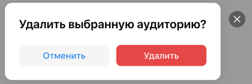
  * При нажатии на кнопку "Удалить" происходит удаление аудитории 
  * При нажатии на кнопку "Отменить" происходит отмена удаления аудитории

* При нажатии на вкладку "Списки пользователей" открывается [страница списков пользователей](https://ads.vk.com/hq/audience/user_lists)
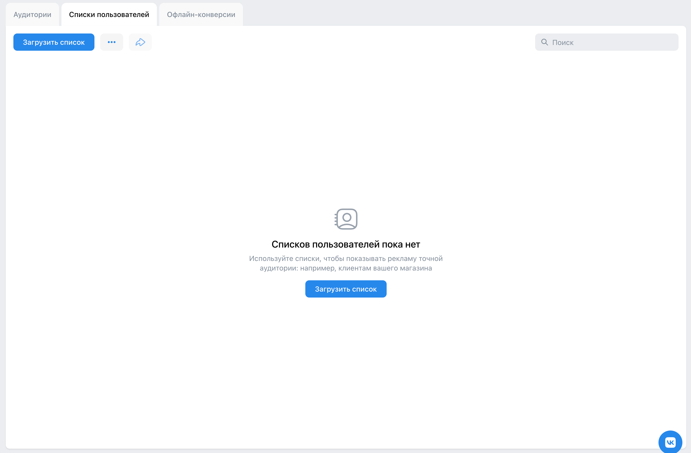
* При нажатии на кнопку "Загрузить список" появляется боковое меню "Загрузить список" с инпутами "Название", "Тип списка", "Файл списка" и чекбоксами "Как имя файла" и "Создать аудиторию из списка"
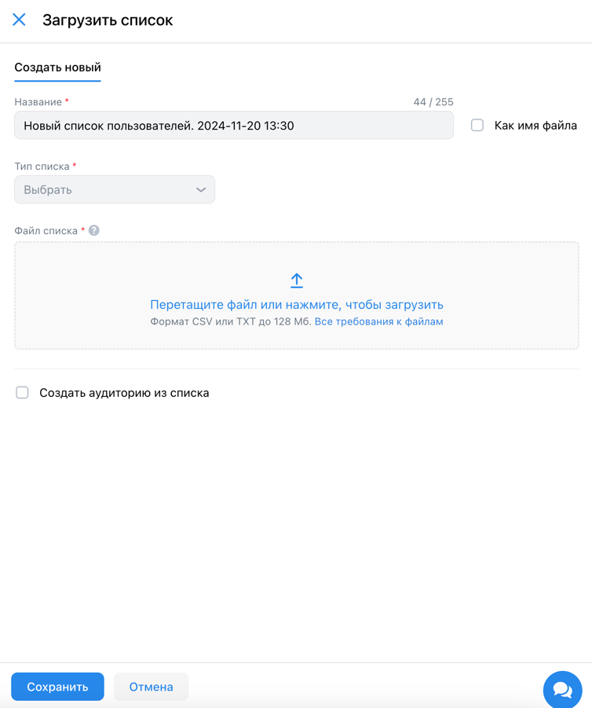
* В меню присутствуют:
  * Инпут "Название"
  * Инпут "Тип списка"
  * Инпут "Файл списка"
  * Чекбокс "Как имя файла"
  * Чекбокс "Создать аудиторию списка"
  * Кнопка "Крестик"
  * Кнопка "Сохранить"
  * Кнопка "Отмена"
* При нажатии на вкладку "Офлайн-конверсии" открывается [страница офлайн-конверсии](https://ads.vk.com/hq/audience/offline_conversion)
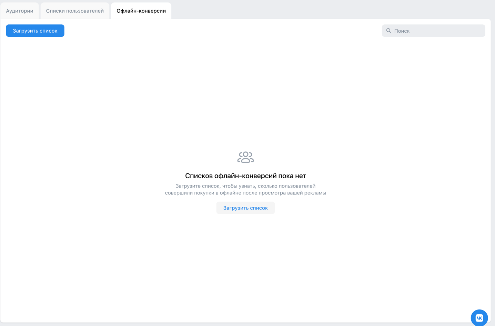
* При нажатии на кнопку "Загрузить список" появляется боковое меню "Загрузить список"
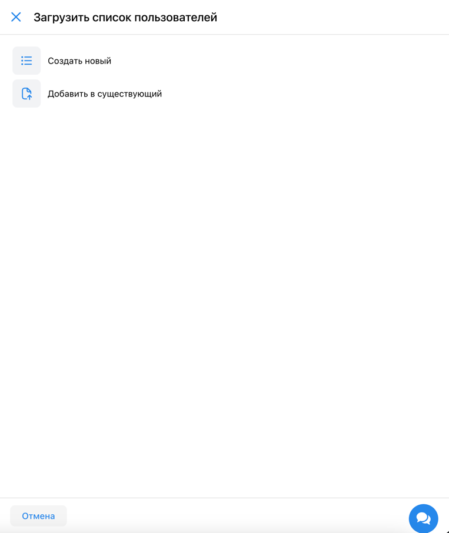
* В меню присутствуют:
  * Кнопка "Создать новый"
  * Кнопка "Добавить существующий"
  * Кнопка "Отмена"