Проект [VK Реклама](https://ads.vk.com/)
--
----
 Помощь и обучение.Обучение
- 
  https://ads.vk.com/hq/overview
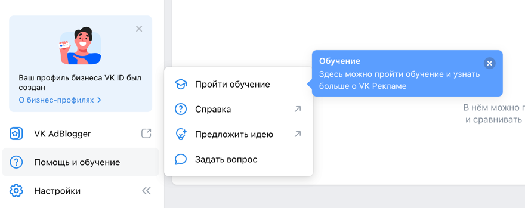
**Помощь и обучение. Обучение. Всплывающее окно обучения.**\
В нем отображаются:
- заголовок "С чего начнем обучение?"
- подзаголовок "Выберите, что будете рекламировать"
- надпись "Вернуться к обучению можно когда угодно"
- кнопка "Попробовать позже"
- кнопка крестик для закрытия
- кнопки "Сообщество ВКонтакте", "Каталог товаров", "Лид формы", "Музыка", "Дзен",  "Сайт", "Мобильное приложение", "VK Mini Apps", "Видео и трансляции"  
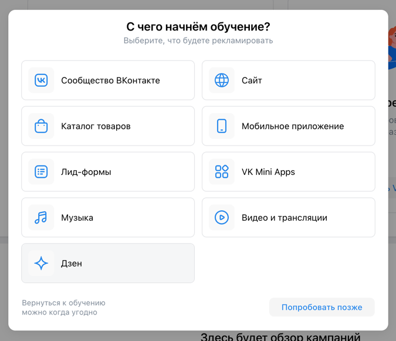  
**Помощь и обучение.Обучение.Сайт**
- заголовок "Как хотите учится?"
- кнопка "Настроить кампанию с подсказками"
- кнопка "Смотреть видеоурок от экспертов VK"
- кнопка "Смотреть курс на обучающей платформе" 
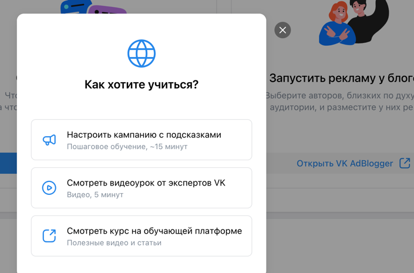  
Далее при нажатии на целевую кнопку - переход к следующему tooltip.

**Помощь и обучение.Обучение.Сайт.Настроить компанию с подсказками** 

- Кнопка **"Создать кампанию"** - целевая
- Подсказка 
  - заголовок "Создание кампании"
  - текст "Нажмите, чтобы начать настройку новой рекламной кампании."
  - кнопка закрытия 
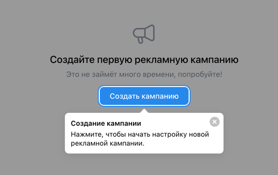 
**Помощь и обучение.Обучение.Сайт.Настроить компанию с подсказками.Создать кампанию**
  
- Попап 
  - Заголовок "Выбор объекта и цели рекламы" 
  - Описание "Тут вы выбираете, что хотите продвигать и что пользователь должен сделать, увидев рекламу"
  - Кнопка **"Далее"** - целевая
  - Кнопка закрытия (крестик) 
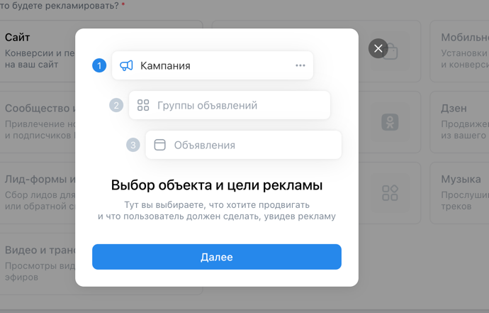 
  
**Помощь и обучение.Обучение.Сайт.Настроить компанию с подсказками.Создать кампанию**

- Целевая кнопка **"Сайт"**
  - Описание "Конверсия и переходы на ваш сайт"
- Подсказка
  - Название "Объект рекламы"
  - Описание "Это то, что вы хотите продвигать."
  - Кнопка закрытия (крестик) 
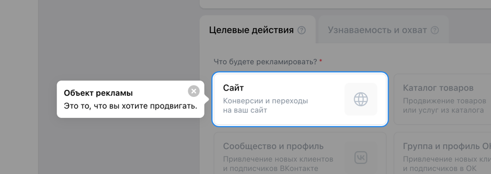 
**Помощь и обучение.Обучение.Сайт.Настроить компанию с подсказками.Создать кампанию** 
  
  - Поле ввода
    - Название поля ввода "Рекламируемый сайт" 
    - Поле ввода с плйэсхолдером "Введите ссылку на сайт"
      - Если ввести корректную ссылку - активируется кнопка на подсказке
      - Если ввести текст, не являющийся ссылкой - сообщение об ошибке "Не удалось подгрузить данные ссылки"
  - Подсказка
    - Заголовок "Рекламируемый сайт"
    - Описание
    - Кнопка **"Далее"**- целевая (неактивна, пока не будет заполнено поле ввода)
    - Кнопка закрытия (крестик) 
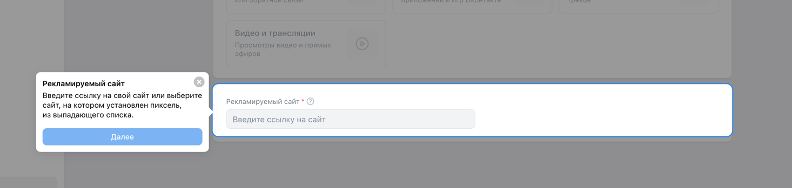 

**Помощь и обучение.Обучение.Сайт.Настроить компанию с подсказками.Создать кампанию.Закрыть**\
При нажатии на кнопку закрытия (крестик):
- Попап "Прервать обучение"
  - Описание
  - Кнопка "Прервать"
  - Кнопка "Отмена"
  - Кнопка закрытия (крестик) 
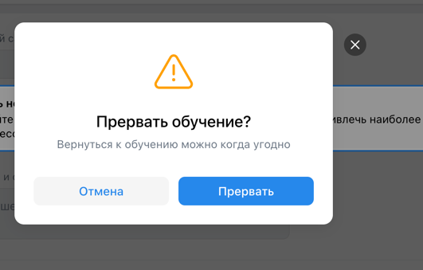 
  
__________

 Мобильные приложения
--
https://ads.vk.com/hq/apps

**Мобильные приложения.Добавить приложение**\
Попап: 
- Заголовок "Привязка приложения"
- Описание
- Кнопка "Далее" (неактивна)
- Поле ввода. 
  - При вводе корректной ссылки на мобильное приложение - активируется кнока "Далее"
  - При вводе ссылки на приложение, которое уже добавлено - сообщение об ошибке 
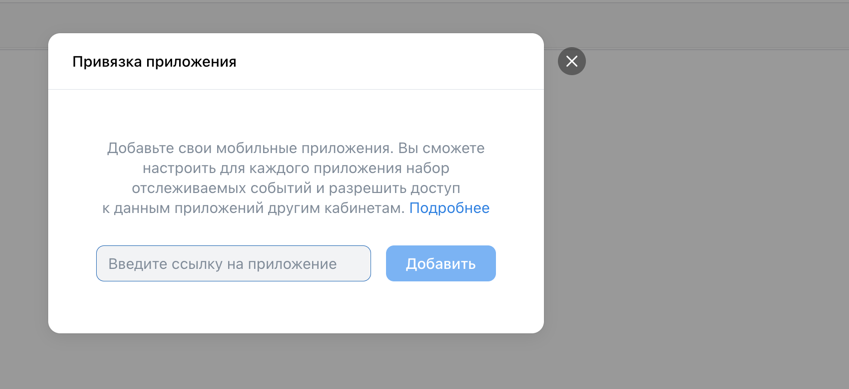 
**Мобильные приложения.Добавить приложение.Добавить**\
Попап:
  - Ссылка на приложение + превью
  - Описание
  - Ссылка на инструкцию "Как настроит приложение в трекере"
  - Поле с кодом
  - Кнопка "Копировать"
  - Кнопка закрытия (крестик) 

 

**Мобильные приложения.Список приложений**\
- Шапка
  - Фильтр
  - Поиск
  - Кнопка "Добавить приложение"
- Основная часть
  - Таблица со списком приложений
    - Столбцы: Название приложения, Название трекера, Статус, Действие
    - Футер 
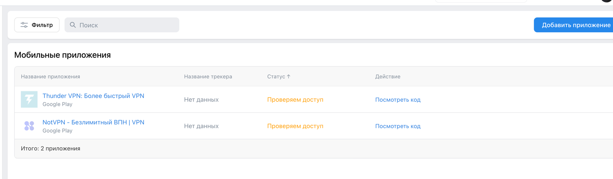 

----
Сайты
---
https://ads.vk.com/hq/pixels

**Нет привязанных пикселей**
- Заголовок
- Описание
- Кнопка "Добавить пиксель" 
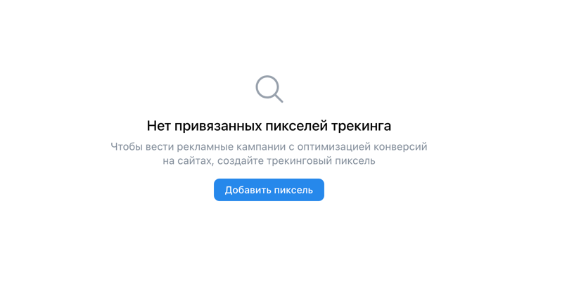 

**Сайты.Добавить пиксель**  
Попап:
- Заголовок "Добавление пикселя"
- Описание
- Переключатель: 
  - Домен сайта
    - Поле ввода с плейсхолдером "Домен сайта"
    - Кнопка Добавить пиксель (неактивна, пока не введена ссылка)
  - ID пикселя
    - Поля ввода ID пикселя и email владельца
    - Кнопка Запросить доступ (неактивна, пока не заполнены поля)
- Кнопка закрытия (крестик) 
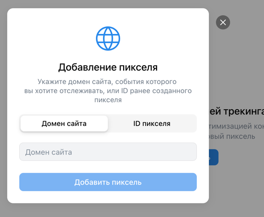 
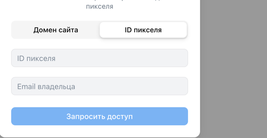 
После ввода появляется попап:
- Заголовок
- Кнопка назад
- Кнопка "Запросить доступ к пикселю"
- Кнопка "Создать новый пиксель" 
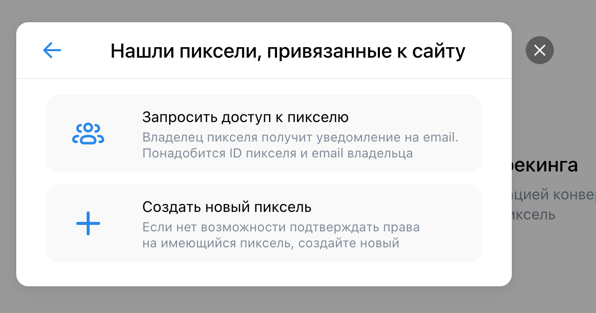 

**Сайты.Добавить пиксель.Домен сайта.Создать новый пиксель** 
При вводе корректного домена появляется попап:
- Заголовок
- Описание
- Кнопка "Получить код"
- Кнопка закрытия (крестик) 
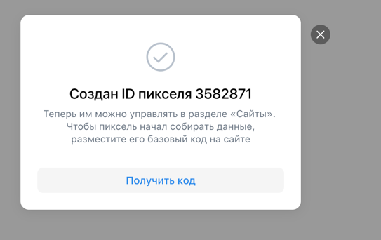 
**Сайты. Список сайтов** 
Шапка:
- Кнопка Добавить пиксель
- Поле поиска
Таблица:
- Столбцы: Домен и название сайта, ID пикселя VK, Статус, Действия 
- При наведении появляется попа с кнопками Переименовать, Удалить пиксель 
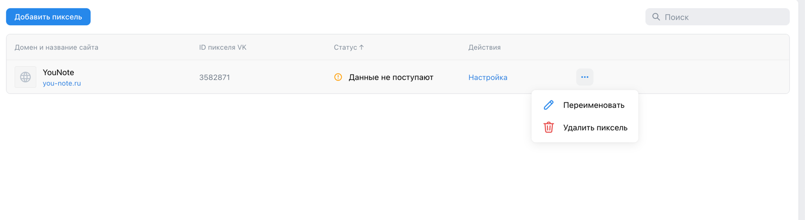 

**Сайты.Список сайтов.Переименовать** 
Попап:
- Заголовок "Изменить название пикселя"
- Подзаголовок "Введите новое название"
- Поле ввода
- Кнопка Отмена
- Кнопка Изменить
- Кнопка закрытия (крестик) 
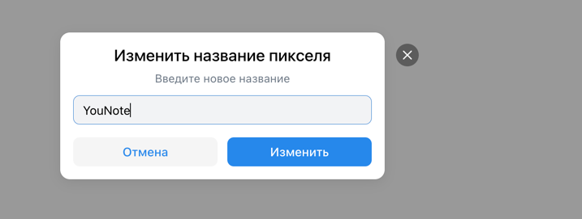 
**Сайты.Список сайтов.Удалить пиксель** 
Попап:
- Заголовок "Удаление пикселя"
- Описание
- Кнопка Отмена
- Кнопка Удалить
- Кнопка закрытия (крестик) 
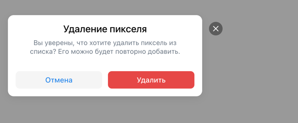 