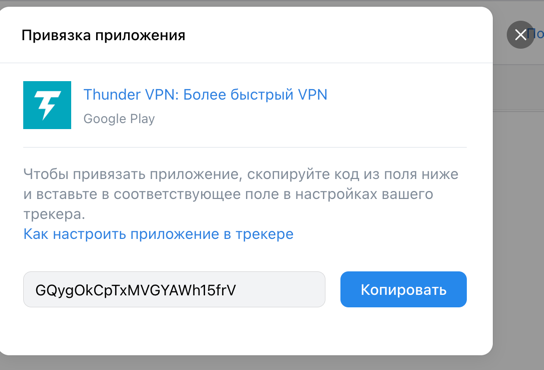
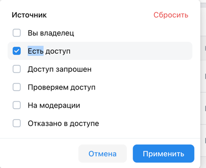
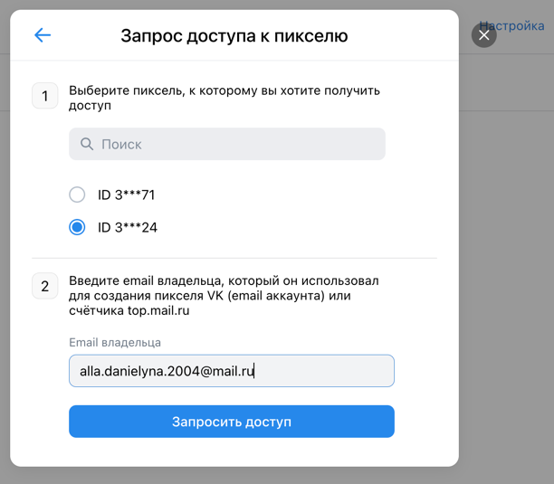
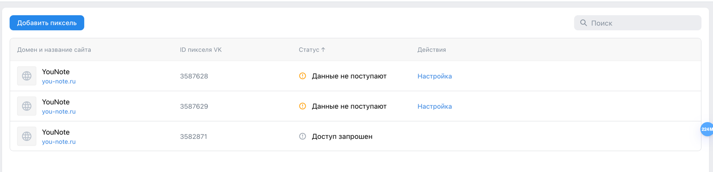

Проект [VK Реклама](https://ads.vk.com/)
--
## Содержание:

1. [ Мобильные приложения](#мобильные-приложения)
2. [Сайты](#сайты)

----

[//]: # ( Помощь и обучение.Обучение)

[//]: # (- )

[//]: # (  https://ads.vk.com/hq/overview)

[//]: # (![img_6.png]&#40;resources/img_6.png&#41;)

[//]: # (В нем отображаются:)

[//]: # (- заголовок "С чего начнем обучение?")

[//]: # (- подзаголовок "Выберите, что будете рекламировать")

[//]: # (- надпись "Вернуться к обучению можно когда угодно")

[//]: # (- кнопка "Попробовать позже")

[//]: # (    - при наведении - hover)

[//]: # (    - при нажатии - закрывается баннер)

[//]: # (- кнопка крестик для закрытия)

[//]: # (  - при нажатии закрывается баннер)

[//]: # (- кнопки "Сообщество ВКонтакте", "Каталог товаров", "Лид формы", "Музыка", "Дзен",  "Сайт", "Мобильное приложение", "VK Mini Apps", "Видео и трансляции"  )

[//]: # (  - при наведении - hover)

[//]: # (  - при нажатии - открывается соответствующий баннер)

[//]: # (![img_7.png]&#40;resources/img_7.png&#41;  )

[//]: # (**Помощь и обучение.Обучение.Сайт**)

[//]: # (- заголовок "Как хотите учится?")

[//]: # (- кнопка "Настроить кампанию с подсказками")

[//]: # (  - при наведении - hover)

[//]: # (  - при нажатии - redirect на https://ads.vk.com/hq/dashboard/ad_plans и доступ к тултипам)

[//]: # (- кнопка "Смотреть видеоурок от экспертов VK")

[//]: # (  - при наведении - hover)

[//]: # (  - при нажатии - открывается видеоплеер VK)

[//]: # (- кнопка "Смотреть курс на обучающей платформе" )

[//]: # (  - при наведении - hover)

[//]: # (  - при нажатии - редирект на https://expert.vk.com/courses/kak-prodvigat-saiti-v-vk-reklame/)

[//]: # (![img_8.png]&#40;resources/img_8.png&#41;  )

[//]: # (Далее при нажатии на целевую кнопку - переход к следующему tooltip.)

[//]: # ()
[//]: # (**Помощь и обучение.Обучение.Сайт.Настроить компанию с подсказками** )

[//]: # ()
[//]: # (- Кнопка **"Создать кампанию"** - целевая)

[//]: # (  - при нажатии - следующий tooltip)

[//]: # (- Подсказка )

[//]: # (  - заголовок "Создание кампании")

[//]: # (  - текст "Нажмите, чтобы начать настройку новой рекламной кампании.")

[//]: # (  - кнопка закрытия )

[//]: # (    - при нажатии появляется попап подтверждения завершения обучения)

[//]: # (![img.png]&#40;resources/img.png&#41; )

[//]: # (**Помощь и обучение.Обучение.Сайт.Настроить компанию с подсказками.Создать кампанию**)

[//]: # (  )
[//]: # (- Попап )

[//]: # (  - Заголовок "Выбор объекта и цели рекламы" )

[//]: # (  - Описание "Тут вы выбираете, что хотите продвигать и что пользователь должен сделать, увидев рекламу")

[//]: # (  - Кнопка **"Далее"** - целевая)

[//]: # (    - при нажатии - переход к следующему тултипу)

[//]: # (  - Кнопка закрытия &#40;крестик&#41; )

[//]: # (    - при нажатии появляется попап подтверждения завершения обучения)

[//]: # (![img_1.png]&#40;resources/img_1.png&#41; )

[//]: # (  )
[//]: # (**Помощь и обучение.Обучение.Сайт.Настроить компанию с подсказками.Создать кампанию**)

[//]: # ()
[//]: # (- Целевая кнопка **"Сайт"**)

[//]: # (  - при наведении - hover)

[//]: # (  - при нажатии - переход к следующему tooltip)

[//]: # (- Описание "Конверсия и переходы на ваш сайт")

[//]: # (- Подсказка)

[//]: # (  - Название "Объект рекламы")

[//]: # (  - Описание "Это то, что вы хотите продвигать.")

[//]: # (  - Кнопка закрытия &#40;крестик&#41; )

[//]: # (    - при нажатии появляется попап подтверждения завершения обучения)

[//]: # ()
[//]: # (![img_2.png]&#40;resources/img_2.png&#41; )

[//]: # (**Помощь и обучение.Обучение.Сайт.Настроить компанию с подсказками.Создать кампанию** )

[//]: # (  )
[//]: # (  - Поле ввода)

[//]: # (    - Название поля ввода "Рекламируемый сайт" )

[//]: # (    - Поле ввода с плйэсхолдером "Введите ссылку на сайт")

[//]: # (      - Если ввести корректную ссылку - активируется кнопка на подсказке)

[//]: # (      - Если ввести текст, не являющийся ссылкой - сообщение об ошибке "Не удалось подгрузить данные ссылки")

[//]: # (  - Подсказка)

[//]: # (    - Заголовок "Рекламируемый сайт")

[//]: # (    - Описание)

[//]: # (    - Кнопка **"Далее"**- целевая &#40;неактивна, пока не будет заполнено поле ввода&#41;)

[//]: # (      - при нажатии - переход к следующему tooltip)

[//]: # (    - Кнопка закрытия &#40;крестик&#41; )

[//]: # (![img_3.png]&#40;resources/img_3.png&#41; )

[//]: # ()

[//]: # (При нажатии на кнопку закрытия &#40;крестик&#41;:)

[//]: # (- Попап "Прервать обучение")

[//]: # (  - Описание)

[//]: # (  - Кнопка "Прервать")

[//]: # (    - при нажатии - закрывается окно обучения)

[//]: # (  - Кнопка "Отмена")

[//]: # (    - при нажатии - возвращаемся к прохождению обучения)

[//]: # (  - Кнопка закрытия &#40;крестик&#41; )

[//]: # (    - при нажатии - возвращаемся  к прохождению обучения)

[//]: # (![img_5.png]&#40;resources/img_5.png&#41; )

[//]: # (  )
__________

 Мобильные приложения
---

##### **1.1 Добавление приложения**
1. **Открытие попапа привязки приложения:**
  - Нажать кнопку **"Добавить приложение"**.
  - Убедиться, что открывается попап с заголовком **"Привязка приложения"**, описанием и неактивной кнопкой **"Далее"**.

2. **Поле ввода ссылки:**
  - Ввести корректную ссылку на мобильное приложение .
  - Убедиться, что кнопка **"Далее"** становится активной.
  - Ввести ссылку на приложение, которое уже добавлено.
  - Убедиться, что появляется сообщение об ошибке.
  - Ввести текст, не являющийся ссылкой на приложение.
  - Убедиться, что кнопка **"Далее"** остается неактивной.

3. **Попап с информацией о добавляемом приложении:**
  - После активации кнопки **"Далее"**, нажать ее.
  - Убедиться, что открывается попап с:
    - Ссылкой на приложение и его превью.
    - Описанием.
    - Ссылкой на инструкцию **"Как настроить приложение в трекере"**, которая открывает страницу [инструкции](https://ads.vk.com/help/articles/integration_tracker).
    - Полем с нередактируемым кодом.
    - Кнопкой **"Копировать"**.
    - Кнопкой закрытия (крестик).

4. **Кнопка "Копировать":**
  - Нажать кнопку **"Копировать"**.
  - Убедиться, что появляется тост с текстом **"Код скопирован"**.

5. **Закрытие попапа:**
  - Нажать кнопку закрытия (крестик).
  - Убедиться, что попап закрывается и **приложение добавляется в список** со статусом "Проверяем доступ".
     
  -  
---

#### **2. Список мобильных приложений**

##### **2.1 Шапка**

###### **Фильтр**
6. **Открытие фильтра:**
  - Нажать на кнопку **"Фильтр"**.
  - Убедиться, что появляется баннер с чекбоксами и надписью **"Выбрать все"**.

7. **Выбор всех чекбоксов:**
  - Нажать на **"Выбрать все"**.
  - Убедиться, что все чекбоксы отмечены.
  - Убедиться, что надпись меняется на **"Сбросить"**.

8. **Сброс выбора чекбоксов:**
  - Нажать на **"Сбросить"**.
  - Убедиться, что все чекбоксы снимаются.
  - Убедиться, что надпись меняется обратно на **"Выбрать все"**.

9. **Отмена фильтрации:**
  - Нажать кнопку **"Отмена"**.
  - Убедиться, что баннер закрывается и фильтрация не применяется.

10. **Применение фильтрации:**
  - Отметить несколько чекбоксов.
  - Нажать кнопку **"Применить"**.
  - Убедиться, что баннер закрывается.
  - Проверить, что в списке отображаются приложения, соответствующие выбранным фильтрам.

###### **Поиск**
11. **Поиск приложения:**
  - Ввести в поле поиска название приложения.
  - Убедиться, что в списке отображаются только соответствующие приложения.
  - Ввести несуществующее название приложения.
  - Убедиться, что в списке отображается сообщение **"Ничего не найдено"**.

---

##### **2.2 Основная часть**

###### **Таблица приложений**
12. **Отображение данных:**
  - Убедиться, что таблица содержит столбцы:
    - **Название приложения**
    - **Название трекера**
    - **Статус**
    - **Действие**

######  **Футер**
13. **Отображение итогов:**
  - Убедиться, что в футере таблицы отображается общее количество приложений и/или страниц.
  - Пролистать список до последней страницы.
  - Убедиться, что данные футера корректно обновляются.

---
 

----
Сайты.Пиксели
---
https://ads.vk.com/hq/pixels

### **Нет привязанных пикселей**
- Заголовок
- Описание
- Кнопка "Добавить пиксель" 
 

#### **Добавление пикселя**
1. **Добавление нового пикселя (неповторяющийся домен):**
  - Ввести корректное доменное имя.
  - Нажать **"Добавить пиксель"**.
  - Проверить, что появляется модальное окно с сообщением: **"Создан ID пикселя"**.
  - Закрыть окно.
  - Убедиться, что пиксель добавлен в список со статусом **"Данные не поступают"**.
 
     
     
     
2. **Запрос доступа по ID пикселя:**
  - Ввести корректный (существующий) **ID пикселя**  и email владельца (которому принадлежит пиксель).
  - Нажать **"Запросить доступ"**.
  - Проверить, что появляется модальное окно: **"Доступ к пикселю запрошен"**.
  - Закрыть окно или нажать кнопку **"Отлично"**.
  - Убедиться, что пиксель появляется в списке со статусом **"Доступ запрошен"**.
     

3. **Запрос доступа к пикселю (по домену):**
  - Ввести корректное доменное имя (например, `you-note.ru`).
  - На появившемся попапе выбрать "Запросить доступ к пикселю"
  - Выбрать из списка один из доступных пикселей.
  - Ввести корректный email владельца (например, `alla.danielyna.2004@mail.ru@mail.ru`).
  - Нажать **"Запросить доступ"**.
  - Проверить, что появляется модальное окно: **"Доступ к пикселю запрошен"**.
  - Закрыть окно или нажать кнопку **"Отлично"**.
  - Убедиться, что пиксель появляется в списке со статусом **"Доступ запрошен"**.

---

#### **Изменение названия пикселя**
5. **Изменение названия пикселя:**
  - Добавить пиксель для нового домена (например, `example123.ru`).
  - Открыть выпадающее меню (три точки) → **Переименовать**.
  - Ввести новое название (например, **"Новое название"**) → нажать **"Изменить"**.
  - Перезагрузить страницу и убедиться, что название пикселя обновлено.
  - Открыть выпадающее меню → **Удалить пиксель** → подтвердить удаление.
  - Убедиться, что пиксель пропал из списка.

6. **Отмена изменения названия пикселя:**
  - Открыть выпадающее меню (три точки) → **Переименовать**.
  - Ввести новое название (например, **"Новое название"**) → нажать **"Отмена"**.
  - Перезагрузить страницу и убедиться, что название пикселя не изменилось.
     

---

#### **Удаление пикселя**
7. **Отмена удаления пикселя:**
  - Открыть выпадающее меню (три точки) → **Удалить пиксель**.
  - Нажать **"Отмена"** или закрыть окно.
  - Убедиться, что пиксель остается в списке.

8. **Подтверждение удаления пикселя:**
  - Открыть выпадающее меню (три точки) → **Удалить пиксель**.
  - Подтвердить удаление.
  - Убедиться, что пиксель пропал из списка.
     

---

#### **Поиск пикселей**
9. **Поиск пикселя по имени:**
  - Ввести имя пикселя в поле поиска.
  - Убедиться, что пиксель найден.

10. **Поиск пикселя по подстроке имени:**
  - Ввести подстроку имени пикселя в поле поиска.
  - Убедиться, что пиксель найден.

11. **Поиск пикселя по ID:**
  - Ввести ID пикселя  в поле поиска.
  - Убедиться, что пиксель найден.

12. **Поиск пикселя по подстроке ID:**
  - Ввести подстроку ID пикселя  в поле поиска.
  - Убедиться, что пиксель найден.

13. **Поиск отсутствующего пикселя:**
  - Ввести имя или ID, отсутствующие в списке .
  - Убедиться, что в списке отображается сообщение **"Ничего не найдено"**.

[//]: # (----)

[//]: # (Обзор)

[//]: # (---)

[//]: # ()
[//]: # (https://ads.vk.com/hq/overview)

[//]: # ()
[//]: # (![img.png]&#40;resources/img30.png&#41; )

[//]: # (**Блок информационный:**  )

[//]: # (- Заголовок "Добро пожаловать в VK Рекламу!")

[//]: # (- Подзаголовок)

[//]: # (- Карточка "Создать кампанию вручную")

[//]: # (  - Ссылка на обучение)

[//]: # (  - Кнопка "Создать вручную")

[//]: # (- Карточка "Запустить рекламу у блогеров")

[//]: # (  - Кнопка "Открыть VK AdBlogger" )

[//]: # ()
[//]: # (**Блок обзора кампаний**  )

[//]: # (- Если нет кампаний:)

[//]: # (  - Заголовок)

[//]: # (  - Подзаголовок)

[//]: # (- Если есть кампании:)

[//]: # (  - Кампании)

[//]: # (    - Транслируются, Не транслируются, На модерации, Отклоненные)

[//]: # (    - Кнопка "Создать кампанию")

[//]: # (      - при нажатии - редирект на https://ads.vk.com/hq/new_create/ad_plan)

[//]: # (  - Бюджет)

[//]: # (    - Расходы за сегодня)

[//]: # (      - при нажатии список доступных периодов)

[//]: # (    - Прогноз бюджета)

[//]: # (    - Кнопка "Пополнить")

[//]: # (      - при нажатии - появляется попап оплаты)

[//]: # (  - Баннер "Запустите рекламу у блогеров")

[//]: # (    - Описание)

[//]: # (    - Кнопка "Открыть VK AdBlogger")

[//]: # (  - Список избранных кампаний)

[//]: # (    - Заголовок)

[//]: # (    - Описание)

[//]: # (    - Кнопка "Выбрать Кампании")

[//]: # (      - при нажатии - открывается окно выбора кампаний)

[//]: # (  - Полезные материалы)

[//]: # (    - Кейсы)

[//]: # (    - Новости)

[//]: # (    - )

[//]: # (![img.png]&#40;resources/img31.png&#41;)

[//]: # ()
[//]: # (**Обзор.Блок обзора кампаний. Список избранных кампаний. Выбрать кампании** )

[//]: # (Попап:)

[//]: # (- Загловок "Избранные кампании")

[//]: # (- Подзаголовок)

[//]: # (- Поисковая строка)

[//]: # (  - при вводе значени фильтруется выдача)

[//]: # (- Список кампаний)

[//]: # (  - каждая строка содержит чек бокс)

[//]: # (  - при выборе чек бокса появляется надпись Сбросить в углу)

[//]: # (    - при нажатии на сбросить все отмеченные чекбоксы отменяются)

[//]: # (- Кнопка Отмена)

[//]: # (  - при нажатии закрывается попап)

[//]: # (- Кнопка Сохранить)

[//]: # (  - при нажатии закрывается попап, выбранные кампании оказываются в списке избраных)

[//]: # (- Кнопка закрытия &#40;крестик&#41; )

[//]: # (  - при нажатии закрывает попап)

[//]: # ()
[//]: # (![img_1.png]&#40;resources/img_32.png&#41; )

[//]: # ()
[//]: # (После выбора избранных кампаний. Список Избранные кампании.)

[//]: # (- Заголовок)

[//]: # (- Список избранных кампаний)

[//]: # (- Кнопка "Выбрать кампании")

[//]: # (  - при нажатии открывается попап выбора кампаний)

[//]: # (- Кнопка "Показы")

[//]: # (  - при нажатии открывается список доступных для просмотра метрик)

[//]: # (- DatePiker)

[//]: # (  - при нажатии открывается окно для выбора даты)

[//]: # (- Окно просмотра статистики )

[//]: # ()
[//]: # (![img_2.png]&#40;resources/img_33.png&#41;)