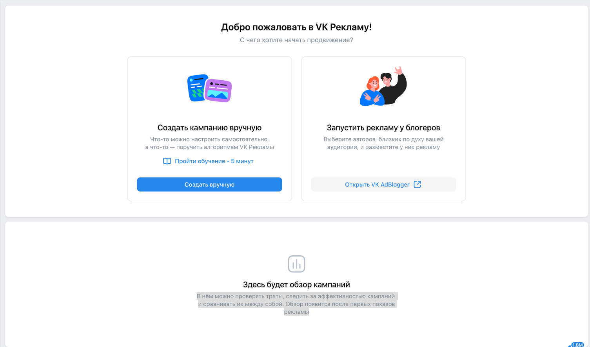

Проект [VK Реклама](https://ads.vk.com/)
--
## Содержание:
1. [ Помощь и обучение](#помощь-и-обучениеобучение)
2. [ Мобильные приложения](#мобильные-приложения)
3. [Сайты](#сайты)
4. [Обзор](#обзор)
----
 Помощь и обучение.Обучение
- 
  https://ads.vk.com/hq/overview

**Помощь и обучение. Обучение. Всплывающее окно обучения.**\
В нем отображаются:
- заголовок "С чего начнем обучение?"
- подзаголовок "Выберите, что будете рекламировать"
- надпись "Вернуться к обучению можно когда угодно"
- кнопка "Попробовать позже"
    - при наведении - hover
    - при нажатии - закрывается баннер
- кнопка крестик для закрытия
  - при нажатии закрывается баннер
- кнопки "Сообщество ВКонтакте", "Каталог товаров", "Лид формы", "Музыка", "Дзен",  "Сайт", "Мобильное приложение", "VK Mini Apps", "Видео и трансляции"  
  - при наведении - hover
  - при нажатии - открывается соответствующий баннер
  
**Помощь и обучение.Обучение.Сайт**
- заголовок "Как хотите учится?"
- кнопка "Настроить кампанию с подсказками"
  - при наведении - hover
  - при нажатии - redirect на https://ads.vk.com/hq/dashboard/ad_plans и доступ к тултипам
- кнопка "Смотреть видеоурок от экспертов VK"
  - при наведении - hover
  - при нажатии - открывается видеоплеер VK
- кнопка "Смотреть курс на обучающей платформе" 
  - при наведении - hover
  - при нажатии - редирект на https://expert.vk.com/courses/kak-prodvigat-saiti-v-vk-reklame/
  
Далее при нажатии на целевую кнопку - переход к следующему tooltip.

**Помощь и обучение.Обучение.Сайт.Настроить компанию с подсказками** 

- Кнопка **"Создать кампанию"** - целевая
  - при нажатии - следующий tooltip
- Подсказка 
  - заголовок "Создание кампании"
  - текст "Нажмите, чтобы начать настройку новой рекламной кампании."
  - кнопка закрытия 
    - при нажатии появляется попап подтверждения завершения обучения
 
**Помощь и обучение.Обучение.Сайт.Настроить компанию с подсказками.Создать кампанию**
  
- Попап 
  - Заголовок "Выбор объекта и цели рекламы" 
  - Описание "Тут вы выбираете, что хотите продвигать и что пользователь должен сделать, увидев рекламу"
  - Кнопка **"Далее"** - целевая
    - при нажатии - переход к следующему тултипу
  - Кнопка закрытия (крестик) 
    - при нажатии появляется попап подтверждения завершения обучения
 
  
**Помощь и обучение.Обучение.Сайт.Настроить компанию с подсказками.Создать кампанию**

- Целевая кнопка **"Сайт"**
  - при наведении - hover
  - при нажатии - переход к следующему tooltip
- Описание "Конверсия и переходы на ваш сайт"
- Подсказка
  - Название "Объект рекламы"
  - Описание "Это то, что вы хотите продвигать."
  - Кнопка закрытия (крестик) 
    - при нажатии появляется попап подтверждения завершения обучения

 
**Помощь и обучение.Обучение.Сайт.Настроить компанию с подсказками.Создать кампанию** 
  
  - Поле ввода
    - Название поля ввода "Рекламируемый сайт" 
    - Поле ввода с плйэсхолдером "Введите ссылку на сайт"
      - Если ввести корректную ссылку - активируется кнопка на подсказке
      - Если ввести текст, не являющийся ссылкой - сообщение об ошибке "Не удалось подгрузить данные ссылки"
  - Подсказка
    - Заголовок "Рекламируемый сайт"
    - Описание
    - Кнопка **"Далее"**- целевая (неактивна, пока не будет заполнено поле ввода)
      - при нажатии - переход к следующему tooltip
    - Кнопка закрытия (крестик) 
 

**Помощь и обучение.Обучение.Сайт.Настроить компанию с подсказками.Создать кампанию.Закрыть**\
При нажатии на кнопку закрытия (крестик):
- Попап "Прервать обучение"
  - Описание
  - Кнопка "Прервать"
    - при нажатии - закрывается окно обучения
  - Кнопка "Отмена"
    - при нажатии - возвращаемся к прохождению обучения
  - Кнопка закрытия (крестик) 
    - при нажатии - возвращаемся  к прохождению обучения
 
  
__________

 Мобильные приложения
--
https://ads.vk.com/hq/apps

**Мобильные приложения.Добавить приложение**\
Попап: 
- Заголовок "Привязка приложения"
- Описание
- Кнопка "Далее" (неактивна)
- Поле ввода. 
  - При вводе корректной ссылки на мобильное приложение - активируется кнока "Далее"
  - При вводе ссылки на приложение, которое уже добавлено - сообщение об ошибке 
  - При вводе текста отличного от ссылки на приложение - кнопка Далее остается неактивной
 
**Мобильные приложения.Добавить приложение.Добавить**\
Попап:
  - Ссылка на приложение + превью
  - Описание
  - Ссылка на инструкцию "Как настроить приложение в трекере"
    - при нажатии - открывается страница https://ads.vk.com/help/articles/integration_tracker
  - Поле с кодом
    - нередактируемое
  - Кнопка "Копировать"
    - При нажатии - появляется тост с надписью "Код скопирован"
  - Кнопка закрытия (крестик) 

 

**Мобильные приложения.Список приложений**\
- Шапка
  - Фильтр
    - при нажатии появляется баннер с чек-боксами
    - надпись Выбрать все
      - при нажатии - отмечаются все чек боксы
    - при выборе чекбокса заменяется Выбрать все -> Сбросить и отменяются чекбоксы
    - кнопка Отмена 
      - при  нажатии закрывается баннер
    кнопка Применить
      - при нажатии закрывается баннер и фильтруются мобильные прилолжения в списке
  - Поиск
  - Кнопка "Добавить приложение"
- Основная часть
  - Таблица со списком приложений
    - Столбцы: Название приложения, Название трекера, Статус, Действие
    - Футер 
 

----
Сайты
---
https://ads.vk.com/hq/pixels

**Нет привязанных пикселей**
- Заголовок
- Описание
- Кнопка "Добавить пиксель" 
 

**Сайты.Добавить пиксель**  
Попап:
- Заголовок "Добавление пикселя"
- Описание
- Переключатель: 
  - Домен сайта
    - Поле ввода с плейсхолдером "Домен сайта"
    - Кнопка Добавить пиксель (неактивна, пока не введена ссылка)
  - ID пикселя
    - Поля ввода ID пикселя и email владельца
    - Кнопка Запросить доступ (неактивна, пока не заполнены поля)
- Кнопка закрытия (крестик) 
 
 
После ввода появляется попап:
- Заголовок
- Кнопка назад
- Кнопка "Запросить доступ к пикселю"
- Кнопка "Создать новый пиксель" 
 

**Сайты.Добавить пиксель.Домен сайта.Создать новый пиксель** 
При вводе корректного домена появляется попап:
- Заголовок
- Описание
- Кнопка "Получить код"
- Кнопка закрытия (крестик) 
 
**Сайты. Список сайтов** 
Шапка:
- Кнопка Добавить пиксель
  -  при нажатии появляется баннер добавления пикселя
- Поле поиска
  - при вводе значения список фильтруется
Таблица:
- Столбцы: Домен и название сайта, ID пикселя VK, Статус, Действия 
- При наведении появляется попа с кнопками Переименовать, Удалить пиксель 
 

**Сайты.Список сайтов.Переименовать** 
Попап:
- Заголовок "Изменить название пикселя"
- Подзаголовок "Введите новое название"
- Поле ввода
- Кнопка Отмена
  - при нажатии зкарывается окно переименования пикселя
- Кнопка Изменить
  - при нажатии - закрывается окно переименования пикселя 
  - в список новое название просачивается только после перезагрузки страницы
- Кнопка закрытия (крестик) 
  - при нажатии зкарывается окно переименования пикселя

 
**Сайты.Список сайтов.Удалить пиксель** 
Попап:
- Заголовок "Удаление пикселя"
- Описание
- Кнопка Отмена
  - закрывается окно удаления пикселя
- Кнопка Удалить
  - попап с кнопками Отмена и Удалить для подтверждения
- Кнопка закрытия (крестик) 
  - закрывается окно удаления пикселя

 

----
Обзор
---

https://ads.vk.com/hq/overview

 
**Блок информационный:**  
- Заголовок "Добро пожаловать в VK Рекламу!"
- Подзаголовок
- Карточка "Создать кампанию вручную"
  - Ссылка на обучение
  - Кнопка "Создать вручную"
- Карточка "Запустить рекламу у блогеров"
  - Кнопка "Открыть VK AdBlogger" 

**Блок обзора кампаний**  
- Если нет кампаний:
  - Заголовок
  - Подзаголовок
- Если есть кампании:
  - Кампании
    - Транслируются, Не транслируются, На модерации, Отклоненные
    - Кнопка "Создать кампанию"
      - при нажатии - редирект на https://ads.vk.com/hq/new_create/ad_plan
  - Бюджет
    - Расходы за сегодня
      - при нажатии список доступных периодов
    - Прогноз бюджета
    - Кнопка "Пополнить"
      - при нажатии - появляется попап оплаты
  - Баннер "Запустите рекламу у блогеров"
    - Описание
    - Кнопка "Открыть VK AdBlogger"
  - Список избранных кампаний
    - Заголовок
    - Описание
    - Кнопка "Выбрать Кампании"
      - при нажатии - открывается окно выбора кампаний
  - Полезные материалы
    - Кейсы
    - Новости
    - 

**Обзор.Блок обзора кампаний. Список избранных кампаний. Выбрать кампании** 
Попап:
- Загловок "Избранные кампании"
- Подзаголовок
- Поисковая строка
  - при вводе значени фильтруется выдача
- Список кампаний
  - каждая строка содержит чек бокс
  - при выборе чек бокса появляется надпись Сбросить в углу
    - при нажатии на сбросить все отмеченные чекбоксы отменяются
- Кнопка Отмена
  - при нажатии закрывается попап
- Кнопка Сохранить
  - при нажатии закрывается попап, выбранные кампании оказываются в списке избраных
- Кнопка закрытия (крестик) 
  - при нажатии закрывает попап

 

После выбора избранных кампаний. Список Избранные кампании.
- Заголовок
- Список избранных кампаний
- Кнопка "Выбрать кампании"
  - при нажатии открывается попап выбора кампаний
- Кнопка "Показы"
  - при нажатии открывается список доступных для просмотра метрик
- DatePiker
  - при нажатии открывается окно для выбора даты
- Окно просмотра статистики 

