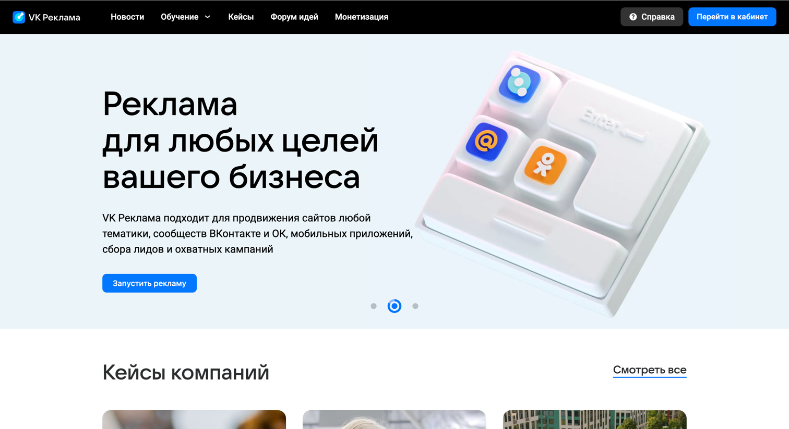
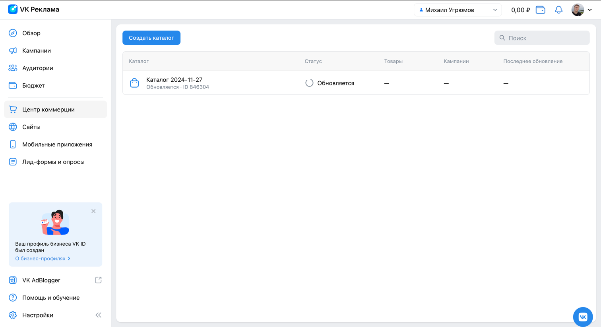
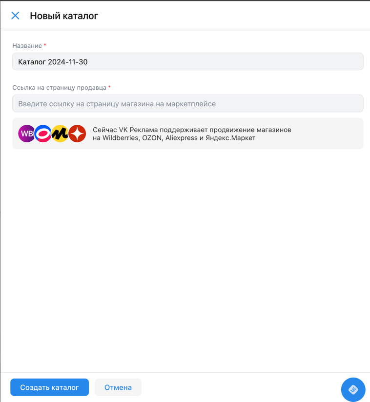
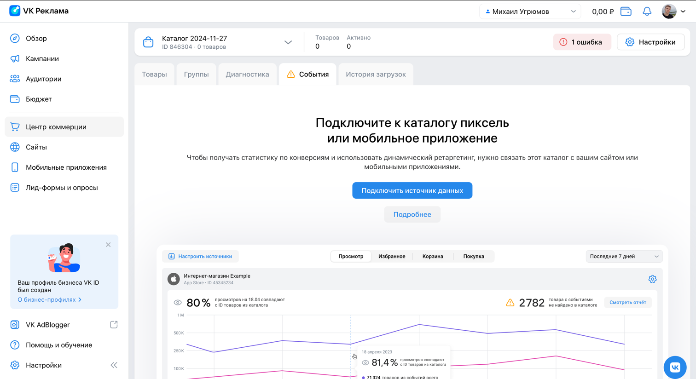

# Проект [VK Реклама](https://ads.vk.com/)

## Содержание:

1. [Главная](#главная)
2. [Лид-формы и опросы](#лид-формы-и-опросы)
3. [Центр коммерции](#центр-коммерции)

## Главная

- При нажатии на кнопки переключения рекламы происходит переключение на соответствующий контент.
- При нажатии на кнопки "Получить бонус", "Запустить рекламу", "Подрбонее" внутри рекламы происходит переход на соответствующую страницу.
- При нажатии на кнопку "Перейти в кабинет" происходит переход на страницу авторизации.
- При нажатии на кнопку "Смотреть все" происходит переход на страницу кейсов.

## Лид-формы и опросы

### Оформление.

- При клике на кнопку "Создать опрос" открывается страница модальное окно с названием "Новый опрос", полем "Название", "Название компании", "Заголовок опроса", "Описание опроса".
- При клике на месяц тело карточки становится темным.
- При клике на солнце тело карточки становится светлым.
- При клике на крест модального окна - окно закрывается.

### Оформление. Вопросы.

- При вводе значений во все поля для ввода, загрузке логотипа минимум 256x256px формата JPEG, PNG или GIF и клике на кнопку "Вопросы" открывается окно.
- Окно имеет заголовок "Вопросы" и содержит кнопки: Добавить вариант, Добавить вопрос, Ответ из шаблона, Добавить стоп-кран, Один из списка.
- При клике на кнопку "Назад" открывается предыдущая страница с введенными до этого значениями.
- Лид-формы и опросы. Опросы. Оформление. Вопросы. При клике на кнопку "Результат" появляется сообщение "Вопрос должен быть не пустым и содержать минимум 2 ответа". При клике на крест модального окна - окно закрывается.
- При клике на кнопку "Добавить вариант" появляется новое поле "Введите ответ" и рядом с ним появляется крест. При клике на крест появившееся поле удаляется.
- При клике на кнопку "Добавить вопрос" добавляется новый вопрос. При клике на корзину вопрос удаляется.
- При клике на крест модального окна - окно закрывается.

### Оформление. Вопросы. Добавить стоп-экран.

- При клике на кнопку "Добавить стоп-экран" добавляется стоп экран с полями: "Завершить опрос, если ответ на", "содержит любой из", "Заголовок экрана", "Описание".
- При клике на крест появившееся поле удаляется.
- После ввода символов в текст вопроса и два поля вариантов ответа и клике на кнопку "Результат" - открывается страница "Результат" с двумя заполненными по умолчанию полями "Заголовок" с телом "Спасибо за ответы!" и "Описание" с телом "Заявка отправлена", а также кнопкой "Добавить ссылку".

### Оформление. Вопросы. Результат.

- При очистке данных полей и клике на кнопку "Запустить опрос" у каждого поля появляется сообщение "Обязательное поле".
- При клике на "Добавить ссылку" появляется поле "Ссылка".
- При клике на "Запустить опрос" закрывается модальное окно "Новый опрос". Отображается таблица опросов. В данной таблице отображается последний созданный опрос с именем, равным введенному при создании.

## Центр коммерции

- При нажатии на кнопку "Создать каталог" появляется форма создания каталога c заполненным полем "Название".
- После создания каталога он добавляется в список каталогов.

### Фид или сообщество

- При вводе ссылки без протокола появляется ошибка "Необходимо указать протокол http(s)".
- Появляется ошибка "Обязательное поле" при создании каталога с пустым полем "Ссылка на фид или сообщество".

### Маркетплейс

- При нажатии на кнопку "Добавить каталог магазина" открывается модальное окно c заголовком "Новый каталог".
- Окно содержит поля "Название" с заполненным названием вида "Каталог {текущая дата в формате yyyy-mm-dd}" и "Ссылка на страницу продавца".
- При нажатии "Создать каталог" без ввода ссылки около соответствующего поля появляется ошибка "Обязательное поле".
- При вводе корректной ссылки на страницу продавца появляется поле "API key".
- При клике на крест модального окна - окно закрывается.

### Вручную

- При нажатии на кнопку "Скачать шаблон фида {выбранная категория фида}" скачивается файл соответствующего вида.
- Ошибка "Ошибка при загрузке файла" при попытке загрузить файл фида формата, отличного от CSV, TXT, XML, YML.
- После загрузки файла появляется крест, при нажатии на который файл исчезает.
- Ошибка при создании каталога без загруженного файла фида.

### Товары

- При нажатии на кнопку "Рекламировать" отрывается форма создания кампании.

### Группы

- При нажатии на кнопку "Создать группу" появляется выбор "Использовать фильтры" или "Выбрать товары вручную".
- При создании группы с использование фильтров добавляется группа соответсвующих товаров в список групп.
- При создании группы с товарами, выбранными вручную, добавляется группа соответсвующих товаров в список групп.

### Диагностика

- При нажатии на кнопку "Скачать полный отчет" скачивается файл с отчетом формате CSV.

### События

- При нажатии на кнопку "Подключить источник данных" открывается форма подключения источников данных с кнопкой "Добавить источник".
- Подключение источника данных. При нажатии на кнопку "Добавить источник" появляется выбор между "Пиксель" и "Мобильное приложение".
- При выборе одного из вариантов "Пиксель" или "Мобильное приложение" открывается форма добавления источника данных.

- 
