Кампании

# Тесты полей и блоков

## Настройка кампании

1. Целевые действия. Сайт. Рекламируемый сайт. Ввод валидной ссылки, например, https://www.statista.com. Появление остальных полей.
2. Целевые действия. Сайт. Рекламируемый сайт. Ввод невалидной ссылки, например, rewq. Отображение ошибки "Не удалось подгрузить данные ссылки"
3. Целевые действия. Сайт. Отображение ошибок. Ввод невалидной ссылки, например, rewq, в поле "Рекламируемый сайт". Нажатие кнопки "Продолжить". Отображение блока ошибки. Нажатие на блок ошибки. Вывод информации о ошибке "Рекламируемый сайт".
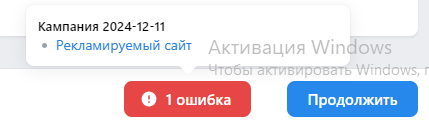
3. Целевые действия. Сайт. Бюджет. Ввод 100. При нажатии кнопки "продолжить" переход на следующий этап
4. Целевые действия. Сайт. Бюджет. Ввод меньше 100. При нажатии кнопки "продолжить" вывод сообщения "Укажите бюджет не меньше 100₽"
5. Целевые действия. Сайт. Бюджет. Ввод ограничен значением "9 999 999 999 999".
6. Целевые действия. Сайт. Бюджет. После ввода бюджета итоговый бюджет сохраняется и отображается в окне.

7. Целевые действия. Сайт. Бюджет. При выборе опции "за всё время" выбор даты проведения "до" является обязательным. Нажатие кнопки "Продолжить". Вывод ошибок.
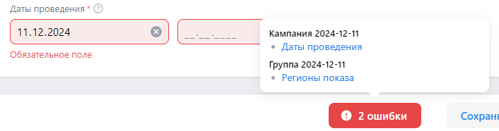
8. Целевые действия. Даты проведения. При нажатии на поле даты открывается календарь. Нажатие на дату. Отображение каледнаря. Выбор даты 31 декабря 2024. Поле заполняется значением 31.12.2024. Нажатие кнопки "Сохранить как черновик". 
Переход к редактированию черновика. Проверка сохранения даты.
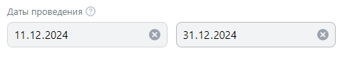
9. Целевые действия. Даты проведения. При нажатии на поле даты открывается календарь. Нажатие на дату. Отображение каледнаря. Выбор в качестве даты проведения прошедшее число заблокирован.
10. Целевое действие. Целевые действия. Поле автоматически заполнено значением "Показы рекламы". Выбор опции "Клики по рекламе". Сохранение черновика. Переход к редактированию черновика. Проверка сохранения целевого действия.
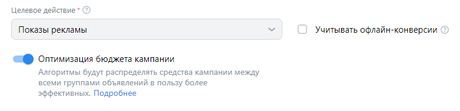
11. Целевое действие. Учитывать оффлайн-конверсии. Нажать checkbox. Сохранение черновика. Сохранение черновика. Переход к редактированию черновика. Проверка сохранения значения "Учитывать оффлайн-конверсии".
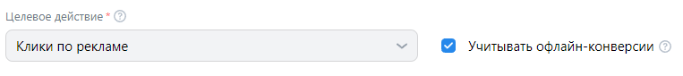
12. Целевое действие. Оптимизация бюджета кампании. Нажатие переключателя. Нажатие кнопки продолжить. Отображение блока бюджета на этапе "Группы объявлений". Сохранение черновика. Переход к редактированию черновика. Проверка сохранения выбора "Оптимизация бюджета кампании".
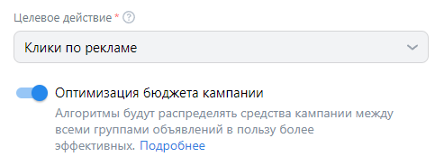
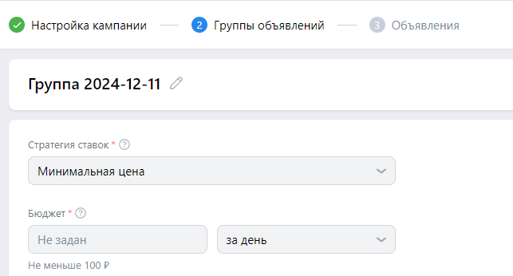
13. Целевое действие. Описание предложения. Заполнение поля значением, содержащим >300 символов. Ограничение ввода 300 символами. Сохранение черновика. Переход к редактированию черновика. Проверка значения поля.
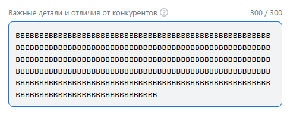
14. Целевые действия. Каталог товаров. Рекламируемый сайт. Ввод валидной ссылки https://vk.com/tm_limited_man. Появление остальных полей.
15. Целевые действия. Каталог товаров. Рекламируемый сайт. Ввод невалидной ссылки, например, rewq. Отображение ошибки "Не удалось подгрузить данные ссылки".
16. Целевые действия. Каталог товаров. Каталог товаров. Нажатие на поле. Выбор опции "Создать каталог". Открытие всплывающего меню. Заполенение поля "Название" значением "Каталог из фида". Нажатие кнопки "Фид или сообщество". Появление остальных полей. Заполение поля "Ссылка на фид или сообщество" значением "https://vk.com/tm_limited_man". Нажатие кнопки "Создать каталог". Всплытие окна "Товары загружаются в каталог". Нажатие кнопки "Продолжить".
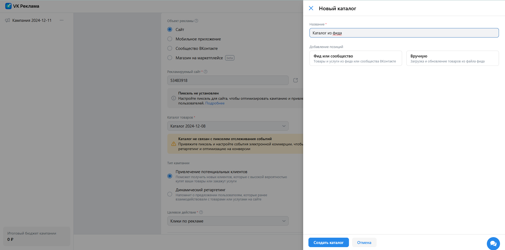
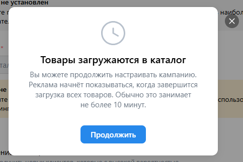
17. Целевые действия. Каталог товаров. Каталог товаров. Нажатие на поле. Выбор опции "Создать каталог". Открытие всплывающего меню. Заполенение поля "Название" значением "Каталог из фида". Нажатие кнопки "Фид или сообщество". Появление остальных полей. Заполение поля "Ссылка на фид или сообщество" значением "https://vk.com/tm_limited_man". Нажатие кнопки "Создать каталог". Всплытие окна "Товары загружаются в каталог". Нажатие кнопки "Продолжить". Повторное создание каталога из фида. Вывод сообщения такой каталог уже есть.
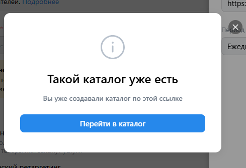
18. Целевые действия. Каталог товаров. Каталог товаров. Нажатие на поле. Выбор опции "Создать каталог". Открытие всплывающего меню. Заполенение поля "Название" значением "Каталог из фида". Нажатие кнопки "Фид или сообщество". Появление остальных полей. Заполение поля "Ссылка на фид или сообщество" значением "https://vk.com/tm_limited_man". Нажатие кнопки "Создать каталог". Всплытие окна "Товары загружаются в каталог". Нажатие кнопки "Продолжить". Нажатие на поле "Каталог товаров". Созданный каталог не предлагается для выбора.
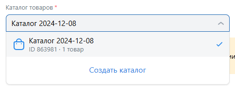 
19. Целевые действия. Каталог товаров. Тип кампании. Нажатие на блок "Динамический ретаргетинг". Отображение предупреждения. Нажатие кнопки "Изменить объект". Выбор оции "Динамический ретаргетинг".
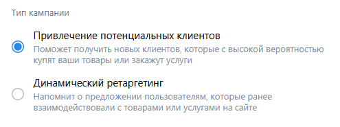

20. Целевые действия. Сообщество ВКонтакте. Нажатие поля "Рекламируемый объект". Выбор опции "Другое сообщество". Появление попапа. Заполнение поля значением "tm_limited_man". Нажатие кнопки добавить. Поле "Рекламируемый объект" заполняется значением "TM Limited | Мужская одежда". Поле "Каталог товаров" заполняется значением "Товары - TM Limited | Мужская одежда".
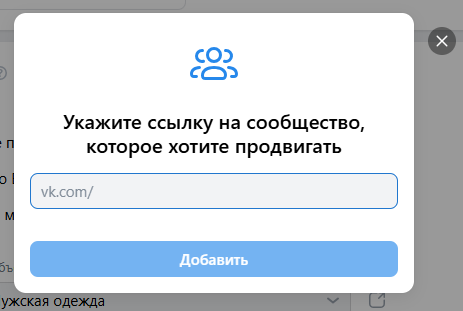
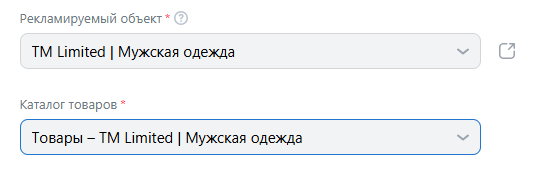
21. Целевые действия. Каталог товаров. Каталог товаров. Нажатие на поле. Выбор опции "Создать каталог". Открытие всплывающего меню. Заполенение поля "Название" значением "Каталог вручную". Нажатие кнопки "Вручную". Появление остальных полей. Загрузка в поле "Файл фида" файла catalog_products.csv. Нажатие кнопки "Создать каталог". Всплытие окна "Товары загружаются в каталог". Нажатие кнопки "Продолжить". Нажатие поля "Каталог товаров". Выбор опции "Каталог вручную".
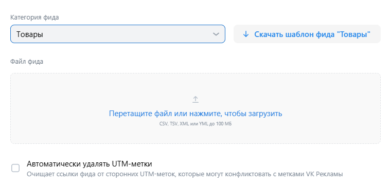
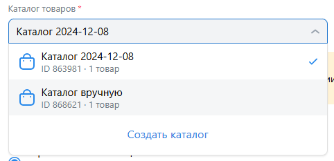
22. Сообщество и профиль. Рекламируемый объект. Нажатие на поле "Рекламируемый объект". Выбор опции "Другое сообщество". Всплытие попапа. Заполнение поля ссылки значением profcomsm. Нажатие кнопки "Добавить". Закрытие попапа. Поле "Рекламируемый объект" заполнено значением "Профсоюз студентов факультета СМ". Поле "Бюджет" заполнено автоматически значением "1 225".
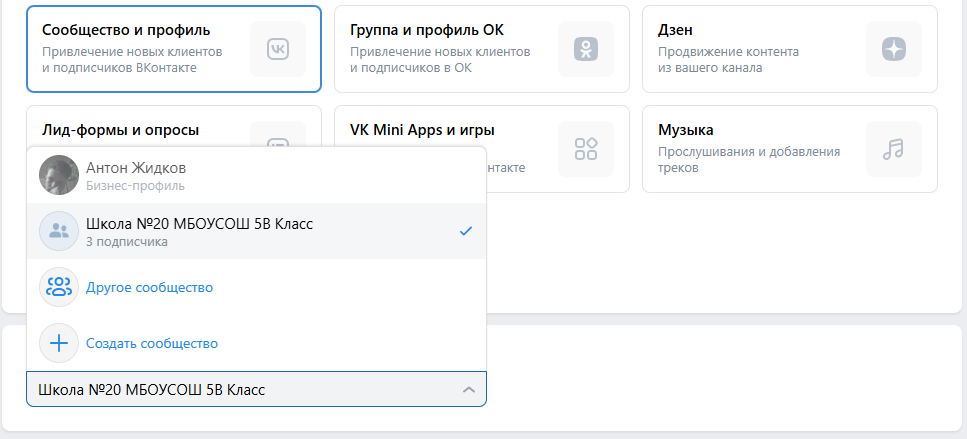
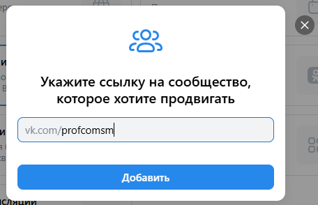
23. Сообщество и профиль. Рекламируемый объект. Нажатие на поле "Рекламируемый объект". Выбор опции "Другое сообщество". Всплытие попапа. Заполнение поля ссылки значением "asfdawfwaaf". Нажатие кнопки "Добавить". Вывод ошибки "Сообщество не найдено".

## Группы кампаний
1. Настроить время показа. Нажатие кнопки "Будни". Переключение на вкладку с расписанием показа по будним дням.
2. Настроить время показа. Нажатие кнопки "Рабочее". Переключение на вкладку с расписанием показа в рабочее время.
3. Настроить время показа. Нажатие кнопки "Выходные". Переключение на вкладку с расписанием показа в выходные.
4. Настроить время показа. Моё время. Нажатие на ячейку. Переключение ячейки с указанным днём недели и часом.
5. Настроить время показа. Переход во вкладку "Моё время" со вкладок "Будни", "Рабочее", "Выходные" происходит с сохранением выбранных ячеек.
6. Регионы показа. Быстрый выбор. Нажатие на одну из опций остаётся выбранная, например, Москва, остальные скрываются.
7. Регионы показа. Поиск. Отображения города при вводе его названия.
8. Регионы показа. Поиск. Добавление региона при нажатии на checkbox среди выдаваемых результатов.
9. Регионы показа. Добавление нескольких регионов. Отображение выбранных регионов и их количества.

10. Регионы показа. Нажатие на кнопку "Добавить списком". Отображение попапа добавления  списком.

11. Регионы показа. Добавление списка. Ввод городов, регионов. Вывод сообщения о добавлении n регионов. Регионы заменятся на выбранные.
12. Регионы показа. Добавление списка. Ввод "йцук". Вывод сообщения об ошибке.
13. Регионы показа. Добавление списка. Загрузка из файла. Чтение указаного файла формата .txt и .csv. Добавление указанных регионов и вывод сообщения о добавлении n регионов.
14. Регионы показа. Добавление списка. Загрузка из файла. Чтение указаного файла формата .txt и .csv. Вывод сообщения об ошибке при чтении некорректных данных, например, "йцуй" или файлов другого расширения.
15. Регионы показа. Нажатие кнопки "Очистить всё". Сброс выбранных регионов.

16. Регионы показа. Указать на карте. Нажатие на карту. Добавление геометки.
17. Регионы показа. Нажатие на стрелочку вверх. Блок сворачивается, отображает выбранные регионы.

18. Демография. Пол. Нажатие на "Мужской". Выбор мужского пола.
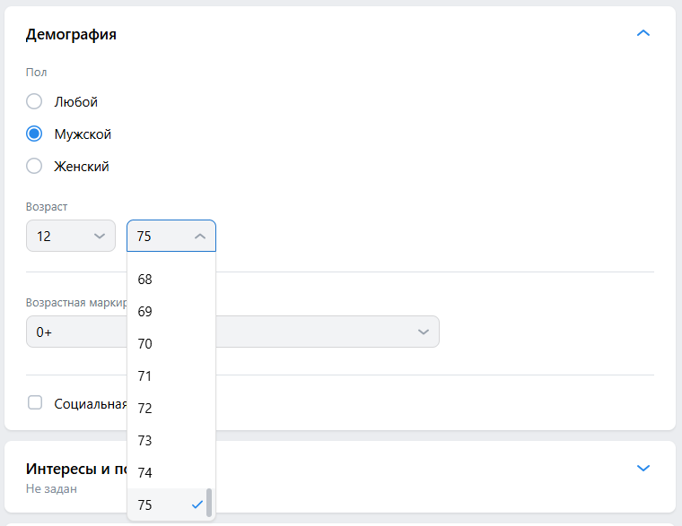
19. Демография. Возраст. Нажатие на блок "От". Отображение drop-down. Выбор опции 70. Нажатие на блок "До". Вывод ограниченного снизу списка опций (от 70 до 75)
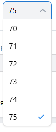
20. Демография. Возраст. Нажатие на блок "До". Отображение drop-down. Выбор опции 19. Нажатие на блок "От". Вывод ограниченного сверху списка опций (от 12 до 19)
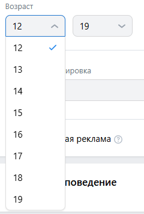
21. Демография. Возрастная маркировка. Нажатие на поле "Возрастная маркировка". Выбор опции "18+". Значение поля заполняется значением "18+".
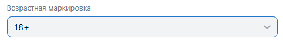
22. Демография. Возрастная маркировка. Предупреждение. Нажатие на поле "Возрастная маркировка". Выбор опции "18+". Вывод предупреждения.
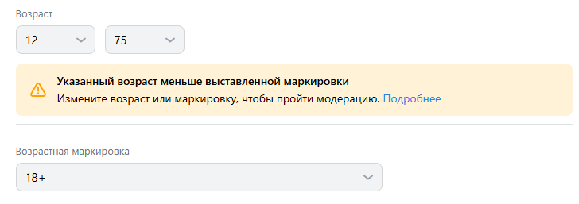

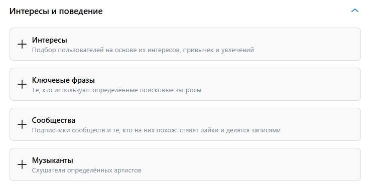
23. Интересы и поведение. Нажатие на блок "Интересы". Пояление поля "Введите название". Нажатие на поле. Появление drop-down меню. Выбор опции "Авто". Блок "Авто" отображается внутри поля ввода.

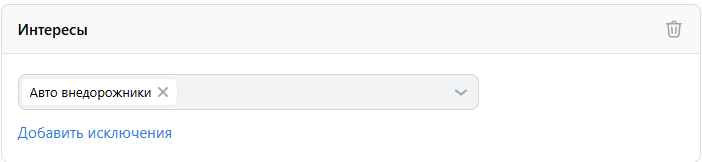
24. Интересы и поведение. Интересы. Нажатие на поле "Введите название". Появление drop-down меню. Выбор опции "Авто". Нажатие крестика в блоке "Авто" внутри поля ввода. Удаление опции.
25. Интересы и поведение. Интересы. Нажатие на строку "Добавить исключения". Появление поля "Исключая интересы". Нажатие на поле. Появление drop-down меню. Выбор опции "Авто".
26. Интересы и поведение. Интересы. Добавление категории "Авто" в интересы и в "Исключая интересы". Нажатие кнопки продолжить. Отображение ошибки.
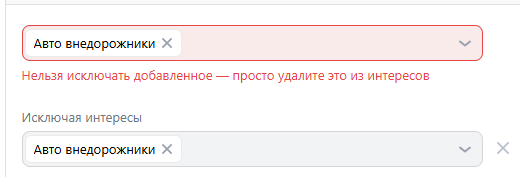
27. Интересы и поведение. Интересы. Добавление категории "Авто" в интересы и в "Исключая интересы". Нажатие кнопки удаление интересов. Блок сворачивается. Нажатие блока Интересы. Поля блока являются пустыми. 
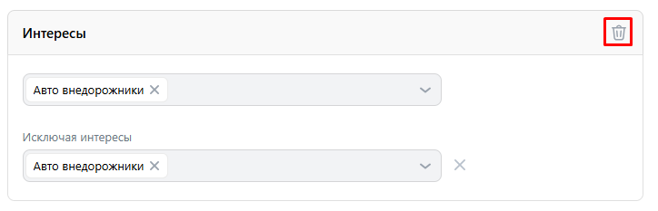
28. Ключевые фразы. Ключевые фразы. Заполнение поля значением "автомобиль". Вывод сообщение "Показать 10 похожих".
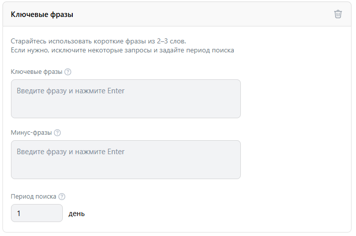
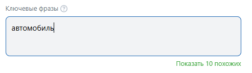
29. Ключевые фразы. Минус-фразы. Заполнение поля значением "автомобиль".
30. Ключевые фразы. Заполнение полей "Ключевые фразы" и "Минус-фразы" значением "автомобиль". Вывод предупреждения.
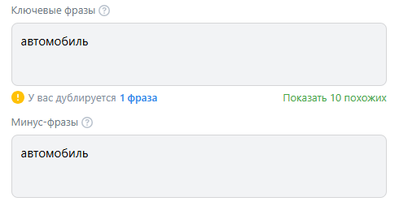
31. Ключевые фразы. Период поиска. Ввод ограничен 2 цифрами.

32. Ключевые фразы. Период поиска. Ввод значения "50". Вывод ошибки "От 1 до 30 дней". Снятие фокуса с поля. Заполнение поля значением "30".
33. Ключевые фразы. Период поиска. Заполнение полей "Ключевые фразы" и "Минус-фразы" значением "автомобиль", заполнение поля "Период поиска" значением "15". Нажатие кнопки удаления Ключевых фраз. Блок сворачивается. Нажатие блока Ключевых фраз. Поля "Ключевые фразы" и "Минус-фразы" являются пустыми, поле "Период поиска" заполнен значением "15".

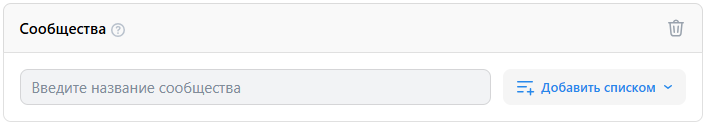

34. Сообщества. Заполнение поля названия сообщества значением "профсоюз". Отображение drop-down. Нажатие кнопки "Сообщества ВКонтакте". Раскрытие списка групп. Выбор первой группы. Нажатие кнопки "Сообщества ВКонтакте". Скрытие списка. Нажатие на "Группы ОК". Раскрытие списка. Выбор первой группы. Нажатие на блок сообщества. Скрытие меню, отображение выбранных групп и их количества (2).

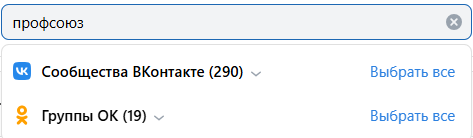
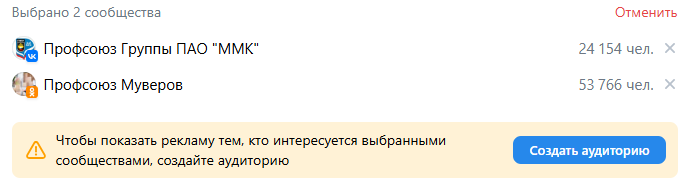

35. Сообщества. Заполнение поля названия сообщества значением "профсоюз". Добавление группы. Нажатие крестика в строке группы. Удаление группы из списка.
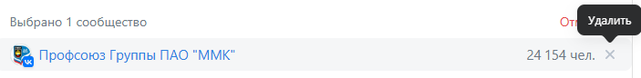
36. Сообщества. Заполнение поля названия сообщества значением "профсоюз". Добавление группы. Нажатие кнопки "Отменить". Удаление группы из списка.
37. Сообщества. Заполнение поля названия сообщества значением "профсоюз". Добавление группы. Нажатие кнопки удаление Сообщества. Блок сворачивается. Нажатие блока Сообщества. Поле блока являются пустыми.

38. Музыканты. Заполнение поля "Введите название музыканта" значением "Баста". Отображение drop-down с результатами поиска. Нажатие первого блока в выдаче. Нажатие кнопки "Готово". Отображение выбранных музыкантов.
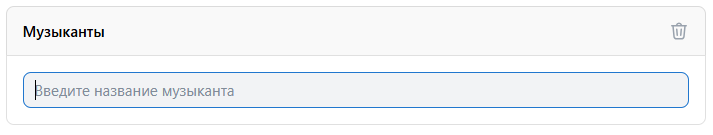
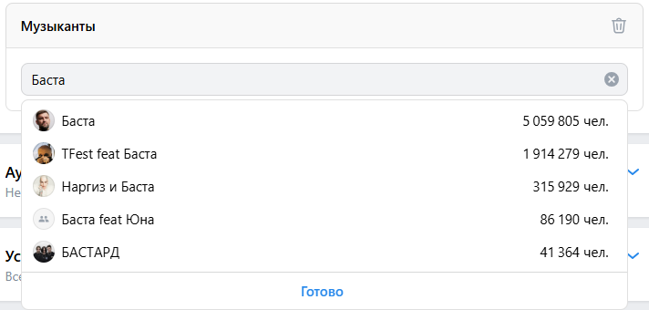
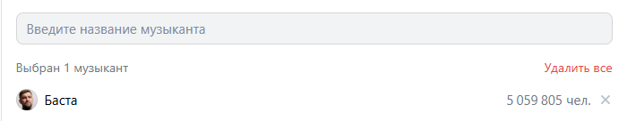
39. Музыканты. Заполнение поля значением "Баста". Добавление исполнителя "Баста". Нажатие крестика в строке музыканта. Удаление музыканта из списка.
40. Музыканты. Заполнение поля значением "Баста". Добавление исполнителя "Баста". Нажатие кнопки "Отменить". Удаление музыканта из списка.
41. Музыканты. Заполнение поля значением "Баста". Добавление исполнителя "Баста". Нажатие кнопки удаление Музыканты. Блок сворачивается. Нажатие блока Музыканты. Поле блока является пустым.

42. Устройства. Нажатие строки "Десктопные". Checkbox "Мобильные" не доступен для редактирования. Нажатие строки "Мобильные". Отсутствие изменений.
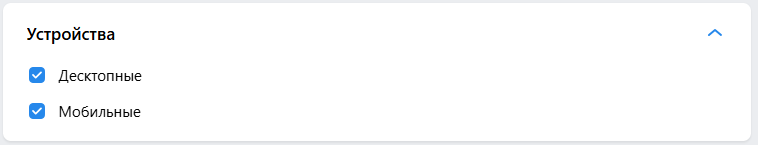
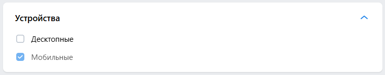
42. Устройства. Нажатие строки "Мобильные". Checkbox "Десктопные" не доступен для редактирования. Нажатие строки "Десктопные". Отсутствие изменений.

43. Параметры URL. Выбор опции "Добавлять UTM-метки вручную". Переключение на опцию
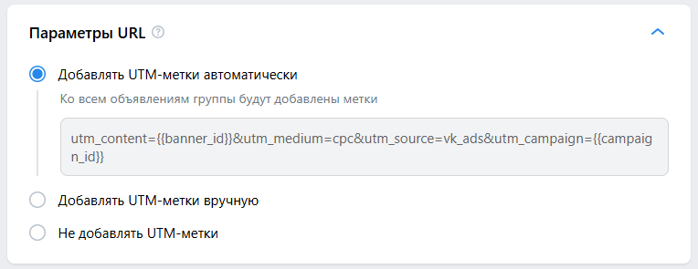
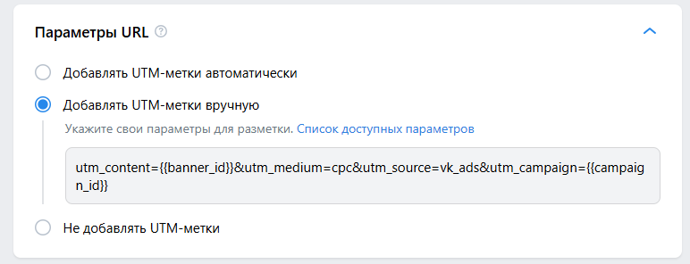
44. Параметры URL. Поле недоступно для редактирования.
45. Параметры URL. Выбор опции "Добавлять UTM-метки вручную". Поле доступно к редактированию.
46. Параметры URL. Выбор опции "Добавлять UTM-метки вручную". Заполнение поля значением "". Нажатие кнопки продолжить. Отображение ошибки.
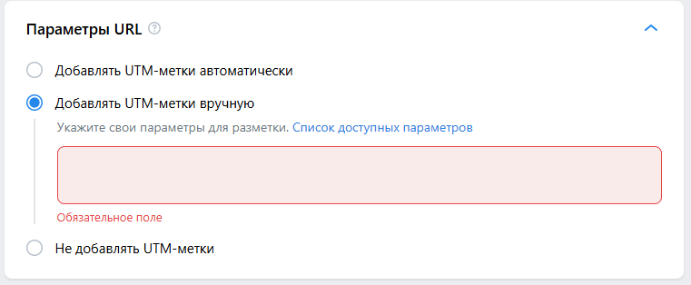
47. Параметры URL. Выбор опции "Добавлять UTM-метки вручную". Заполнение поля значением "pampam". Нажатие кнопки продолжить. Отображение ошибки.
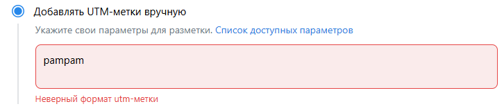

## Объявления
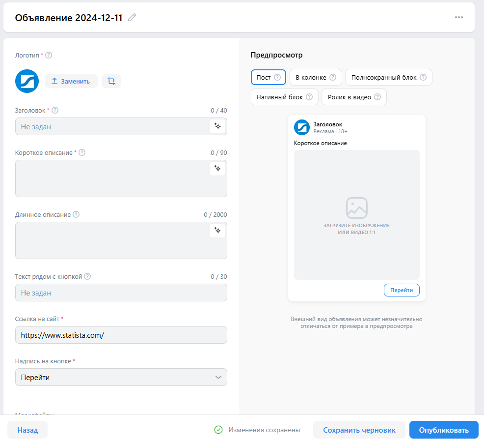

1. Заголовок. Заполнение поля значением "Тестовый заголовок".
2. Заголовок. Нажатие кнопки "Опубликовать". Вывод ошибки.
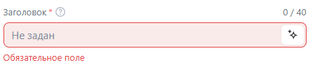
3. Заголовок. Заполнение поля значением, содержащим 41 символ. Нажатие кнопки "Опубликовать". Вывод ошибки.
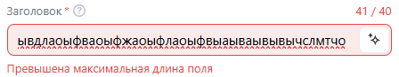
3. Короткое описание

## Демография.

1. Проверка сохранения

Перейти к созданию рекламы сайта. Заполнение поля "Рекламируемый сайт" валидным URL, например, https://www.statista.com. Ввод в поле бюджет суммы от 100, например, 100. Нажатие кнопки "Продолжить". Переход на этап "Группы объявлений".
Раскрыть блок с демографией. Выбрать пол Мужской, возраст от 50. Нажатие кнопки "Сохранить как черновик". Вернуться на вкладку кампании. Открыть черновики. Нажать кнопку редактирования созданного 
черновика. Откроется этап "Настройка кампании". Нажатие кнопки "Продолжить". Нажатие на блок "Демография". Раскрытие блока "Демография". Проверка выбранного пола и указанного возраста.

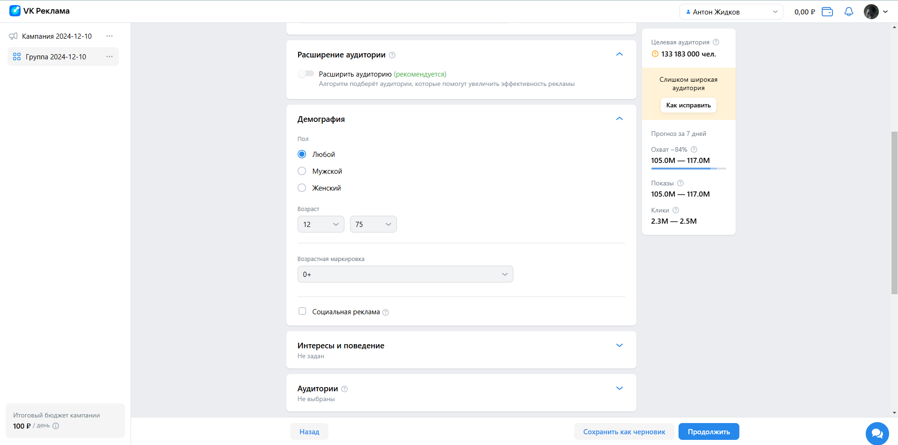

2. Проверка редактирования

Перейти к созданию рекламы сайта. Заполнение поля "Рекламируемый сайт" валидным URL, например, https://www.statista.com. Ввод в поле бюджет суммы от 100, например, 100. Нажатие кнопки "Продолжить". Переход на этап "Группы объявлений".
Раскрыть блок с демографией. Выбрать пол Мужской, возраст от 50. Нажатие кнопки "Сохранить как черновик". Вернуться на вкладку кампании. Открыть черновики. Нажать кнопку редактирования созданного 
черновика. Откроется этап "Настройка кампании". Нажатие кнопки "Продолжить". Нажатие на блок "Демография". Раскрытие блока "Демография". Изменение пола на "Женский" и возраста на от 30 до 50.
Нажатие кнопки "Сохранить как черновик". Проверка сохранения.

## Интересы и поведение.

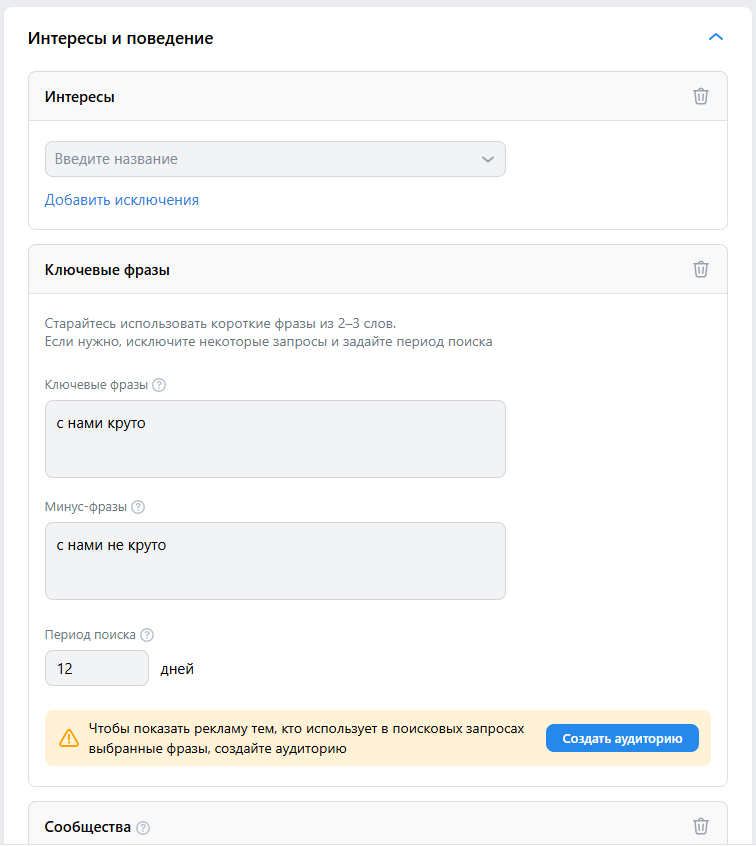
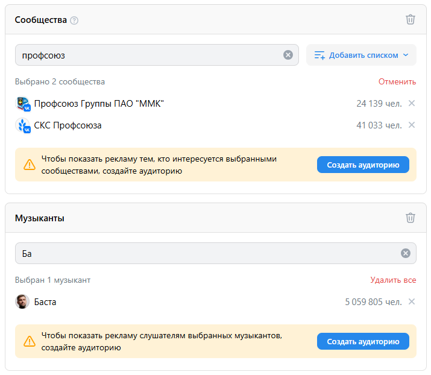

1. Проверка сохранения.
Перейти к созданию рекламы сайта. Заполнение поля "Рекламируемый сайт" валидным URL, например, https://www.statista.com. Ввод в поле бюджет суммы от 100, например, 100. Нажатие кнопки "Продолжить". Переход на этап "Группы объявлений".
Раскрыть блок с Интересы и поведение.

# Кампании

## Создание рекламы Сайта
Стартовая страница - https://ads.vk.com/hq/overview

1. Перейти в блок "Кампании" нажатием на кнопку "Кампании" в меню. Нажатие кнопки "Создать". Переход на страницу https://ads.vk.com/hq/new_create/ad_plan на этап "Настройка кампании". Нажатие на кнопку "Сайт". Заполнение поля "Рекламируемый сайт" валидным URL, например, https://www.statista.com. Ввод в поле бюджет суммы от 100, например, 100. Нажатие кнопки "Продолжить". Переход на этап "Группы объявлений". В блоке "Регионы показа" нажатие кнопки "Москва". Нажатие кнопки "Продолжить". Переход на этап "Объявления". Заполнение полей "заголовок" значением "Тест", "Короткое описание" значением "Тест", прикрепление изображения в блок "Медиафайлы". Заполнение формы "О рекламодателе" (заполняется автоматически указанными ФИО и ИНН). Нажатие кнопки "Опубликовать". Переход на страницу "Кампании". Отображение созданной кампании в списке с заданным ранее бюджетом и названием. Нажатие на название группы. Переход на вкладку группы. Нажатие на название группы. Переход на вкладку объявление. Нажатие на блок с фото рядом с названием объявления. Предпросмотр созданного объявления. 

## Редактирование рекламной кампании

1. Наведение на название кампании, нажатие на кнопку "Редактировать". Всплытие меню редактирования. Изменение бюджета на 200, изменение названия на "Кампания 1". Нажатие на блок "Группа". Переход на редактирование Группы. Изменение названия группы на "Группа 1", добавление региона "Санкт-Петербугр". Нажатие на блок "Объявление". Изменение названия на "Объявление 1", заголовка значением "Тест 1", описания значением "Тест 1", ссылки на сайт на "https://vk.com/a645g743", удаление всех медиафайлов у добавлнение нового. Нажатие кнопки "Сохранить".

В списке отображается кампания с измененными именем и бюджетом. Нажатие на название группы. Переход на вкладку группы. Отображение группы с измененным названием. Нажатие на название группы. Переход на вкладку объявление. Нажатие на блок с фото рядом с названием объявления. Предпросмотр редактированного объявления.
 

## Дублирование кампании

1. Наведение на название кампании, наведение на троеточие, нажатие на кнопку "Дублировать". Переход на страницу. Переход на этап "настройка камании". Нажатие на кнопку продолжить. Переход на следующий этап. Нажатие кнопки "Продолжить". Переход на следующий этап. Нажатие на кнопку "Опубликовать". На вкладке "Кампании" отображается копия кампания.

## Удаление кампании

1. Наведение на название кампании, наведение на троеточие, нажатие на кнопку "Удалить". Удаление кампании. Кампания не отображается в списке. После обновления страницы кампания не отображается в списке.

## Создание рекламы каталога товара

1. Перейти в блок "Кампании" нажатием на кнопку "Кампании" в меню. Нажатие кнопки "Создать". Нажатие на кнопку "Каталог товаров". Заполнение поля "Рекламируемый сайт" значением "https://vk.com/tm_limited_man". Нажатие на поле "Выберите каталог". Всплытие dropdown меню. Нажатие опции "Создать каталог". Всплытие окна "Новый каталог". Нажатие кнопки "Вручную". Заполнение поля "файл фида" файлом catalog_products.csv. Нажатие кнопки "Создать каталог". Отображение сообщения "Товары загружаются в каталог". Задать бюджет значением 100. Нажатие кнопки "Продолжить". Переход на следующий этап. В блоке "Регионы показа" нажатие кнопки "Москва". Нажатие кнопки "Продолить". Переход на следующий этап. Задание заголовка значением "Тест". Поле "Описание для баннера" заполняется автоматически значением "{{product.name}} {{product.price}}". Заполнение поля "Описание для карусели" значением "тестовая карусель". Поле "Заголовок карточки" заполняется автоматически значением "{{product.name}}". Нажатие кнопки "Опубликовать". Переход на страницу "Кампании". Отображение созданной кампании в списке с заданным ранее бюджетом и названием.

## Создание рекламы мобильного приложения - не реализовано

1. Перейти в блок "Кампании" нажатием на кнопку "Кампании" в меню. Нажатие кнопки "Создать". Нажатие кнопки "Мобильное приложение". Нажатие на поле "Рекламируемое приложение". 
Выбор опции "Привязать новое приложение". Всплытие окна "Привязка приложения". Заполнение поля значением "https://play.google.com/store/apps/details?id=org.telegram.messenger&hl=ru". Нажатие кнопки "Добавить". Всплытие окна "Привязка приложения" с трекером. Сохранение трекера и закрытие окна. 
Заполнение поля бюджета значением 100. Нажатие кнопки "Продолжить". Переход на следующий этап. Переход на следующий этап. В блоке "Регионы показа" нажатие кнопки "Москва". Нажатие кнопки "Продолить". Переход на следующий этап. 
Заполнение поля "Короткое описание" значением "Тест". Поле заголовок заполняется автоматически значением "Telegram". Заполнение поля "Длинное описание" значением "Тест1". Заполение поля "Трекинговая ссылка" ???.

трекер - BrtMSN1SPEEe6QZmGkMq4e

--------------

Стартовые условия:
Перейти в блок "Кампании" нажатием на кнопку "Кампании" в меню. Нажатие кнопки "Создать". 

## Создание рекламы сообщества ВК.

1. Нажатие кнопки "Сообщество и профиль". Нажатие на поле "Рекламируемый объект". Выбор опции "Другое сообщество". Всплытие окна "Укажите ссылку на сообщество". Заполнение поля значением "profcomsm". Нажатие кнопки "Добавить". Нажатие кнопки "Продолжить". Переход на следующий этап. В блоке "Регионы показа" нажатие кнопки "Москва". Нажатие кнопки "Продолить". Переход на следующий этап. Поле "Загаловок" автоматически заполняется значением "Профсоюз студентов факультета "СМ"". Заполнение поля "Описание" значением "Тест". Добавление медиафайлов. Нажатие кнопки "Опубликовать". Переход на страницу "Кампании". Отображение созданной кампании в списке с заданным ранее бюджетом и названием.

## Создание рекламы "Группа и профиль ОК" - не реализовано
1. Нажатие кнопки "Группа и профиль ОК". Нажатие на поле "Рекламируемый объект". Выбор опции "Создать группу". Нажатие кнопки "Перейти" в всплывающем меню. Переход на страницу "https://ok.ru/groups/create". Нажатие блока "Публичная или бизнес-страница". Авторизация. Переход на страницу "https://ok.ru/groups/create/page". Заполнить поле "Название" значением "Тестовая страница". Нажатие поля "Тематика". Выбор опции "Автомобили". Нажатие кнопки "Создать". 

## Создание рекламы "Лид формы и опросы"

1. Нажатие кнопки "Лид формы и опросы". Выбор лид формы "Лид-форма 2024-12-09". Нажатие кнопки "Продолжить". Переход на следующий этап. В поле бюджет задать значение "100". В блоке "Регионы показа" нажатие кнопки "Москва". Нажатие кнопки "Продолить". Переход на следующий этап. Поле "Заголовок" заполнено автоматически значением "тест". Заполнение поля "Короткое описание" значением "Короткое описание лид формы". Заполнение поля "Текст рядом с кнопкой" значением "Нажимай". Заполнение поля "Длинное описание" значением "Длинное описание лид формы". Добавление медиафайлов. Нажатие кнопки "Опубликовать". Отображение созданной кампании в списке с заданным ранее бюджетом и названием.

## Сохранение черновика.

1. Нажатие кнопки "Сообщество и профиль". Нажатие на поле "Рекламируемый объект". Выбор опции "Другое сообщество". Всплытие окна "Укажите ссылку на сообщество". Заполнение поля значением "profcomsm". Нажатие кнопки "Добавить". Нажатие кнопки "Продолжить". Переход на следующий этап. Нажатие кнопки "Сохранить как черновик". Сохранение черновика. Переход на страницу "https://ads.vk.com/hq/dashboard/ad_plans". Нажатие кнопки "Все кампании". В всплывающем меню нажатие кнопки "Черновики". Отображение сохраненного черновика в списке.

