# Кампании

## Создание рекламы Сайта
Стартовая страница - https://ads.vk.com/hq/overview

Перейти в блок "Кампании" нажатием на кнопку "Кампании" в меню. Нажатие кнопки "Создать". Переход на страницу https://ads.vk.com/hq/new_create/ad_plan на этап "Настройка кампании". Нажатие на кнопку "Сайт". Заполнение поля "Рекламируемый сайт" валидным URL, например, https://www.statista.com. Ввод в поле бюджет суммы от 100, например, 100. Нажатие кнопки "Продолжить". Переход на этап "Группы объявлений". В блоке "Регионы показа" нажатие кнопки "Москва". Нажатие кнопки "Продолжить". Переход на этап "Объявления". Заполнение полей "заголовок" значением "Тест", "Короткое описание" значением "Тест", прикрепление изображения в блок "Медиафайлы". Заполнение формы "О рекламодателе" (заполняется автоматически указанными ФИО и ИНН). Нажатие кнопки "Опубликовать". Переход на страницу "Кампании". Отображение созданной кампании в списке с заданным ранее бюджетом и названием. Нажатие на название группы. Переход на вкладку группы. Нажатие на название группы. Переход на вкладку объявление. Нажатие на блок с фото рядом с названием объявления. Предпросмотр созданного объявления. 

## Редактирование рекламной кампании

Наведение на название кампании, нажатие на кнопку "Редактировать". Всплытие меню редактирования. Изменение бюджета на 200, изменение названия на "Кампания 1". Нажатие на блок "Группа". Переход на редактирование Группы. Изменение названия группы на "Группа 1", добавление региона "Санкт-Петербугр". Нажатие на блок "Объявление". Изменение названия на "Объявление 1", заголовка значением "Тест 1", описания значением "Тест 1", ссылки на сайт на "https://vk.com/a645g743", удаление всех медиафайлов у добавлнение нового. Нажатие кнопки "Сохранить".

В списке отображается кампания с измененными именем и бюджетом. Нажатие на название группы. Переход на вкладку группы. Отображение группы с измененным названием. Нажатие на название группы. Переход на вкладку объявление. Нажатие на блок с фото рядом с названием объявления. Предпросмотр редактированного объявления.
 

## Дублирование кампании

Наведение на название кампании, наведение на троеточие, нажатие на кнопку "Дублировать". Переход на страницу. Переход на этап "настройка камании". Нажатие на кнопку продолжить. Переход на следующий этап. Нажатие кнопки "Продолжить". Переход на следующий этап. Нажатие на кнопку "Опубликовать". На вкладке "Кампании" отображается копия кампания.

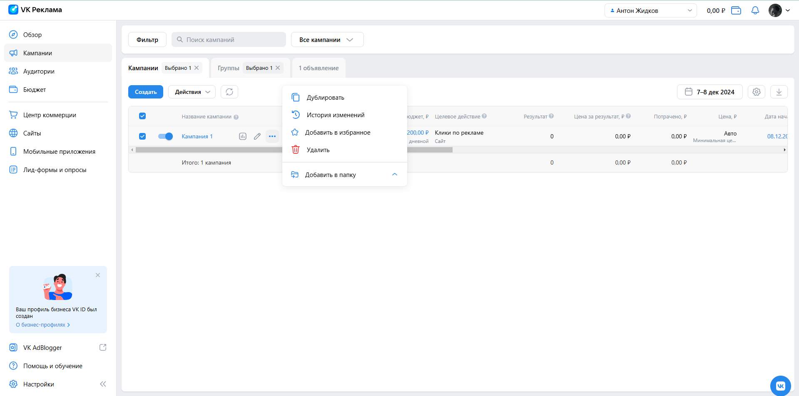
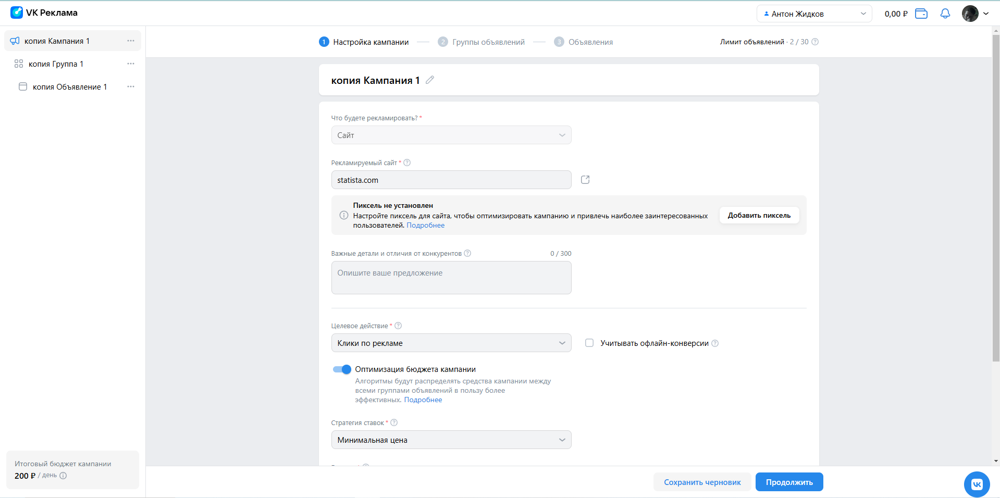
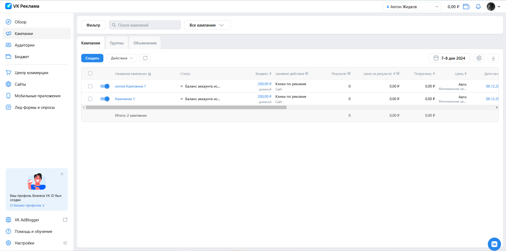

## Удаление кампании

Наведение на название кампании, наведение на троеточие, нажатие на кнопку "Удалить". Удаление кампании. Кампания не отображается в списке. После обновления страницы кампания не отображается в списке.

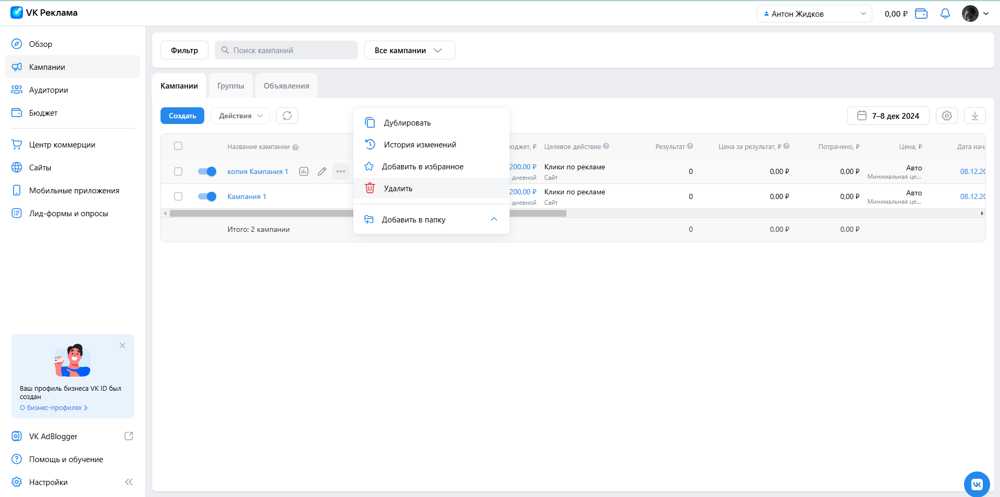

## Создание рекламы каталога товара

Перейти в блок "Кампании" нажатием на кнопку "Кампании" в меню. Нажатие кнопки "Создать". Нажатие на кнопку "Каталог товаров". Заполнение поля "Рекламируемый сайт" значением "https://vk.com/tm_limited_man". Нажатие на поле "Выберите каталог". Всплытие dropdown меню. Нажатие опции "Создать каталог". Всплытие окна "Новый каталог". Нажатие кнопки "Вручную". Заполнение поля "файл фида" файлом catalog_products.csv. Нажатие кнопки "Создать каталог". Отображение сообщения "Товары загружаются в каталог". Задать бюджет значением 100. Нажатие кнопки "Продолжить". Переход на следующий этап. В блоке "Регионы показа" нажатие кнопки "Москва". Нажатие кнопки "Продолить". Переход на следующий этап. Задание заголовка значением "Тест". Поле "Описание для баннера" заполняется автоматически значением "{{product.name}} {{product.price}}". Заполнение поля "Описание для карусели" значением "тестовая карусель". Поле "Заголовок карточки" заполняется автоматически значением "{{product.name}}". Нажатие кнопки "Опубликовать". Переход на страницу "Кампании". Отображение созданной кампании в списке с заданным ранее бюджетом и названием.

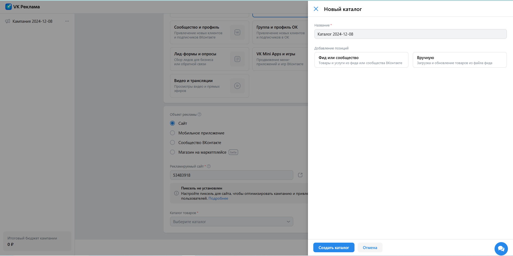
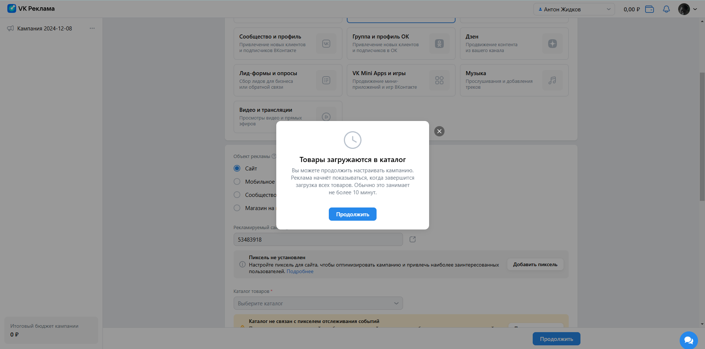
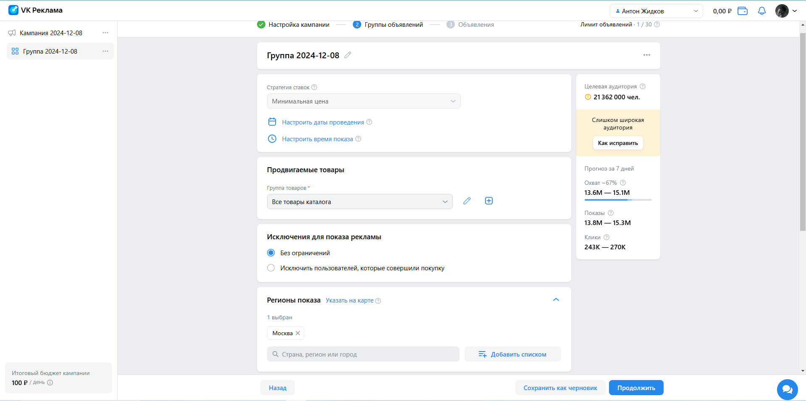
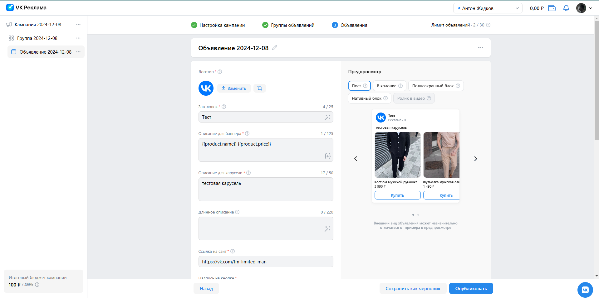

## Создание рекламы мобильного приложения - не реализовано

Перейти в блок "Кампании" нажатием на кнопку "Кампании" в меню. Нажатие кнопки "Создать". Нажатие кнопки "Мобильное приложение". Нажатие на поле "Рекламируемое приложение". 
Выбор опции "Привязать новое приложение". Всплытие окна "Привязка приложения". Заполнение поля значением "https://play.google.com/store/apps/details?id=org.telegram.messenger&hl=ru". Нажатие кнопки "Добавить". Всплытие окна "Привязка приложения" с трекером. Сохранение трекера и закрытие окна. 
Заполнение поля бюджета значением 100. Нажатие кнопки "Продолжить". Переход на следующий этап. Переход на следующий этап. В блоке "Регионы показа" нажатие кнопки "Москва". Нажатие кнопки "Продолить". Переход на следующий этап. 
Заполнение поля "Короткое описание" значением "Тест". Поле заголовок заполняется автоматически значением "Telegram". Заполнение поля "Длинное описание" значением "Тест1". Заполение поля "Трекинговая ссылка" ???.

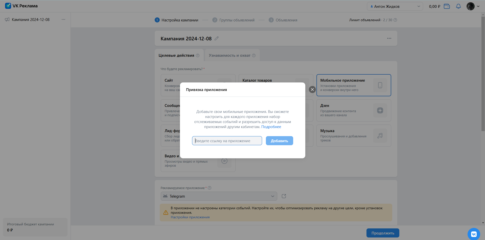
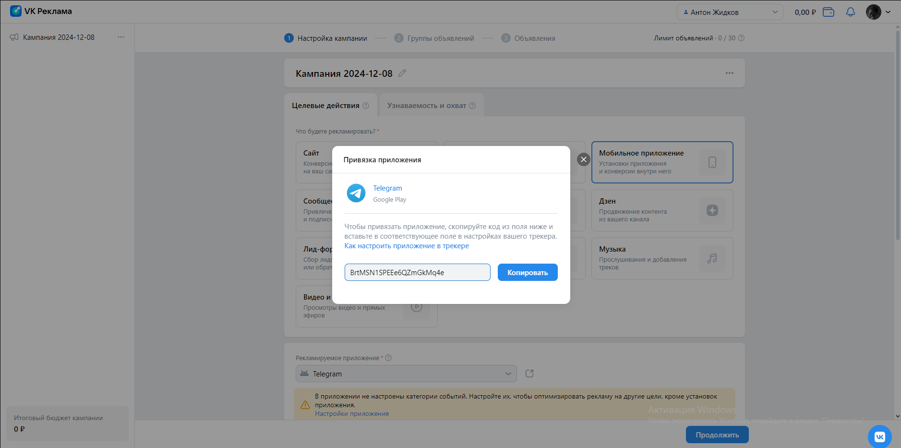
трекер - BrtMSN1SPEEe6QZmGkMq4e

--------------

Стартовые условия:
Перейти в блок "Кампании" нажатием на кнопку "Кампании" в меню. Нажатие кнопки "Создать". 

## Создание рекламы сообщества ВК.

Нажатие кнопки "Сообщество и профиль". Нажатие на поле "Рекламируемый объект". Выбор опции "Другое сообщество". Всплытие окна "Укажите ссылку на сообщество". Заполнение поля значением "profcomsm". Нажатие кнопки "Добавить". Нажатие кнопки "Продолжить". Переход на следующий этап. В блоке "Регионы показа" нажатие кнопки "Москва". Нажатие кнопки "Продолить". Переход на следующий этап. Поле "Загаловок" автоматически заполняется значением "Профсоюз студентов факультета "СМ"". Заполнение поля "Описание" значением "Тест". Добавление медиафайлов. Нажатие кнопки "Опубликовать". Переход на страницу "Кампании". Отображение созданной кампании в списке с заданным ранее бюджетом и названием.

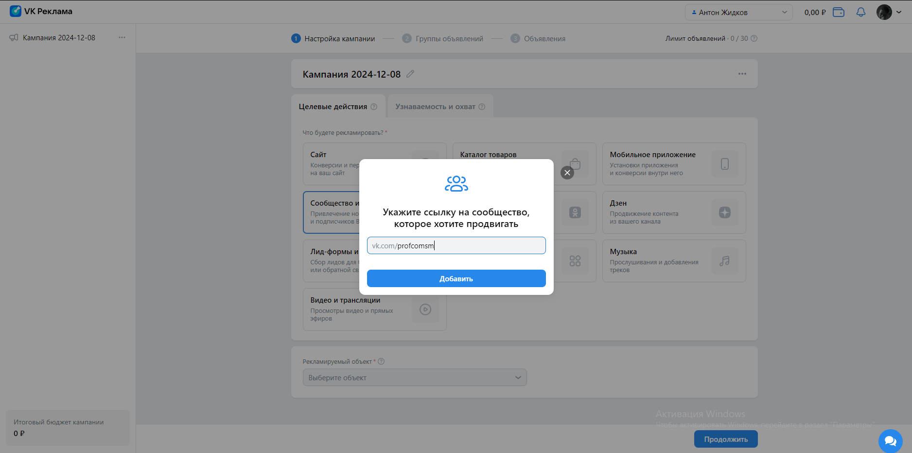

## Создание рекламы "Группа и профиль ОК" - не реализовано
Нажатие кнопки "Группа и профиль ОК". Нажатие на поле "Рекламируемый объект". Выбор опции "Создать группу". Нажатие кнопки "Перейти" в всплывающем меню. Переход на страницу "https://ok.ru/groups/create". Нажатие блока "Публичная или бизнес-страница". Авторизация. Переход на страницу "https://ok.ru/groups/create/page". Заполнить поле "Название" значением "Тестовая страница". Нажатие поля "Тематика". Выбор опции "Автомобили". Нажатие кнопки "Создать". 

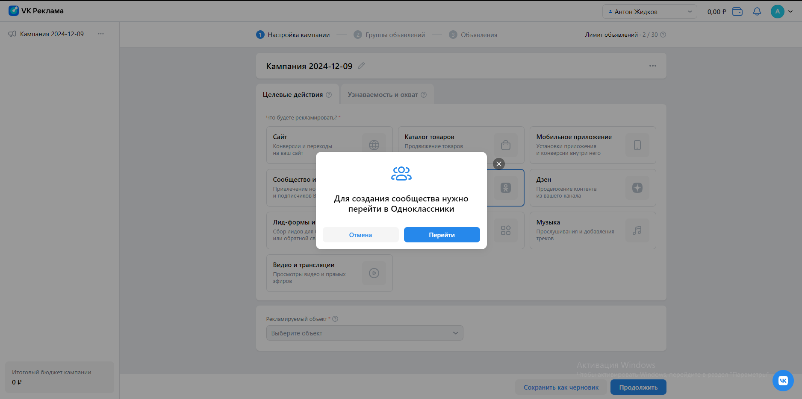
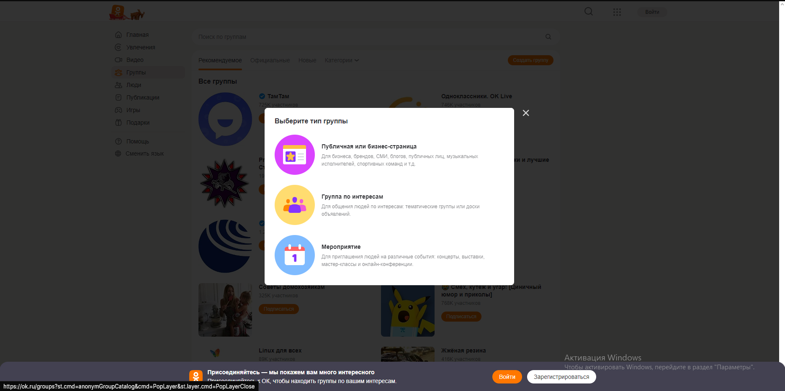
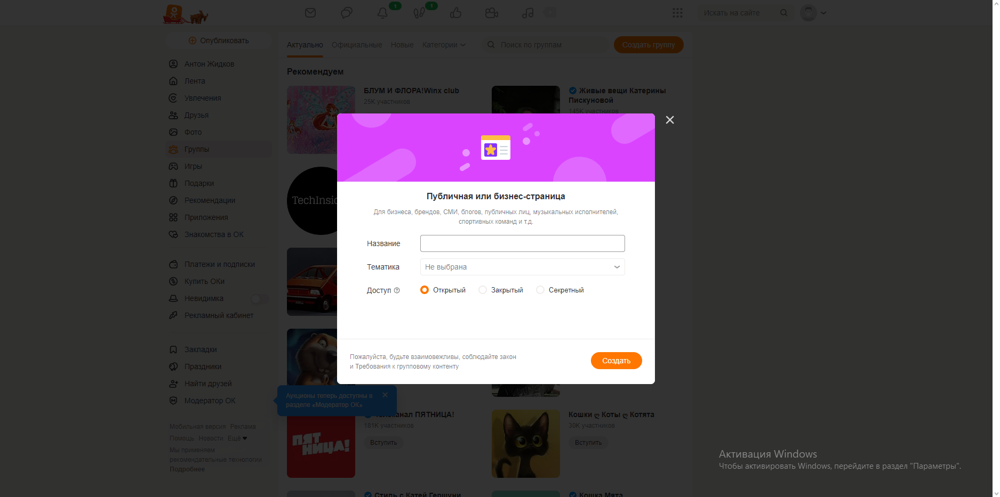

## Создание рекламы "Лид формы и опросы"

Нажатие кнопки "Лид формы и опросы". Выбор лид формы "Лид-форма 2024-12-09". Нажатие кнопки "Продолжить". Переход на следующий этап. В поле бюджет задать значение "100". В блоке "Регионы показа" нажатие кнопки "Москва". Нажатие кнопки "Продолить". Переход на следующий этап. Поле "Заголовок" заполнено автоматически значением "тест". Заполнение поля "Короткое описание" значением "Короткое описание лид формы". Заполнение поля "Текст рядом с кнопкой" значением "Нажимай". Заполнение поля "Длинное описание" значением "Длинное описание лид формы". Добавление медиафайлов. Нажатие кнопки "Опубликовать". Отображение созданной кампании в списке с заданным ранее бюджетом и названием.

## Сохранение черновика.

Нажатие кнопки "Сообщество и профиль". Нажатие на поле "Рекламируемый объект". Выбор опции "Другое сообщество". Всплытие окна "Укажите ссылку на сообщество". Заполнение поля значением "profcomsm". Нажатие кнопки "Добавить". Нажатие кнопки "Продолжить". Переход на следующий этап. Нажатие кнопки "Сохранить как черновик". Сохранение черновика. Переход на страницу "https://ads.vk.com/hq/dashboard/ad_plans". Нажатие кнопки "Все кампании". В всплывающем меню нажатие кнопки "Черновики". Отображение сохраненного черновика в списке.

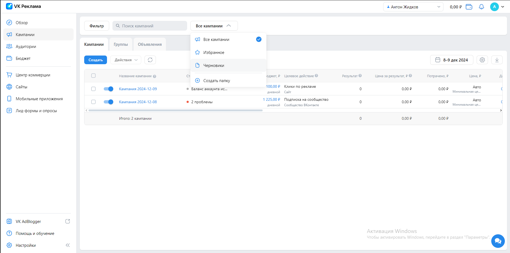
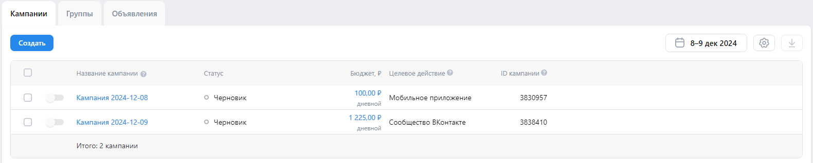

# Тесты полей и блоков

## Настройка кампании

1. Целевые действия. Сайт. Рекламируемый сайт. Ввод валидной ссылки, например, https://www.statista.com. Появление остальных полей.
2. Целевые действия. Сайт. Рекламируемый сайт. Ввод невалидной ссылки, например, rewq. Отображение ошибки "Не удалось подгрузить данные ссылки"
3. Целевые действия. Сайт. Бюджет. Ввод 100. При нажатии кнопки "продолжить" переход на следующий этап
4. Целевые действия. Сайт. Бюджет. Ввод меньше 100. При нажатии кнопки "продолжить" вывод сообщения "Укажите бюджет не меньше 100₽"
5. Целевые действия. Сайт. Бюджет. Ввод ограничен значением "9 999 999 999 999".
6. Целевые действия. Сайт. Бюджет. После ввода бюджета итоговый бюджет сохраняется и отображается в окне.

7. Целевые действия. Сайт. Бюджет. При выборе опции "за всё время" выбор даты проведения "до" является обязательным.

## Группы кампаний
1. Настроить время показа. Нажатие кнопки "Будни". Переключение на вкладку с расписанием показа по будним дням.
2. Настроить время показа. Нажатие кнопки "Рабочее". Переключение на вкладку с расписанием показа в рабочее время.
3. Настроить время показа. Нажатие кнопки "Выходные". Переключение на вкладку с расписанием показа в выходные.
4. Настроить время показа. Моё время. Нажатие на ячейку. Переключение ячейки с указанным днём недели и часом.
5. Настроить время показа. Переход во вкладку "Моё время" со вкладок "Будни", "Рабочее", "Выходные" происходит с сохранением выбранных ячеек.
6. Регионы показа. Быстрый выбор. Нажатие на одну из опций остаётся выбранная, остальные скрываются.
7. Регионы показа. Поиск. Отображения города при вводе его названия.
8. Регионы показа. Поиск. Добавление региона при нажатии на checkbox среди выдаваемых результатов.
9. Регионы показа. Добавление нескольких регионов. Отображение выбранных регионов и их количества.

10. Регионы показа. Нажатие на кнопку "Добавить списком". Отображение попапа добавления  списком.

11. Регионы показа. Добавление списка. Ввод городов, регионов. Вывод сообщения о добавлении n регионов. Регионы заменятся на выбранные.
12. Регионы показа. Добавление списка. Ввод "йцук". Вывод сообщения об ошибке.
13. Регионы показа. Добавление списка. Загрузка из файла. Чтение указаного файла формата .txt и .csv. Добавление указанных регионов и вывод сообщения о добавлении n регионов.
14. Регионы показа. Добавление списка. Загрузка из файла. Чтение указаного файла формата .txt и .csv. Вывод сообщения об ошибке при чтении некорректных данных, например, "йцуй" или файлов другого расширения.
15. Регионы показа. Нажатие кнопки "Очистить всё". Сброс выбранных регионов.

16. Регионы показа. Указать на карте. Нажатие на карту. Добавление геометки.
17. Регионы показа. Нажатие на стрелочку вверх. Блок сворачивается, отображает выбранные регионы.

