Кампании

# Тесты полей и блоков

## Настройка кампании
### Целевые действия

1. Целевые действия. Сайт. Рекламируемый сайт. Ввод валидной ссылки, например, https://www.statista.com. Появление остальных полей.
2. Целевые действия. Сайт. Рекламируемый сайт. Ввод невалидной ссылки, например, rewq. Отображение ошибки "Не удалось подгрузить данные ссылки"
3. Целевые действия. Сайт. Отображение ошибок. Ввод невалидной ссылки, например, rewq, в поле "Рекламируемый сайт". Нажатие кнопки "Продолжить". Отображение блока ошибки. Нажатие на блок ошибки. Вывод информации о ошибке "Рекламируемый сайт".

3. Целевые действия. Сайт. Бюджет. Ввод 100. При нажатии кнопки "продолжить" переход на следующий этап
4. Целевые действия. Сайт. Бюджет. Ввод меньше 100. При нажатии кнопки "продолжить" вывод сообщения "Укажите бюджет не меньше 100₽"
5. Целевые действия. Сайт. Бюджет. Ввод ограничен значением "9 999 999 999 999".
6. Целевые действия. Сайт. Бюджет. После ввода бюджета итоговый бюджет сохраняется и отображается в окне.

7. Целевые действия. Сайт. Бюджет. При выборе опции "за всё время" выбор даты проведения "до" является обязательным. Нажатие кнопки "Продолжить". Вывод ошибок.

8. Целевые действия. Даты проведения. При нажатии на поле даты открывается календарь. Нажатие на дату. Отображение каледнаря. Выбор даты 31 декабря 2024. Поле заполняется значением 31.12.2024. Нажатие кнопки "Сохранить как черновик". 
Переход к редактированию черновика. Проверка сохранения даты.

9. Целевые действия. Даты проведения. При нажатии на поле даты открывается календарь. Нажатие на дату. Отображение каледнаря. Выбор в качестве даты проведения прошедшее число заблокирован.
10. Целевое действие. Целевые действия. Поле автоматически заполнено значением "Показы рекламы". Выбор опции "Клики по рекламе". Сохранение черновика. Переход к редактированию черновика. Проверка сохранения целевого действия.

11. Целевое действие. Учитывать оффлайн-конверсии. Нажать checkbox. Сохранение черновика. Сохранение черновика. Переход к редактированию черновика. Проверка сохранения значения "Учитывать оффлайн-конверсии".

12. Целевое действие. Оптимизация бюджета кампании. Нажатие переключателя. Нажатие кнопки продолжить. Отображение блока бюджета на этапе "Группы объявлений". Сохранение черновика. Переход к редактированию черновика. Проверка сохранения выбора "Оптимизация бюджета кампании".

13. Целевое действие. Описание предложения. Заполнение поля значением, содержащим >300 символов. Ограничение ввода 300 символами. Сохранение черновика. Переход к редактированию черновика. Проверка значения поля.

14. Целевые действия. Каталог товаров. Рекламируемый сайт. Ввод валидной ссылки https://vk.com/tm_limited_man. Появление остальных полей.
15. Целевые действия. Каталог товаров. Рекламируемый сайт. Ввод невалидной ссылки, например, rewq. Отображение ошибки "Не удалось подгрузить данные ссылки".
16. Целевые действия. Каталог товаров. Каталог товаров. Нажатие на поле. Выбор опции "Создать каталог". Открытие всплывающего меню. Заполенение поля "Название" значением "Каталог из фида". Нажатие кнопки "Фид или сообщество". Появление остальных полей. Заполение поля "Ссылка на фид или сообщество" значением "https://vk.com/tm_limited_man". Нажатие кнопки "Создать каталог". Всплытие окна "Товары загружаются в каталог". Нажатие кнопки "Продолжить".

17. Целевые действия. Каталог товаров. Каталог товаров. Нажатие на поле. Выбор опции "Создать каталог". Открытие всплывающего меню. Заполенение поля "Название" значением "Каталог из фида". Нажатие кнопки "Фид или сообщество". Появление остальных полей. Заполение поля "Ссылка на фид или сообщество" значением "https://vk.com/tm_limited_man". Нажатие кнопки "Создать каталог". Всплытие окна "Товары загружаются в каталог". Нажатие кнопки "Продолжить". Повторное создание каталога из фида. Вывод сообщения такой каталог уже есть.

18. Целевые действия. Каталог товаров. Каталог товаров. Нажатие на поле. Выбор опции "Создать каталог". Открытие всплывающего меню. Заполенение поля "Название" значением "Каталог из фида". Нажатие кнопки "Фид или сообщество". Появление остальных полей. Заполение поля "Ссылка на фид или сообщество" значением "https://vk.com/tm_limited_man". Нажатие кнопки "Создать каталог". Всплытие окна "Товары загружаются в каталог". Нажатие кнопки "Продолжить". Нажатие на поле "Каталог товаров". Созданный каталог не предлагается для выбора.
 
19. Целевые действия. Каталог товаров. Тип кампании. Нажатие на блок "Динамический ретаргетинг". Отображение предупреждения. Нажатие кнопки "Изменить объект". Выбор оции "Динамический ретаргетинг".

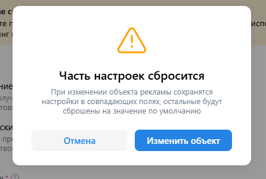
20. Целевые действия. Сообщество ВКонтакте. Нажатие поля "Рекламируемый объект". Выбор опции "Другое сообщество". Появление попапа. Заполнение поля значением "tm_limited_man". Нажатие кнопки добавить. Поле "Рекламируемый объект" заполняется значением "TM Limited | Мужская одежда". Поле "Каталог товаров" заполняется значением "Товары - TM Limited | Мужская одежда".

21. Целевые действия. Каталог товаров. Каталог товаров. Нажатие на поле. Выбор опции "Создать каталог". Открытие всплывающего меню. Заполенение поля "Название" значением "Каталог вручную". Нажатие кнопки "Вручную". Появление остальных полей. Загрузка в поле "Файл фида" файла catalog_products.csv. Нажатие кнопки "Создать каталог". Всплытие окна "Товары загружаются в каталог". Нажатие кнопки "Продолжить". Нажатие поля "Каталог товаров". Выбор опции "Каталог вручную".

22. Сообщество и профиль. Рекламируемый объект. Нажатие на поле "Рекламируемый объект". Выбор опции "Другое сообщество". Всплытие попапа. Заполнение поля ссылки значением profcomsm. Нажатие кнопки "Добавить". Закрытие попапа. Поле "Рекламируемый объект" заполнено значением "Профсоюз студентов факультета СМ". Поле "Бюджет" заполнено автоматически значением "1 225".

22. Сообщество и профиль. Бюджет. Заполнение поля значением "200". Изменение подсказки. Сообщение "Реклама конкурентов принесёт меньше подписчиков, чем у конкурентов".
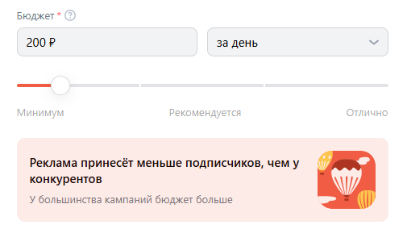
22. Сообщество и профиль. Бюджет. Заполнение поля значением "2000". Изменение подсказки. Сообщение "Реклама конкурентов принесёт значительно больше подписчиков, чем у конкурентов".
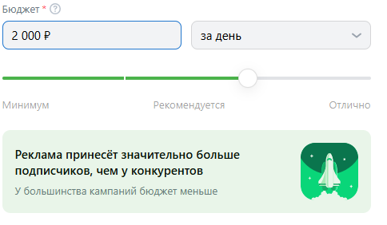
23. Сообщество и профиль. Рекламируемый объект. Нажатие на поле "Рекламируемый объект". Выбор опции "Другое сообщество". Всплытие попапа. Заполнение поля ссылки значением "asfdawfwaaf". Нажатие кнопки "Добавить". Вывод ошибки "Сообщество не найдено".
24. Группа и профиль ОК. Рекламируемый объект. Заполнение поля значением "https://ok.ru/film2020". Вывод результатов поиска. Нажатие на строку "Фильмы". Отображение остальных полей.
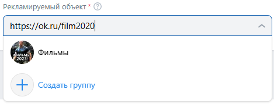
25. Дзен. Рекламируемый канал заполняется автоматически привязанным каналом Дзена.
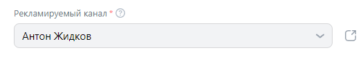
26. Лид-форма. Поле лид-форма при отсуствии лид-форм не заполнено.
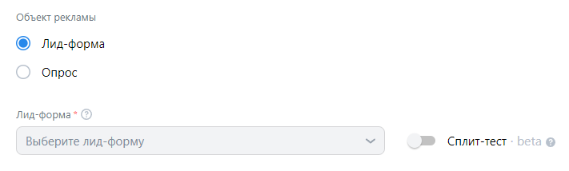
27. Лид-форма. Нажатие на поле "Лид-форма". Отображение списка лид-форм. Нажатие кнопки "Создать лид-форму". Открытие меню создание лид-формы.
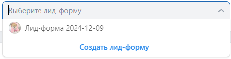
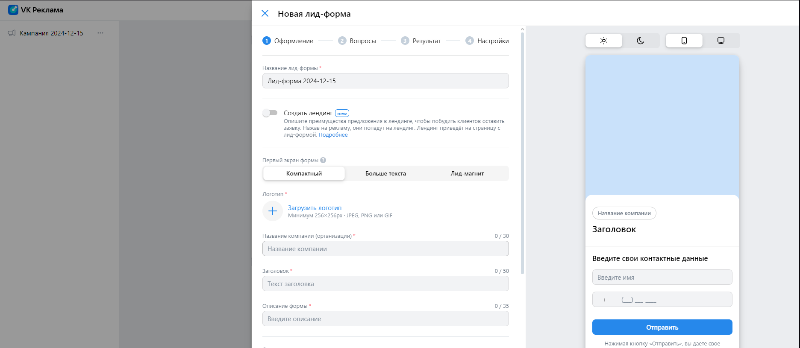 
28. Лид-форма. При наличии активной лид-формы поле "Лид-форма" будет автоматически заполнено.
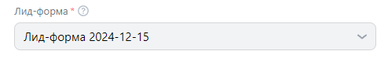
29. Лид-форма. Объект рекламы. Нажатие на строку "Опрос". Выбор опции.
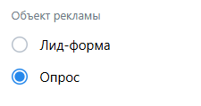
30. Лид-форма. Опрос. Нажатие "Форма опроса". Отображение списка опросов.
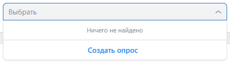
31. Лид-форма. Опрос. Нажатие "Форма опроса". Отображение списка опросов. Нажатие кнопки "Создать опрос". Открытие меню создания опроса.
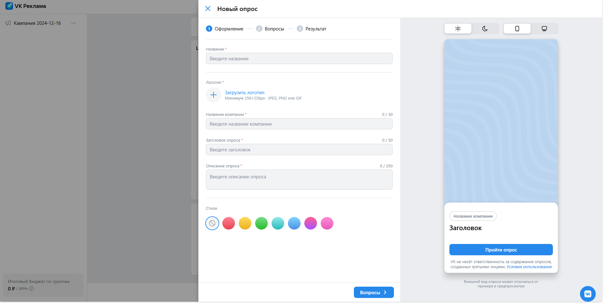
32. Лид-форма. Опрос. При наличии опроса поле "Форма опроса" заполняется автоматически имеющимся опросом.
33. Лид-форма. Опрос. Поле "Количество респондентов" автоматически задано значением 10.
34. Лид-форма. Опрос. Количество респондентов. Ввод ограничен значением "1.0000000000000003e+21"
35. Лид-форма. Опрос. Количество респондентов. Заполненеи поля значением "0". Нажатие кнопки "Продолжить". Вывод ошибки.
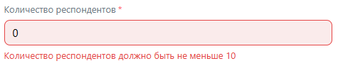

### Узнаваемость и охват
1. Узнаваемость и охват. Нажатие кнопки "Узнаваемость и охват". Переключение на вкладку "Узнаваемость и охват".
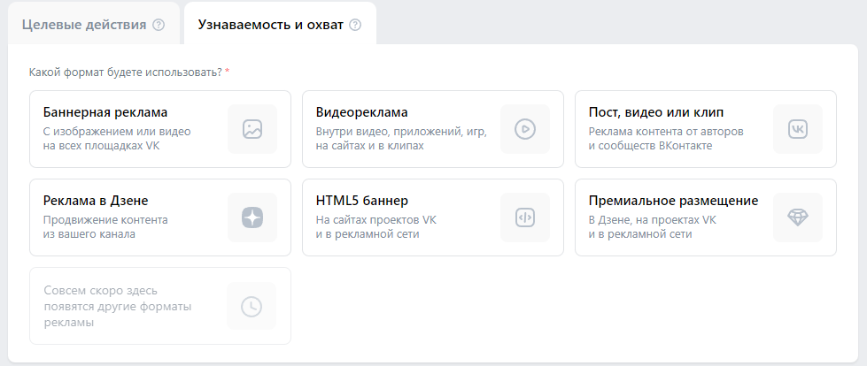
2. Нажатие кнопки "Баннерная реклама". Заполнение поля "Рекламируемый сайт" значением https://www.statista.com.
3. Баннерная реклама. Цена за 1000 показов. Поле автоматически задано значением "70".
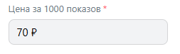
4. Баннерная реклама. Цена за 1000 показов. Заполнение поля значением "0". Нажатие кнопки "Продолжить". Вывод ошибки "Обязательное поле".
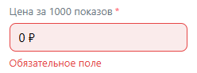
5. Баннерная реклама. Цена за 1000 показов. Заполнение поля значением "50". Нажатие кнопки "Продолжить". Вывод ошибки "Цена должна быть больше или равна 70 ₽".
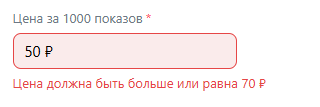
6. Нажатие кнопки "Видеореклама". Заполнение поля "Рекламируемый сайт" значением https://www.statista.com. Цена за 1000 показов. Заполнение поля значением "50". Нажатие кнопки "Продолжить". Вывод ошибки "Цена должна быть больше или равна 100 ₽".
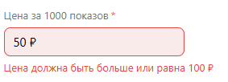
7. Премиальное размещение. Нажатие кнопки "В Дзене". Выбор оции.
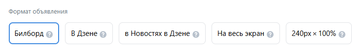
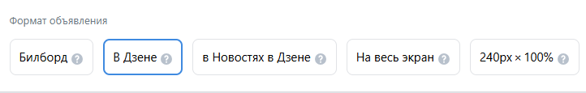

## Группы кампаний
1. Настроить время показа. Нажатие кнопки "Будни". Переключение на вкладку с расписанием показа по будним дням.
2. Настроить время показа. Нажатие кнопки "Рабочее". Переключение на вкладку с расписанием показа в рабочее время.
3. Настроить время показа. Нажатие кнопки "Выходные". Переключение на вкладку с расписанием показа в выходные.
4. Настроить время показа. Моё время. Нажатие на ячейку. Переключение ячейки с указанным днём недели и часом.
5. Настроить время показа. Переход во вкладку "Моё время" со вкладок "Будни", "Рабочее", "Выходные" происходит с сохранением выбранных ячеек.
6. Регионы показа. Быстрый выбор. Нажатие на одну из опций остаётся выбранная, например, Москва, остальные скрываются.
7. Регионы показа. Поиск. Отображения города при вводе его названия.
8. Регионы показа. Поиск. Добавление региона при нажатии на checkbox среди выдаваемых результатов.
9. Регионы показа. Добавление нескольких регионов. Отображение выбранных регионов и их количества.

10. Регионы показа. Нажатие на кнопку "Добавить списком". Отображение попапа добавления  списком.

11. Регионы показа. Добавление списка. Ввод городов, регионов. Вывод сообщения о добавлении n регионов. Регионы заменятся на выбранные.
12. Регионы показа. Добавление списка. Ввод "йцук". Вывод сообщения об ошибке.
13. Регионы показа. Добавление списка. Загрузка из файла. Чтение указаного файла формата .txt и .csv. Добавление указанных регионов и вывод сообщения о добавлении n регионов.
14. Регионы показа. Добавление списка. Загрузка из файла. Чтение указаного файла формата .txt и .csv. Вывод сообщения об ошибке при чтении некорректных данных, например, "йцуй" или файлов другого расширения.
15. Регионы показа. Нажатие кнопки "Очистить всё". Сброс выбранных регионов.

16. Регионы показа. Указать на карте. Нажатие на карту. Добавление геометки.
17. Регионы показа. Нажатие на стрелочку вверх. Блок сворачивается, отображает выбранные регионы.

18. Демография. Пол. Нажатие на "Мужской". Выбор мужского пола.

19. Демография. Возраст. Нажатие на блок "От". Отображение drop-down. Выбор опции 70. Нажатие на блок "До". Вывод ограниченного снизу списка опций (от 70 до 75)

20. Демография. Возраст. Нажатие на блок "До". Отображение drop-down. Выбор опции 19. Нажатие на блок "От". Вывод ограниченного сверху списка опций (от 12 до 19)

21. Демография. Возрастная маркировка. Нажатие на поле "Возрастная маркировка". Выбор опции "18+". Значение поля заполняется значением "18+".

22. Демография. Возрастная маркировка. Предупреждение. Нажатие на поле "Возрастная маркировка". Выбор опции "18+". Вывод предупреждения.

23. Интересы и поведение. Нажатие на блок "Интересы". Пояление поля "Введите название". Нажатие на поле. Появление drop-down меню. Выбор опции "Авто". Блок "Авто" отображается внутри поля ввода.
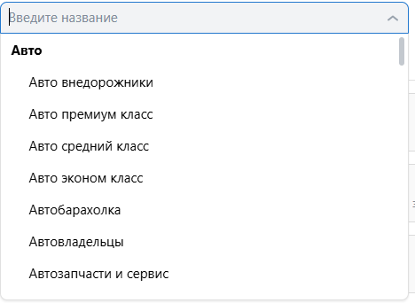

24. Интересы и поведение. Интересы. Нажатие на поле "Введите название". Появление drop-down меню. Выбор опции "Авто". Нажатие крестика в блоке "Авто" внутри поля ввода. Удаление опции.
25. Интересы и поведение. Интересы. Нажатие на строку "Добавить исключения". Появление поля "Исключая интересы". Нажатие на поле. Появление drop-down меню. Выбор опции "Авто".
26. Интересы и поведение. Интересы. Добавление категории "Авто" в интересы и в "Исключая интересы". Нажатие кнопки продолжить. Отображение ошибки.

27. Интересы и поведение. Интересы. Добавление категории "Авто" в интересы и в "Исключая интересы". Нажатие кнопки удаление интересов. Блок сворачивается. Нажатие блока Интересы. Поля блока являются пустыми. 

28. Ключевые фразы. Ключевые фразы. Заполнение поля значением "Авто". Вывод сообщение "Показать 10 похожих".

29. Ключевые фразы. Минус-фразы. Заполнение поля значением "Авто".
30. Ключевые фразы. Заполнение полей "Ключевые фразы" и "Минус-фразы" значением "Авто". Вывод предупреждения.

31. Ключевые фразы. Период поиска. Ввод ограничен 2 цифрами.
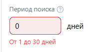
32. Ключевые фразы. Период поиска. Ввод значения "50". Вывод ошибки "От 1 до 30 дней". Снятие фокуса с поля. Заполнение поля значением "30".
33. Ключевые фразы. Период поиска. Заполнение полей "Ключевые фразы" и "Минус-фразы" значением "автомобиль", заполнение поля "Период поиска" значением "15". Нажатие кнопки удаления Ключевых фраз. Блок сворачивается. Нажатие блока Ключевых фраз. Поля "Ключевые фразы" и "Минус-фразы" являются пустыми, поле "Период поиска" заполнен значением "15".

34. Сообщества. Заполнение поля названия сообщества значением "профсоюз". Отображение drop-down. Нажатие кнопки "Сообщества ВКонтакте". Раскрытие списка групп. Выбор первой группы. Нажатие кнопки "Сообщества ВКонтакте". Скрытие списка. Нажатие на "Группы ОК". Раскрытие списка. Выбор первой группы. Нажатие на блок сообщества. Скрытие меню, отображение выбранных групп и их количества (2).

35. Сообщества. Заполнение поля названия сообщества значением "профсоюз". Добавление группы. Нажатие крестика в строке группы. Удаление группы из списка.

36. Сообщества. Заполнение поля названия сообщества значением "профсоюз". Добавление группы. Нажатие кнопки "Отменить". Удаление группы из списка.
37. Сообщества. Заполнение поля названия сообщества значением "профсоюз". Добавление группы. Нажатие кнопки удаление Сообщества. Блок сворачивается. Нажатие блока Сообщества. Поле блока являются пустыми.

38. Музыканты. Заполнение поля "Введите название музыканта" значением "Баста". Отображение drop-down с результатами поиска. Нажатие первого блока в выдаче. Нажатие кнопки "Готово". Отображение выбранных музыкантов.

39. Музыканты. Заполнение поля значением "Баста". Добавление исполнителя "Баста". Нажатие крестика в строке музыканта. Удаление музыканта из списка.
40. Музыканты. Заполнение поля значением "Баста". Добавление исполнителя "Баста". Нажатие кнопки "Отменить". Удаление музыканта из списка.
41. Музыканты. Заполнение поля значением "Баста". Добавление исполнителя "Баста". Нажатие кнопки удаление Музыканты. Блок сворачивается. Нажатие блока Музыканты. Поле блока является пустым.

42. Устройства. Нажатие строки "Десктопные". Checkbox "Мобильные" не доступен для редактирования. Нажатие строки "Мобильные". Отсутствие изменений.

42. Устройства. Нажатие строки "Мобильные". Checkbox "Десктопные" не доступен для редактирования. Нажатие строки "Десктопные". Отсутствие изменений.

43. Параметры URL. Выбор опции "Добавлять UTM-метки вручную". Переключение на опцию "добавлять UTM-метки вручную". Поле заполнено значением "utm_content={{banner_id}}&utm_medium=cpc&utm_source=vk_ads&utm_campaign={{campaign_id}}"

44. Параметры URL. Поле недоступно для редактирования.
45. Параметры URL. Выбор опции "Добавлять UTM-метки вручную". Поле доступно к редактированию.
46. Параметры URL. Выбор опции "Добавлять UTM-метки вручную". Заполнение поля значением "". Нажатие кнопки продолжить. Отображение ошибки.

47. Параметры URL. Выбор опции "Добавлять UTM-метки вручную". Заполнение поля значением "pampam". Нажатие кнопки продолжить. Отображение ошибки.

48. Параметры URL. Выбор опции "Не добавлять UTM-метки". Поле исчезает.
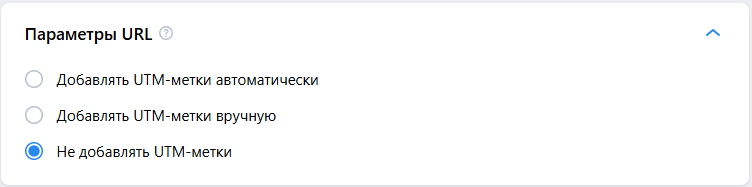
49. Места размещения. Опция "Автоматический выбор мест размещения" включена.
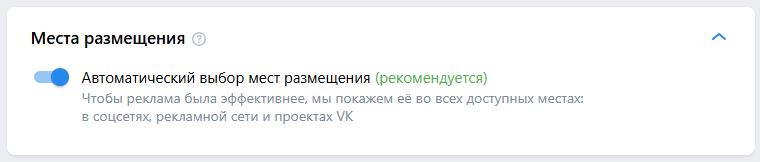
50. Места размещения. Отключение опции "Автоматический выбор мест размещения", вывод мест размещения.
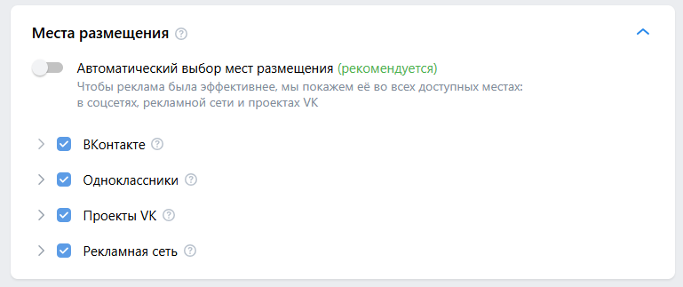
51. Места размещения. Отключение одного места размещения, вывод предупреждения.
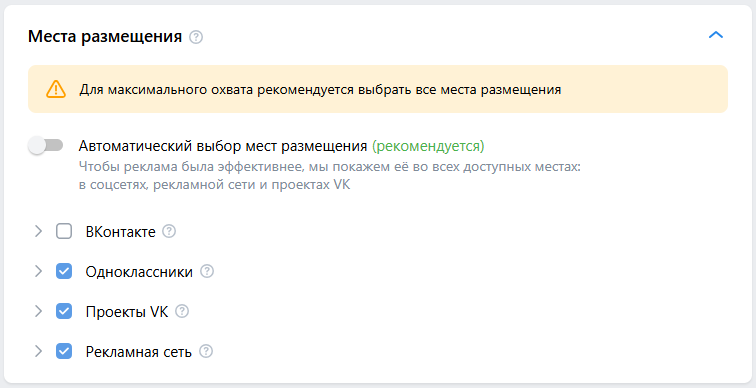
52. Добавление группы. Нажатие на кнопку "Добавить ещё группу". Переход к созданию объявления. В списке объявлени слева отображается 2 группы
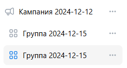
53. Переключение между группами. Заполнение блока "Регион показа" значением "Москва". Нажатие кнопки "Добавить ещё группу". Перехол к созданию новой группы. Нажатие на название первой группы с писке слева. Переход к первому объявлению. В регионе показа выбран регион "Москва".
54. Удаление группы. Нажатие на троеточие в строке группы. Вывод меню. Выбор опции "Удалить группу". Вывод попапа. Нажатие кнопки "Удалить". Скрытие попапа. Группа не отображается в меню слева.
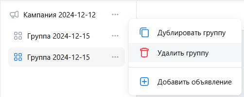
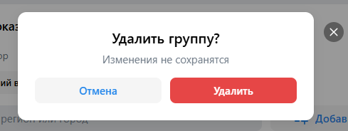
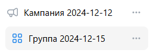
55. Дублирование группы. Заполнение блока "Регион показа" значением "Москва". Нажатие на троеточие в строке группы. Вывод меню. Выбор опции "Дублировать группу". Переклчение на создание новой группы. В блоке "Регион показа" выбран регион "Москва". Название группы "Копия " + название дублируемой группы
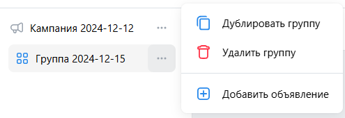
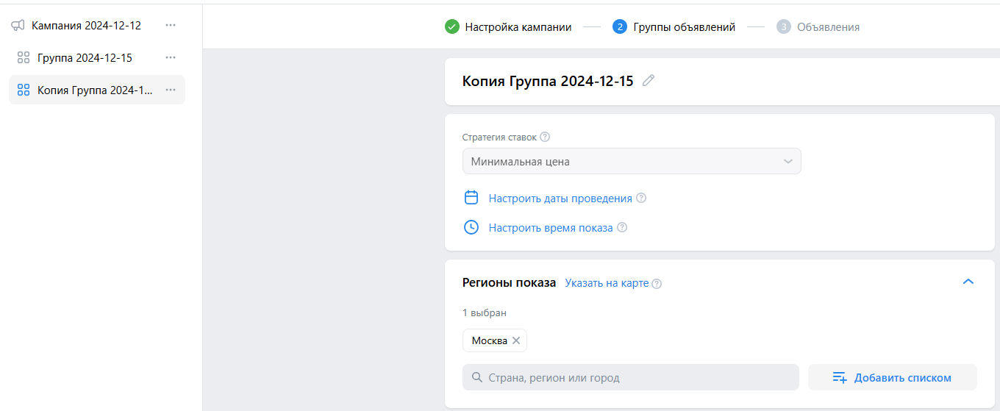

### Видеореклама
1. Нажатие кнопки "Продолжить". Вывод ошибки.
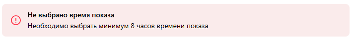
2. Нажатие кнопки "Настроить время показа". Отображение календаря. Нажатие вкладки "Будни". Выбор времени показа "Будни". Выбор региона "Москва" в блоке "Регионы показа". Нажатие кнопки "Продолжить". Переход на следующий этап.

### Каталог товаров. Продвигаемые товары
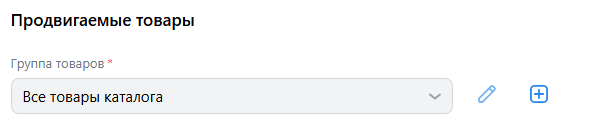
1. Поле автоматически задано значением "Все товары каталога".
2. 

## Объявления

### Сайт

1. Заголовок. Заполнение поля значением "Тестовый заголовок". Нажатие кнопки "Продолжить". Отсутствие ошибки.
2. Заголовок. Нажатие кнопки "Опубликовать". Вывод ошибки.

3. Заголовок. Заполнение поля значением, содержащим 41 символ. Нажатие кнопки "Опубликовать". Вывод ошибки.

4. Заголовок. Заполнение поля значением, содержащим 40 символов. Отсутствие ошибки.
4. Короткое описание. Нажатие кнопки "Опубликовать". Вывод ошибки.
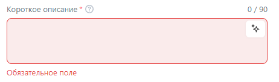
5. Короткое описание. Заполнение поля значением "Короткое описание". Нажатие кнопки "Продолжить". Отсутствие ошибки.
6. Коротное описание. Заполнение поля значением длиной в 91 символ. Отображение ошибки.
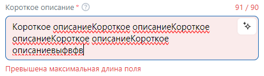
7. Коротное описание. Заполнение поля значением длиной в 90 символ. Отсутствие ошибки.
8. Длинное описание. Заполнение поля значением длиной в 2001 символ. Отображение ошибки.
9. Длинное описание. Заполнение поля значением длиной в 2000 символов. Отсутствие ошибки.
10. Текст рядом с кнопкой. Заполнение поля значением длиной в 31 символ. Отображение ошибки.
11. Текст рядом с кнопкой. Заполнение поля значением длиной в 30 символов. Отсутствие ошибки.
12. Ссылка на сайт. Автоматически заполнено значением, вводимым на этапе "Настройка кампании".
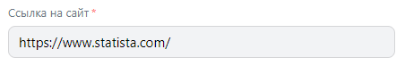
13. Ссылка на сайт. Заполение поля значением "йцук". Отображение ошибки.
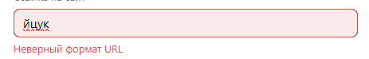
14. Ссылка на сайт. Заполнение поля значением "https://vk.com/public50647949". Отсуствие ошибки. 
15. Ссылка на сайт. Нажатие по полю. Отображение подсказки с изначально заданной ссылкой.
16. Ссылка на сайт. Подсказка. При нажатии на изначально заданную ссылку значение поля заполняется выбранной строкой.
17. Надпись на кнопке. Автоматически выбрана опция "Перейти". Нажатие по полю. Отображение других опций. Нажатие на опцию "В магазин". Выбор опции "В магазин".
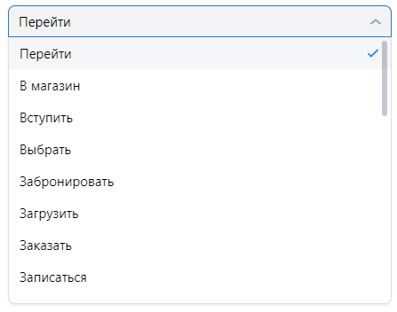
18. Медиафайлы. Нажатие кнопки "Медиатека". Отображение меню с загруженными фотографиями. Нажатие на фотографию. Отображение кнопки "Добавить". Нажатие на кнопку "Добавить". Автоматическое заполнение полей "Изображение" и "Видео" шестью элементами.
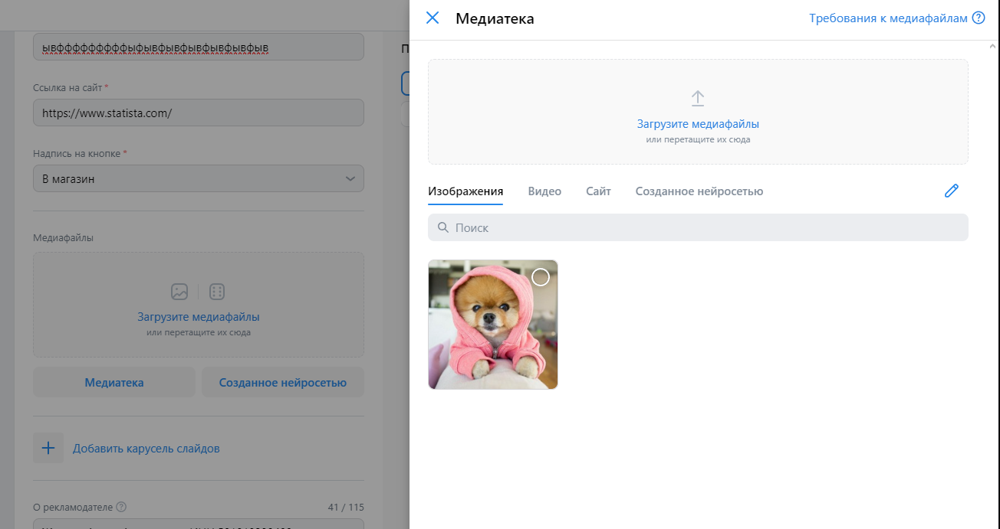
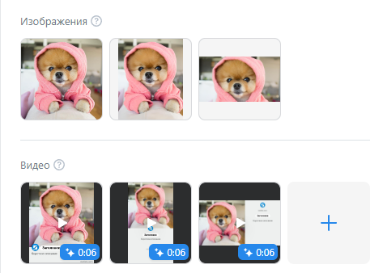
19. Медиафайлы. Нажатие на кнопку "Медиафайлы". Открытие меню на вкладке "Созданное нейросетью".
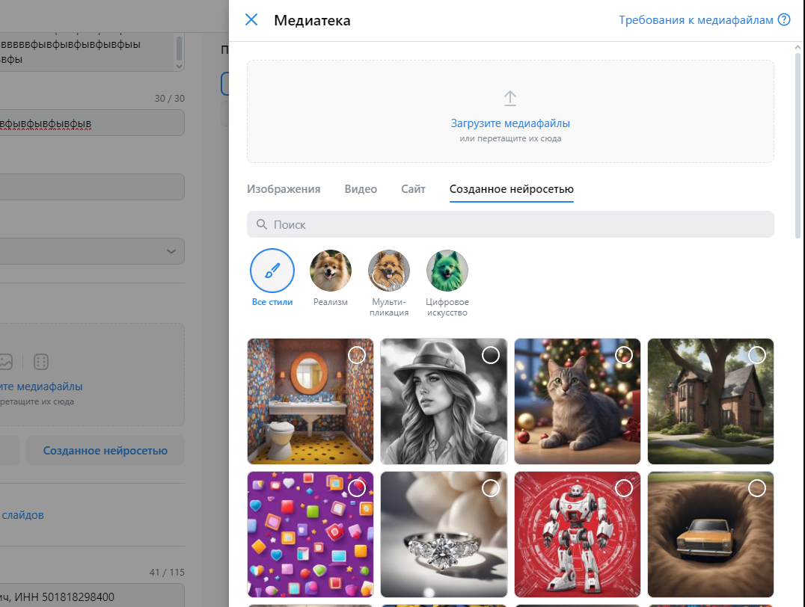
20. Медиафайлы. Нажатие поля "Загрузите медиафайлы". Запрос файла у системы. Выбор фотографии. Автоматическое заполнение полей "Изображение" и "Видео" шестью элементами.
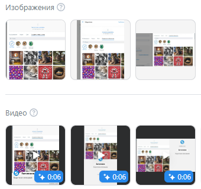
21. Медиафайлы. Загрузите медиафайлы. После загрузки медифайла загруженно сохраняется в медиатеке
22. Карусель слайдов. Нажатие на блок "Карусель слайдов". Появление списка слайдов. Нажатие кнопки "Продолжить". Вывод ошибки.
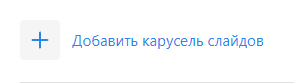
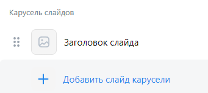
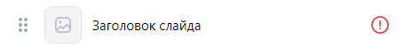
23. Карусель слайдов. Слайд. Нажатие на слайд. Раскрытие слайда и появление полей. Нажатие кнопки "Продолжить". Отображение ошибок.

24. Карусель слайдов. Добавление слайдов. Нажатие кнопки "Добавить слайд к карусели". Отображение ещё одного слайда и обновление счётчика.
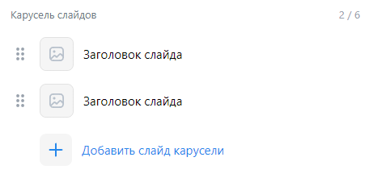
25. Карусель слайдов. Добавление 5 слайдов. Кнопка "Добавить слайд к карусели" не отображается.
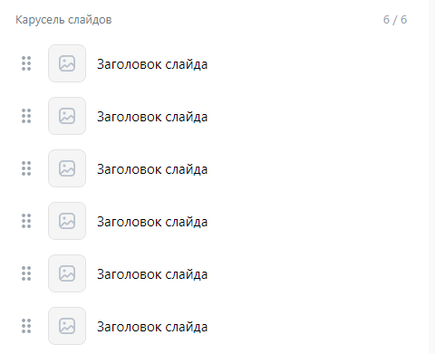

### Дзен - продвижение статьи.
1. Отображение списка статей привязанного аккаунта.
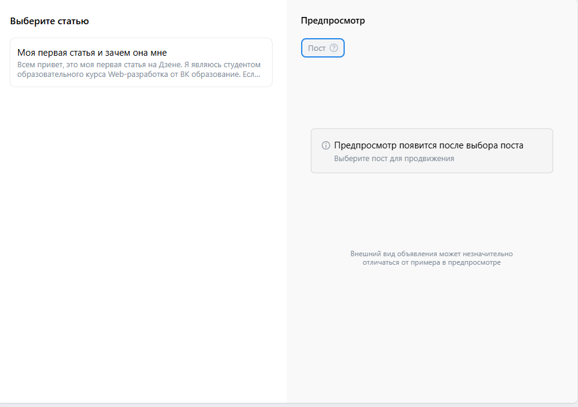
2. Нажатие на статью. Выделение статьи. Нажатие кнопки "Опубликовать". Публикация рекламы.
Итог - ошибка.
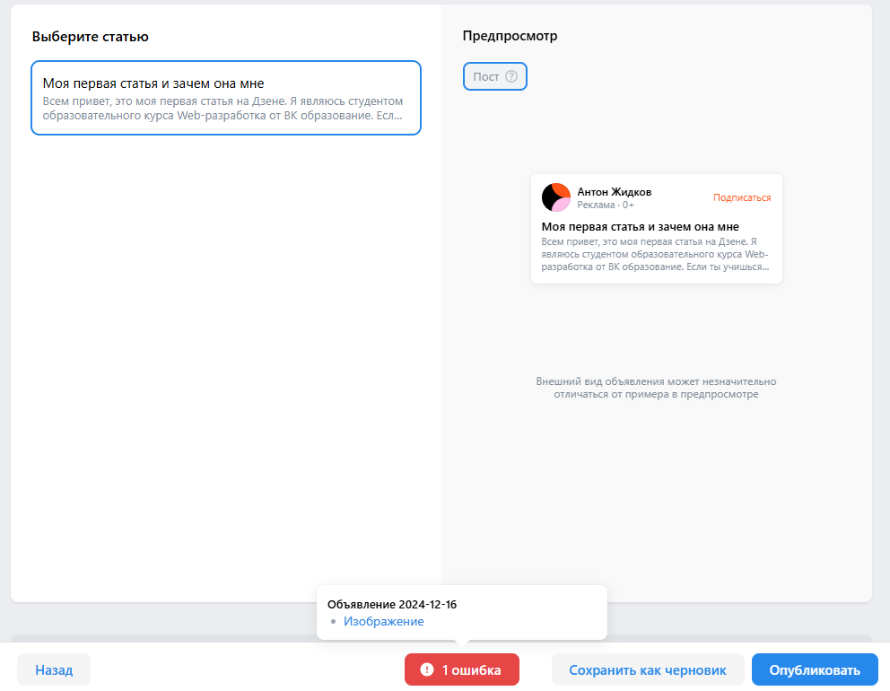

### Лид-форма.
1. Поле "Загаловок" автоматически задано значением названия Лид-формы.

### VK mini Apps и игры
1. Поле "Загаловок" автоматически задано названием приложения.

2. Значение поля "Ссылка на приложение" неизменяемо (неактивно).

### Видеореклама

Блок "Видео".

1. Нажатие на икноку "+". Открытие Медиатеки на вкладке "Видео".

2. Нажатие на вторую иконку. Открытие Медиатеки на вкладке "Изображения". Выбор изображения. Добавление сгенерированного видео.

### HTML5 баннер
ZIP-архив

1. Загрузка архива html5.zip. Успешная загрузка баннера.

2. Баннер. Наведение на загруженный баннер. Нажатие крестика. Удаление баннера.

3. Загрузка архива ALS_Sector.zip. Отображение ошибок.

# Кампании

## Создание рекламы Сайта
Стартовая страница - https://ads.vk.com/hq/overview

1. Перейти в блок "Кампании" нажатием на кнопку "Кампании" в меню. Нажатие кнопки "Создать". Переход на страницу https://ads.vk.com/hq/new_create/ad_plan на этап "Настройка кампании". Нажатие на кнопку "Сайт". Заполнение поля "Рекламируемый сайт" валидным URL, например, https://www.statista.com. Ввод в поле бюджет суммы от 100, например, 100. Нажатие кнопки "Продолжить". Переход на этап "Группы объявлений". В блоке "Регионы показа" нажатие кнопки "Москва". Нажатие кнопки "Продолжить". Переход на этап "Объявления". Заполнение полей "заголовок" значением "Тест", "Короткое описание" значением "Тест", прикрепление изображения в блок "Медиафайлы". Заполнение формы "О рекламодателе" (заполняется автоматически указанными ФИО и ИНН). Нажатие кнопки "Опубликовать". Переход на страницу "Кампании". Отображение созданной кампании в списке с заданным ранее бюджетом и названием. Нажатие на название группы. Переход на вкладку группы. Нажатие на название группы. Переход на вкладку объявление. Нажатие на блок с фото рядом с названием объявления. Предпросмотр созданного объявления. 

## Редактирование рекламной кампании

1. Наведение на название кампании, нажатие на кнопку "Редактировать". Всплытие меню редактирования. Изменение бюджета на 200, изменение названия на "Кампания 1". Нажатие на блок "Группа". Переход на редактирование Группы. Изменение названия группы на "Группа 1", добавление региона "Санкт-Петербугр". Нажатие на блок "Объявление". Изменение названия на "Объявление 1", заголовка значением "Тест 1", описания значением "Тест 1", ссылки на сайт на "https://vk.com/a645g743", удаление всех медиафайлов у добавлнение нового. Нажатие кнопки "Сохранить".

В списке отображается кампания с измененными именем и бюджетом. Нажатие на название группы. Переход на вкладку группы. Отображение группы с измененным названием. Нажатие на название группы. Переход на вкладку объявление. Нажатие на блок с фото рядом с названием объявления. Предпросмотр редактированного объявления.
 

## Дублирование кампании

1. Наведение на название кампании, наведение на троеточие, нажатие на кнопку "Дублировать". Переход на страницу. Переход на этап "настройка камании". Нажатие на кнопку продолжить. Переход на следующий этап. Нажатие кнопки "Продолжить". Переход на следующий этап. Нажатие на кнопку "Опубликовать". На вкладке "Кампании" отображается копия кампания.

## Удаление кампании

1. Наведение на название кампании, наведение на троеточие, нажатие на кнопку "Удалить". Удаление кампании. Кампания не отображается в списке. После обновления страницы кампания не отображается в списке.

## Добавление кампании в избранное 

1. Наведение на название кампании, наведение на троеточие, нажатие на кнопку "Добавить в избранное". Нажатие на кнопку "Все кампании". Вспылтие меню. Нажатие кнопки "Избранное". Отображение кампании в списке избранных.

## Добавление объявления в новую папку

1. Наведение на название кампании, наведение на троеточие, наведение на кнопку "Добавить в папку". Отображение папок. Нажатие кнопки "Создать папку". Отображение попапа. Нажатие кнопки "Создать". Закрытие попапа. Нажатие кнопки "Все кампании". Всплытие меню с созданной папкой в списке. Нажатие на папку "Новая папка". Переход в папку. Отображение кампании, добавленной в папку.

## Добавление объявления в существующую папку

1. Наведение на название кампании, наведение на троеточие, наведение на кнопку "Добавить в папку". Отображение папок. Нажатие кнопки "Новая папка". Нажатие кнопки "Все кампании". Всплытие меню с созданной папкой в списке. Нажатие на папку "Новая папка". Переход в папку. Отображение кампании, добавленной в папку.

## Удаление объявления из папки

1. Нажатие кнопки "Все кампании". Всплытие меню с созданной папкой в списке. Нажатие на папку "Новая папка". Переход в папку. Отображение кампании. Наведение на название кампании, наведение на троеточие. наведение на кнопку "Добавить в папку". Отображение папок. Нажатие кнопки "Новая папка". Скрытие меню. Кампания больше не отображается в списке.

## Удаление папки

1. Нажатие кнопки "Все кампании". Всплытие меню. Наведение на созданную папку. Нажатие иконки реадктировать всплытие попапа. Нажатие кнопки "Удалить папку". Отображение предупреждения. Нажатие кнопки "Удалить". Нажатие кнопки "Все кампании". Всплытие меню. Папка не отображается в списке.

## Создание рекламы каталога товара

1. Перейти в блок "Кампании" нажатием на кнопку "Кампании" в меню. Нажатие кнопки "Создать". Нажатие на кнопку "Каталог товаров". Заполнение поля "Рекламируемый сайт" значением "https://vk.com/tm_limited_man". Нажатие на поле "Выберите каталог". Всплытие dropdown меню. Нажатие опции "Создать каталог". Всплытие окна "Новый каталог". Нажатие кнопки "Вручную". Заполнение поля "файл фида" файлом catalog_products.csv. Нажатие кнопки "Создать каталог". Отображение сообщения "Товары загружаются в каталог". Задать бюджет значением 100. Нажатие кнопки "Продолжить". Переход на следующий этап. В блоке "Регионы показа" нажатие кнопки "Москва". Нажатие кнопки "Продолить". Переход на следующий этап. Задание заголовка значением "Тест". Поле "Описание для баннера" заполняется автоматически значением "{{product.name}} {{product.price}}". Заполнение поля "Описание для карусели" значением "тестовая карусель". Поле "Заголовок карточки" заполняется автоматически значением "{{product.name}}". Нажатие кнопки "Опубликовать". Переход на страницу "Кампании". Отображение созданной кампании в списке с заданным ранее бюджетом и названием.

## Создание рекламы мобильного приложения - не реализовано

1. Перейти в блок "Кампании" нажатием на кнопку "Кампании" в меню. Нажатие кнопки "Создать". Нажатие кнопки "Мобильное приложение". Нажатие на поле "Рекламируемое приложение". 
Выбор опции "Привязать новое приложение". Всплытие окна "Привязка приложения". Заполнение поля значением "https://play.google.com/store/apps/details?id=org.telegram.messenger&hl=ru". Нажатие кнопки "Добавить". Всплытие окна "Привязка приложения" с трекером. Сохранение трекера и закрытие окна. 
Заполнение поля бюджета значением 100. Нажатие кнопки "Продолжить". Переход на следующий этап. Переход на следующий этап. В блоке "Регионы показа" нажатие кнопки "Москва". Нажатие кнопки "Продолить". Переход на следующий этап. 
Заполнение поля "Короткое описание" значением "Тест". Поле заголовок заполняется автоматически значением "Telegram". Заполнение поля "Длинное описание" значением "Тест1". Заполение поля "Трекинговая ссылка" ???.

трекер - BrtMSN1SPEEe6QZmGkMq4e

--------------

Стартовые условия:
Перейти в блок "Кампании" нажатием на кнопку "Кампании" в меню. Нажатие кнопки "Создать". 

## Создание рекламы сообщества ВК.

1. Нажатие кнопки "Сообщество и профиль". Нажатие на поле "Рекламируемый объект". Выбор опции "Другое сообщество". Всплытие окна "Укажите ссылку на сообщество". Заполнение поля значением "profcomsm". Нажатие кнопки "Добавить". Нажатие кнопки "Продолжить". Переход на следующий этап. В блоке "Регионы показа" нажатие кнопки "Москва". Нажатие кнопки "Продолить". Переход на следующий этап. Поле "Загаловок" автоматически заполняется значением "Профсоюз студентов факультета "СМ"". Заполнение поля "Описание" значением "Тест". Добавление медиафайлов. Нажатие кнопки "Опубликовать". Переход на страницу "Кампании". Отображение созданной кампании в списке с заданным ранее бюджетом и названием.

## Создание рекламы "Группа и профиль ОК"
1. Нажатие кнопки "Группа и профиль ОК". Нажатие на поле "Рекламируемый объект". Заполнение поля значением "https://ok.ru/film2020". Вывод результатов поиска. Нажатие на строку "Фильмы". Заполнение поля "Бюджет" значением 100. Нажатие кнопки "Продолжить". Переход на следующий этап. В блоке "Регионы показа" нажатие кнопки "Москва". Нажатие кнопки "Продолить". Переход на следующий этап. Поле "Заголовок" автоматически заполнено значением "Фильмы". Заполнение поля "Описание" значением "Тест". Добавление медиафайлов. Нажатие кнопки "Опубликовать". Переход на страницу "Кампании". Отображение созданной кампании в списке с заданным ранее бюджетом и названием.

## Создание рекламы "Лид формы и опросы"

1. Нажатие кнопки "Лид формы и опросы". Выбор лид формы "Лид-форма 2024-12-09". Нажатие кнопки "Продолжить". Переход на следующий этап. В поле бюджет задать значение "100". В блоке "Регионы показа" нажатие кнопки "Москва". Нажатие кнопки "Продолить". Переход на следующий этап. Поле "Заголовок" заполнено автоматически значением "тест". Заполнение поля "Короткое описание" значением "Короткое описание лид формы". Заполнение поля "Текст рядом с кнопкой" значением "Нажимай". Заполнение поля "Длинное описание" значением "Длинное описание лид формы". Добавление медиафайлов. Нажатие кнопки "Опубликовать". Отображение созданной кампании в списке с заданным ранее бюджетом и названием.

2. Нажатие кнопки "Лид формы и опросы". Выбор опции "Опрос". Выбор первого в списке опроса в поле "Форма опроса" - "опрос1". Заполнение поля бюджет значением "100". Выбор даты проведения "до" значением 31.12.24. Нажатие кнопки "Продолжить". В блоке "Регионы показа" нажатие кнопки "Москва". Поле "Заголовок" автоматически заполняется значением "опрос". Заполнение поля "Короткое описание" значением "Короткое описание". Заполнение поля "Текст рядом с кнопкой" значением "Участвовать". Заполнение поля "Длинное описание" значением "Длинное описание". Добавление медиафайлов. Нажатие кнопки "Опубликовать". Отображение созданной кампании в списке с заданным ранее бюджетом и названием.

## Создание рекламы "Дзен"

1. Нажатие кнопки "Дзен". Поле "рекламируемый канал" автоматичечки заполнено. Выбор опции "Подписка на канал" в блоке "Целевое действие". Нажатие кнопки "Продолжить". Заполнение поля "Бюджет" значением "10 000". В блоке "Регионы показа" нажатие кнопки "Москва". Нажатие кнопки "Продолжить". Заполнение заголовка значением "Тест". Заполнение поля "Описание" значением "Тест". Добавление медиафайлов. Нажатие кнопки "Опубликовать". Отображение созданной кампании в списке с заданным ранее бюджетом и названием.

2. Нажатие кнопки "Дзен". Поле "рекламируемый канал" автоматичечки заполнено. В блоке "Целевое дейтсвие" автоматический выбрана опция "Продвижение статьи". Нажатие кнопки "Продолжить". Заполнение поля "Бюджет" значением "10 000". В блоке "Регионы показа" нажатие кнопки "Москва". Нажатие кнопки "Продолжить". Переход на следующий этап, отображение списка статей. Выбор первой статьи. Нажатие кнопки "Опубликовать". Публикация статьи.

Баг: форма требует изображение. Форма изображение не требует.

## Создание рекламы "VK mini Apps и игры"

1. Нажатие кнопки "VK mini Apps и игры". Заполнить поле "Рекламируемый объект" значением обучение. Выбрать первый ответ в выдаче. Задать бюджет значением 100. Нажатие кнопки "Продолжить". Переход на следующий этап. В блоке "Регионы показа" нажатие кнопки "Москва". Выбор региона "Москва". Нажатие кнопки "Продолжить. Переход на следующий этап. Поле "Заголовок" заполнено автоматически значением "VK Клипы для авторов". Заполнение поля "Описание" значением "Тест". Добавление медиафайлов. Нажатие кнопки "Опубликовать". Отображение созданной кампании в списке с заданным ранее бюджетом и названием.

## Создание рекламы "Видеореклама".

1. Нажатие кнопки "Видеореклама". Заполнение поля "Рекламируемый сайт" валидным URL, например, https://www.statista.com. Заполенение поля "Бюджет" значением 100. Нажатие кнопки "Продолжить". Переход на следующий этап. В блоке "Регионы показа" нажатие кнопки "Москва". Выбор региона "Москва". Нажатие кнопки "Продолжить". Переход на следующий этап. Заполнение полей "заголовок" значением "Тест", "Короткое описание" значением "Тест", "Длинное описание" значением "Длинное описание". Нажатие второй иконки в блоке "Видео". Нажатие на изображение. Нажатие кнопки "Опубликовать". Переход на страницу "Кампании". Отображение созданной кампании в списке с заданным ранее бюджетом и названием.

## Создание рекламы "Музыка" - Требуются права.

1. Нажатие кнопки "Музыка". Рекламируемый объект автоматически заполняется значением "Школа №20 МБОУСОШ 5B Класс" (Сообщество должно управляться владельцем аккаунта в ВК). Задать бюджет значением 100. Нажатие кнопки "Продолжить". Переход на следующий этап. В блоке "Регионы показа" нажатие кнопки "Москва". Выбор региона "Москва". Нажатие кнопки "Продолжить. Переход на следующий этап. Заполнение поля "Описание" значением "Тест". Нажатие блока "Выбрать треки". Открытие меню с аудиозаписями на странице пользователя в ВК. Нажатие на первую аудиозапись в списке. Выбор аудиозаписи

## Создание рекламы "Видео и трансляции".

1. Нажатие кнопки "Видео и трансляции". Рекламируемый объект автоматически заполняется значением "Школа №20 МБОУСОШ 5B Класс" (Сообщество должно управляться владельцем аккаунта в ВК). Вывод ошибки "Обязательное поле".

Дополнение к исходным данным - нажатие на кнопку "Узнаваемость и охват".

## Создание рекламы "Баннерная реклама".

1. Нажатие кнопки "Баннерная реклама". Заполнение поля "Рекламируемый сайт" валидным URL, например, https://www.statista.com. Заполенение поля "Бюджет" значением 100. Нажатие кнопки "Продолжить". Переход на следующий этап. В блоке "Регионы показа" нажатие кнопки "Москва". Выбор региона "Москва". Нажатие кнопки "Продолжить". Переход на следующий этап. Заполнение полей "заголовок" значением "Тест", "Короткое описание" значением "Тест", прикрепление изображения в блок "Медиафайлы". Заполнение формы "О рекламодателе" (заполняется автоматически указанными ФИО и ИНН). Нажатие кнопки "Опубликовать". Переход на страницу "Кампании". Отображение созданной кампании в списке с заданным ранее бюджетом и названием.

## Создание рекламы "Реклама в Дзене".

1. Нажатие кнопки "Реклама в Дзене". Нажатие кнопки "Продолжить". Заполнение поля бюджет значением "10000". В блоке "Регионы показа" нажатие кнопки "Москва". Выбор региона "Москва". Нажатие кнопки "Продолжить". Отображение списка статей. Нажатие на первую статью, нажатие на кнопку "Опубликовать". Переход на страницу "Кампании". Отображение созданной кампании в списке с заданным ранее бюджетом и названием.

## Создание рекламы "HTML5 баннер".

1. Нажатие кнопки "HTML5 баннер". Заполнение поля "Рекламируемый сайт" валидным URL, например, https://www.statista.com. Заполенение поля "Бюджет" значением 100. Нажатие кнопки "Продолжить". Переход на следующий этап. В блоке "Регионы показа" нажатие кнопки "Москва". Выбор региона "Москва". Нажатие кнопки "Продолжить". Загрузка в поле "Загрузите ZIP-архив" архива html5.zip. Нажатие кнопки "Опубликовать". Переход на страницу "Кампании". Отображение созданной кампании в списке с заданным ранее бюджетом и названием. 

## Создание рекламы "Премиальное размещение".

1. Нажатие кнопки "Премиальное размещение". Заполнение поля "Рекламируемый сайт" валидным URL, например, https://www.statista.com. Заполенение поля "Бюджет" значением 100. Нажатие кнопки "Продолжить". Переход на следующий этап. В блоке "Регионы показа" нажатие кнопки "Москва". Выбор региона "Москва". Нажатие кнопки "Продолжить". Загрузка в поле "Загрузите ZIP-архив" архива html5.zip. Нажатие кнопки "Опубликовать". Переход на страницу "Кампании". Отображение созданной кампании в списке с заданным ранее бюджетом и названием.

## Сохранение черновика.

1. Нажатие кнопки "Сообщество и профиль". Нажатие на поле "Рекламируемый объект". Выбор опции "Другое сообщество". Всплытие окна "Укажите ссылку на сообщество". Заполнение поля значением "profcomsm". Нажатие кнопки "Добавить". Нажатие кнопки "Продолжить". Переход на следующий этап. Нажатие кнопки "Сохранить как черновик". Сохранение черновика. Переход на страницу "https://ads.vk.com/hq/dashboard/ad_plans". Нажатие кнопки "Все кампании". В всплывающем меню нажатие кнопки "Черновики". Отображение сохраненного черновика в списке. Нажатие кнопки "Добавить". Закрытие меню, отображение выбранного трека в блоке "Треки"

Дзен Id рекламного кабинета - 23057685