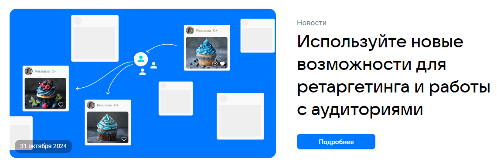
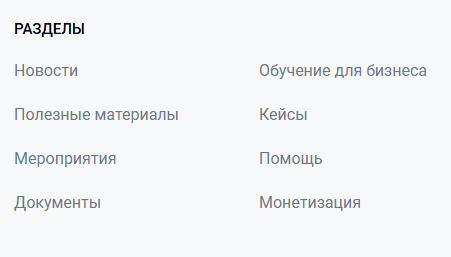
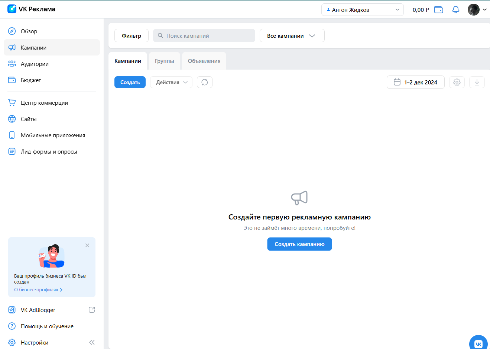
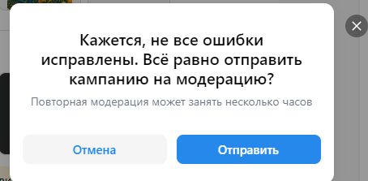
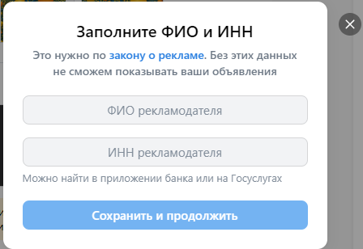
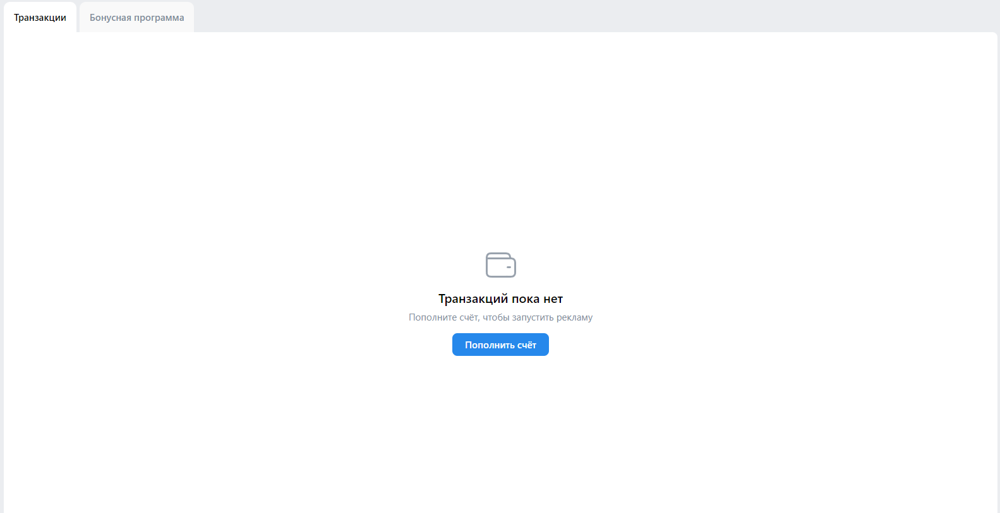

# Главная страница.

## Header

1. Лого. Проверка отображения. Ожидаем блок div с  классом class="content_logo__GA44t" и вложенным svg с xmlns="http://www.w3.org/2000/svg"
2. Лого. Нажатие на лого. Переход на главную страницу https://ads.vk.com/
3. Навигация. Проверка отображения. Ожидаем блок div с классом class="content_navigation__OmmEn" с вложенным блком div с классом class="navigation_left__xPyjc" и блока div с классом class="navigation_right__QB_MT". В навигации должны быть пункты Новости, обучение, Кейсы, Форму идей, Монетизация в первом блоке и пункты Справка, Перейти в кабинет во втором блоке.
4. Навигация. Нажатие на ссылку "Новости". Переход на страницу https://ads.vk.com/news.
5. Навигация. Нажатие на ссылку "Кейсы". Переход на страницу https://ads.vk.com/cases.
6. Навигация. Нажатие на ссылку "Форум идей". Переход на страницу https://ads.vk.com/upvote.
7. Навигация. Нажатие на ссылку "Монетизация". Страница https://ads.vk.com/partner открывается в новом окне.
8. Навигация. Нажатие на  ссылку "Справка". Переход на страницу https://ads.vk.com/help.
9. Навигация. Обучение. Наведение на блок "Обучение". Появление всплывающего меню.
10. Навигация. Обучение. Нажатие на ссылку "Полезные материалы" всплывающего меню. Переход на страницу https://ads.vk.com/insights
11. Навигация. Обучение. Нажатие на ссылку "Мероприятия" всплывающего меню. Переход на страницу https://ads.vk.com/events.
12. Навигация. Обучение. Нажатие на ссылку "Видеокурсы" всплывающего меню. Страница https://expert.vk.com/catalog/courses/ открывается в новом окне.
13. Навигация. Обучение. Нажатие на ссылку "Сертфикация" всплывающего окна. Страница https://expert.vk.com/certification/ открывается в новом окне.
14. Навигация. Обучение. Всплывающее меню. Отведение курсора от всплывающего меню или блока "Обучение". Всплывающее меню закрывается.
15. Навигация. Нажатие на ссылку "Перейти в личный кабинет". Переход на страницу авторизации.

## Карусель

1. Проверка отображения блока на главной  странице. Ожидаем отображение блока div с классом class="styles_slider__S9aAm.
2. Ожидание n секунд. Переход на следующий слайд.
3. Нажатие конпки переключения слайда. Переход на выбранный слайд.
4. Нажатие кнопки взаимодействия (vkuiButton__in). Переход по ссылке.

## Кейсы компаний.

1. Проверка отображения блока на главной странице. Ожидаем отображение блока div с классом class="styles_section__kQovd" с вложенными h2 с текстом Кейсы компаний; блоком div с классом class="styles_cols__Iavf_"; ссылкой a с артибутом href="/cases".
2. Нажатие кнопки "Смотреть все". Переход на страницу "Кейсы".
3. Нажатие на фотографию кейса. Переход на страницу кейса.

## Использование Cookie.

1. Отображение предупреждения об использовании Cookie при первом входе на страницу.
2. Отображение предупреждения об использовании Cookie при перезагрузке страницы при отсутствии согласия на использование Cookie
3. Нажатие на кнопку согласия. Закрытие предупреждения об использовании Cookie.
4. Отсутствие предупреждения об использовании Cookie при перезагрузке страницы после согласия на использование Cookie.

## Обучающий блок

1. Проверка отображения блока на главной странице. Ожидаем отображение блока div с классом class="styles_section__kQovd" с вложенной ссылкой a с артибутом href="/events"
2. Нажатие кнопки "Подробнее". Переход на страницу "Обучение".
3. Нажатие на обучающий блок. Переход на страницу "Обучение".

## Новостной блок

1. Проверка отображения блока на главной странице. Ожидаем отображение блока div с классом class="styles_section__kQovd" с вложенным блоком div с классом class="styles_row__GTpce"
2. Новостной блок. Нажатие кнопки "Подробнее". Переход на страницу "Новости".
3. Нажатие на новостной блок. Переход на страницу "Новости".

## Footer

1. Проверка отображения Footer на странице. Ожидаем отображние блока с тегом footer.
2. Лого. Проверка отображения. Ожидаем отображение блока div с классом class="Footer_leftContent__U8bZg".
3. Лого. Нажатие на лого. Переход на главную страницу https://ads.vk.com/.
4. Нажатие кнопки "Перейти в кабинет". Переход на страницу авторизации.

### Разделы

1. Проверка отображения разделов в футере. Ожидаем отображение span с классом class="Footer_menuTitle__TrNAn" и ul с классом class="Footer_items__gaWoZ". В ul содержатся пункты Новости, Полезные материалы, Мероприятия, Документы, Обучение для бизнеса, Кейсы, Помощь, Монетизация.

1. Нажатие на ссылку "Новости". Переход на страницу https://ads.vk.com/news.

2. Нажатие на ссылку "Полезные материалы". Переход на страницу https://ads.vk.com/insights.

3. Нажатие на ссылку "Мероприятия". Переход на страницу https://ads.vk.com/events.

4. Нажатие на ссылку "Документы". Переход на страницу https://ads.vk.com/documents.

5. Нажатие на ссылку "обучение для бизнеса". Страница https://expert.vk.com/?utm_source=vk_ads_blog&utm_medium=futer открывается в новой вкладке.

6. Нажатие на ссылку "Кейсы". Переход на страницу https://ads.vk.com/cases.

7. Нажатие на  ссылку "Помощь". Переход на страницу https://ads.vk.com/help.

8. Нажатие на ссылку "Монетизация". Страница https://ads.vk.com/partner открывается в новом окне.

### Контакты

1. Проверка отображения лого. Ожидаем отображение блока div с классом class="Footer_controls__wNiHw" и вложенной ссылкой a с атрибутом href="https://vk.company/ru/company/business/".
2. Лого. Нажатие на лого. Страница https://vk.company/ru/company/business/ открывается в новом окне.
3. Соцсети. Проверка отображения. Ожидаем отображение блока div с классом class="Footer_leftControls__25wO6".
3. Соцсети. Нажатие на ссылку ВК. Страница https://vk.com/vk_ads открывается в новом окне.
4. Соцсети. Нажатие на ссылку ОК. Страница https://ok.ru/group/64279825940712 открывается в новом окне.
5. Соцсети. Нажатие на ссылку Дзен. Страница https://dzen.ru/vk_ads?utm_referrer=ads.vk.com открывается в новом окне.
6. Соцсети. Нажатие на ссылку Телеграм. Страница https://t.me/vk_ads открывается в новом окне.
7. Локализация. Нажатие на язык. Появление всплывающего меню.

8. Локализация. Выбор языка. Нажатие ссылки "English". Переход на страницу https://ads.vk.com/en.
9. Локализация. Выбор языка. Отведение курсора от всплывающего меню. Всплывающее меню закрывается.
10. О компании. Нажатие на ссылку "О компании". Открытие страницы https://vk.company/ru/ в новой вкладке.

# *Проверка сожержания*

1. Нажатие кнопки "Подробнее" первой элемента. Переход на страницу элемента.
2. Нажатие на элемент. Переход на страницу элемента.

# *Проверка пагинации*

1. Отображение общего количества элементов.
2. Отображение текущей страницы.
3. Нажатие на ссылку другой страницы. Переход на другую страницу.
4. Нажатие на ссылку текущей страницы. Отсутствие изменений.
5. Нажатие на кнопку "Стрелка влево" при текущей странице, не являющейся первой. Переход на предыдущую страницу.
6. Нажатие на кнопку "Стрелка влево" на первой странице. Отсутствие изменений.
6. Нажатие на кнопку "Стрелка вправо" при текущей странице, не являющейся последней. Переход на следующую страницу.
7. Нажатие на кнопку "Стрелка вправо" на последней странице. Отсутствие изменений.

# Новости

1. Проверка отоброжения заголовочного блока.
2. Проверка содержания.
3. Проверка пагинации.

# Полезные материалы

1. Проверка отоброжения заголовочного блока.
2. Проверка содержания.
3. Проверка пагинации.

# Мероприятия 

1. Проверка отоброжения заголовочного блока.
2. Проверка отображения предстоящих мероприятий.
3. Проверка отображения прошедших мероприятий.
4. Нажатие кнопки "Подробнее" меропрятия. Переход на страницу мероприятия.
5. Нажатие на блок мероприятия. Переход на страницу мероприятия.

# Кейсы

1. Проверка отоброжения заголовочного блока.
2. Проверка содержания.
3. Проверка пагинации.
 
# Обучение

## Предложение по обучению

1. При входе в личных кабинет отображается предложение по обучению.

# Кампании

1. При переходе во вкладку кампаний отображается кнопка "Создать кампанию".
2. Нажатие на кнопку "Создание кампании". Переход на страницу https://ads.vk.com/hq/new_create/ad_plan.

3. Нажатие на кнопку "Создать". Отображение блока div с id="new_ad_create".

## Создание кампании

1. Отображение имени кампании.
2. Имя кампании соответствует формату "Кампания <текущая дата в виде гггг:мм:дд>"
3. Нажатие на имя кампании. Изменение названия кампании.

### Целевые действия

1. Нажатие на кнопку "Сайт". Отображение поля ввода ссылки сайта.
2. Нажатие на кнопку "Каталог товаров". Отображение выбора объекта рекламы и полей ввода "Рекламируемый сайт", "Каталог товаров".
3. Нажатие на кнопку "Мобильное приложение". Отображается поле выбора приложения "Рекламируемое приложение".
4. Нажатие на кнопку "Сообщество и профиль". Отображение полей рекламы объекта.
5. Нажатие на кнопку "Группа и профиль ОК". Отображение поля ввода "Рекламируемый объект".
6. Нажатие на кнопку "Дзен". Отображение сообщения "Свяжите кабинет VK Рекламы с Дзен-студией, чтобы запустить рекламу канала" и кнопки "перейти в Студию".
7. Нажатие на кнопку "Лид формы и опросы". Отображение radio button выбора Объекта рекламы.
8. Нажатие на кнопку "VK Mini Apps и игры". Отображение поля "Мини-приложение".
9. Нажатие на кнопку "Музыка". Отображение поля ввода "Рекламируемый объект".
10. Нажатие на кнопку "Видео и трансляции". Отображение поля ввода "Рекламируемый объект".
11. Нажатие на кнопку "Продолжить" при выборе объекта рекламы. Отображение ошибки с указанием поля.
12. Даты проведения. Нажатие на поле даты проведения открывается календарь.

#### Сайт

1. Нажатие на кнопку "Продолжить". Отображение ошибки с указанием поля.
2. Ввод ссылки рекламируемого сайта. Ввод случайного текста. Отображение ошибки "Неверный формат URL".
3. Ввод ссылки рекламируемого сайта. Ввод корректной ссылки на сайт. Отображение остальных полей.
4. Ввод в поле "Важные детали и отличия от конкурентов". Ввод ограничен 300 символами.
5. Целевое действие. Нажатие на поле. Открывается выпадающее меню с выбором действия пользователя.
6. Оптимизация бюджета кампании. Нажатие на переключатель. Поля "Стратегия ставок", "Бюджет", удаляются.
7. Стратегия ставок. Выбор пункта "Предельная цена". Отображается дополнительное поле "Макс. стоимость клика".
8. Заполнение необходимых полей, нажатие кнопки "Продолжить". Переход на этап "Группы объявлений".

### Группы объявлений 

1. Бюджет. Ввод значения, меньше 100. Отображение ошибки "Укажите бюджет не меньше 100 Р"
2. Бюджет. Ввод ограничен значением 9 999 999 999 999.
3. Нажатие на текст "Настроить даты проведения". Отображение полей "Даты проведения группы".
4. Нажатие на текст "Настроить время показа". Отображение таблицы с указанием дней недели и часов показа.
5. Настроить время показа. Нажатие кнопки "Будни". Переключение на вкладку с расписанием показа по рабочим дням.
6. Настроить время показа. Нажатие кнопки "Рабочее". Переключение на вкладку с расписанием показа в рабочее время.
7. Настроить время показа. Нажатие кнопки "Выходные". Переключение на вкладку с расписанием показа в выходные.
8. Настроить время показа. Моё время. Нажатие на ячейку. Toggle ячейки с указанным днём недели и часом.
9. Настроить время показа. Вкладки "Будни", "Рабочее", "Выходные". Нажатее на ячейку. Toggle ячейки и переход во вкладку "Моё время" с сохранением выбранных ячеек.
10. Калькулятор аудитории. Отображение на странице.

11. Калькулятор аудитории. Перерендер при изменении параметров времени показа.
12. Калькулятор аудитории. Перерендер при выборе параметра "Учитывать местное время". Работает в случае, если в настройках времени показа не выбраны все ячейки.
13. Регионы показа. Отображение на странице.

14. Регионы показа. Быстрый выбор. Нажатие на одну из опций остаётся выбранная, остальные скрываются.
15. Регионы показа. Поиск. Отображения города при вводе его названия.
16. Регионы показа. Поиск. Добавление региона при нажатии на checkbox среди выдаваемых результатов.
17. Регионы показа. Добавление нескольких регионов. Отображение выбранных регионов и их количества.
17. Регионы показа. Нажатие на кнопку "Добавить списком". Отображение попапа добавления списком.

18. Регионы показа. Добавление списка. Ввод городов, регионов. Вывод сообщения о добавлении n регионов. Регионы заменятся на выбранные.
19. Регионы показа. Добавление списка. Ввод "йцук". Вывод сообщения об ошибке.
20. Регионы показа. Добавление списка. Загрузка из файла. Чтение указаного файла формата .txt и .csv. Добавление указанных регионов и вывод сообщения о добавлении n регионов.
21. Регионы показа. Добавление списка. Загрузка из файла. Чтение указаного файла формата .txt и .csv. Вывод сообщения об ошибке при чтении некорректных данных, например, "йцуй" или файлов другого расширения.
22. Регионы показа. Нажатие кнопки "Очистить всё". Сброс выбранных регионов.
23. Регионы показа. Нажатие кнопки "Указать на карте". Отображение версии с картой.

24. Регионы показа. Указать на карте. Нажатие на карту. Добавление геометки.
25. Регионы показа. Нажатие на стрелочку вверх. Блок сворачивается, отображает выбранные регионы.
26. Расширение аудитории. Нажатие переключателя "Расширить аудиторию". Отсутствие изменений.
27. Нажатие кнопки "Сохранить как черновик". Отображение сообщения о сохранении в черновиках.
28. Нажатие кнопки "назад". Возвращение на вкладку "Настройка кампании".

### Настройка кампании
1. Отображение на странице.

2. Логотип. Использование стандартного логотипа.
3. Логотип. Загрузка собственного прототипа.
4. Заголовок. Проверка ввода до 40 символов.
5. Краткое описание. Проверка ввода до 90 символов.
6. Длинное описание. Проверка ввода до 2000 символов.
7. Текст рядом с кнопкой. Проверка ввода до 30 символов.
8. Медиафайлы. Загрузка файлов.
9. Предпросмотр. Изменение верстки при редактировании полей объявления.
10. Нажатие кнопки "Добавить ещё объявление". Переход к созданию нового объявления.
11. Нажатие кнопки "Опубликовать". Отображение попапа предупреждения о возможных ошибках.

12. Нажатие кнопки "Отправить". Отображение ввода данных рекламодателя.

# Бюджет
## Транзакции
1. Отображение блока "Танзакций пока нет" при отсутствии транзакций.

2. Нажатие на кнопку "Пополнить счёт". Отображение попапа "Пополнение счёта".

3. Пополнение счёта. Ввод в поле "Сумма к оплате". Проверка суммы (от 600 Р) с выводом ошибки. Конвертация и отображение суммы после уплаты налогов в поле "Сумма, поступающая на ваш счёт".
4. Пополнение счёта. Ввод в поле "Сумма, поступающая на ваш счёт". Конвертация и отображение суммы к оплате в поле "Сумма к оплате".
5. Пополнение счёта. Нажатие кнопки "Пополнить счёт". Проверка суммы к оплате. Проверка суммы к оплате. Отображение попапа оплаты.
## Бонусная программа.
1. Отображение блока с информацией о бонусах.

2. Отображение блока активированных промокодов.

3. Отображение блока персональных акций.

4. Нажатие кнопки "Активировать промокод". Отображение попапа "Активация промокода".
5. Активация промокода. Ввод в поле "Введите промокод" случайной строки. Нажатие кнопки "Активировать". Отображение ошибки "Промокод не может быть активирован".

6. Активация промокода. Нажатие кнопки "Активировать". Отображение ошибки "Укажите промокод".

---Для себя---

https://ads.vk.com/promo/firstbonus?from=direct&utm_source=yandex&utm_medium=cpc&utm_campaign=all|vk|leadgen|brand-basic|bonus|common|search|domln&utm_content=cid_116116270|gid_5515808642|ad_16670011886|crt_0|pst_premium|ps_1|srct_search|src_none|devt_desktop|ret_53755307233|geo_21619|tgn_|tgid_53755307233&utm_term=вк%20реклама|kwd-53755307233&mt_link_id=xeg2w9&logid=13833430058750705663&yclid=13833430058750705663&mt_sub1=none&mt_sub3=16670011886&mt_sub4=5515808642&mt_sub5=116116270&mt_network=search&mt_campaign=all%7Cvk%7Cleadgen%7Cbrand-basic%7Cbonus%7Ccommon%7Csearch%7Cdomln&mt_adset=вк%20реклама&yclid=13833430058750705663

Включить горячие клавиши