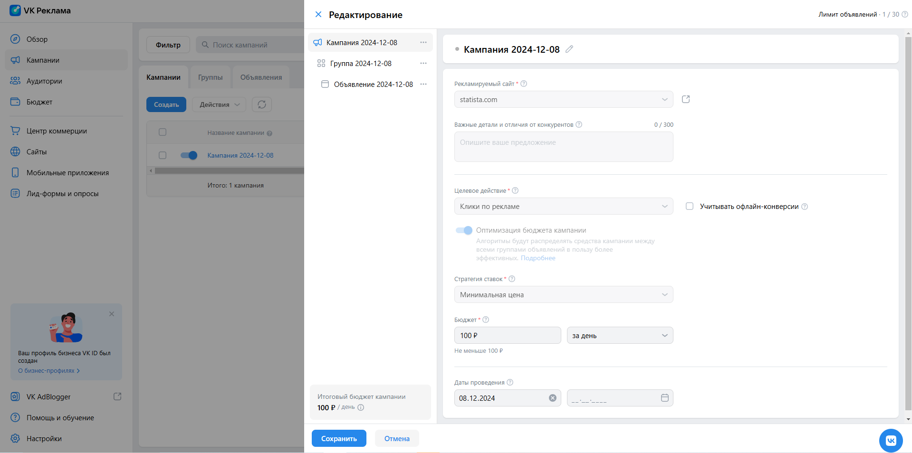
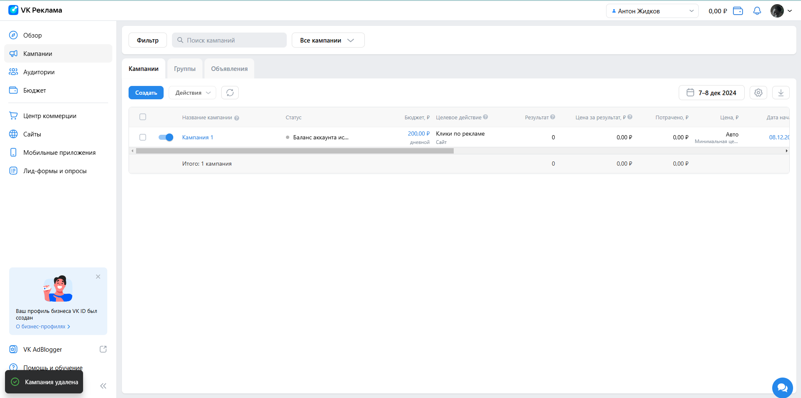
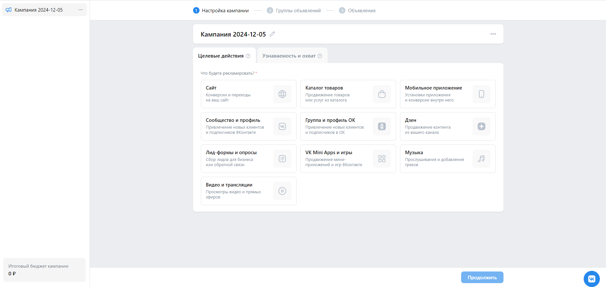

# Кампании

## Создание рекламы Сайта
Стартовая страница - https://ads.vk.com/hq/overview

Перейти в блок "Кампании" нажатием на кнопку "Кампании" в меню. Нажатие кнопки "Создать". Переход на страницу https://ads.vk.com/hq/new_create/ad_plan на этап "Настройка кампании". Нажатие на кнопку "Сайт". Заполнение поля "Рекламируемый сайт" валидным URL, например, https://www.statista.com. Ввод в поле бюджет суммы от 100, например, 100. Нажатие кнопки "Продолжить". Переход на этап "Группы объявлений". В блоке "Регионы показа" нажатие кнопки "Москва". Нажатие кнопки "Продолжить". Переход на этап "Объявления". Заполнение полей "заголовок" значением "Тест", "Короткое описание" значением "Тест", прикрепление изображения в блок "Медиафайлы". Заполнение формы "О рекламодателе" (заполняется автоматически указанными ФИО и ИНН). Нажатие кнопки "Опубликовать". Переход на страницу "Кампании". Отображение созданной кампании в списке с заданным ранее бюджетом и названием. Нажатие на название группы. Переход на вкладку группы. Нажатие на название группы. Переход на вкладку объявление. Нажатие на блок с фото рядом с названием объявления. Предпросмотр созданного объявления. 

## Редактирование рекламной кампании

Наведение на название кампании, нажатие на кнопку "Редактировать". Всплытие меню редактирования. Изменение бюджета на 200, изменение названия на "Кампания 1". Нажатие на блок "Группа". Переход на редактирование Группы. Изменение названия группы на "Группа 1", добавление региона "Санкт-Петербугр". Нажатие на блок "Объявление". Изменение названия на "Объявление 1", заголовка значением "Тест 1", описания значением "Тест 1", ссылки на сайт на "https://vk.com/a645g743", удаление всех медиафайлов у добавлнение нового. Нажатие кнопки "Сохранить".

В списке отображается кампания с измененными именем и бюджетом. Нажатие на название группы. Переход на вкладку группы. Отображение группы с измененным названием. Нажатие на название группы. Переход на вкладку объявление. Нажатие на блок с фото рядом с названием объявления. Предпросмотр редактированного объявления.
 

## Дублирование кампании

Наведение на название кампании, наведение на троеточие, нажатие на кнопку "Дублировать". Переход на страницу. Переход на этап "настройка камании". Нажатие на кнопку продолжить. Переход на следующий этап. Нажатие кнопки "Продолжить". Переход на следующий этап. Нажатие на кнопку "Опубликовать". На вкладке "Кампании" отображается копия кампания.

## Удаление кампании

Наведение на название кампании, наведение на троеточие, нажатие на кнопку "Удалить". Удаление кампании. Кампания не отображается в списке. После обновления страницы кампания не отображается в списке.

## Создание рекламы каталога товара

Перейти в блок "Кампании" нажатием на кнопку "Кампании" в меню. Нажатие кнопки "Создать". Нажатие на кнопку "Каталог товаров". Заполнение поля "Рекламируемый сайт" значением "https://vk.com/tm_limited_man". Нажатие на поле "Выберите каталог". Всплытие dropdown меню. Нажатие опции "Создать каталог". Всплытие окна "Новый каталог". Нажатие кнопки "Вручную". Заполнение поля "файл фида" файлом catalog_products.csv. Нажатие кнопки "Создать каталог". Отображение сообщения "Товары загружаются в каталог". Задать бюджет значением 100. Нажатие кнопки "Продолжить". Переход на следующий этап. В блоке "Регионы показа" нажатие кнопки "Москва". Нажатие кнопки "Продолить". Переход на следующий этап. Задание заголовка значением "Тест". Поле "Описание для баннера" заполняется автоматически значением "{{product.name}} {{product.price}}". Заполнение поля "Описание для карусели" значением "тестовая карусель". Поле "Заголовок карточки" заполняется автоматически значением "{{product.name}}". Нажатие кнопки "Опубликовать". Переход на страницу "Кампании". Отображение созданной кампании в списке с заданным ранее бюджетом и названием.

## Создание рекламы мобильного приложения

Перейти в блок "Кампании" нажатием на кнопку "Кампании" в меню. Нажатие кнопки "Создать". Нажатие кнопки "Мобильное приложение". Нажатие на поле "Рекламируемое приложение". Выбор опции "Привязать новое приложение". Всплытие окна "Привязка приложения". Заполнение поля значением "https://play.google.com/store/apps/details?id=org.telegram.messenger&hl=ru". Нажатие кнопки "Добавить". Заполнение поля бюджета значением 100. Нажатие кнопки "Продолжить". Переход на следующий этап. Переход на следующий этап. В блоке "Регионы показа" нажатие кнопки "Москва". Нажатие кнопки "Продолить". Переход на следующий этап. Заполнение поля "Короткое описание" значением "Тест". Поле заголовок заполняется автоматически значением "Telegram". Заполнение поля "Длинное описание" значением "Тест". Заполение поля "Трекинговая ссылка" значением "dasd12". 

1. Страница каманий. При отсутствии кампаний отображается предложение о создании первой рекламной кампании. Нажатие "создать кампанию" переводит на страницу "Настройки кампании" с автоматически заданным названием кампании в формате "Кампания <текущая дата в виде гггг:мм:дд>".

2. Настройка кампании. Изменение названия кампании. При редактировании имени кампании новое имя сохраняется и отображается в меню слева.
3. Настройка кампании. Изменение названия кампании. Поле не позволяет сохранить пустую строку в качестве имени. Имя кампании остаётся прежним при переходе на следующий шаг.
4. Настройка кампании. Целевые действия. Сайт. Рекламируемый сайт. Ввод валидной ссылки, например, https://www.statista.com. Появление остальных полей.
5. Настройка кампании. Целевые действия. Сайт. Рекламируемый сайт. Ввод невалидной ссылки, например, rewq. Отображение ошибки "Не удалось подгрузить данные ссылки"
6. Настройка кампании. Целевые действия. Сайт. Бюджет. Ввод 100. При нажатии кнопки "продолжить" переход на следующий этап
7. Настройка кампании. Целевые действия. Сайт. Бюджет. Ввод меньше 100. При нажатии кнопки "продолжить" вывод сообщения "Укажите бюджет не меньше 100₽"
8. Настройка кампании. Целевые действия. Сайт. Бюджет. Ввод ограничен значением "9 999 999 999 999".
9. Настройка кампании. Целевые действия. Сайт. Бюджет. После ввода бюджета итоговый бюджет сохраняется и отображается в окне.

10. Настройка кампании. Целевые действия. Сайт. Бюджет. При выборе опции "за всё время" выбор даты проведения "до" является обязательным.
11. Настройка кампании. Целевые действия. Сайт. Целевое действие. Оптимизация бюджета кампании. При выключении опции бюджет и стратегия ставок будут пересенены на этап Группы объявлений.
12. Группы кампаний. При указании бюджета на этапе Настройка кампании изменение поля Стратегия ставок заблокирован.
13. Группы кампаний. Настроить время показа. Нажатие кнопки "Будни". Переключение на вкладку с расписанием показа по будним дням.
14. Группы кампаний. Настроить время показа. Нажатие кнопки "Рабочее". Переключение на вкладку с расписанием показа в рабочее время.
15. Группы кампаний. Настроить время показа. Нажатие кнопки "Выходные". Переключение на вкладку с расписанием показа в выходные.
16. Группы кампаний. Настроить время показа. Моё время. Нажатие на ячейку. Переключение ячейки с указанным днём недели и часом.
17. Группы кампаний. Настроить время показа. Переход во вкладку "Моё время" со вкладок "Будни", "Рабочее", "Выходные" происходит с сохранением выбранных ячеек.

8. Настроить время показа. Моё время. Нажатие на ячейку. Toggle ячейки с указанным днём недели и часом.
9. Настроить время показа. Вкладки "Будни", "Рабочее", "Выходные". Нажатее на ячейку. Toggle ячейки и переход во вкладку "Моё время" с сохранением выбранных ячеек.

1. При переходе во вкладку кампаний отображается кнопка "Создать кампанию".
2. Нажатие на кнопку "Создание кампании". Переход на страницу https://ads.vk.com/hq/new_create/ad_plan.

3. Нажатие на кнопку "Создать". Отображение блока div с id="new_ad_create".

## Создание кампании 

1. Отображение имени кампании.
2. Имя кампании соответствует формату "Кампания <текущая дата в виде гггг:мм:дд>"
3. Нажатие на имя кампании. Изменение названия кампании.

### Целевые действия

1. Нажатие на кнопку "Сайт". Отображение поля ввода ссылки сайта.
2. Нажатие на кнопку "Каталог товаров". Отображение выбора объекта рекламы и полей ввода "Рекламируемый сайт", "Каталог товаров".
3. Нажатие на кнопку "Мобильное приложение". Отображается поле выбора приложения "Рекламируемое приложение".
4. Нажатие на кнопку "Сообщество и профиль". Отображение полей рекламы объекта.
5. Нажатие на кнопку "Группа и профиль ОК". Отображение поля ввода "Рекламируемый объект".
6. Нажатие на кнопку "Дзен". Отображение сообщения "Свяжите кабинет VK Рекламы с Дзен-студией, чтобы запустить рекламу канала" и кнопки "перейти в Студию".
7. Нажатие на кнопку "Лид формы и опросы". Отображение radio button выбора Объекта рекламы.
8. Нажатие на кнопку "VK Mini Apps и игры". Отображение поля "Мини-приложение".
9. Нажатие на кнопку "Музыка". Отображение поля ввода "Рекламируемый объект".
10. Нажатие на кнопку "Видео и трансляции". Отображение поля ввода "Рекламируемый объект".
11. Нажатие на кнопку "Продолжить" при выборе объекта рекламы. Отображение ошибки с указанием поля.
12. Даты проведения. Нажатие на поле даты проведения открывается календарь.

#### Сайт

1. Нажатие на кнопку "Продолжить". Отображение ошибки с указанием поля.
2. Ввод ссылки рекламируемого сайта. Ввод случайного текста. Отображение ошибки "Неверный формат URL".
3. Ввод ссылки рекламируемого сайта. Ввод корректной ссылки на сайт. Отображение остальных полей.
4. Ввод в поле "Важные детали и отличия от конкурентов". Ввод ограничен 300 символами.
5. Целевое действие. Нажатие на поле. Открывается выпадающее меню с выбором действия пользователя.
6. Оптимизация бюджета кампании. Нажатие на переключатель. Поля "Стратегия ставок", "Бюджет", удаляются.
7. Стратегия ставок. Выбор пункта "Предельная цена". Отображается дополнительное поле "Макс. стоимость клика".
8. Заполнение необходимых полей, нажатие кнопки "Продолжить". Переход на этап "Группы объявлений".

### Группы объявлений 

1. Бюджет. Ввод значения, меньше 100. Отображение ошибки "Укажите бюджет не меньше 100 Р"
2. Бюджет. Ввод ограничен значением 9 999 999 999 999.
3. Нажатие на текст "Настроить даты проведения". Отображение полей "Даты проведения группы".
4. Нажатие на текст "Настроить время показа". Отображение таблицы с указанием дней недели и часов показа.
5. Настроить время показа. Нажатие кнопки "Будни". Переключение на вкладку с расписанием показа по рабочим дням.
6. Настроить время показа. Нажатие кнопки "Рабочее". Переключение на вкладку с расписанием показа в рабочее время.
7. Настроить время показа. Нажатие кнопки "Выходные". Переключение на вкладку с расписанием показа в выходные.
8. Настроить время показа. Моё время. Нажатие на ячейку. Toggle ячейки с указанным днём недели и часом.
9. Настроить время показа. Вкладки "Будни", "Рабочее", "Выходные". Нажатее на ячейку. Toggle ячейки и переход во вкладку "Моё время" с сохранением выбранных ячеек.
10. Калькулятор аудитории. Отображение на странице.

11. Калькулятор аудитории. Перерендер при изменении параметров времени показа.
12. Калькулятор аудитории. Перерендер при выборе параметра "Учитывать местное время". Работает в случае, если в настройках времени показа не выбраны все ячейки.
13. Регионы показа. Отображение на странице.

14. Регионы показа. Быстрый выбор. Нажатие на одну из опций остаётся выбранная, остальные скрываются.
15. Регионы показа. Поиск. Отображения города при вводе его названия.
16. Регионы показа. Поиск. Добавление региона при нажатии на checkbox среди выдаваемых результатов.
17. Регионы показа. Добавление нескольких регионов. Отображение выбранных регионов и их количества.

17. Регионы показа. Нажатие на кнопку "Добавить списком". Отображение попапа добавления списком.

18. Регионы показа. Добавление списка. Ввод городов, регионов. Вывод сообщения о добавлении n регионов. Регионы заменятся на выбранные.
19. Регионы показа. Добавление списка. Ввод "йцук". Вывод сообщения об ошибке.
20. Регионы показа. Добавление списка. Загрузка из файла. Чтение указаного файла формата .txt и .csv. Добавление указанных регионов и вывод сообщения о добавлении n регионов.
21. Регионы показа. Добавление списка. Загрузка из файла. Чтение указаного файла формата .txt и .csv. Вывод сообщения об ошибке при чтении некорректных данных, например, "йцуй" или файлов другого расширения.
22. Регионы показа. Нажатие кнопки "Очистить всё". Сброс выбранных регионов.
23. Регионы показа. Нажатие кнопки "Указать на карте". Отображение версии с картой.

24. Регионы показа. Указать на карте. Нажатие на карту. Добавление геометки.
25. Регионы показа. Нажатие на стрелочку вверх. Блок сворачивается, отображает выбранные регионы.
26. Расширение аудитории. Нажатие переключателя "Расширить аудиторию". Отсутствие изменений.
27. Нажатие кнопки "Сохранить как черновик". Отображение сообщения о сохранении в черновиках.
28. Нажатие кнопки "назад". Возвращение на вкладку "Настройка кампании".

### Настройка кампании
1. Отображение на странице.

2. Логотип. Использование стандартного логотипа.
3. Логотип. Загрузка собственного прототипа.
4. Заголовок. Проверка ввода до 40 символов.
5. Краткое описание. Проверка ввода до 90 символов.
6. Длинное описание. Проверка ввода до 2000 символов.
7. Текст рядом с кнопкой. Проверка ввода до 30 символов.
8. Медиафайлы. Загрузка файлов.
9. Предпросмотр. Изменение верстки при редактировании полей объявления.
10. Нажатие кнопки "Добавить ещё объявление". Переход к созданию нового объявления.
11. Нажатие кнопки "Опубликовать". Отображение попапа предупреждения о возможных ошибках.

12. Нажатие кнопки "Отправить". Отображение ввода данных рекламодателя.

