# Аудитории

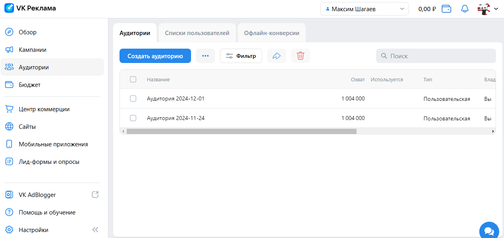
1. Личный кабинет. Нажатие на сайдбаре кнопки "Сайты". Переход на страницу https://ads.vk.com/hq/audience

2. Аудитории. Проверка отображения. Вверхнее меню кнопки: "Аудитории", "Список пользователей", "Офлайн-конверсии". Окно аудиторий, кнопки: создать аудиторию, троеточие, фильтр, кнопки поделиться и удалить, поле для поиска аудитории.

3. Аудитории. При нажатии на кнопку "Создать аудиторию" открывается окно создания аудитории.

4. Создание аудитории. Ввести название аудитории. Если название больше 255 символов, появляется ошибка.Аудитория создается с введеным названием.

5. Создание аудитории. Нажатие на кнопку "Добавить источник". Включить источник "Подписчики сообществ".
Ввод названия сообщества. При нахождении сообществ отображается их список. Если сообщества нету, то выводится сообщение "Ничего не нашлось".
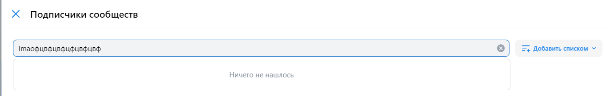

5. Аудитории. При наведении на аудиторию появляется троеточие. При наведении на троеточие появляются варианты: "Редактировать", "Настроить доступ", "Удалить".
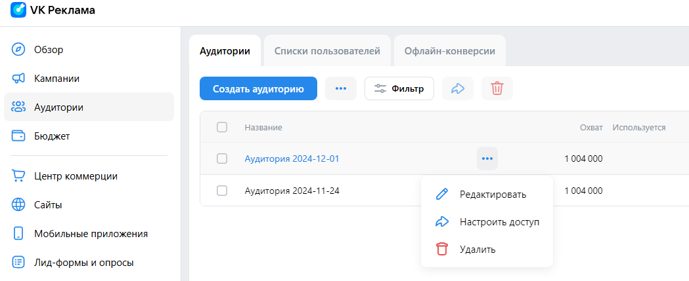

6. Аудитории. При нажатии на кнопку "Удалить" и подтверждения Аудитория удаляется.

# Сайты
1. Личный кабинет. При нажатии на сайдбаре кнопки "Сайты" открывается окно с списком пикселей трекинга. https://ads.vk.com/hq/pixels
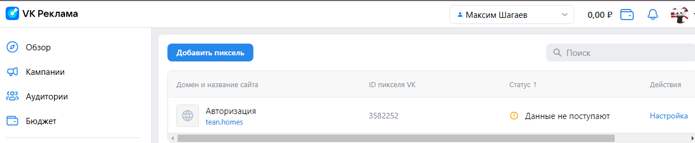

2. Сайты. Проверка отображения. Кнопки Добавить пиксель и поля для поиска пикселей.

3. Сайты. При нажатии на кнопку "Добавить пиксель" открывается окно для добавления пикселя.

4. Добавление пикселя. Ввести домен сайта. Если введен некорректный домен, появляется ошибка.
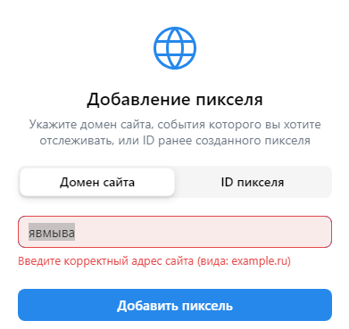
Ввод корректного домена (с окончанием через .ru например), появляется окно об успешном создании пикселя.
В списке пикселей отображается созданный пиксель.

5. Редактирование названия пикселя. При наведении на пиксель в списке, появляется троеточие. При нажатии на троеточие появляются варианты "Переименовать", "Удалить". При нажатии на вариант переименовать появляется окно для ввода нового названия. Если название больше 255 символов, в нижнем левом углу появляется ошибка "Внутренняя ошибка сервера". Если название меньше - у пикселя изменяется название, после обновления страницы видно изменение.

6. Удаление пикселя. При нажатии на вариант удалить и подтверждении удаления пиксель удаляется и пропадает из списка пикселей.
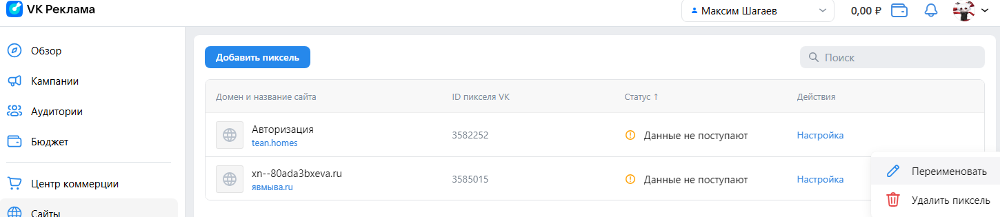

# Лид-формы и опросы

1. Личный кабинет. Нажатие на сайдбаре кнопки "Лид-формы и опросы". Переход на страницу https://ads.vk.com/hq/leadads/leadforms

2. Лид-формы. Проверка отображения. В верхнем меню кнопки "Лид-формы", "Формы YCLIENTS", "Опросы". В окне Лид-форм надпись "Лид-форм пока нет", кнопки "Создать лид-форму", "Пройти обучение . 15 минут".

3. Создание лид-формы. Нажатие на кнопку "Создать Лид-форму" открывает форму для создания лид-формы.
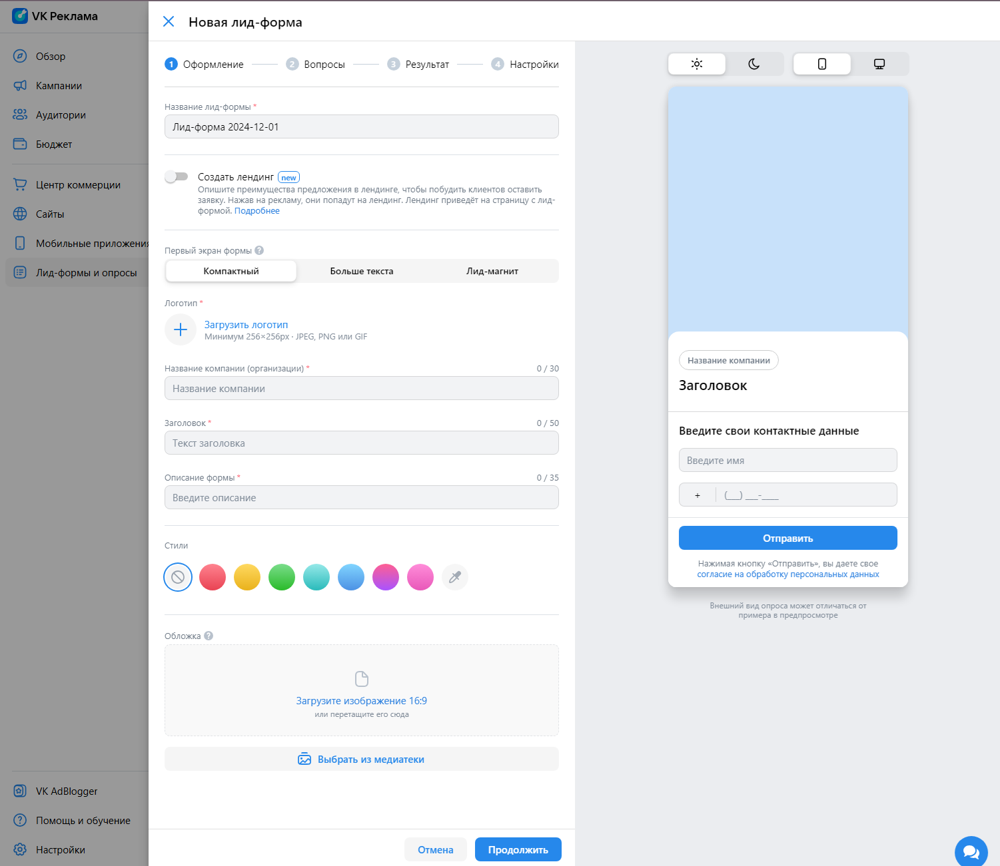

4. Офомление Лид-формы. Проверка отображения. Полей "Название лид-формы", "Логотип", "Название компании(организации)", "Заголовок", "Описание формы". Справа предварительный просмотр внешнего вида лид-формы. Кнопки светлой и темной темы. Кнопки мобильной и десктопной версии.

4. Офомление Лид-формы. Нельзя продолжить без заполнения обязательных полей(Название лид-формы, Логотип, Название компании(организации), Заголовок, Описание формы)

5. Оформление Лид-формы. Нельзя продолжить создание, если поле "Название лид-формы" больше 255 символов.

6. Оформление Лид-формы. Нельзя продолжить создание, если поле "Название компании (организации)" больше 30 символов.

7. Оформление Лид-формы. Нельзя продолжить создание, если поле "Заголовок" больше 50 символов.

8. Оформление Лид-формы. Нельзя продолжить создание, если поле "Описание формы" больше 50 символов.

9. Офомление Лид-формы. При нажатии на кнопку "пипетки" в Стилях открывается окно выбора цвета с полем для ввода 6-значного HEX кода цвета, кнопки "ОК" и палитрой цветов.

10. Офомление Лид-формы. При корректном заполнении(без превышения по размеру) обязательных полей(Название лид-формы, Логотип, Название компании(организации), Заголовок, Описание формы) и нажатии кнопки "Продолжить" происходит переход в окно создания вопросов.

11. Вопросы Лид-формы. Проверка отображения. Кнопка "+ Добавить вопрос". Выбор контактной информации. Кнопка "+ Добавить контактные данные". Справа предварительный просмотр внешнего вида лид-формы. Кнопки светлой и темной темы. Кнопки мобильной и десктопной версии.
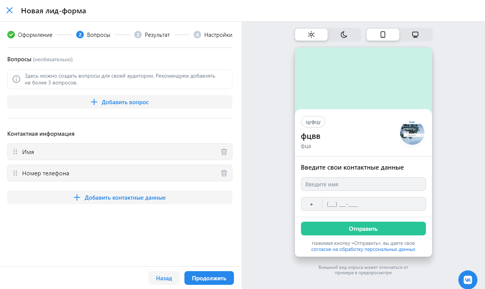

12. Вопросы Лид-формы. При нажатии на кнопку "Добавить вопрос" отображается в окне ввод вопроса с полями для ввода "напишите вопрос", кнопка с выбором типа вопроса, поля для ввода варианта ответа. 

13. Вопросы Лид-формы. Нельзя ввести более 68 символов в поле "Напишите вопрос".

14. Вопросы Лид-формы. Нельзя ввести более 40 символов в поле "Введите ответ".

15. Вопросы Лид-формы. Нажатие на кнопку "Добавить ответ" добавляет вариант ответа.

16. Вопросы Лид-формы. Нажатие на кнопку "Ответ из шаблона" открывает окно с выбором ответа "Ничего из перечисленного", "Затрудняюсь ответить", "Другое (свой ответ)".

17. Вопросы Лид-формы. При выборе ответа из шаблона пропадает кнопка "Ответ из шаблона" и добавляется вариант ответа из шаблона в ответы вопроса.

18. Вопросы Лид-формы. При удалении вопроса из шаблона кнопка "Ответ из шаблона" появляется.

18. Вопросы Лид-формы. При нажатии на кнопку удаления вопроса вопрос удаляется.

19. Вопросы Лид-формы. Контактная информация. При нажатии на кнопку удаления вариант контактной информации убирается.

20. Вопросы Лид-формы. Контактная информация. Если удалены все варианты Контактной информации появляется предупреждающий текст: "Минимальное количество полей: 1".

21. Вопросы Лид-формы. Контактная информация. При нажатии на кнопку "Добавить контактные данные появляется окно с выбором контатной информации для добавления".
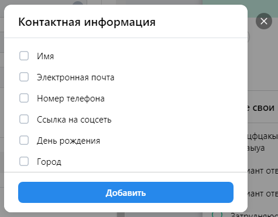

22. Вопросы Лид-формы. Контактная информация. При нажатии на вариант контактной информации он отмечается галочкой и при нажатии кнопки "добавить" добавляется в контактную информацию.

23. Вопросы Лид-формы. Добавление одного вопроса и одного варианта контактной информации. Нажатие на кнопку "Продолжить" переходит на окно "Продолжить".

24. Результат Лид-формы. Проверка отображения. Поля ввода "Заголовок", "Описание". Кнопки "Добавить сайт", "Добавить телефон", "Добавить промокод". Справа предварительный просмотр внешнего вида лид-формы. Кнопки светлой и темной темы. Кнопки мобильной и десктопной версии.

25. Результат Лид-формы. Сообщение об ошибке если ввести более 25 символов в поле "Заголовок".

26. Результат Лид-формы. Сообщение об ошибке если ввести более 160 символов в поле "Описание".

27. Результат Лид-формы. При нажатии на кнопку "Добавить телефон" появляется поле "Телефон для заказа".

28. Результат Лид-формы. Поле "Телефон для заказа" должно начинаться с знака "+" и содержать только цифры, и иметь правильную длину для введённого кода страны. Сообщение об ошибке, если некорректный ввод.

29. Результат Лид-формы. При нажатии на кнопку "Добавить промокод" появляется поле "Промокод".

30. Результат Лид-формы. Если поле "Промокод" больше 30 символов появляется сообщение об ошибке - "Превышена максимальная длина поля".

31. Результат Лид-формы. При нажатии на кнопку "Ссылка на сайт" появляется поле "Ссылка на сайт".

32. Результат Лид-формы. При вводе некорректного url в поле "Ссылка на сайт" появляется сообщение "Невалидный url".

33. Результат Лид-формы. Если поле Заголовок введено корректно(не более 25 символов) и остальные поля либо отстутствуют, либо введены корректно. При нажатии на кнопку "Продолжить" происходит переход на "Настройки лид-формы".

34. Настройки Лид-формы. Заголовок "Настройки лид-формы". Подзаголовок "Уведомления". Кнопки "Уведомлять о новых заявках по email", "Уведомлять о новых заявка в VK Messenger", "Обязателньые вопросы". Подзаголовок "Согласие на обработку персональных данных". Поля ввода: "Фамилия, имя, отчество (если есть)", "Адрес регистрации по месту жительства", "Email", "ИНН". Справа предварительный просмотр внешнего вида лид-формы. Кнопки светлой и темной темы. Кнопки мобильной и десктопной версии.

35. Настройки Лид-формы. Заголовок "Настройки лид-формы". Подзаголовок "Уведомления". Кнопки "Уведомлять о новых заявках по email", "Уведомлять о новых заявка в VK Messenger", "Обязателньые вопросы". Подзаголовок "Согласие на обработку персональных данных". Поля ввода: "Фамилия, имя, отчество (если есть)", "Адрес регистрации по месту жительства", "Email", "ИНН". Справа предварительный просмотр внешнего вида лид-формы. Кнопки светлой и темной темы. Кнопки мобильной и десктопной версии.

36. Настройки Лид-формы. При нажатии на "Уведомлять о новых заявках по email" появляется поле ввода "Email-адреса для уведомленийй (до 10 штук, через запятую)" и предупреждение "Тестовые лиды будут приходить только на те почтовые ящики, которые привязаны к рекламному кабинету. Привязать email можно через настройки(ссылка)".

37. Настройки Лид-формы. При вводе в поле ввода "Email-адреса для уведомленийй (до 10 штук, через запятую)" некорректного email-адреса появляется предупреждение "Поле содержит невалидные email".

38. Настройки Лид-формы. При вводе в поле ввода "Email-адреса для уведомленийй (до 10 штук, через запятую)" больше 10 email сообщение об ошибке не появляется!!!! ....

39. Настройки Лид-формы. При нажатии на "Обязательные вопросы" появляется окно с предупреждением "Сделать все вопросы обязательными?" При нажатии да, появляется "галочка".
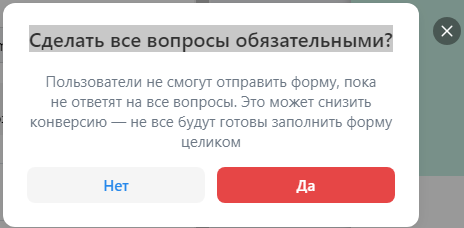

40. Настройки Лид-формы. При попытке создании без email-адреса, ФИО, Адреса регистрации по месту жительства появляются предупреждения под полями "Обязательное поле".

41. Настройки Лид-формы. При вводе ИНН больше 32 символов появляется сообщени об ошибке "Превышена максимальня длина поля".

42. Настройки Лид-формы. Нажатие кнопки "Сохранить" с корректно введенным email-адреса, ФИО, Адреса регистрации по месту жительства. Переход на окно Лид-форм и опросов, созданная лид-форма отображается в списке.

43. Лид-формы. При наведении на лид-форму в списке появляется под названием кнопки "Редактировать", "Архивировать" и троеточие, при наведение на которое появляется кнопка "дублировать".

44. Лид-формы. При нажатии на кнопку "дублировать" создается копия лид-формы.

45. Лид-формы. При нажатии на кнопку "архивировать" появляется окно с предупреждением. При нажатии на кнопку "Архивировать" лид-форма переносится в архив.
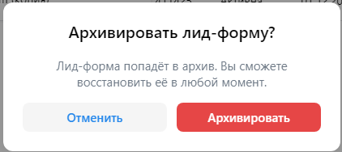 

46. Лид-формы. При наведении на лид-форму "в архиве" появляется кнопка "восстановить". При нажатии на кнопку "восстановить" и подтверждении Лид-форма вернется в список активных.

47. Лид-формы. При наведении на лид-форму "в архиве" появляется кнопка "восстановить". При нажатии на кнопку "восстановить" и подтверждении Лид-форма вернется в список активных.

Лиды нельзя удалить??? как минимум я нашел только в архив переместить...