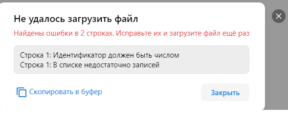
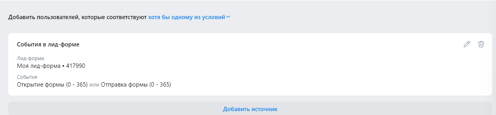
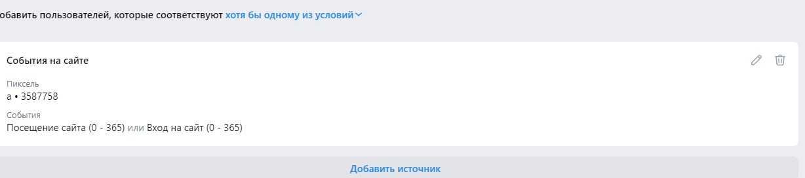
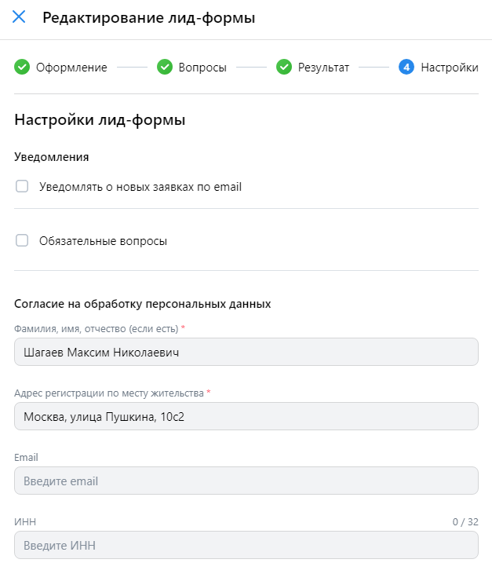
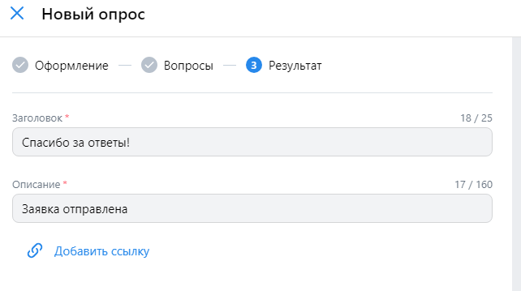

# Сайты

1. Личный кабинет. Создание пикселя. Url: https://ads.vk.com/hq/pixels. Нажатие на кнопку "Добавить пиксель".
Открывается окно добавления пикселя. Ввод корренктного домена сайта, например tean.homes . Нажатие на кнопку "Добавить пиксель". Нажатие на кнопку "Создать новый пиксель". Окно с сообщением об успешном создании пикселя. В списке пикселей добавился созданный пиксель (проверка домена созданного пикселя).

2. Личный кабинет. Удаление пикселя. Нажатие на троеточие в списке пикселей. Нажатие на кнопку "Удалить пиксель". Подтверждение удаление. Пиксель исчезает из списка пикселей.

3. Личный кабинет. Редактирование названия пикселя. Нажатие на троеточие в списке пикселей. Нажатие на кнопку "Переименовать". Ввод нового названия пикселя, например (tean auth). Обновить страницу. Проверка, что название пикселя изменилось.

4. Личный кабинет. Настройки пикселя. Добавление события. Нажатие на пиксель в списке пикселей действия "Настройка". Открывается окно настроек пикселей. Нажатие на кнопку добавить событие. Ручная настройка события. Ввод названия события (регистрация). Выбор категории - "Регистрация". Условие наступления - "Посещена страница". URL содержит - "auth". Нажатие на кнопку "Добавить событие". Проверка, что событие добавилось с корректным названием и условием.

5. Личный кабинет. Настройки пикселя. Создание аудиторного тега. Нажатие на кнопку "Создать аудиторный тег". Открывается окно создания, ввод названия тега, например (sometag), нажатие создать. Проверка, что аудиторный тег создался с названием.

6. Личный кабинет. Настройки пикселя. Редактирование события. 
Изменение названия на "Вход на сайт". Категория - "Контакт". Нажатие на кнопку "Изменить событие". Проверка, что Категория и Название события изменились.

7. Личный кабинет. Настройки пикселя. Редактирование события. 
Если изменить название на другое, длинной больше 255, то при нажатии на кнопку "Изменить событие" то в левом нижнем углу появится окно с ошибкой - "Максимальное количество символов - 255".

# Аудитории

1. Создание аудитории. Ключевые фразы. Нажатие на кнопку создать аудиторию. Ввод названия аудитории "Моя аудитория". Нажатие на кнопку "Добавить источник". Выбор Ключевые фразы. Изменить название на "Пиво", Ключевые фразы - "пиво". Нажать на сохранить. Сохранить аудиторию. Проверить, что аудитория создалась с введенным названием.

2. Создание аудитории. Существующая аудитория. Нажатие на кнопку создать аудиторию.  Нажатие на кнопку "Добавить источник". Выбрать "существующая аудитория". Выбрать аудиторию "Моя аудитория". Нажать "сохранить". И ещё раз.  Перейти в редактирование аудитории, убедиться, что условие добавилось - отображается как источник.

3. Создание аудитории. Список пользователей. Нажатие на кнопку создать аудиторию.  Нажатие на кнопку "Добавить источник". Выбрать "Список пользователей". Выбрать "Загрузить новый". Выбрать тип списка "ID ВКонтаке". Загрузить файл списка. Нажать "сохранить". И ещё раз. Перейти в редактирование аудитории, убедиться, что условие добавилось - отображается как источник.

4. Создание аудитории. Список пользователей. Нажатие на кнопку создать аудиторию.  Нажатие на кнопку "Добавить источник". Выбрать "События в лид-форме"(лид форма должна быть предварительно создана). Выбрать "Загрузить новый". Выбрать тип списка "ID ВКонтаке". Загрузить файл списка с некорректным текстом - появится окно с ошибками в файле.

5. Создание аудитории. События в лид-форме. Нажатие на кнопку создать аудиторию.  Нажатие на кнопку "Добавить источник". Выбрать "События в лид-форме". Нажать на "Открытие формы" и "Отправка формы".  Нажать "сохранить". И ещё раз. Перейти в редактирование аудитории, убедиться, что условие добавилось - отображается как источник.

6. Создание аудитории. События на сайте. Нажатие на кнопку создать аудиторию.  Нажатие на кнопку "Добавить источник". Выбрать "События на сайте". Выбрать пиксель в списке пикселей(он должен быть предварительно создан). Включить "Посещение сайта" и "Вход на сайт". Нажать "сохранить". И ещё раз. Перейти в редактирование аудитории, убедиться, что условие добавилось - отображается как источник.

7. Редактирование аудитории. Нажать на название аудитории в списке аудиторий. Изменить название аудитории на "Редактированная аудитория". Нажать сохранить. Проверить, что название аудитории изменилось.

8. Редактирование аудитории. Добавление источника. Нажать на название аудитории в списке аудиторий. Нажать на добавить источник. Выбрать вариант "Подписчики сообществ". Ввести название сообщества (lmao). Выбрать сообщество lmao. Нажать на кнопку "Сохранить". Перейти в редактирование аудитории, убедиться, что условие добавилось - отображается как источник в окне редактирования аудитории.

9. Удаление аудитории. Нажатие на checkbox напротив аудитории. Нажатие на кнопку "корзины - удалить". Подтверждение удаления. Проверить, что аудитория удалилась и пропала из списка аудиторий.

10. Создание аудитории https://ads.vk.com/hq/audience. Нажатие на кнопку создать аудиторию. Ввод названия аудитории больше 255 символов. Появляется ошибка: "Напишите текст не больше 255 символов". 

# Лид-формы

1. Создание Лид-формы https://ads.vk.com/hq/leadads/leadforms. Ввод данных: Название лид-формы - "Моя лид-форма", добавление логотипа(Tean_Logo.png), название компании - "TeaN", Заголовок - "TeaN - найди жилье мечты". Описание формы - "Поможем вам найти жилье!". Нажать на продолжить. Создание вопроса: Вопрос: "Что вы ищете". варианты: "Квартиру" "дом". Нажатие на продолжить. Результат - добавить сайт, ввести url "https://tean.homes". Добавить телефон. Ввести номер "+79043654623" Продолжить. Заполнить в "Согласие на обработку персональных данных". ФИО - "Шагаев Максим Николаевич" и Адрес регистрации "Москва, улица Пушкина, 10c2". Нажать сохранить. Проверить, что лид-форма отображается в списке созданнным названием.

2. Дублирование Лид-формы. При наведении на лид-форму в списке появляется троеточие, при наведении появляется кнопка "Дублировать". При нажатии в списке появляется новая лид-форма. Проверить название, такое же как и у оригинальной, но в конце добавлено " (копия)".

3. Архивирование Лид-формы.  При наведении на лид-форму в списке появляеются кнопки "Редактировать" и "Архивировать". При нажатии на архивировать и подтверждение лид-форма пропадает из списка активных. Перейти в список заархивированных лид-форм, проверить что лид-форма отображается в архиве.

4. Оформление Лид-формы. Нельзя продолжить создание, если поле "Название лид-формы" больше 255 символов.

5. Оформление Лид-формы. Нельзя продолжить создание, если поле "Название компании (организации)" больше 30 символов.

6. Оформление Лид-формы. Нельзя продолжить создание, если поле "Заголовок" больше 50 символов.

7. Оформление Лид-формы. Нельзя продолжить создание, если поле "Описание формы" больше 50 символов.

8. Вопросы Лид-формы. Нельзя ввести более 68 символов в поле "Напишите вопрос".

9. Вопросы Лид-формы. Нельзя ввести более 40 символов в поле "Введите ответ".

10. Вопросы Лид-формы. Контактная информация. Если удалены все варианты Контактной информации появляется предупреждающий текст: "Минимальное количество полей: 1".

11. Результат Лид-формы. Сообщение об ошибке если ввести более 25 символов в поле "Заголовок".

12. Результат Лид-формы. Сообщение об ошибке если ввести более 160 символов в поле "Описание".

13. Результат Лид-формы. Ввод в  поле "Телефон для заказа" букв, например "some number". Появляется Сообщение об ошибке - "Телефон должен начинаться с + и содержать только цифры", если некорректный ввод.

14. Результат Лид-формы. При нажатии на кнопку "Добавить промокод" появляется поле "Промокод". Если поле "Промокод" больше 30 символов появляется сообщение об ошибке - "Превышена максимальная длина поля".

15. Результат Лид-формы. При нажатии на кнопку "Ссылка на сайт" появляется поле "Ссылка на сайт". При вводе некорректного url в поле "Ссылка на сайт" появляется сообщение "Невалидный url".

16. Настройки Лид-формы. При вводе в поле ввода "Email-адреса для уведомленийй (до 10 штук, через запятую)" некорректного email-адреса появляется предупреждение "Поле содержит невалидные email".

17. Настройки Лид-формы. При попытке создании без email-адреса, ФИО, Адреса регистрации по месту жительства появляются предупреждения под полями "Обязательное поле".

18. Настройки Лид-формы. При вводе ИНН больше 32 символов появляется сообщени об ошибке "Превышена максимальня длина поля".

# Опросы
 
1. Создание опроса. https://ads.vk.com/hq/leadads/surveys. Кнопка создать опрос. Ввод названия "Мой опрос", добавление логотипа, Название компании "TeaN", Заголовок опроса "Какое жилье вам интересно?", Описание опроса: "Расскажите о своих предпочтениях жилья". Вопросы. Ввод текста вопроса: "Какое жилье в ищете?", варианты ответа: "квартира", "дом". Нажатие на "Результат". Заголовок и Описание по умолчанию. Запустить опрос. Проверить, что опрос создался с введенным названием.

2. Опросы. Дублирование опроса. При наведении на опрос в списке появляется троеточие. При наведении на троеточие и нажатии на дублировать создается копия опроса с таким же названием, но концом " (копия)".

3. Опросы. Архивироание опроса. При наведении на опрос в списке появляются варианты "Редактировать" и "Архивировать". При нажатии на архивировать и подтверждение Опрос переходит в архив. 

4. Опросы. Редактирование опроса. Оформление. При наведении на опрос в списке появляются варианты "Редактировать" и "Архивировать". Редактирование названия опроса с "Мой опрос" на "Редактированный опрос". Нажатие на крест в левом верхнем углу, нажатие на "сохранить опрос". Проверить, что название опроса изменилось.

5. Опросы. Создание/Редактирование опроса. Оформление. Ввести "Название опроса" - текст длинной больше 255 символов. При нажатии на кнопку "вопросы"(переход к следующему пункту создания). Под полем появляется сообщение: "Превышена максимальная длина поля".

6. Опросы. Создание/Редактирование опроса. Оформление. Ввести "Название компании" - текст длинной больше 30 символов. При нажатии на кнопку "вопросы"(переход к следующему пункту создания). Под полем появляется сообщение: "Превышена максимальная длина поля".

7. Опросы. Создание/Редактирование опроса. Оформление. Ввести "Заголовок опроса" - текст длинной больше 50 символов. При нажатии на кнопку "вопросы"(переход к следующему пункту создания). Под полем появляется сообщение: "Превышена максимальная длина поля".

8. Опросы. Создание/Редактирование опроса. Оформление. Ввести "Описание опроса" - текст длинной больше 350 символов. При нажатии на кнопку "вопросы"(переход к следующему пункту создания). Под полем появляется сообщение: "Превышена максимальная длина поля".

9. Опросы. Создание/Редактирование опроса. Результат. Ввести "Заголовок" - текст длинной больше 25 символов. При нажатии на кнопку "Сохранить"(завершение создания/редактирования). Под полем появляется сообщение: "Превышена максимальная длина поля".

10. Опросы. Создание/Редактирование опроса. Результат. Ввести "Описание" - текст длинной больше 160 символов. При нажатии на кнопку "Сохранить"(завершение создания/редактирования). Под полем появляется сообщение: "Превышена максимальная длина поля".