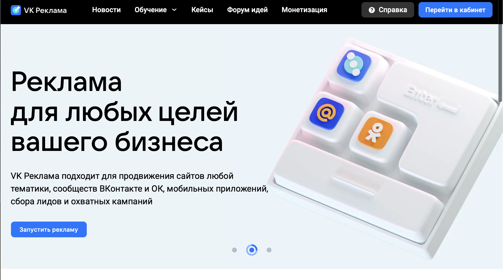
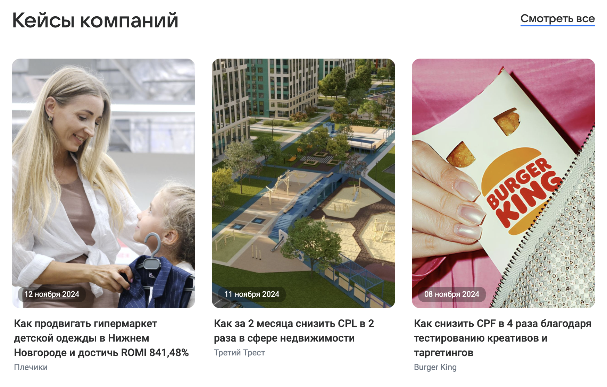
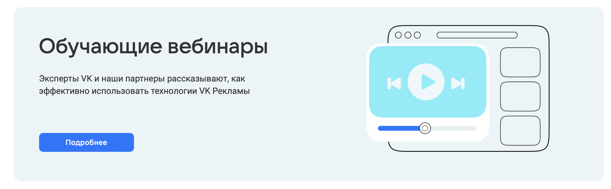
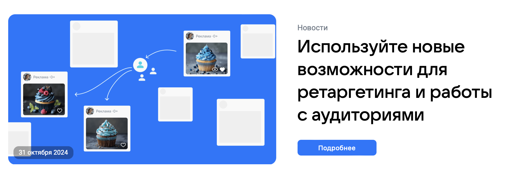
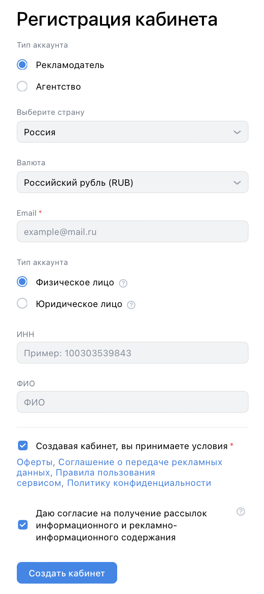
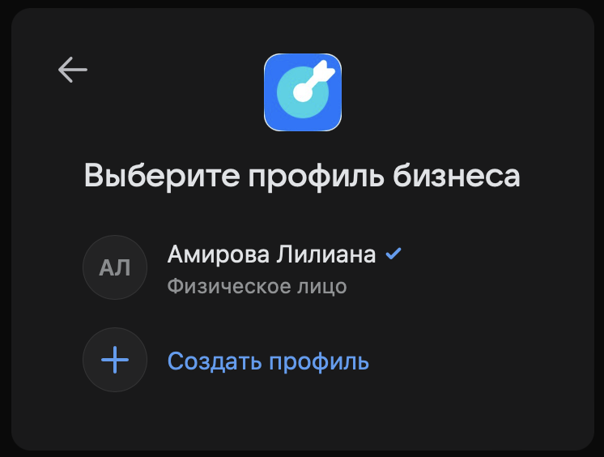
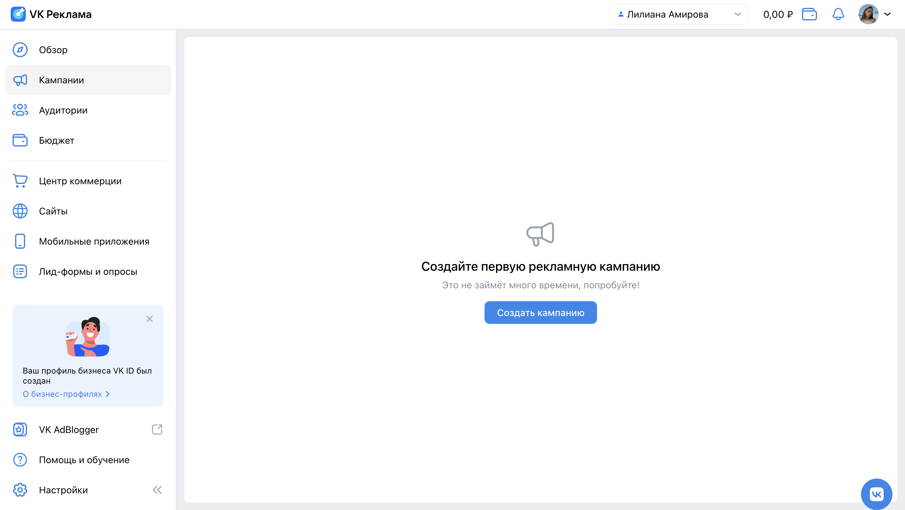
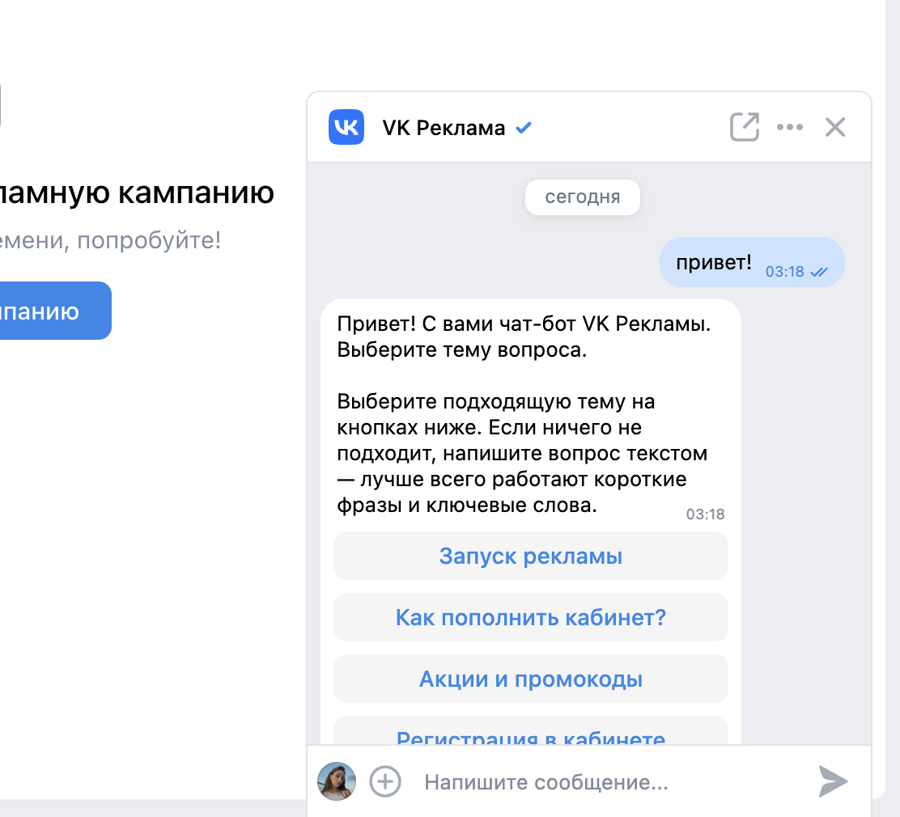
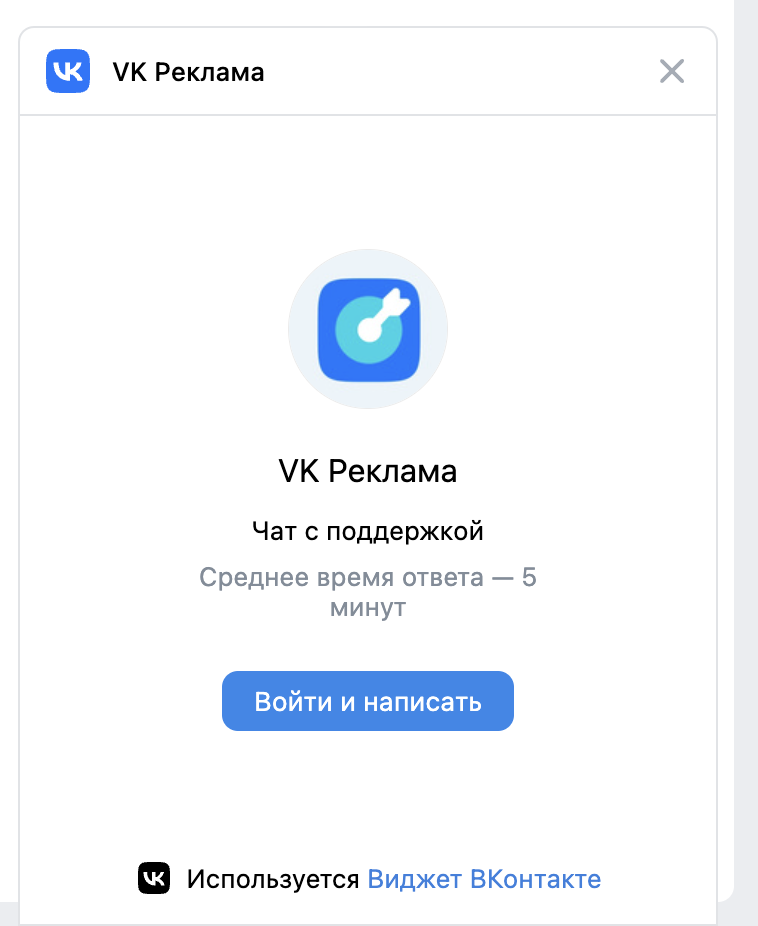

## Лендинг

- Лендинг. Если пользователь не авторизован, при переходе по адресу https://ads.vk.com показывается лендинг VK Рекламы.
- Лендинг. Если пользователь авторизован, при переходе по адресу https://ads.vk.com показывается главная страница кабинета VK Рекламы: https://ads.vk.com/hq/overview.
- Лендинг. Header. 
  - Сверху страницы расположен хэдер, в самом левом углу которого логотип VK Рекламы с подписью "VK Реклама".
  - Слева от логотипа расположены разделы: "Новости", "Обучение" (выпадающий список), "Кейсы", "Форум идей", "Монетизация".
  - В правом углу расположены кнопки "Справка" и "Перейти в кабинет".
  - При нажатии на кнопку "Справка" открывается страница, расположенная по адресу https://ads.vk.com/help.
  - При нажатии на кнопку "Перейти в кабинет":
    - если пользователь не авторизован, происходит редирект на авторизацию VK ID;
    - если пользователь авторизован, происходит редирект в рекламный кабинет.
- Лендинг. Слайдер.
  - На первом слайде расположена кнопка "Получить бонус". При нажатии на кнопку происходит переход на https://ads.vk.com/promo/firstbonus.
  - На втором слайде расположена кнопка "Запустить рекламу".
    - Если пользователь авторизован, при нажатии на кнопку происходит переход в рекламный кабинет.
    - Если пользователь не авторизован, при нажатии на кнопку происходит переход на страницу с авторизацией VK ID.
  - На третьем слайде расположена кнопка "Подробнее". При нажатии на кнопку происходит переход на https://adblogger.vk.com/for-advertisers?utm_source=site&utm_medium=banner&utm_campaign=black_friday&utm_content=ads_vk_com.

- Лендинг. Кейсы компании.
  - Справа отображается кнопка "Смотреть все". При нажатии на кнопку происходит переход в раздел [Кейсы](https://ads.vk.com/cases).
  - При нажатии на конкретный кейс происходит переход на страницу с ним (например, https://ads.vk.com/cases/privlekaem-pokupatelej-shkolnoj-formy-kejs-plechiki).

- Лендинг. Обучающие вебинары.
  - Внутри цветной области блока расположена кнопка "Подробнее". При нажатии на кнопку происходит переход в раздел [Мероприятия](https://ads.vk.com/events).
  - Вся цветная область кликабельна. При нажатии в любое место цветной области, происходит переход в раздел [Мероприятия](https://ads.vk.com/events).

- Лендинг. Новости.
  - Внутри блока расположена кнопка "Подробнее". При нажатии на кнопку происходит переход к конкретной новости, которая обозначена в блоке.
  - Вся область блока кликабельна. При нажатии в любое место цветной области, происходит переход к конкретной новости, которая обозначена в блоке.

- Лендинг. Footer.
  - Внутри элемента расположена кнопка "Перейти в кабинет".
    - Если пользователь не авторизован, при нажатии на кнопку "Перейти в кабинет" происходит редирект на авторизацию VK ID.
    - Если пользователь авторизован, при нажатии на кнопку "Перейти в кабинет" происходит редирект в рекламный кабинет.

## Регистрация и авторизация

Для авторизации на сайте используется [VK ID](https://id.vk.com). Поскольку работа осуществляется c сервисом [ads.vk.com](ads.vk.com), проверки, связанные с [VK ID](https://id.vk.com), в чек-лист не включены.

###### 1. У пользователя еще нет рекламного кабинета.

- Регистрация. Если пользователь не авторизован, при нажатии на кнопку "Перейти в кабинет" происходит редирект на авторизацию VK ID.
- Регистрация. Страница "Добро пожаловать в VK Рекламу".
  - После авторизации с помощью VK ID происходит редирект на страницу "Добро пожаловать в VK Рекламу".
  - Отображается переключатель между русским/английским языками. Он меняет язык всей страницы.
  - Отображаются 2 активные кнопки: "Создать новый кабинет" и "Использовать рекламный кабинет myTarget".
- Регистрация. Регистрация кабинета. 
  - После нажатия на кнопку "Создать новый кабинет" открывается страница "Регистрация кабинета".
  - Выбор типа аккаунта (1) (обязательное поле). Чекбокс: "Рекламодатель" или "Агентство".
  - Выбор страны (обязательное поле). При нажатии на поле появляется выпадающий список со странами.
  - Выбор валюты (обязательное поле). При нажатии на поле появляется выпадающий список, в котором содержится только 1 строка - "Российский рубль (RUB)".
  - Email. До тех пор, пока не введен хотя бы 1 символ, отображается плейсхолдер "example@mail.ru".
  - Email. Если навести курсор на поле, а потом убрать, оставив незаполненным, под полем появляется ошибка "Обязательное поле".
  - Email. Считается валидным, если:
    - содержит ровно один **"@"** и хотя бы одну **"."** после знака **"@"**;
    - часть до **"@"** содержит заглавные/строчные буквы латиницы, символы **"."**, **"-"**, **"_"**, цифры;
    - часть после **"@"** до последней точки содержит заглавные/строчные буквы кириллицы/латиницы, символы **"."**, **"-"**, **"_"**, цифры;
    - часть после **"@"** после последней точки содержит заглавные/строчные буквы кириллицы/латиницы;
    - часть после **"@"** содержит после каждой **"."** хотя бы 2 символа;
  - Email. Если введен невалидный email, под полем появляется ошибка "Некорректный email адрес".
  - Выбор типа аккаунта (2) (обязательное поле). Если тип аккаунта (1) - "Рекламодатель", то чекбокс: "Физическое лицо", "Юридическое лицо".
  - Выбор типа аккаунта (2) (обязательное поле). Если тип аккаунта (1) - "Агентство", то чекбокс: "Юридическое лицо" (без выбора).
  - Если выбрано "Физическое лицо", появляются поля: ИНН (необязательное поле), ФИО (необязательное поле).
  - ИНН. Не получается ввести ничего, кроме цифр.
  - ИНН. Если введено меньше 12 цифр, под полем появляется ошибка "Напишите не меньше 12 символов".
  - ИНН. Если введено больше 12 цифр, под полем появляется ошибка "Напишите текст не больше 12 символов".
  - ФИО. Если введено больше 60 символов, под полем появляется ошибка "Напишите текст не больше 60 символов"
  - ФИО. Считается валидным, если содержит только кириллицу, **"-"**, **" "**.
  - ФИО. Если введены недопустимые символы, под полем появляется ошибка "Некорректные символы. Разрешена только кириллица дефис и пробел".
  - Внизу формы расположены 2 чекбокса: об условиях оферты и о согласии на рассылку. По умолчанию они оба отмечены.
  - Чекбокс об условиях оферты обязательно должен быть выбран.
  - Чекбокс о согласии на рассылку может быть и выбран, и не выбран.
- Регистрация. После нажатия на кнопку "Создать кабинет" происходит редирект на страницу https://ads.vk.com/hq/overview.

###### 2. У пользователя уже есть рекламный кабинет.

- Авторизация. Если пользователь не авторизован, при нажатии на кнопку "Перейти в кабинет" происходит редирект на авторизацию VK ID.
- Авторизация. После выбора способа авторизации через VK ID появляется страница "Выберите профиль бизнеса".
- Авторизация. Страница "Выберите профиль бизнеса".
  - Отображаются все рекламные кабинеты, привязанные к выбранному аккаунту.
  - Отображается кнопка "Создать профиль".
- Авторизация. После нажатия на выбранный кабинет происходит редирект на страницу https://ads.vk.com/hq/overview.

## Помощь (чат-бот)

Чат-бот - это виджет ВК Мессенджера. Поскольку работа осуществляется c сервисом [ads.vk.com](ads.vk.com), проверки, связанные с ВК Мессенджером, в чек-лист не включены.

Чтобы воспользоваться чат-ботом, пользователь должен быть авторизован через ВКонтакте.

- Личный кабинет.
  - Если выбрать пункт "Помощь и обучение" в меню и нажать на "Задать вопрос" в выпадающем списке, в правом нижнем углу появится окно с чат-ботом.
  - Если Если нажать на синий логотип ВК в правом нижнем углу, там же появится окно с чат-ботом.

    

- Личный кабинет. Чат-бот.
  - Если отправить первое сообщение, чат-бот пришлет в ответ сообщение, показанное на скрине.

    

  - После выбора темы чат-бот присылает сообщение с дальнейшими инструкциями по этому вопросу.
  - К сообщению можно прикрепить фото.
  - К сообщению можно прикрепить видео.
  - К сообщению можно прикрепить файлы.
  - При наведении курсора на "..." показывается список из двух пунктов: "Открыть сообщество", "Выйти из аккаунта ВКонтакте".
    - При нажатии на "Открыть сообщество" в новой вкладке открывается [сообщество ВК Рекламы](https://vk.com/vk_ads).
    - При нажатии на  "Выйти из аккаунта ВКонтакте" происходит выход из аккаунта ВК, но авторизация в рекламном кабинете остается.

        

  - При нажатии на кнопку "Войти и написать" происходит редирект на авторизацию VK ID "Вход в «VK Messenger»".
  - При нажатии на иконку  диалог с чат-ботом открывается в vk.com.
  - При нажатии на крестик окно закрывается.
