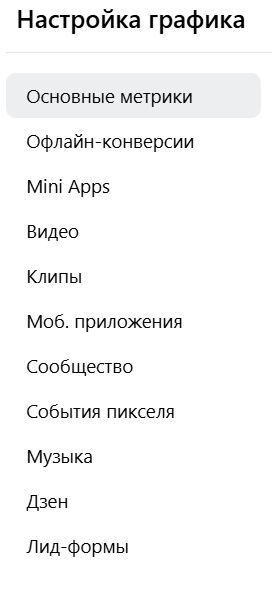
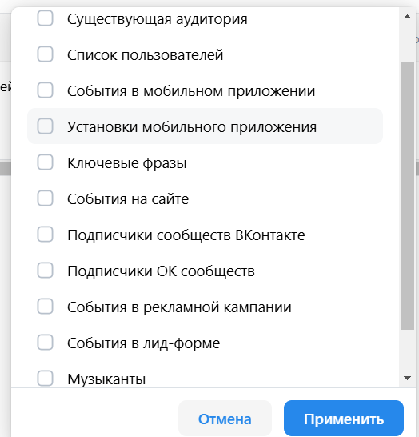

<h2>Обзор</h2>
<ul>
    <li>
        Всегда
        <ol>
            <li>Обзор. Полезные материалы. При нажатом переключателе в положении "Кейсы" в разделе отображаются кейсы.</li>
            <li>Обзор. Полезные материалы. При нажатом переключателе в положении "Новости" в разделе отображаются новости.</li>
        </ol>
    </li>
    <li>
        При отсуствии кампаний
        <ol>
            <li>Обзор. При нажатии кнопки "Создать вручную" происходит редирект на создание кампании.</li>
            <li>Обзор. При нажатии на кнопку "Открыть VK ADBloger" происходит редирект на [https://adblogger.vk.com/](https://adblogger.vk.com/)</li>
        </ol>
    </li>
    <li>
        При наличии кампаний
        <ol>
            <li>Обзор. Overview кампаний. При клике по ссылке "Создать кампанию" или по категориям кампаний (Транслируются, Не транслируются, На модерации, Отклоненные) происходит переход на страницу кампаний.</li>
            <li>Обзор. Overview бюджета. При клике по ссылке "Пополнить бюджет" показывается попап пополнения бюджета.</li>
            <li>Обзор. Overview бюджета. Можно менять период, за который отображаются расходы (Сегодня, Вчера, 3 дня и др.)</li>
            <li>Обзор. Раздел AdBloger. При нажатии на кнопку "Открыть VK ADBloger" происходит редирект на [https://adblogger.vk.com/](https://adblogger.vk.com/)</li>
            <li>Обзор. Раздел "AdBloger". Можно закрыть рекламу для блогеров по нажатию на крестик.</li>
            <li>Обзор. Раздел "Лимит объявлений". При нажатии Подробнее происходит редирект на [документацию](https://ads.vk.com/help/articles/ad_limits)</li>
            <li>Обзор. Избранное. При нажатии кнопки "Выбрать кампании" открывается попап добавления кампании в Избранное.</li>
            <li>Обзор. Попап Избранное. Можно добавить существующие кампании в избранное.</li>
            <li>Обзор. Избранное. Можно отображать на графиках метрики из разделов на рисунке </li>
        </ol>
    </li>
</ul>

<h2>Кампании</h2>
<ol>
    <li>
        Фильтр
        <ul>
            <li>При нажатии кнопки "Фильтр" открывается попап фильтров.</li>
            <li>При нажатии кнопки "Сохранить" открывается попап сохранения фильтра</li>
            <li>При нажатии кнопки "Очистить" все фильтры сбрасываются.</li>
            <li>При вводе текста в строку поиска кампании фильтруются по названию</li>
        </ul>
    </li>
    <li>
        Попап фильтров
        <ul>
            <li>При нажатии кнопки "Отмена" попап закрывается.</li>
            <li>При нажатии "Выбрать все" применяются все фильтры из раздела.</li>
            <li>При выборе непустого множества фильтров появляется кнопка "Сбросить все" и надпись "Сбросить", пропадает надпись "Выбрать все"</li>
            <li>При нажатии "Сбросить" фильтры текущего раздела сбрасываются</li>
            <li>При нажатии "Сбросить все" все фильтры сбрасываются</li>
            <li>При нажатии "Применить" отображаются только кампании, подходящие под выбранные фильтры</li>
            <li>При нажатии на вкладку "Сохраненные" отображаются сохраненные фильтры</li>
            <li>При нажатии на фильтр на вкладке "Сохраненные" он применяется</li>
        </ul>
    </li>
    <li>
        Попап сохранения фильтра
        <ul>
            <li>При нажатии кнопки "Отмена" попап закрывается.</li>
            <li>При нажатии кнопки "Сохранить" с пустым именем появляется надпись "Введите название фильтра"</li>
            <li>При нажатии кнопки "Сохранить" с неуникальным именем появляется надпись "This component already exists"</li>
            <li>При нажатии кнопки "Сохранить" и непустом уникальном названии фильтр появляется во вкладке "Сохраненные" попапа фильтров.</li>
        </ul>
    </li>
    <li>
        Выбор разделов
        <ul>
            <li>При выборе в выпадающем списке "Все кампании" отображаются все кампании.</li>
            <li>При выборе в выпадающем списке "Избранное" отображается раздел Избранное.</li>
            <li>При выборе в выпадающем списке "Черновики" отображается раздел Черновики.</li>
            <li>При выборе в выпадающем списке названия папки отображается содержимое папки</li>
            <li>При нажатии иконки ручки на папке открывается попап редактирования папки</li>
            <li>При выборе в выпадающем списке "Создать папку" отображается попап создания новой папки</li>
        </ul>
    </li>
    <li>
        Попап создания папки
        <ul>
            <li>При создании папки с неуникальным названием отображается надпись "Выберите другое имя — это уже занято другой папкой"</li>
            <li>При нажатии "Добавить кампании в папку" отображаются кампании и строка поиска по ним</li>
            <li>При добавлении кампании в папку она появляется в списке</li>
            <li>При добавлении кампании в папку она появляется в списке</li>
            <li>При создании папки она появляется в выпадающем меню разделов</li>
        </ul>
    </li>
    <li>
        Попап редактирования папки
        <ul>
            <li>При изменении имени папки на неуникальное отображается надпись "Выберите другое имя — это уже занято другой папкой"</li>
            <li>При нажатии "Удалить папку" открывается попап подтверждения</li>
            <li>При нажатии "Удалить" в попапе подтверждения папка удаляется</li>
            <li>При нажатии "Отмена" в попапе подтверждения папка не удаляется</li>
            <li>При нажатии "Отмена" в попапе редактирования папка не изменяется</li>
            <li>При нажатии "Сохранить" в попапе редактирования изменения сохраняются</li>
        </ul>
    </li>
    <li>
        Создание кампании. Старт.
        <li>
            <ul>
                <li>При нажатии кнопки "Создать" в разделе "Кампании" происходит редирект на страницу создания кампании</li>
                <li>Можно изменить имя кампании, нажав на иконку ручки</li>
                <li>При нажатии на иконку галочки происходит сохранение измененного имени кампании</li>
                <li>При нажатии на пункты меню "Целевые действия" и "Узнаваемость и охват" отображаются соответствующие категории</li>
                <li>Пока не выбран ни одна категория из списков "Целевые действия" и "Узнаваемость и охват", кнопка "Продолжить" отключена</li>
                <li>При наведении на иконку многоточия отображается выпадающее меню с пунктом "Скопировать существующую"</li>
                <li>При нажатии на пункт меню "Скопировать существующую" открывается страница выбора существующих кампаний</li> 
                <li>При нажатии на кнопку "Отменить копирование" на странице выбора существующих кампаний страница закрывается</li>
                <li>При выборе существующей кампании на странице выбора существующих кампаний происходит переход на первый шаг создания кампании (Настройка кампании), все данные на всех шагах скопированы из выбранной кампании</li>
            </ul>
        </li>
    </li>
    <li>
        Создание кампании. Общее.
        <li>
            <ul>
                <li>При нажатии кнопки Продолжить и незаполненном бюджете - сообщение об ошибке, перехода не происходит</li>
                <li>При нажатии кнопки Продолжить и бюджетом < 100р - сообщение об ошибке, перехода не происходит</li>
                <li>При заполненном названии и бюджете >100р нажатие Продолжить переводит пользователя на шаг Группы объявлений создания кампании</li>
            </ul>
        </li>
    </li>
    <li>
        Создание кампании. Объект рекламы - сайты.
        <li>
            <ul>
                <li>При нажатии кнопки Продолжить и незаполненном доменном имени сайта - сообщение об ошибке, перехода не происходит</li>
            </ul>
        </li>
    </li>
    <li>
        Создание кампании. Объект рекламы - каталог товаров.
        <li>
            <ul>
                <li>В выпадающем списке выбора каталогов отображаются добавленные каталоги и пункт "Создать каталог"</li>
                <li>При нажатии на пункт "Создать каталог" открывается форма создания каталога</li>
                <li>При нажатии в форме создания каталога на крестик она закрывается</li> 
                <li>Создание каталога из фида или сообщества. При вводе в инпут ссылки на сообщество текста, не являющегося URL, отображается ошибка "Невалидный url"<li>     
                <li>Создание каталога из фида или сообщества. При вводе в инпут ссылки на сообщество, в котором нет товаров, отображается ошибка "Укажите ссылку на ваше сообщество ВКонтакте с товарами или услугами"</li>    
                <li>Создание каталога из фида или сообщества. До ввода в инпут валидного url кнопка "Создать каталог" заблокирована</li>   
                <li>Создание каталога из фида или сообщества. При нажатии в форме создания каталога на кнопку "Отмена" она закрывается</li> 
                <li>Создание каталога вручную. При загрузке файла фида товары добавляются автоматически.</li>
            </ul>
        </li>
    </li>
    <li>
        Создание кампании. Объект рекламы - мобильное приложение.
        <li>
            <ul>
                <li>При нажатии выпадающего списка Выбрать приложение появляется поле Привязать новое приложение</li>
                <li>При нажатии Привязать новое приложение появляется попап привязки с инпутом ссылки на приложение</li>
                <li>При нажатии Привязать новое приложение появляется попап привязки с инпутом ссылки на приложение</li>
                <li>При вводе в инпут несуществующей ссылки на приложение появляется надпись "Введите корректную ссылку на приложение"</li>   
                <li>До ввода текста формата URL в инпут кнопка Добавить заблокирована</li>               
            </ul>
        </li>
    </li>
    <li>
        Создание кампании. Объект рекламы - сообщество и профиль.
        <li>
            <ul>
                <li>В поле Объект рекламы предлагаются профиль и сообщества авторизованного пользователя ВК</li>
            </ul>
        </li>
    </li>
    <li>
        Создание кампании. Объект рекламы - группа и профиль OK.
        <li>
            <ul>
                <li>При вводе названия выполняется поиск по группам и профилям OK</li>
            </ul>
        </li>
    </li>
    <li>
        Создание кампании. Объект рекламы - Дзен.
        <li>
            <ul>
                <li>При нажатии кнопки Перейти в Студию происходит переход в раздел Продвижение в</li>
            </ul>
        </li>
    </li>
    <li>
        Создание кампании. Объект рекламы - лид-формы и опросы.
        <li>
            <ul>
                <li>Лид-формы. Форма создания лид-формы. При отсутствии ввода в полях "Название", "Логотип", "Название компании", "Заголовок", "Описание формы" и нажатии кнопки "Продолжить" отображаются сообщения об ошибках</li>
                <li>Лид-формы. Форма создания лид-формы. При заполненных полях "Название", "Логотип", "Название компании", "Заголовок", "Описание формы" и нажатии кнопки "Продолжить" происходит переход к шагу "Вопросы"</li>
                <li>Лид-формы. Форма создания лид-формы. Невозможно добавить вопрос с пустыми полями "Вопрос" и пустымии ответами</li>
                <li>Лид-формы. Форма создания лид-формы. При непустых полях каждого вопроса и нажатии кнопки "Продолжить" происходит переход к шагу "Результат"</li>
                <li>Лид-формы. Форма создания лид-формы. Нельзя ввести пустой заголовок на шаге "Результаты"</li>
                <li>Лид-формы. Форма создания лид-формы. При непустом поле "Заголовок" и нажатии кнопки "Продолжить" происходит переход к шагу "Настройки"</li>
                <li>Лид-формы. Форма создания лид-формы. На шаге "Настройки" невльзя нажать кнопку "Сохранить" при пустых полях "ФИО" и "Адрес регистрации"</li>
                <li>Лид-формы. Форма создания лид-формы. При нажатии "Сохранить" и заполненных полях "ФИО" и "Адрес регистрации" лид-форма появляется в списке лид-форм</li>
                <li>Опросы. При пустом поле количества респондентов кнопка "Продолжить" заблокирована</li>
                <li>Опросы. Форма создания опроса. При отсутствии ввода в полях "Название", "Логотип", "Название компании", "Заголовок", "Описание" и нажатии кнопки "Вопросы" отображаются сообщения об ошибках</li>
                <li>Опросы. Форма создания опроса. При отсутствии ввода в полях "Текст вопроса" или "Введите ответ" любого вопроса нажатие кнопки "Результат" приводит к появлению собощений об ошибках</li>
                <li>Опросы. Форма создания опроса. При заполненных полях вопроса и нажатии кнопки "Результат" происходит переход к шагу "Результат"</li>
                <li>Опросы. Форма создания опроса. При отсутствии ввода в полях "Заголовок" или "Описание" шага "Результат" нажатие кнопки "Запустить опрос" приводит к появлению собощений об ошибках</li>
                <li>Опросы. Форма создания опроса.При заполненных полях "Заголовок" или "Описание" шага "Результат" нажатие кнопки "Запустить опрос" приводит к сохранению формы опроса</li>
                <li></li>
            </ul>
        </li>
    </li>
    <li>
        Создание кампании. Объект рекламы - VK Mini Apps и игры.
        <li>
            <ul>
                <li>При вводе некорректной ссылки на VK Mini App отображается надпись "Приложение не найдено"</li>
            </ul>
        </li>
    </li>
    <li>
        Создание кампании. Объект рекламы - музыка.
        <li>
            <ul>
                <li>В поле Объект рекламы предлагаются профиль и сообщества авторизованного пользователя ВК</li>
            </ul>
        </li>
    </li>
    <li>
        Создание кампании. Объект рекламы - Видео и трансляции.
        <li>
            <ul>
                <li>В поле Объект рекламы предлагаются профиль и сообщества авторизованного пользователя ВК</li>
            </ul>
        </li>
    </li>
    <li>
        Создание кампании. Группы объявлений
        <li>
            <ul>
                <li>При вводе региона показа текстом автоматически предлагаются подсказки</li>
                <li>При указании региона показа на карте локации добавляются в виде геометок с настраиваемым радиусом</li>
                <li>При отсутствии выбранных регионов показа и нажатии кнопки "Продолжить" отображается сообщение об ошибке</li>
                <li>Нельзя убрать оба типа устройства из аудитории - Мобильные и Десктопные</li>
            </ul>
        </li>
    </li>
    <li>
        Создание кампании. Объявления
        <li>
            <ul>
                <li>При отсутствии ввода в полях "Логотип", "Заголовок", "Короткое описание", "Ссылка на сайт", "Надпись на кнопке" и нажатии кнопки "Продолжить" отображаются сообщения об ошибках</li>
                <li>Если выбрано место для размещения медиафайлов и не выбрано соответствующее количество медиа-файлов, отображается сообщение об ошибке</li>
                <li>При заполненных полях "Логотип", "Заголовок", "Короткое описание", "Ссылка на сайт", "Надпись на кнопке" и выбранных медиа-файлах нажатие кнопки "Опубликовать" приводит к добавлению кампании в список кампаний</li>
            </ul>
        </li>
    </li>
    <li>
        Список кампаний
        <li>
            <ul>
                <li>Если не выбрано ни одной кампании, выпадающее меню "Действия" заблокировано</li>
                <li>Если выбрана одна кампания, доступны действия "Остановить", "Редактировать", "Удалить", "Добавить в папку"</li>
                <li>Если выбрано более одной кампанией, доступны действия "Остановить", "Редактировать", "Удалить", "Добавить в папку", "Сравнить кампании"</li>
                <li>При выборе действия "Остановить" выбранные кампании переходят в статус "Остановлена"</li>
                <li>Если выбрана одна кампания, то при выборе действия "Редактировать" открывается форма редактирования кампании</li>
                <li>Если выбрано более одной кампании, то при выборе действия "Редактировать" открывается форма массового редактирования кампаний</li>
                <li>Если выбрано более одной кампании, то при выборе действия "Сравнить кампании" выбранные кампании добавляются в группу сравнения</li>
            </ul>
        </li>
    </li>
    <li>
        Список групп
        <li>
            <ul>
                <li>Если не выбрано ни одной группы, выпадающее меню "Действия" заблокировано</li>
                <li>Если выбрана одна группа, доступны действия "Остановить", "Редактировать", "Удалить"</li>
                <li>Если выбрано более одной группы, доступны действия "Остановить", "Редактировать", "Удалить", "Сравнить группы"</li>
                <li>При выборе действия "Остановить" выбранные группы переходят в статус "Остановлена"</li>
                <li>Если выбрана одна группа, то при выборе действия "Редактировать" открывается форма редактирования группы</li>
                <li>Если выбрано более одной группы, то при выборе действия "Редактировать" открывается форма массового редактирования групп</li>
                <li>Если выбрано более одной группы, то при выборе действия "Сравнить кампании" выбранные кампании добавляются в группу сравнения</li>
            </ul>
        </li>
    </li>
    <li>
        Список объявлений
        <li>
            <ul>
                <li>Если не выбрано ни одного объявления, выпадающее меню "Действия" заблокировано</li>
                <li>Если выбрана одно объявление, доступны действия "Остановить", "Редактировать", "Удалить"</li>
                <li>Если выбрано более одного объявления, доступны действия "Остановить", "Редактировать", "Удалить", "Сравнить объявления"</li>
                <li>При выборе действия "Остановить" выбранные объявления переходят в статус "Остановлено"</li>
                <li>Если выбрано одно объявление, то при выборе действия "Редактировать" открывается форма редактирования объявления</li>
                <li>Если выбрано более одного объявления, то при выборе действия "Редактировать" открывается форма массового редактирования объявлений</li>
                <li>Если выбрано более одного объявления, то при выборе действия "Сравнить объявления" выбранные объявления добавляются в группу сравнения</li>
            </ul>
        </li>
    </li>
</ol>

<h2>Аудитории</h2>
<ol>
    <li>
        Поделиться аудиторией
        <ul>
            <li>При нажатии иконки "Поделиться" открывается попап выбора ключа шейринга (Публичный или Приватный).</li>
            <li>Нельзя создать Приватный ключ с пустым ID кабинета</li>
            <li>При создании Публичного ключа открывается попап с текстом созданного ключа</li>
            <li>При нажатии кнопки Закрыть в попапе с текстом созданного ключа попап закрывается</li>
            <li>При нажатии кнопки "Удалить" открывается попап подтверждения удаления</li>
            <li>При нажатии кнопки "Отмена" в попапе подтверждения удаления аудитория не удаляется</li>
            <li>При нажатии кнопки "Удалить" в попапе подтверждения удаления аудитория удаляется</li>
        </ul>
    </li>
    <li>
        Список Аудиторий
        <ul>
            <li>Фильтр. При выборе категорий из списка отображаются только аудитории, относящиеся к этим категориям </li>
            <li>Фильтр. При нажатии кнопки "Сбросить" при выбранных категориях фильтрации чекбоксы устанавливаются на "не выбрано"</li>
            <li>Поиск. При вводе в строку поиска текста аудитории фильтруются по названию</li>
            <li>Если ни одна аудитория не выбрана, кнопки "Поделиться" и "Удалить" отключены</li>
        </ul>
    </li>
    <li>
        Список Списков пользователей
        <ul>
            <li>Если ни один список не выбран, кнопка "Поделиться" отключена</li>
        </ul>
    </li>
    <li>
        Аудитории. Создание.
        <ul>
            <li>При нажатии кнопки "Создать аудиторию" открывается форма создания аудитории</li>
            <li>При нажатии кнопки "Добавить источник" открывается список видов источников</li>
            <li>При выборе вида источника "Существующие аудитории" в выпадающем списке можно выбрать добавленные аудитории</li>
            <li>При выборе вида источника "Список пользователей" в выпадающем списке можно выбрать добавленные списки пользователей</li>
            <li>При выборе вида источника "Ключевые фразы" при вводе ключевых фраз появляется подсказка "Показать n похожих" </li>
            <li>При выборе вида источника "События в рекламной кампании" в выпадающем списке можно выбрать рекламную кампанию из списка существующих</li>
            <li>При выборе вида источника "События в лид-форме" в выпадающем списке можно выбрать лид-форму из списка существующих</li>
            <li>При выборе вида источника "События на сайте" в выпадающем списке можно выбрать пиксель из списка существующих</li>
            <li>При выборе вида источника "События сообществ" с помощью строки поиска можно по названию найти сообщество в ВК и ОК</li>
            <li>При выборе вида источника "События сообществ" и наличии выбранного сообщества нажатие кнопки "Удалить все" приводит к очистке списка выбранных сообществ</li>
            <li>При выборе вида источника "Музыканты" с помощью строки поиска можно найти музыканта из VK Music</li>
            <li>При выборе вида источника "Пользователи VK Mini Apps и игр ВКонтакте" с помощью строки поиска можно добавить миниапп из VK Mini Apps</li>
        </ul>
    </li>
    <li>
        Список пользователей. Создание.
        <ul>
            <li>Нельзя добавить список пользователей, если инпут названия или dropdown типа списка пустые</li>
            <li>В существующий список можно добавить пользователей только из файлов того же типа (например, Email)</li>
            <li>Если ввести информацию и нажать на кнопку "Отмена", появляется попап подтверждения сброса формы</li>
            <li>Из существующего списка можно исключить пользователей только с помощью файлов того же типа</li>
            <li>Нельзя добавлять файлы форматов, отличающихся от txt и csv</li>
            <li>При добавлении файла, не отвечающего [требованиям](https://ads.vk.com/help/articles/user_lists#requirements), отображаются сообщения об ошибках при парсинге файла</li>
            <li>При добавлении файла, отвечающего [требованиям](https://ads.vk.com/help/articles/user_lists#requirements), происходит добавление списка пользователей</li>
        </ul>
    </li>
    <li>
        Офлайн-конверсии. Создание.
        <ul>
            <li>Нельзя добавлять файлы форматов, отличающихся от txt и csv</li>
            <li>При добавлении файла, не отвечающего [требованиям](https://ads.vk.com/help/articles/user_lists#requirements), отображаются сообщения об ошибках при парсинге файла</li>
            <li>При добавлении файла, отвечающего [требованиям](https://ads.vk.com/help/articles/user_lists#requirements), происходит добавление списка офлайн-конверсий</li>
        </ul>
    </li>
</ol>

<h2>Обучение</h2>
<ol>
    <li>
        Попап выбора кейса
        <ul>
            <li>При нажатии кнопки "Попробовать позже" попап закрывается.</li>
            <li>При нажатии кнопки-крестика попап закрывается.</li>
            <li>При нажатии на любой кейс отображаются три варианта - Настроить с подсказками, Видеоурок и Курс на обучающей платформе.</li>
        </ul>
    </li>
    <li>
        Попап выбора вида обучения
        <ul>
            <li>При нажатии на Видеоурок открывается плеер с соответствующим видео.</li>
            <li>При нажатии на  Курс на обучающей платформе происходит редирект на соответствующий курс</li>
            <li>При нажатии на Настроить с подсказками происходит редирект на страницу создания кампании, отображается подсказка "Нажмите, чтобы начать настройку новой рекламной кампании" около кнопки "Создать".</li>
        </ul>
    </li>
    <li>
        Обучение созданию кампании
        <ul>
            <li>При нажатии на крестик в сообщении с подсказками по обучению подсказки перестают отображаться.</li>
            <li>При нажатии кнопки "Создать" присходит редирект на страницу создания кампании, отображается попап "Выбор объекта и цели рекламы".</li>
            <li>При нажатии кнопки "Далее" на попапе "Выбор объекта и цели рекламы" отображается подсказка "Объект рекламы".</li>
            <li>При нажатии на объект рекламы появляется подсказка "Рекламируемое сообщество".</li>
            <li>При выборе рекламируемого объекта и нажатии кнопки "Далее" на подсказке "Рекламируемое сообщество" появляется подсказка "Даты проведения".</li>
            <li>При нажатии кнопки "Назад" на подсказке "Даты проведения" отображается подсказка "Рекламируемое сообщество".</li>
            <li>При нажатии кнопки "Назад" на подсказке "Даты проведения" отображается подсказка "Рекламируемое сообщество".</li>
            <li>При нажатии кнопки "Далее" на подсказке "Даты проведения" отображается подсказка "Целевое действие".</li>
            <li>При нажатии кнопки "Назад" на подсказке "Целевое действие" отображается подсказка "Даты проведения".</li>
            <li>При нажатии кнопки "Далее" на подсказке "Целевое действие" отображается подсказка "Оптимизация бюджета кампании".</li>
            <li>При нажатии кнопки "Назад" на подсказке "Оптимизация бюджета кампании" отображается подсказка "Целевое действие".</li>
            <li>При нажатии кнопки "Далее" на подсказке "Оптимизация бюджета кампании" отображается подсказка "Стратегия ставок кампании".</li>
            <li>При нажатии кнопки "Назад" на подсказке "Стратегия ставок кампании" отображается подсказка "Оптимизация бюджета кампании".</li>
            <li>При нажатии кнопки "Далее" на подсказке "Стратегия ставок кампании" отображается подсказка "Бюджет".</li>
            <li>При нажатии кнопки "Назад" на подсказке "Бюджет" отображается подсказка "Стратегия ставок кампании".</li>
            <li>При нажатии кнопки "Далее" на подсказке "Бюджет" отображается подсказка "Кампания настроена".</li>
            <li>При нажатии кнопки "Продолжить" снизу от подсказки "Кампания настроена" отображается попап "Настройка целевой аудитории".</li>
            <li>При нажатии кнопки "Далее" на попапе "Настройка целевой аудитории" отображается подсказка "Расписание показа".</li>
            <li>При нажатии кнопки "Назад" на подсказке "Расписание показа" отображается попап "Настройка целевой аудитории".</li>
            <li>При нажатии кнопки "Далее" на подсказке "Расписание показа" отображается подсказка "Регионы показа".</li>
            <li>При нажатии кнопки "Назад" на подсказке "Регионы показа" отображается подсказка "Расписание показа".</li>
            <li>При отсуствия выбранного региона кнопка "Далее" на подсказке "Регионы показа" отключена.</li>
            <li>При выборе региона и нажатии кнопки "Далее" на подсказке "Регионы показа" отображается подсказка "Параметры аудитории".</li>
            <li>При нажатии кнопки "Назад" на подсказке "Параметры аудитории" отображается подсказка "Регионы показа".</li>
            <li>При нажатии кнопки "Далее" на подсказке "Параметры аудитории" отображается подсказка "Группа объявлений готова".</li>
            <li>При нажатии кнопки "Продолжить" снизу от подсказки "Группа объявлений готова" отображается попап "Оформление объявления".</li>
            <li>При нажатии кнопки "Далее" на попапе "Оформление объявления" отображается подсказка "Логотип".</li>
            <li>При нажатии кнопки "Назад" на подсказке "Логотип" отображается попап "Оформление объявления".</li>
            <li>При отсуствия выбранного логотипа кнопка "Далее" на подсказке "Логотип" отключена.</li>
            <li>При выборе логотипа и нажатии кнопки "Далее" на подсказке "Логотип" отображается подсказка "Описание".</li>
            <li>При нажатии кнопки "Назад" на подсказке "Описание" отображается подсказка "Логотип".</li>
            <li>При отсуствия выбранного описания кнопка "Далее" на подсказке "Описание" отключена.</li>
            <li>При вводе описания и нажатии кнопки "Далее" на подсказке "Описание" отображается подсказка "Медиафайлы".</li>
            <li>При нажатии кнопки "Назад" на подсказке "Медиафайлы" отображается попап "Описание".</li>
            <li>При отсуствия выбранных файлов кнопка "Далее" на подсказке "Медиафайлы" отключена.</li>
            <li>При выборе медиафайлов и нажатии кнопки "Далее" на подсказке "Медиафайлы" отображается подсказка "Юридическая информация".</li>
            <li>При нажатии кнопки "Назад" на подсказке "Юридическая информация" отображается подсказка "Медиафайлы".</li>
            <li>При отсуствия введенных символов кнопка "Далее" на подсказке "Юридическая информация" отключена.</li>
            <li>При наличии введенных символов и нажатии кнопки "Далее" на подсказке "Юридическая информация" отображается подсказка "Предпросмотр".</li>
            <li>При нажатии кнопки "Назад" на подсказке "Предпросмотр" отображается подсказка "Юридическая информация".</li>
            <li>При нажатии кнопки "Далее" на подсказке "Предпросмотр" отображается подсказка "Объявление оформлено".</li>
            <li>При нажатии кнопки "Опубликовать" под подсказкой "Объявление оформлено" обучение завершается.</li>
        </ul>
    </li>
</ol>
