## Landing

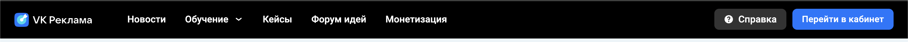

#### Перейти в кабинет

Если пользователь не авторизован на https://ads.vk.com/, при нажатии на кнопку "Перейти в кабинет" - перенаправление на страницу авторизации VK ID (URL начинается с https://id.vk.com/auth).

Если пользователь авторизован на https://ads.vk.com/, при нажатии на кнопку "Перейти в кабинет" - перенаправление в личный кабинет.

## Регистрация

При попытке войти в личный кабинет (https://ads.vk.com/hq) пользователь будет перенаправлен на страницу авторизации VK ID (так как это отдельный сервис, в данном чеклисте для него проверок нет)

После авторизации через VK ID отображается модальное окно "Выберите профиль бизнеса", в котором отображаются все доступные профили и кнопка "Создать профиль".

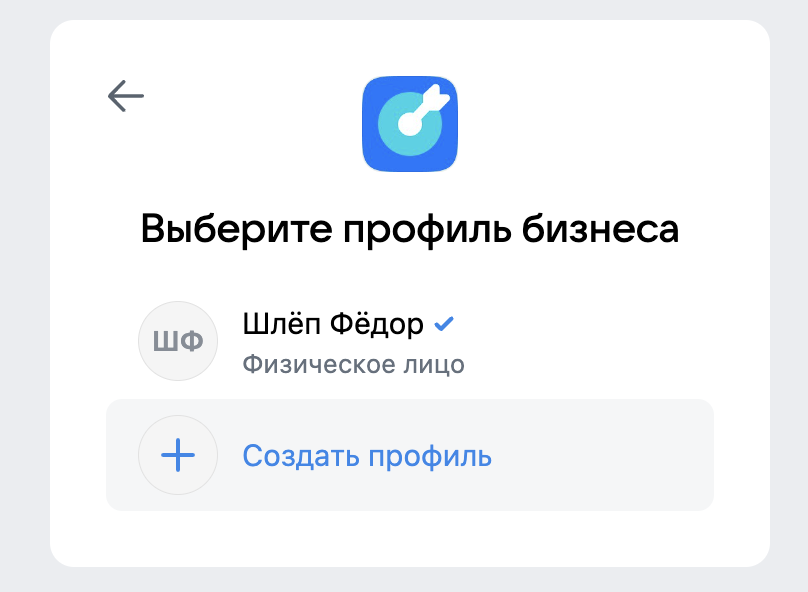

### Регистрация. Выберите профиль бизнеса

При нажатии кнопки "Создать профиль" пользователь будет перенаправлен на страницу регистрации (https://ads.vk.com/hq/registration).

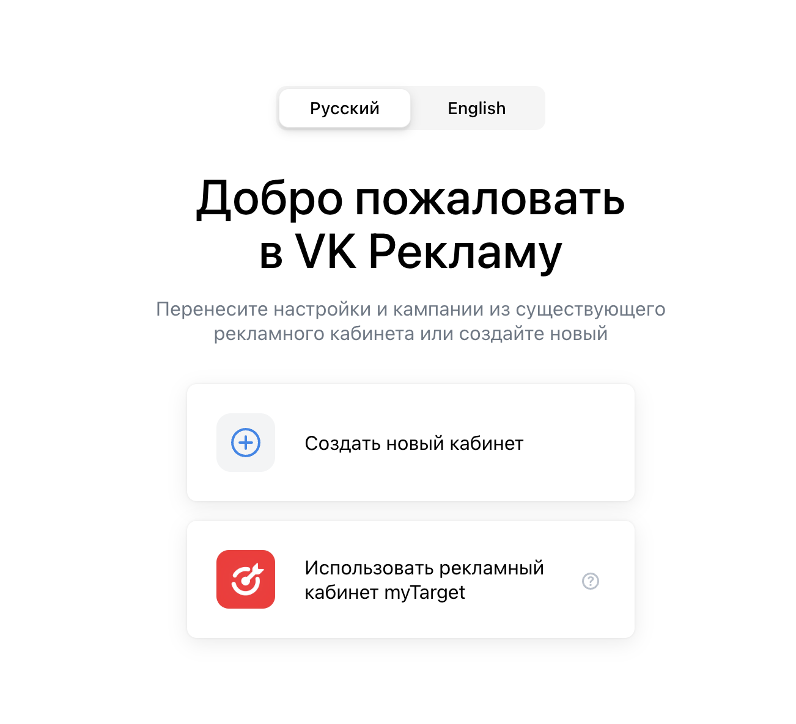

### Регистрация. Добро пожаловать в VK Рекламу

#### Переключатель языка

- При нажатии на переключатель языка (Русский) язык страницы меняется на Русский.

  > - титул страницы меняется на "Регистрация нового кабинета"
  >
  >   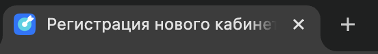

- При нажатии на переключатель языка (Английский) язык страницы меняется на Английский.

  > - титул страницы меняется на "Registration of a new account"
  >
  >   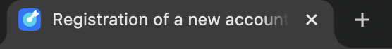

#### Создание кабинета

При нажатии на кнопку "Создать новый кабинет", отображается форма "Регистрация кабинета" и кнопка "Создать кабинет".

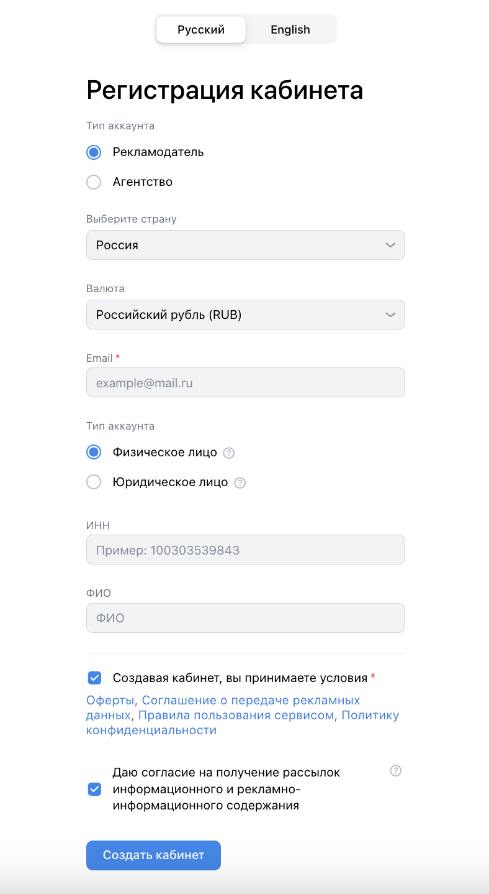

#### Форма "Регистрация кабинета"

- Радио-кнопки "Тип аккаунта" [1] (обязательное поле):

  > "Рекламодатель" или "Агентство".

  > При нажатии на кнопку "Рекламодатель" она становится выбранной, другие кнопки в этом блоке перестают быть выбранными.

  > При нажатии на кнопку "Агентство" она становится выбранной, другие кнопки в этом блоке перестают быть выбранными.

- Выпадающий список "Выберите страну" (обязательное поле).
  > По умолчанию выбрана Россия
- Выпадающий список "Валюта" (обязательное поле).
  > По умолчанию выбран Российский рубль (RUB)
- Email

  > Email валидный, если:
  >
  > - Содержит ровно один "@" и минимум одну "." после него.
  > - До "@" допускаются латинские буквы (без спецсимволов), ".", "-", "\_", цифры.
  > - Между "@" и последней точкой допускаются буквы кириллицы/латиницы, ".", "-", "\_", цифры.
  > - После последней точки — только буквы кириллицы/латиницы.
  > - После каждой "." — минимум 2 символа.

  > Если Email невалиден, после снятия фокуса с поля, под ним отображается ошибка "Некорректный email адрес".
  >
  > - Пример ввода
  >
  >   ```
  >   roflanpotsan@...
  >   ```

  > Если Email пустой (не введен хотя бы 1 символ), отображается плейсхолдер "example@mail.ru".

  > Если оставить Email незаполненным, после снятия фокуса с поля, под ним отображается ошибка "Обязательное поле".
  >
  > - Пример ввода
  >
  >   ```
  >
  >   ```

  > Если Email валидный, то после снятия фокуса с поля, ошибок не будет.
  >
  > - Пример ввода
  >
  >   ```
  >   roflanpotsan@ya.ru
  >   ```

- Радио-кнопки "Тип аккаунта" [2] (обязательное поле):

  > "Физическое лицо" или "Юридическое лицо" (если в "Тип аккаунта" [1] выбран "Рекламодатель").
  >
  > - в этому случае "Тип аккаунта" [2] выбран по умолчанию ("Физическое лицо")

  > "Юридическое лицо" (если в "Тип аккаунта" [1] выбрано "Агентство").
  >
  > - в этом случаае "Тип аккаунта" [2] выбран по умолчанию ("Юридическое лицо")

  > При нажатии на кнопку "Физическое лицо" она становится выбранной, кнопка "Юридическое лицо" в этом блоке перестает быть выбранной.

  > При нажатии на кнопку "Юридическое лицо" она становится выбранной, кнопка "Физическое лицо" в этом блоке перестает быть выбранной.

- Если в "Тип аккаунта" [2] выбрано "Физическое лицо", появляются поля:

  > ИНН (необязательное поле)

  > ФИО (необязательное поле).

- ИНН

  > Для ввода доступны только цифры

  > Если поле ИНН пустое (не введен хотя бы один символ), то будет отображаться плейсхолдер: "Пример: 100303539843"

  > ИНН валидный, если:
  >
  > - Содержит ровно 12 символов, все цифры. И соответствует следующим критериям:
  >   - 1. младший разряд остатка от деления cуммы произведений цифр ИНН (с 1-й по 10-ю) на следующие коэффициенты — 7, 2, 4, 10, 3, 5, 9, 4, 6, 8 (т.е. 7 _ ИНН[1] + 2 _ ИНН[2] + ...) на 11 совпадает с 11 цифрой ИНН.
  >   - 2. младший разряд остатка от деления cуммы произведений цифр ИНН (с 1-й по 11-ю) на следующие коэффициенты — 3, 7, 2, 4, 10, 3, 5, 9, 4, 6, 8 (т.е. 3 _ ИНН[1] + 7 _ ИНН[2] + ...) на 11 совпадает с 12 цифрой ИНН.

  > Если поле ИНН содержит менее 12 символов, то под полем отображается ошибка "Напишите не меньше 12 символов".
  >
  > - Пример ввода
  >
  >   ```
  >   14504772754
  >   ```

  > Если поле ИНН содержит более 12 символов, то под полем отображается ошибка "Напишите текст не больше 12 символов".
  >
  > - Пример ввода
  >
  >   ```
  >   1450477275430
  >   ```

  > Если ИНН невалидный, то после нажатия кнопки "Создать кабинет", под полем будет отображаться ошибка "Некорректный ИНН"
  >
  > - Пример ввода
  >
  >   ```
  >   145047727542
  >   ```

  > Eсли поле ИНН оставить незаполненным, то ошибок не будет (поле необязательное).
  >
  > - Пример ввода
  >
  >   ```
  >
  >   ```

  > Если ИНН валидный, то ошибок не будет.
  >
  > - Пример ввода
  >
  >   ```
  >   145047727543
  >   ```

- ФИО

  > ФИО валидно, если содержит только кириллицу, дефис и пробел. При регистрации не проверяется количество подряд идущих дефисов и пробелов.

  > Если поле ФИО пустое (не введен хотя бы один символ), то будет отображаться плейсхолдер: "ФИО"

  > Если ФИО невалидно, под полем отображается ошибка "Некорректные символы. Разрешена только кириллица дефис и пробел".
  >
  > - Пример ввода
  >
  >   ```
  >   roflanpotsan
  >   ```

  > Если введено больше 60 символов, под полем отображается ошибка "Напишите текст не больше 60 символов"
  >
  > - Пример ввода
  >
  >   ```
  >   абвгдеабвгдеабвгдеабвгдеабвгдеабвгдеабвгдеабвгдеабвгдеабвгдеа
  >   ```

  > Eсли поле ФИО оставить незаполненным, то ошибок не будет (поле необязательное).
  >
  > - Пример ввода
  >
  >   ```
  >
  >   ```

  > Если ФИО валидно, то ошибок не будет.
  >
  > - Пример ввода
  >
  >   ```
  >   Рофлан    лицо---хехе
  >   ```

- Чекбокс об условиях оферты (отмечен по умолчанию) (Обязательное поле)
  > Если чекбокс оставить неотмеченным, под полем отображается ошибка "Обязательное поле".
- Чекбокс о согласии на рассылку (отмечен по умолчанию) (Необязательно поле)
  > Если чекбокс оставить неотмеченным, то ошибок не будет (поле необязательное)

#### Кнопка "Создать кабинет"

При нажатии на кнопку "Создать кабинет" происходит перенаправление на https://ads.vk.com/hq/overview.

#### Альтернативный flow регистрации

При нажатии на кнопку "Использовать рекламный кабинет myTarget" отображается переключатель (Рекламодателю/Агентству) и кнопка "Продолжить".

- При нажатии на переключатель (Рекламодателю) отображается информация для рекламодателей.

  > Отображается список возможностей, среди которых есть пункт с следующим заголовком и текстом:
  >
  > **Кампании**
  >
  > Сможете копировать нужные кампании из myTarget в новый кабинет

- При нажатии на переключатель (Агентству) отображается информация для агентств.

  > Отображается список возможностей, среди которых есть пункт с следующим заголовком и текстом:
  >
  > **Клиенты**
  >
  > Вы сможете работать с уже созданными клиентами и создавать новых

- При нажатии кнопки "Продолжить" происходит перенаправление на https://target.vk.ru/.

## Авторизация

При попытке войти в личный кабинет (https://ads.vk.com/hq) пользователь будет перенаправлен на страницу авторизации VK ID (URL начинается с https://id.vk.com/auth; так как это отдельный сервис, в данном чеклисте для него проверок нет)

После авторизации через VK ID отображается модальное окно "Выберите профиль бизнеса", в котором отображаются все доступные профили и кнопка "Создать профиль".


### Авторизация. Выберите профиль бизнеса

- При нажатии на существующий профиль происходит вход в систему (перенаправление https://ads.vk.com/hq/overview)

- При нажатии на кнопку "Создать профиль" происходит перенаправление на страницу регистрации (https://ads.vk.com/hq/registration)

## Настройки

При открытии настроек (https://ads.vk.com/hq/settings) пользователь попадает на вкладку "Общие".

При изменении какого-либо поля, появляются кнопки "Сохранить" и "Отменить".

При нажатии кнопки Сохранить

- Если нет ошибок, все изменения сохраняются (при перезагрузке страницы изменения остаются)
  > Если при нажатии кнопки сохранить у пользователя нет подключения к интернету, то появляется уведомление "Произошла сетевая ошибка. Попробуйте еще раз"

При нажатии кнопки Отменить

- Все несохраненные изменения сбрасываются (все поля на странице возвращаются в исходное состояние - до внесения изменений)

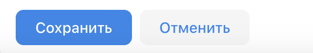

### Настройки. Header (Навигация)

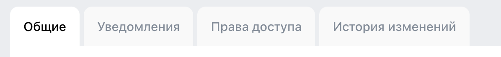

Всего в хедере 4 вкладки

- **Общие** (при нажатии - отображение общих настроек)
- **Уведомления** (при нажатии - отображание настроек уведомлений)
- **Права доступа** (при нажатии - отображение настроек прав доступа)
- **История изменений** (при нажатии - отображение истории изменений настроек)

### Настройки. Общие

#### Блок "Контакты"

- Поле "Телефон" (Необязательное поле)

  > Ограничение на длину ввода 14 символов.

  > Телефон валидный, если:
  >
  > - Содержит только цифры (минимум 11 цифр) и знак "+" (должен начинаться со знака "+").

  > Если поле "Телефон" невалидно, под полем отображается ошибка "Некорректный номер телефона".
  >
  > - Пример ввода
  >
  >   ```
  >   +123123
  >   ```

  > Если поле "Телефон" оставить незаполненным, то ошибок не будет (поле необязательное)
  >
  > - Пример ввода
  >
  >   ```
  >
  >   ```

  > Если телефон валидный, указанный телефон сохранится без ошибок.
  >
  > - Пример ввода
  >
  >   ```
  >   +123123123123
  >   ```

- Кнопка "Добавить email". При нажатии, появляется поле для ввода email.

- Поле email

  > Email валидный, если:
  >
  > - Содержит ровно один "@" и минимум одну "." после него.
  > - До "@" допускаются латинские буквы (без спецсимволов), ".", "-", "\_", цифры.
  > - Между "@" и последней точкой допускаются буквы кириллицы/латиницы, ".", "-", "\_", цифры.
  > - После последней точки — только буквы кириллицы/латиницы.
  > - После каждой "." — минимум 2 символа.

  > При нажатии кнопки "Сохранить", если email валидный, то:
  >
  > - Если email не совпадает ни с одним из уже добавленных, то он добавляется в список email адресов. Добавленный адрес добавляется в сообщение о необходимости подтвердить почту.
  >   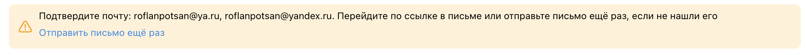
  >
  >   - Пример ввода
  >
  >     ```
  >     roflanpotsan@yandex.ru
  >     ```
  >
  > - Если email совпадает с основным, то под полем отображается ошибка "Данный адрес электронной почты дублирует основной Email адрес"
  >
  >   - Пример ввода
  >
  >     ```
  >     roflanpotsan@ya.ru
  >     ```
  >
  > - Если email совпадает с каким-либо другим, то под полем отображается ошибка "Данный Email является дубликатом одного из Email адресов выше"
  >
  >   - Пример ввода
  >
  >     ```
  >     roflanpotsan@yandex.ru
  >     ```

  > При нажатии кнопки "Сохранить":
  >
  > - Если Email невалиден, под полем отображается ошибка "Некорректный email адрес".
  >
  >   - Пример ввода
  >
  >     ```
  >     roflanpotsan@...
  >     ```
  >
  > - Если оставить Email незаполненным, под полем отображается ошибка "Обязательное поле".
  >
  >   - Пример ввода
  >
  >     ```
  >
  >     ```

#### Блок "Реквизиты"

- Если "Тип кабинета" - "Физическое лицо", отображаются поля:

  > ФИО (обязательное поле).

  > ИНН (обязательное поле)

  > **ИНН и ФИО сохранятся при нажатии кнопки сохранить только при условии, что оба этих поля заполнены и валидны.**

- ФИО

  > Ограничение на длину ввода 255 символов, проверка на длину как при регистрации отсутствует.

  > ФИО валидно, если содержит только кириллицу, дефис и пробел. Максимум один дефис/пробел подряд. Два дефиса не могут разделяться пробелом.

  > Если поле ФИО пустое (не введен хотя бы один символ), то будет отображаться плейсхолдер: "Введите ФИО"

  > **Для проверки поля ФИО необходимо, чтобы поле ИНН было валидно.**

  > При нажатии кнопки сохранить:
  >
  > - Если ФИО невалидно, под полем отображается ошибка "Некорректные символы. Разрешена только кириллица дефис и пробел".
  >
  >   - Пример ввода
  >
  >     ```
  >     Рофлан    лицо---хехе
  >     ```
  >
  > - Eсли поле ФИО оставить незаполненным, то под полем отображается ошибка "Обязательное поле".
  >
  >   - Пример ввода
  >
  >     ```
  >
  >     ```
  >
  > - Если поле ФИО валидно, то ошибок не будет, изменения сохранятся (при перезагрузке страницы изменения останутся).
  >
  >   - Пример ввода
  >
  >     ```
  >     Рофлан лицо-хехе
  >     ```

- ИНН

  > Если поле ИНН пустое (не введен хотя бы один символ), то будет отображаться плейсхолдер: "Введите ИНН физлица"

  > Ограничение на длину ввода 12 символов. В отличие от регистрации можно вводить любые символы, не только цифры.

  > ИНН валидный, если:
  >
  > - Содержит ровно 12 символов, все цифры. И соответствует следующим критериям:
  >   - 1. младший разряд остатка от деления cуммы произведений цифр ИНН (с 1-й по 10-ю) на следующие коэффициенты — 7, 2, 4, 10, 3, 5, 9, 4, 6, 8 (т.е. 7 _ ИНН[1] + 2 _ ИНН[2] + ...) на 11 совпадает с 11 цифрой ИНН.
  >   - 2. младший разряд остатка от деления cуммы произведений цифр ИНН (с 1-й по 11-ю) на следующие коэффициенты — 3, 7, 2, 4, 10, 3, 5, 9, 4, 6, 8 (т.е. 3 _ ИНН[1] + 7 _ ИНН[2] + ...) на 11 совпадает с 12 цифрой ИНН.

  > При нажатии кнопки сохранить:
  >
  > - Если поле ИНН содержит менее 12 символов, то под полем отображается ошибка "Длина ИНН должна быть 12 символов".
  >
  >   - Пример ввода
  >
  >     ```
  >     14504772754
  >     ```
  >
  > - Если ИНН невалидный, под полем отображается ошибка "Невалидный ИНН"
  >
  >   - Пример ввода
  >
  >     ```
  >     145047727542
  >     ```
  >
  > - Eсли поле ИНН оставить незаполненным, под полем отображается ошибка "Обязательное поле".
  >
  >   - Пример ввода
  >
  >     ```
  >
  >     ```
  >
  > - Если ИНН валидный, то ошибок не будет, изменения сохранятся (при перезагрузке страницы изменения останутся).
  >
  >   - Пример ввода
  >
  >     ```
  >     145047727543
  >     ```

#### Блок "Интерфейс"

- Поле "Название кабинета" (необязательное поле)

  > Для ввода доступны любые символы, валидация отсутствует

  > Ограничение на длину ввода 255 символов

  > Если поле "Название кабинета" пустое (не введен хотя бы один символ), то будет отображаться плейсхолдер: "Введите название кабинета"

  > При нажатии кнопки сохранить, сохраняется новое название кабинета (при перезагрузке страницы изменения останутся)

- Выпадающее меню "Язык интерфейса" (RU/EN) (обязательное поле)

  > По умолчанию выбран язык интерфейса, использованный при регистрации.

  > Если выбран язык (EN), при нажати кнопки сохранить, страница перезагружается, язык интерфейса меняется на английский.
  >
  > - титул страницы меняется на General
  >
  >   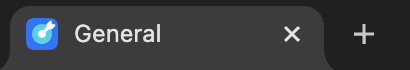

  > Если выбран язык (RU), при нажати кнопки сохранить, страница перезагружается, язык интерфейса меняется на русский.
  >
  > - титул страницы меняется на Общие
  >
  >   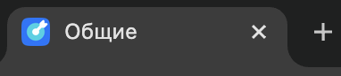

- Чекбокс "Распознавать горячие клавиши"

  > Значение сохраняется без нажатия кнопки "сохранить"
  > Если чекбокс отмечен, то при нажатии `ctrl + /` открывается список горячих клавиш (модальное окно)
  > 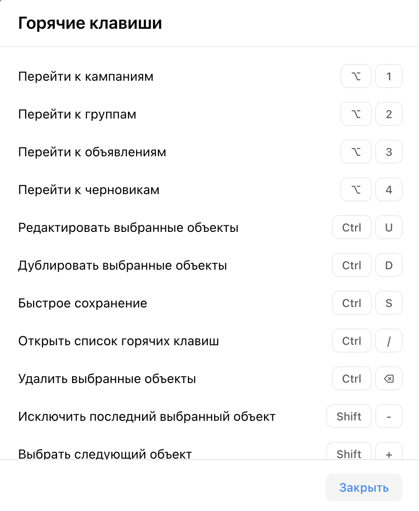
  >
  > - При нажатии кнопки "Закрыть" данное модальное окно закрывается
  >
  > Если чекбокс не отмечен, то при нажатии `ctrl + /` ничего не происходит

#### Блок "Связанные кабинеты"

- Кнопка "Привязать кабинет myTarget". При нажатии открывается модальное окно с кнопками "Отменить" и продолжить".
  - При нажатии кнопки "Отменить" модальное окно закрывается.
  - При нажатии кнопки "Продолжить" происходит перенаправление на https://target.vk.ru/.

#### Блок "Доступ к API"

- Ссылка "Подробнее о доступе". При нажатии - открытие в новой вкладке https://ads.vk.com/help/articles/help_api.

- Кнопка "Запросить доступ к API". При нажатии - открывается модальное окно:

  - ФИО ответственного лица (обязательное поле)

    > Если поле ФИО в блоке "Реквизиты" заполнено, то данное поле заполнено по умолчанию значением ФИО указанным в реквезитах.

    > Ограничение на длину ввода 255 символов, валидация отсутствует.
    >
    > - Пример ввода
    >   ```
    >   ---roflanpotsan---
    >   ```

  - Контактный телефон (обязательное поле)

    > Если поле Телефон в блоке "Реквизиты" заполнено, то данное поле заполнено по умолчанию значением телефона указанным в реквезитах.

    > Телефон валидный, если:
    >
    > - Содержит только цифры (минимум 11 цифр, максимум 14 цифр) и знак "+" (должен начинаться со знака "+").
    >   - Пример ввода
    >     ```
    >     +1231231231231
    >     ```

    > Если поле "Телефон" невалидно, под полем отображается ошибка "Некорректный формат. Пример: +71234567890".
    >
    > - Пример ввода
    >   ```
    >   +123
    >   ```

  - Кнопка Отмена
    > При нажатии закрывает модальное окно
  - Кнопка Запросить доступ

    > Неактивна, если не заполнено поле ФИО ответственного лица

    > Неактивна, если не заполнено поле Контактный телефон

    > При нажатии закрывает модальное окно, в данном блоке отображается информация о доступе к API
    > 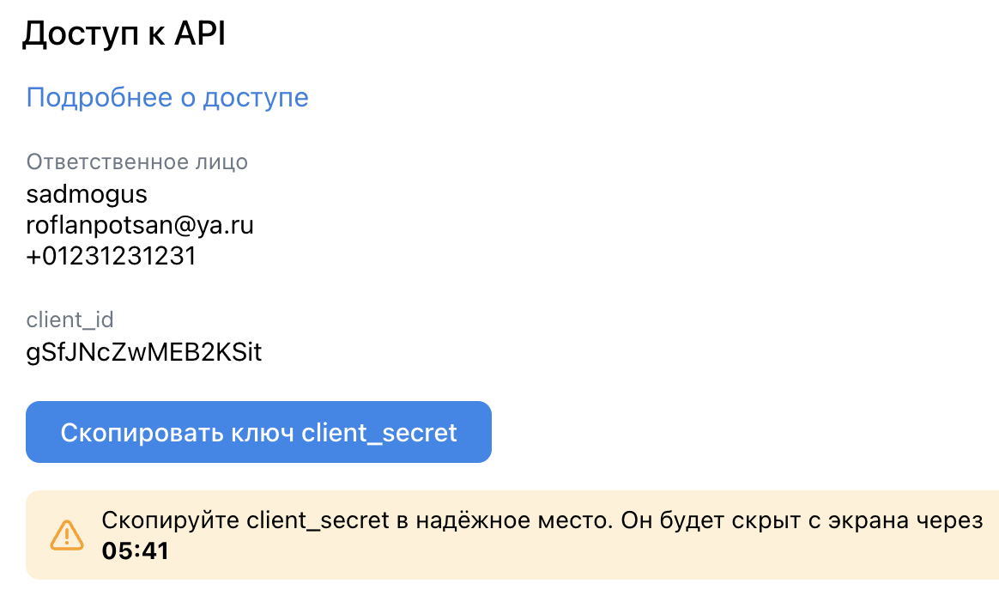
    >
    > - Информация об ответственном лице
    > - client_id
    > - Кнопка Скопировать ключ client_secret
    >   - При нажатии этой кнопки в буфер обмена копируется ключ client_secret
    >     - буфер обмена становится непустым (длина произвольная)
    >   - Данная кнопка активна в течение 10 минут после создания API ключа.
    >   - Под данной кнопкой отображается сообщение "Скопируйте client_secret в надёжное место. Он будет скрыт с экрана через {значение таймера}"
    >   - После истечения таймера сообщение перестает отображаться.
    >   - После истечения таймера кнопка перестает отображаться.

Кнопка "Выйти из других устройств".

> При нажатии появляется уведомление "Активные сеансы на других устройствах завершены"

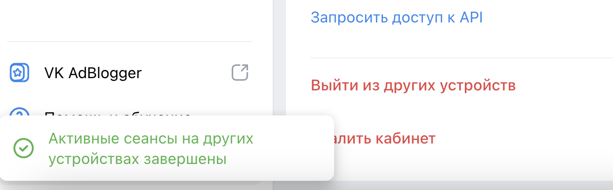

Кнопка "Удалить кабинет".

> При нажатии открывается модальное окно с кнопками "Нет" и "Да, удалить".

> При нажатии кнопки "Нет", модальное окно закрывается.

> При нажатии кнопки "Да, удалить", кабинет удаляется. Пользователя перенаправляет на лэндинг (https://ads.vk.com/).
>
> - При попытке зайти в профиль с удаленным кабинетом, пользователя перенаправляет на страницу регистрации (https://ads.vk.com/hq/registration).

### Настройки. Уведомления

#### Блок "Способы получения"

Перечислены способы получения с переключателями (on/off).

Если при регистрации был выбран чекбокс о согласии на рассылку:

- по умолчанию будут включены все категории уведомлений.
- по умолчанию будут включены все доступные способы получения.

Если какие-либо категории уведомлений уже активны, при отключении всех способов уведомлений появляются кнопки "Сохранить" и Отменить

- При нажатии кнопки Сохранить
  - все категории уведомлений перестают быть выбранными
  - изменения сохраняются (при перезагрузке страницы выбранные категории не меняются)

Если не активен ни один из способов получения:

- отображается сообщение об этом.

  > 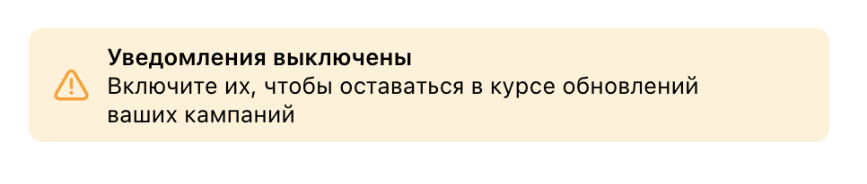

- выбор категорий уведомлений заблокирован.

При включении хотя бы одного способа получения уведомлений:

- появляются кнопки Сохранить и Отменить
- становятся активными для выбора категории уведомлений
  - если не выбрана ни одна из категорий уведомлений, то кнопка "Сохранить" неактивна.

#### Блок "Основные"

Содержит следующие чекбоксы

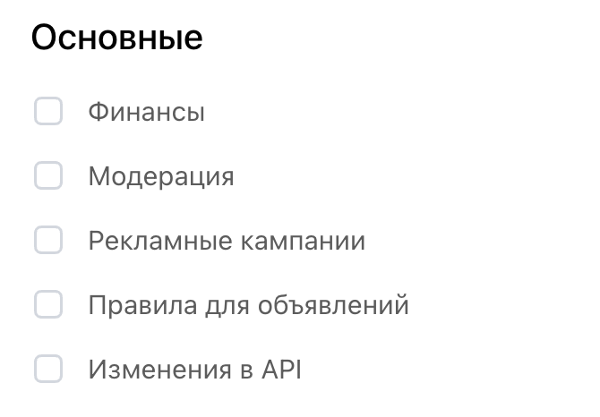

#### Блок "Новости и акции"

Содержит следующие чекбоксы

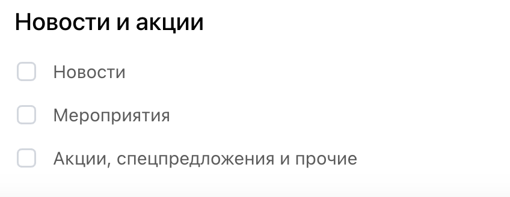

При выборе какой либо категории уведомлений, кнопка Сохранить становится активной.

При нажатии кнопки Сохранить:

- выбранные категории уведомлений сохраняются (при перезагрузке страницы выбранные категории уведомлений не меняются).
- выбранные способы получения уведомлений сохраняются (при перезагрузке страницы выбранные способы получения не меняются).

### Настройки. Права доступа


Если у пользователя есть заявка на предоставление прав доступа, то рядом с вкладкой отображается сообщение об этом.

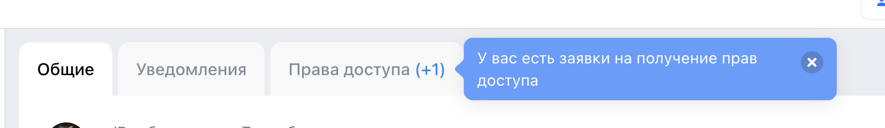

#### Кнопка "Добавить кабинет". При нажатии открывается модальное окно.

- Поле "ID аккаунта VK рекламы" (обязательное поле)

  > Длина поля ограничена 10 символами. Вводить можно только цифры.

  > При нажатии кнопки Сохранить
  >
  > - Если аккаунт с указанным ID не найден, то под полем отображается ошибка "Не нашли такой аккаунт. Проверьте, правильно ли введён ID".
  >   - Пример ввода
  >     ```
  >     1231233123
  >     ```
  > - Если указать свой ID, то под полем отображается ошибка "Это ваш аккаунт. Введите ID другого пользователя"
  >   - Пример ввода
  >     ```
  >     23091282
  >     ```
  > - Если кабинет с указанным ID есть в списке "Имеют доступы к этому кабинету", то под полем отображается ошибка "Кабинет с таким ID уже добавлен".
  >   - Пример ввода
  >     ```
  >     23091282
  >     ```
  > - Если аккаунт с указанным ID другого типа, то под полем отображается ошибка "Аккаунты должны быть одинакового типа".
  >   - Пример ввода
  >     ```
  >     1231231
  >     ```
  >     
  > - Если перебрать id, то можно получить имя клиента [BUG?]
  >   - Пример ввода
  >     ```
  >     12322321
  >     ```
  >     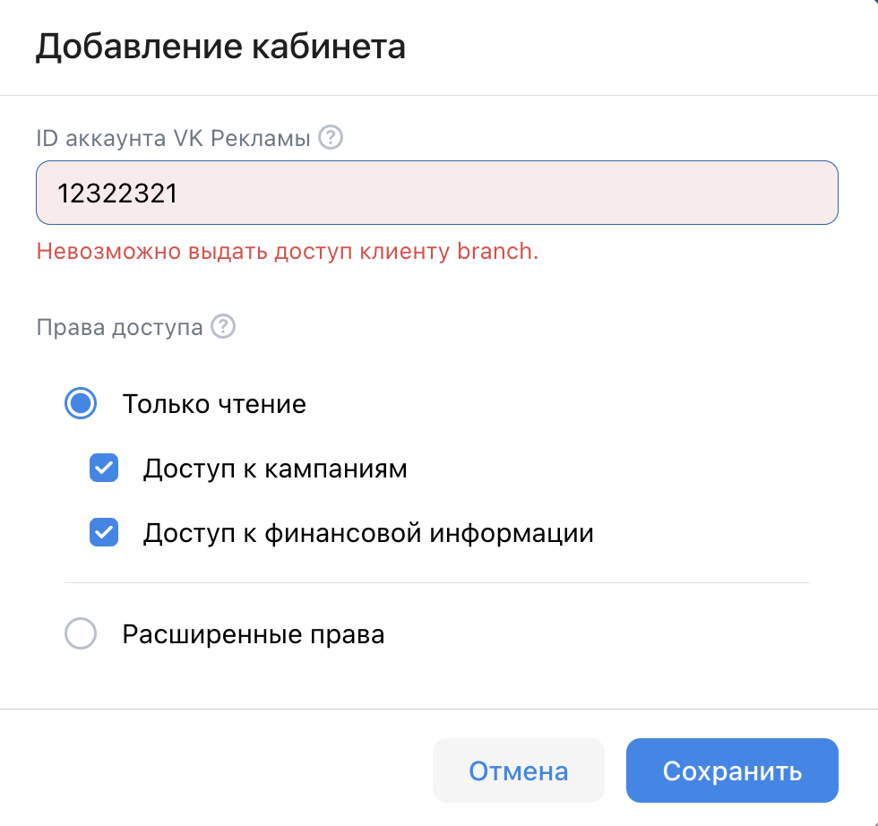

- Чекбоксы "Права доступа"

  > Обязательно должен быть выбран хотя бы один чекбокс. Одновременно может быть выбрана только одна категория.

  - Категория "Только чтение"
    - Чекбокс "Доступ к кампаниям"
    - Чекбокс "Доступ к финансовой информации"
  - Категория "Расширенные права"
    - Чекбокс "Доступ к кампаниям"
    - Чекбокс "Доступ к финансовой информации"

- При нажатии кнопки "Отмена" модальное окно закрывается.

- При нажатии кнопки "Сохранить"
- Если кабинета с указанным ID нет в списке "Имеют доступы к этому кабинету", отправляется завка на предоставление доступа к кабинету.
  - Эта заявка отображается в списке "Имеют доступы к этому кабинету"

#### Список кабинетов

В списке отображаются кабинеты, которым предоставлен доступ под заголовком "Имеют доступ к этому кабинету".

Для любого кабинета из "Имеют доступ к этому кабинету":

- При нажатии на кнопку в колонке права доступа, открывается модальное окно "Редактирование кабинета {ID_Кабинета}"
  - Доступны следующие настройки
    > Обязательно должен быть выбран хотя бы один чекбокс. Одновременно может быть выбрана только одна категория.
    - Категория "Только чтение"
      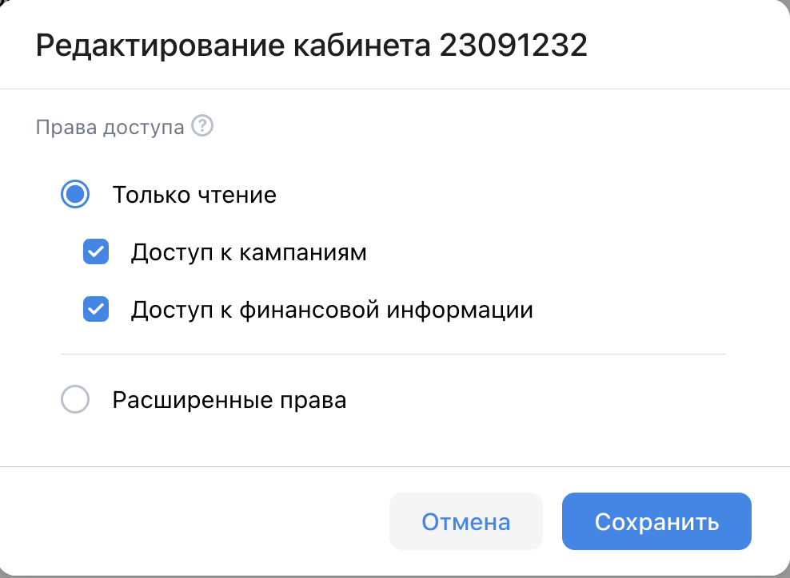
      - Чекбокс "Доступ к кампаниям"
      - Чекбокс "Доступ к финансовой информации"
    - Категория "Расширенные права"
      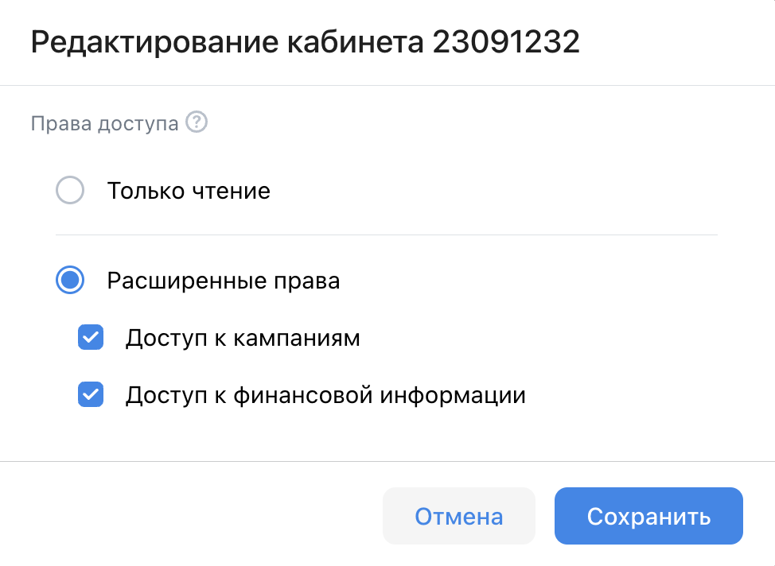
      - Чекбокс "Доступ к кампаниям"
      - Чекбокс "Доступ к финансовой информации"
    - При нажатии кнопки Сохранить, права доступа для кабинета обновляются (значение в колонке прав доступа меняется на сохраненное).
  - Если на заявку еще не ответили, то в статусе отображается "Ещё принимает доступ"
    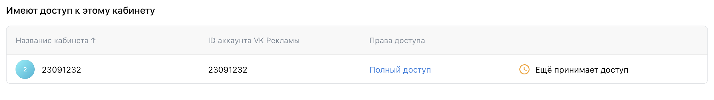
  - Если заявка отклонена, то в статусе отображается "Запрос отклонён"
    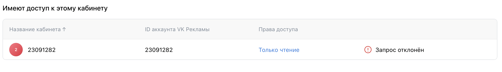
  - Если заявка принята, то:
    - статус не отображается
    - Название кабинета меняется, на текущее имя профиля VK бизнеса (того, кто предоставляет доступ).
      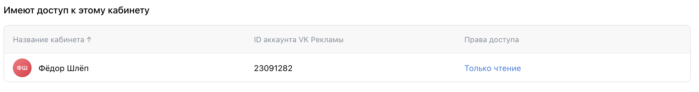
  - При нажатии на кнопку "Закрыть доступ" открывается модальное окно для подтверждения
    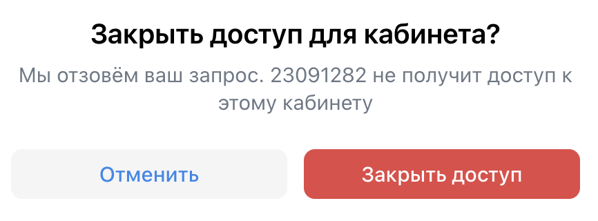
    - Если доступ был отклонен, вместо кнопки "Закрыть доступ" будет кнопка "Удалить из таблицы".
      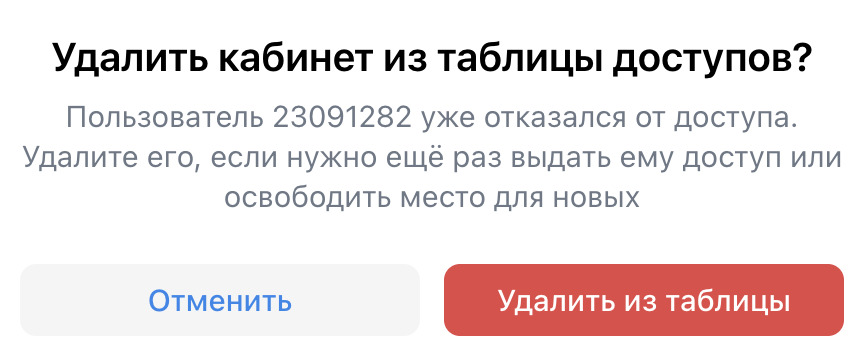
    - Кнопка "Закрыть доступ " при нажатии
      - удаляет кабинет из списка.
      - закрывает доступ к кабинету (удаляет из списка "Мои доступы" у кабинета, которому был предоставлен доступ).
    - Кнопка "Удалить из таблицы" при нажатии
      - удаляет кабинет из списка.
    - Кнопка "Отменить" закрывает модальное окно.

В списке отображаются доступные кабинеты под заголовком "Мои доступы".

Для любого кабинета из "Мои доступы":

- При нажатии на кнопку "Принять доступ":
  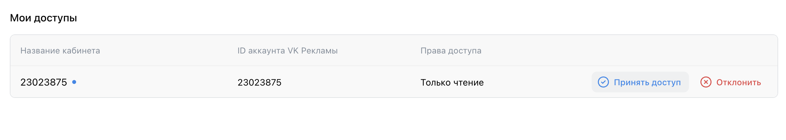

  - появляется уведомление "Доступ принят"
  - Название кабинета меняется, на текущее имя профиля VK бизнеса (того, кто предоставляет доступ).
  - появляетя кнопка "Редактировать"
  - появляется кнопка "Отказаться от доступа"

- При нажатии на кнопку "Отклонить":

  - появляется уведомление "Доступ отклонен"
  - кабинет удаляется из списка
  - отклоняется доступ к кабинету (соответствующий статус отображается напротив записи в списке "Имеют доступ к этому кабинету" в кабинете, предоставляющем доступ)

- При нажатии на кнопку "Редактировать" открывается модальное окно для изменения названия кабинета:
  
  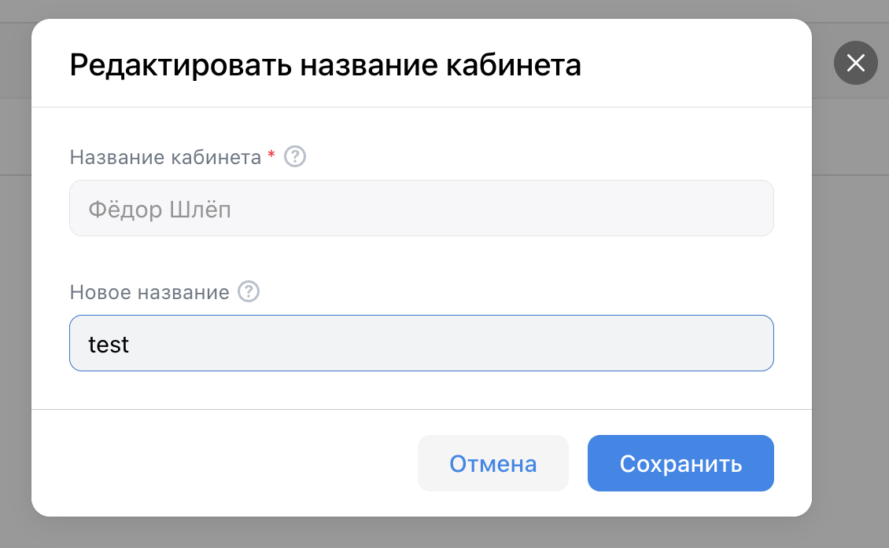

  > Название кабинета меняется только у текущего пользователя.

  - Поле "Название кабинета" (неактивно, стандартное название кабинета = имя профиля VK бизнеса пользователя, предоставляющего доступ)
  - Поле "Новое название"
    > Ограничение на длину ввода 255 символов. Валидации нет.
  - Кнопка Сохранить, при нажатии:
    - Если поле "Новое название" пустое, устанавливает название равное значению поля "Название кабинета".
    - Если поле "Новое название" не пустое, устанавливает название кабинета, равное значению этого поля.
  - Кнопка Отменить, при нажатии закрывает модальное окно.

- Кнопка "Отказаться от доступа" при нажатии открывает модальное окно для подтверждения:
  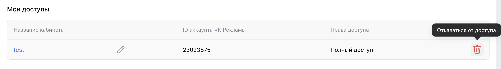
  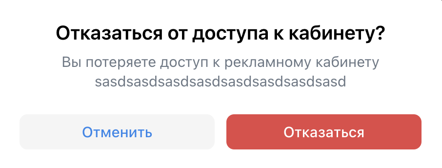
  - Кнопка Отказаться, при нажатии:
    - удаляет кабинет из списка "Мои доступы"
    - закрывает доступ к кабинету (удаляет из списка "Имеют доступ к этому кабинету" у кабинета, которым был предоставлен доступ).
  - Кнопка Отменить, при нажатии:
    - закрывает модальное окно.
