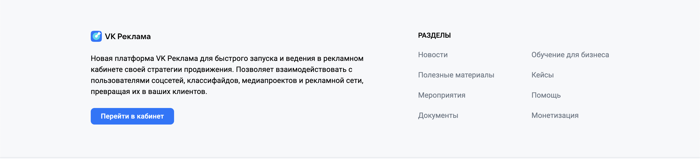

## Landing

### Landing. Загрузка страницы

- Если пользователь не авторизован на https://ads.vk.com/, то при переходе по адресу https://ads.vk.com/ открывается лендинг.
- Если пользователь авторизован на https://ads.vk.com/, то при переходе по адресу https://ads.vk.com/ открывается личный кабинет пользователя https://ads.vk.com/hq/overview.

### Landing. Header (Навигация)

#### Лого

При нажатии на логотип сервиса, происходит перенаправление на https://ads.vk.com/.

#### Новости

При нажатии на кнопку "Новости", происходит перенаправление на https://ads.vk.com/news.

#### Обучение

При наведении на кнопку "Обучение", появляется выпадающее меню со следующими пунктами

- Полезные материалы (при нажатии - перенаправление на https://ads.vk.com/insights)
- Мероприятия (при нажатии - перенаправление на https://ads.vk.com/events)
- Видеокурсы (при нажатии - открытие в новой вкладке https://expert.vk.com/catalog/courses/)
- Сертификация (при нажатии - открытие в новой вкладке https://expert.vk.com/certification/)

#### Кейсы

При нажатии на кнопку "Кейсы", происходит перенаправление на https://ads.vk.com/cases.

#### Форум идей

При нажатии на кнопку "Форум идей", происходит перенаправление на https://ads.vk.com/upvote

#### Монетизация

При нажатии на кнопку "Монетизация", происходит открытие в новой вкладке https://ads.vk.com/partner.

#### Справка

При нажатии на кнопку "Справка", происходит перенаправление на https://ads.vk.com/help

#### Перейти в кабинет

Если пользователь не авторизован на https://ads.vk.com/, при нажатии на кнопку "Перейти в кабинет" - перенаправление на страницу авторизации VK ID.

Если пользователь авторизован на https://ads.vk.com/, при нажатии на кнопку "Перейти в кабинет" - перенаправление в личный кабинет.

### Landing. Slider (Промо слайды)

#### Первый слайд

При нажатии на кнопку "Получить бонус" происходит перенаправление на https://ads.vk.com/promo/firstbonus.

#### Второй слайд

Если пользователь не авторизован на https://ads.vk.com/, при нажатии на кнопку "Запустить рекламу" - перенаправление на страницу авторизации VK ID.

Если пользователь авторизован на https://ads.vk.com/, при нажатии на кнопку "Запустить рекламу" - перенаправление в личный кабинет.

#### Третий слайд

При нажатии кнопки "Подробнее", происходит перенаправление на https://adblogger.vk.com/for-advertisers?utm_source=site&utm_medium=banner&utm_campaign=black_friday&utm_content=ads_vk_com

### Landing. Блок "Кейсы"

При нажатии на кнопку "Смотреть все", происходит перенаправление на https://ads.vk.com/cases.

При нажатии на любой кейс, происходит перенаправление на страницу этого кейса (прим. https://ads.vk.com/cases/testiruem-reklamnye-svyazki-kejs-boombate)

### Landing. Блок "Обучающие вебинары"

При нажатии кнопки "Подробнее", происходит перенаправление на https://ads.vk.com/events

При нажатии в любое место в области блока, происходит перенаправление на https://ads.vk.com/events

### Landing. Блок "Новости"

При нажатии кнопки "Подробнее", происходит перенаправление на страницу отображаемой новости (прим. https://ads.vk.com/news/sbor-auditorii-po-reklamnym-sobytiyam)

При нажатии в любое место в области блока, происходит перенаправление на страницу отображаемой новости (прим. https://ads.vk.com/news/sbor-auditorii-po-reklamnym-sobytiyam)

### Landing. Footer (Контент)

#### Перейти в кабинет

Если пользователь не авторизован на https://ads.vk.com/, при нажатии на кнопку "Перейти в кабинет" - перенаправление на страницу авторизации VK ID.

Если пользователь авторизован на https://ads.vk.com/, при нажатии на кнопку "Перейти в кабинет" - перенаправление в личный кабинет.

### Landing. Footer (Разделы. Навигация)

#### Новости

При нажатии на ссылку "Новости", происходит перенаправление на https://ads.vk.com/news.

#### Полезные материалы

При нажатии на ссылку "Полезные материалы", происходит перенаправление на https://ads.vk.com/insights

#### Мероприятия

При нажатии на ссылку "Мероприятия", происходит перенаправление на https://ads.vk.com/events

#### Документы

При нажатии на ссылку "Документы", происходит перенаправление на https://ads.vk.com/documents

#### Обучение для бизнеса

При нажатии на ссылку "Обучение для бизнеса", происходит открытие в новой вкладке https://expert.vk.com/?utm_source=vk_ads_blog&utm_medium=futer

#### Кейсы

При нажатии на ссылку "Кейсы", происходит перенаправление на https://ads.vk.com/cases

#### Помощь

При нажатии на ссылку "Помощь", происходит перенаправление на https://ads.vk.com/help

#### Монетизация

При нажатии на ссылку "Монетизация", происходит открытие в новой вкладке https://ads.vk.com/partner.

## Регистрация

При попытке войти в личный кабинет (https://ads.vk.com/hq) пользователь будет перенаправлен на страницу авторизации VK ID (так как это отдельный сервис, в данном чеклисте для него проверок нет)

После авторизации через VK ID отображается модальное окно "Выберите профиль бизнеса", в котором отображаются все доступные профили и кнопка "Создать профиль".

### Регистрация. Выберите профиль бизнеса

При нажатии кнопки "Создать профиль" пользователь будет перенаправлен на страницу регистрации (https://ads.vk.com/hq/registration).

### Регистрация. Добро пожаловать в VK Рекламу

#### Переключатель языка

- При нажатии на переключатель языка (Русский) язык страницы меняется на Русский.

- При нажатии на переключатель языка (Английский) язык страницы меняется на Английский.

#### Создание кабинета

При нажатии на кнопку "Создать новый кабинет", отображается форма "Регистрация кабинета" и кнопка "Создать кабинет".

#### Форма "Регистрация кабинета"

- Чекбокс "Тип аккаунта" [1] (обязательное поле):
  > "Рекламодатель" или "Агентство".
- Выпадающий список "Выберите страну" (обязательное поле).
- Выпадающий список "Валюта" (обязательное поле).
- Email

  > Email валидный, если:
  >
  > - Содержит ровно один "@" и минимум одну "." после него.
  > - До "@" допускаются латинские буквы (без спецсимволов), ".", "-", "\_", цифры.
  > - Между "@" и последней точкой допускаются буквы кириллицы/латиницы, ".", "-", "\_", цифры.
  > - После последней точки — только буквы кириллицы/латиницы.
  > - После каждой "." — минимум 2 символа.

  > Если Email невалиден, под полем отображается ошибка "Некорректный email адрес".

  > Если Email пустой (не введен хотя бы 1 символ), отображается плейсхолдер "example@mail.ru".

  > Если оставить Email незаполненным, под полем отображается ошибка "Обязательное поле".

- Чекбокс "Тип аккаунта" [2] (обязательное поле):

  > "Физическое лицо" или "Юридическое лицо" (если в "Тип аккаунта" [1] выбран "Рекламодатель").

  > "Юридическое лицо" (если в "Тип аккаунта" [1] выбрано "Агентство").

- Если в "Тип аккаунта" [2] выбрано "Физическое лицо", появляются поля:

  > ИНН (необязательное поле)

  > ФИО (необязательное поле).

- ИНН

  > Для ввода доступны только цифры

  > ИНН валидный, если:
  >
  > - Содержит ровно 12 символов.

  > Если поле ИНН содержит менее 12 символов, то под полем отображается ошибка "Напишите не меньше 12 символов".

  > Если поле ИНН содержит более 12 символов, то под полем отображается ошибка "Напишите текст не больше 12 символов".

- ФИО

  > ФИО валидно, если содержит только кириллицу, дефис и пробел.

  > Если ФИО невалидно, под полем отображается ошибка "Некорректные символы. Разрешена только кириллица дефис и пробел".

  > Если введено больше 60 символов, под полем отображается ошибка "Напишите текст не больше 60 символов"

- Чекбокс об условиях оферты (отмечен по умолчанию) (Обязательное поле)

- Чекбокс о согласии на рассылку (отмечен по умолчанию) (Необязательно поле)

#### Кнопка "Создать кабинет"

При нажатии на кнопку "Создать кабинет" происходит перенаправление на https://ads.vk.com/hq/overview.

#### Альтернативный flow регистрации

При нажатии на кнопку "Использовать рекламный кабинет myTarget" отображается переключатель (Рекламодателю/Агентству) и кнопка "Продолжить".

- При нажатии на переключатель (Рекламодателю) отображается информация для рекламодателей.
- При нажатии на переключатель (Агентству) отображается информация для агентств.
- При нажатии кнопки "Продолжить" происходит перенаправление на https://target.vk.ru/.

## Авторизация

При попытке войти в личный кабинет (https://ads.vk.com/hq) пользователь будет перенаправлен на страницу авторизации VK ID (так как это отдельный сервис, в данном чеклисте для него проверок нет)

После авторизации через VK ID отображается модальное окно "Выберите профиль бизнеса", в котором отображаются все доступные профили и кнопка "Создать профиль".

### Авторизация. Выберите профиль бизнеса

- При нажатии на существующий профиль происходит вход в систему (перенаправление https://ads.vk.com/hq/overview)

- При нажатии на кнопку "Создать профиль" происходит перенаправление на страницу регистрации (https://ads.vk.com/hq/registration)

## Настройки

При открытии настроек (https://ads.vk.com/hq/settings) пользователь попадает на вкладку "Общие".

При изменении какого-либо поля, появляются кнопки "Сохранить" и "Отменить".

### Настройки. Header (Навигация)

Всего в хедере 4 вкладки

- **Общие** (при нажатии - отображение общих настроек)
- **Уведомления** (при нажатии - отображание настроек уведомлений)
- **Права доступа** (при нажатии - отображение настроек прав доступа)
- **История изменений** (при нажатии - отображение истории изменений настроек)

### Настройки. Общие

#### Блок "Контакты"

- Поле "Телефон" (Необязательное поле)

  > Телефон валидный, если:
  >
  > - Содержит только цифры (минимум 11 цифр) и знак "+" (должен начинаться со знака "+").

  > Если поле "Телефон" невалидно, под полем отображается ошибка "Некорректный номер телефона".

- Кнопка "Добавить email". При нажатии, появляется поле для ввода email.

- Поле email

  > Email валидный, если:
  >
  > - Содержит ровно один "@" и минимум одну "." после него.
  > - До "@" допускаются латинские буквы (без спецсимволов), ".", "-", "\_", цифры.
  > - Между "@" и последней точкой допускаются буквы кириллицы/латиницы, ".", "-", "\_", цифры.
  > - После последней точки — только буквы кириллицы/латиницы.
  > - После каждой "." — минимум 2 символа.

  > Если Email невалиден, под полем отображается ошибка "Некорректный email адрес".

  > Если оставить Email незаполненным, при нажатии кнопки "Сохранить" под полем отображается ошибка "Обязательное поле".

#### Блок "Реквизиты"

- Если "Тип кабинета" - "Физическое лицо", отображаются поля:

  > ФИО (обязательное поле).

  > ИНН (обязательное поле)

- ФИО

  > ФИО валидно, если содержит только кириллицу, дефис и пробел.

  > Если ФИО невалидно, под полем отображается ошибка "Некорректные символы. Разрешена только кириллица дефис и пробел".

  > Если введено больше 60 символов, под полем отображается ошибка "Напишите текст не больше 60 символов"

- ИНН

  > ИНН валидный, если:
  >
  > - Содержит ровно 12 символов, все символы - цифры.

  > Если поле ИНН содержит менее 12 символов, то под полем отображается ошибка "Длина ИНН должна быть 12 символов".

  > Если поле ИНН невалидно, то под полем отображается ошибка "Некорректный ИНН".

  > Если ИНН сам по себе не валиден (просто набор цифр, несуществующий ИНН), то при нажатии кнопки сохранить, под полем отображается ошибка "Невалидный ИНН".

  > Если оставить ИНН незаполненным, при нажатии кнопки "Сохранить" под полем отображается ошибка "Обязательное поле".

#### Блок "Интерфейс"

- Поле "Название кабинета" (необязательное поле)

  > Для ввода доступны любые символы

- Выпадающее меню "Язык интерфейса" (RU/EN) (необязательное поле)

- Чекбокс "Распознавать горячие клавиши"

#### Блок "Связанные кабинеты"

- Кнопка "Привязать кабинет myTarget". При нажатии открывается модальное окно с кнопками "Отменить" и продолжить".
  - При нажатии кнопки "Отменить" модальное окно закрывается.
  - При нажатии кнопки "Продолжить" происходит перенаправление на https://target.vk.ru/.

#### Блок "Доступ к API"

- Ссылка "Подробнее о доступе". При нажатии - открытие в новой вкладке https://ads.vk.com/help/articles/help_api.

- Кнопка "Запросить доступ к API". При нажатии - открывается модальное окно:

  - ФИО ответственного лица (обязательное поле)

    > ФИО валидно, если содержит только кириллицу, дефис и пробел.

    > Если ФИО невалидно, под полем отображается ошибка "Некорректные символы. Разрешена только кириллица дефис и пробел".

    > Если введено больше 60 символов, под полем отображается ошибка "Напишите текст не больше 60 символов"

  - Контактный телефон (обязательное поле)

    > Телефон валидный, если:
    >
    > - Содержит только цифры (ровно 11 цифр) и знак "+" (должен начинаться со знака "+". Поддерживаются только номера РФ).

    > Если поле "Телефон" невалидно, под полем отображается ошибка "Некорректный формат. Пример: +71234567890".

Кнопка "Выйти из других устройств".

> При нажатии появляется уведомление "Активные сеансы на других устройствах завершены"

Кнопка "Удалить кабинет".

> При нажатии открывается модальное окно с кнопками "Нет" и "Да, удалить".

> При нажатии кнопки "Нет", модальное окно закрывается.

> При нажатии кнопки "Да, удалить", кабинет удаляется.

### Настройки. Уведомления

#### Блок "Способы получения"

Перечислены способы получения с переключателями (on/off).

Если не активен ни один из способов получения, то отображается сообщение об этом.

Если не активен ни один из способов получения, то выбор категорий уведомлений заблокирован.

Если не выбрана ни одна из категорий уведомлений, то кнопка "Сохранить" неактивна.

#### Блок "Основные"

Содержит следующие чекбоксы

#### Блок "Новости и акции"

Содержит следующие чекбоксы

### Настройки. Права доступа

Если у пользователя есть заявка на предоставление прав доступа, то рядом с вкладкой отображается сообщение об этом.

#### Кнопка "Добавить кабинет". При нажатии открывается модальное окно.

- Поле "ID аккаунта VK рекламы" (обязательное поле)

  > Длина поля ограничена 10 символами. Вводить можно только цифры.

  > Если аккаунт с указанным ID не найден, то под полем отображается ошибка "Не нашли такой аккаунт. Проверьте, правильно ли введён ID".

  > Если аккаунт с указанным ID другого типа, то под полем отображается ошибка "Аккаунты должны быть одинакового типа".
  > 

  > Кто такой branch? (это IDOR? или так и задумано) [BUG?]
  > При вводе произвольного id получаем имя клиента.
  > 

- Чекбоксы "Права доступа"

  > Обязательно должен быть выбран хотя бы один чекбокс. Одновременно может быть выбрана только одна категория.

  - Категория "Только чтение"
    - Чекбокс "Доступ к кампаниям"
    - Чекбокс "Доступ к финансовой информации"
  - Категория "Расширенные права"

    - Чекбокс "Доступ к кампаниям"
    - Чекбокс "Доступ к финансовой информации"

- При нажатии кнопки "Отмена" модальное окно закрывается.

- При нажатии кнопки "Сохранить", отправляется завка на предоставление доступа к кабинету.

#### Список кабинетов

В списке отображаются доступные кабинеты, и кабинеты к которым предоставлен доступ.

Для кабинетов предоставляющих доступ, можно принять доступ, нажав на кнопку "Принять доступ".

Для кабинетов предоставляющих доступ, можно отклонить доступ, нажав на кнопку "Отклонить доступ".

Для кабинетов, которым предоставлен доступ, доступ можно закрыть, нажав на кнопку "Закрыть доступ".

При нажатии этой кнопки появляется модальное окно

- При нажатии кнопки "Отмена" модальное окно закрывается.

- При нажатии кнопки "Закрыть доступ", предоставление доступа к кабинету прекращается.

Для кабинетов, которыми предоставлен доступ, можно редактировать название, нажав на кнопку "Редактировать".

При нажатии этой кнопки открывается модальное окно

- Название кабинета (обязательное поле) - неактивно
- Новое название (необязательное поле)
  > Для ввода доступны любые символы. Максимальная длина 255 символов.
- При нажатии кнопки "Отмена" модальное окно закрывается.

- При нажатии кнопки "Сохранить", название кабинета меняется на новое.

  > Если новое название пустое, то название кабинета меняется на указанное в поле "Название кабинета".

Для кабинетов, которыми предоставлен доступ, можно отказаться от доступа, нажав на кнопку "Отказаться от доступа".

При нажатии этой кнопки открывается модальное окно

- При нажатии кнопки "Отмена" модальное окно закрывается.

- При нажатии кнопки "Отказаться", предоставление доступа к кабинету прекращается.
