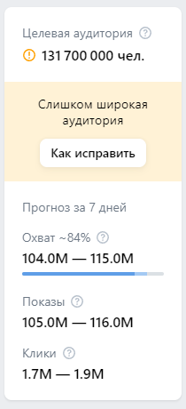

# Футер (без авторизации)
## На странице монетизации

## На остальных страницах

- При нажатии на кнопку "Русский" в выпадающем списке, сайт переводится на русский язык
- При нажатии на кнопку "English" в выпадающем списке, сайт переводится на английский язык

# Навбар (без авторизации)

- При нажатии/наведении на "Обучение", появляется выпадающий список с кнопками "Полезные материалы", "Мероприятия", "Видеокурсы", "Сертификаты"

# Регистрация

- При нажатии на кнопку "Русский", сайт переводится на русский язык
- При нажатии на кнопку "English", сайт переводится на английский язык
- При нажатии на кнопку "Агенство" в выборе типа аккаунта, пропадает возможность выбора пункта "Физическое лицо" в типе аккаунта
- При нажатии на кнопку "Россия" в выпадающем меню страны, в качестве валюты ставится "Российский рубль (RUB)". Если же выбрать другую страну, то валютой становится "Доллар США (USD)" с возможностью выбрать "Евро (EUR)"
- Если не заполнить обязательное поле Email, то появится ошибка "Обязательное поле"
- Если ввести некорректный email, то появляется ошибка "Некорректный email адрес"
- Если выбрать любую страну, кроме России, Республики Белорусь, Казахстана и Таджикистана, то повится предупреждение "Создать рекламный кабинет могут физические лица из России, Республики Беларусь, Казахстана и Таджикистана"
- Если выбрать "Юридическое лицо" в типе аккаунта, то пропадает пункт ИНН
- Если ввести менее 12 цифр в поле ИНН, то появляется ошибка "Напишите не меньше 12 символов"

# Авторизация