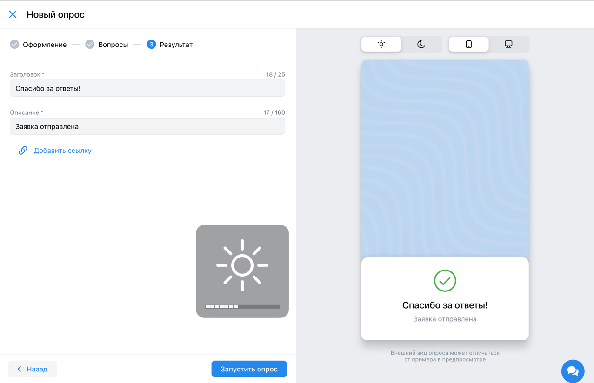
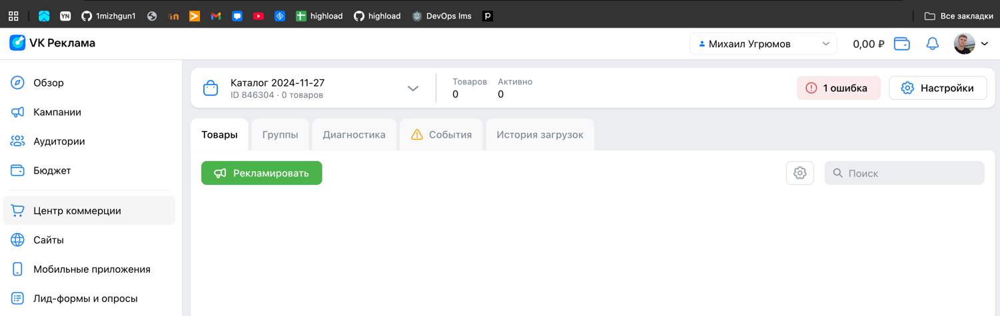

# Содержание
1. [Валидация](#валидация)
2. [Регистрация и авторизация](#регистрация-и-авторизация)
3. [Настройки](#настройки)
4. [Лид-формы и опросы](#лид-формы-и-опросы)
5. [Аудитории](#аудитории)

# Валидация
* Почта считается валидной, если:
  * Содержит строго один символ `@` и хотя бы одну точку после символа `@`
  * До символа "@":
    * Содержит хотя бы один символ из множества `[a-zA-Z0-9]`
    * Содержит только символы из множества `[a-zA-Z0-9._-]`
  * После символа "@" и до последней точки:
    * Содержит хотя бы один символ из множества `[a-zA-Zа-яА-Я0-9]` (в отличие от части до символа `@`, здесь допустима 
      кириллица)
    * Содержит только символы из множества `[a-zA-Zа-яА-Я0-9._-]`
  * После последней точки:
    * Содержит как минимум два символа из множества `[a-zA-Zа-яА-Я]`
    * Содержит только символы из множества `[a-zA-Zа-яА-Я]`
  > Достоверного описания валидной почты нет, поэтому правила выше могут быть не совсем точными: они были определены
  экспериментально и могут не учитывать некоторые случаи.
* Номер телефона считается валидным, если:
  * Начинается с символа `+`
  * Состоит только из цифр и символа `+` в начале (скобки, пробелы и дефисы не допускаются!)
  * Содержит от 11 до 13 цифр включительно
  > Достоверного описания валидного номера нет, поэтому правила выше могут быть не совсем точными: они были определены
  экспериментально и могут не учитывать некоторые случаи.

# Регистрация и авторизация
* Если пользователь не авторизован, то при нажатии на кнопку "Перейти в кабинет" в хедере на 
  [главной странице](https://ads.vk.com) происходит редирект на VK ID.  
    
  

> Т.к. работа посвящена рекламному кабинету VK, а не VK ID, то детальные проверки на работу VK ID будут опущены.

* Если пользователь авторизован, то при нажатии на кнопку "Перейти в кабинет" в хедере на 
  [главной странице](https://ads.vk.com) происходит редирект на главную страницу личного кабинета. 

* Если пользователь не является клиентом VK рекламы, то после входа через VK ID происходит редирект на страницу с 
  регистрацией в рекламном кабинете VK.  
    
  * На странице доступен выбор языка (русский, английский).
    * Переключение языка меняет весь язык на странице.
  * На странице доступна опция "Создать новый кабинет".
    * При нажатии на кнопку "Создать новый кабинет" открывается страница создания нового кабинета.  
      
      * На странице есть следующие элементы:
        * Чекбокс "Тип аккаунта" - рекламодатель, либо агентство. - обязательное поле
        * Список "Выберите страну" - список стран. - обязательное поле
        * Список "Валюта" - список валют. - обязательное поле
        * Поле "Email" - поле для ввода email. - обязательное поле
        * Чекбокс "Тип аккаунта" (да, этот пункт называется так же, но отвечает за другое)
          * Если в первом "Тип аккаунта" выбрано "рекламодатель", то в этом поле можно выбрать между физ. и юр. лицом
          * Если в первом "Тип аккаунта" выбрано "агентство", то в этом поле можно выбрать только юр. лицо
        * Если отмечено "Физическое лицо", то появляются следующие поля:
          * Поле "ИНН" - поле для ввода ИНН. - необязательное поле.
          * Поле "ФИО" - поле для ввода ФИО. - необязательное поле.
        * Чекбокс "Создавая кабинет, вы принимаете условия...". - обязательное поле
        * Чекбокс "Даю согласие на получение рассылок...". - необязательное поле
        * Кнопка "Создать кабинет" - кнопка для создания кабинета.
          * Если Email не введен, то при нажатии на кнопку поле с вводом почты обводится красным и появляется сообщение
            "обязательное поле" под полем.  
            
          * Если введён [невалидный](#валидация) email, то при нажатии на кнопку поле с вводом почты обводится красным 
            и появляется надпись "Некорректный email адрес" под полем.
          * Если не отмечен чекбокс "Даю согласие на получение рассылок...", то при нажатии на кнопку появляется 
            сообщение "обязательное поле" под чекбоксом.  
            
  * На странице доступна опция "Использовать рекламный кабинет myTarget".
    > Т.к. работа посвящена рекламному кабинету VK, а не myTarget, то детальные проверки на работу myTarget будут 
    опущены.
    
# Настройки
* В личном кабинете в боковом меню присутствует кнопка "Настройки".  
  
* При нажатии на кнопку "Настройки" происходит редирект на [соответствующую страницу](https://ads.vk.com/hq/settings).
* На странице настроек доступны следующие кликабельные категории настроек:
  * [Общие](#категория-общие)
  * [Уведомления](#категория-уведомления)
  * [Права доступа](#категория-права-доступа)
  * [История изменений](#категория-история-изменений)

## Категория "Общие"
* Отображается аватар пользователя (аватар берётся из VK ID).
* Отображается ID кабинета пользователя.
* Отображается тип кабинета пользователя.  
 
* Отображается кнопка "Выйти из других устройств"
  * При нажатии на кнопку происходит выход из кабинета на всех устройствах, кроме текущего, а так же появляется
    всплывающее сообщение "Активные сеансы на других устройствах завершены".  
    
* Отображается кнопка "Удалить кабинет"
  * При нажатии на кнопку открывается модальное окно с текстом "Удалить кабинет и все связанные с ним данные?" и двумя
  кнопками: "Нет" и "Да, удалить".
  * При нажатии на кнопку "Да, удалить" происходит удаление кабинета и редирект на главную страницу VK ID.
  * При нажатии на кнопку "Нет" модальное окно закрывается.  
  
* Если на странице произошли изменения в одной или нескольких из подкатегорий, то внизу страницы появляются кнопки
"Сохранить" и "Отмена".
  * При нажатии на кнопку "Сохранить" происходит сохранение изменений при соблюдении всех условий каждого из пунктов 
    (см. ниже).
  * При нажатии на кнопку "Отмена" изменения не сохраняются и возвращаются к предыдущему состоянию.
### Подкатегория "Контакты"
* Отображается поле "Телефон", которое можно редактировать.
  * Если ввести [валидный](#валидация) номер и нажать кнопку "Сохранить" внизу страницы, то номер сохранится.
  * Если ввести [невалидный](#валидация) номер и нажать кнопку "Сохранить" внизу страницы, то отобразится уведомление
    "некорректный номер телефона" под полем ввода и сохранение не произойдет.
* Отображается поле "Email", которое нельзя редактировать.
  * Если есть дополнительные подтвержденные почты, то они отображаются под основным полем для ввода email. Такие почты
    можно удалить, нажав на крестик рядом с ними.  
      
* Отображается кнопка "Добавить почту"
  * При нажатии на кнопку добавляется поле для ввода email.
  * Добавленное поле для ввода email обладает тем же поведением, что и основное поле для ввода email.
  * Если почта в добавленном поле не подтверждена, то её можно удалить, нажав на крестик.
  * Если ввести [валидную](#валидация) почту в добавленное поле и нажать кнопку "Сохранить" внизу страницы, то
    отобразится уведомление с просьбой подтвердить почту.
       
    * Внутри уведомления есть кнопка "Отправить письмо ещё раз". При нажатии на эту кнопку происходит повторная отправка
    письма.
    * Если перейти по ссылке из письма, то открывается страница с уведомлением "Почта подтверждена" и кнопкой для
    перехода в личный кабинет.
      
  * Если ввести [невалидную](#валидация) почту в добавленное поле и нажать кнопку "Сохранить" внизу страницы, то
    отобразится уведомление "некорректный email адрес" под полем ввода и сохранение не произойдет.
  * При добавлении новой почты кнопка "Добавить почту" остаётся на месте, т.е. пользователь может добавить несколько
    почт, но не более пяти штук.
    * Если добавлено пять дополнительных почт, то кнопка "Добавить почту" становится недоступной.
### Подкатегория "Реквизиты"
* Отображается поле "ФИО", которое обязательно должно быть заполнено и его можно редактировать.
  > Примечание: на этапе регистрации это поле необязательно, поэтому в настройках оно может быть пустым. Но если
  попытаться нажать кнопку "Сохранить", оставив это поле пустым, то появится уведомление "обязательное поле".  
  * Если ввести валидное ФИО и нажать кнопку "Сохранить" внизу страницы, то ФИО сохранится.
  * Если ввести невалидное ФИО и нажать кнопку "Сохранить" внизу страницы, то отобразится уведомление "Некорректные 
    символы. Разрешена только кириллица, дефис и пробел" под полем ввода и сохранение не произойдет.  
      
* Отображается поле "ИНН", которое обязательно должно быть заполнено и его можно редактировать.
  * Если ввести валидный ИНН и нажать кнопку "Сохранить" внизу страницы, то ИНН сохранится.
  * Если ввести невалидный ИНН только из цифр и нажать кнопку "Сохранить" внизу страницы, то отобразится уведомление 
    "Длина ИНН должна быть 12 символов" под полем ввода.  
    
  * Если ввести невалидный ИНН из любых символов кроме цифр и нажать кнопку "Сохранить" внизу страницы, то отобразится 
    уведомление "Невалидный ИНН" под полем ввода.  
    
 
### Подкатегория "Интерфейс"
### Подкатегория "Связанные кабинеты"
### Подкатегория "Доступ к API"

## Категория "Уведомления"
## Категория "Права доступа"
## Категория "История изменений"

# Лид-формы и опросы

# Аудитории
