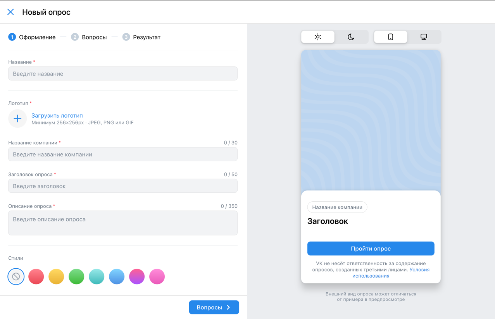
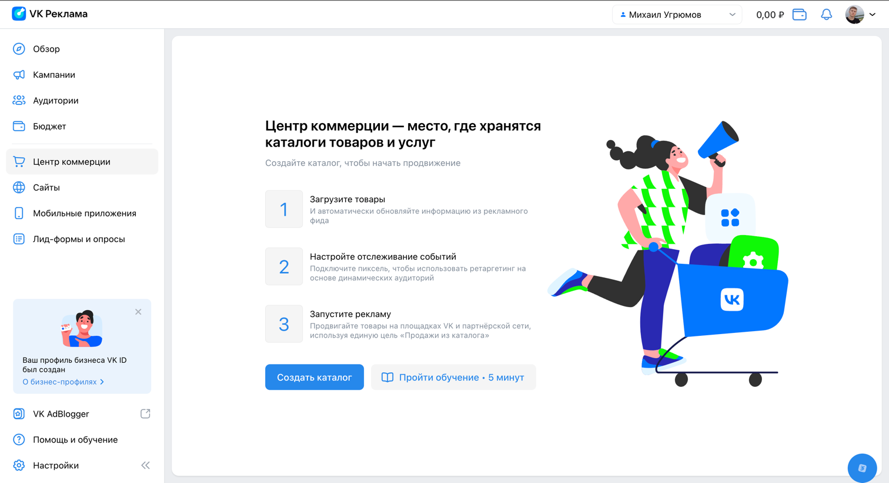
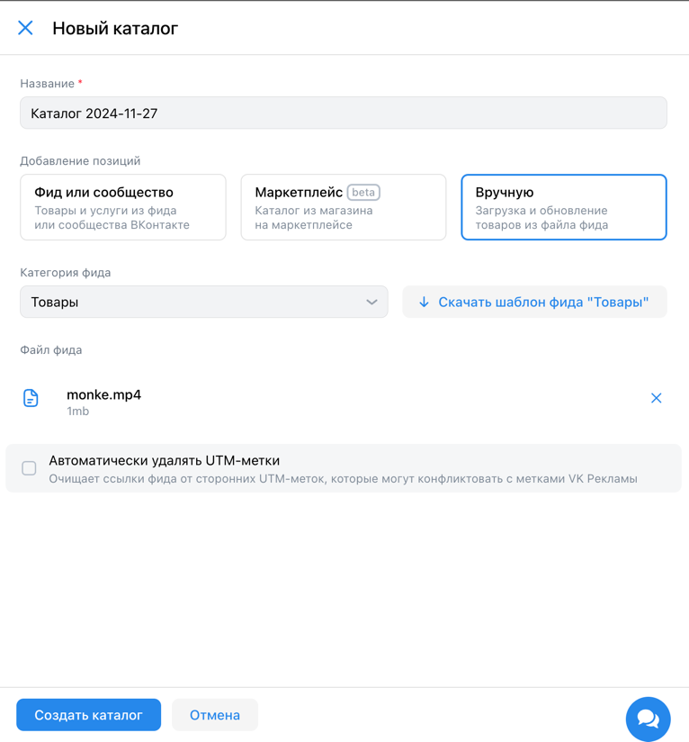
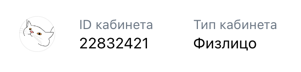
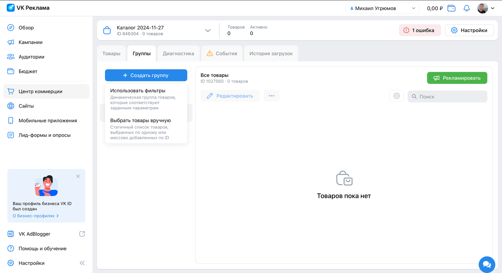
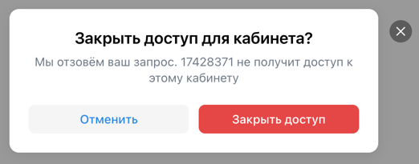

# Содержание
1. [Валидация](#валидация)
2. [Регистрация и авторизация](#регистрация-и-авторизация)
3. [Настройки](#настройки)

# Валидация
* Почта считается валидной, если:
  * Содержит строго один символ `@` и хотя бы одну точку после символа `@`
  * До символа "@":
    * Содержит хотя бы один символ из множества `[a-zA-Z0-9]`
    * Содержит только символы из множества `[a-zA-Z0-9._-]`
  * После символа "@" и до последней точки:
    * Содержит хотя бы один символ из множества `[a-zA-Zа-яА-Я0-9]` (в отличие от части до символа `@`, здесь допустима 
      кириллица)
    * Содержит только символы из множества `[a-zA-Zа-яА-Я0-9._-]`
  * После последней точки:
    * Содержит как минимум два символа из множества `[a-zA-Zа-яА-Я]`
    * Содержит только символы из множества `[a-zA-Zа-яА-Я]`
  > Достоверного описания валидной почты нет, поэтому правила выше могут быть не совсем точными: они были определены
  экспериментально и могут не учитывать некоторые случаи.
* Номер телефона считается валидным, если:
  * Начинается с символа `+`
  * Состоит только из цифр и символа `+` в начале (скобки, пробелы и дефисы не допускаются!)
  * Содержит от 11 до 13 цифр включительно
  > Достоверного описания валидного номера нет, поэтому правила выше могут быть не совсем точными: они были определены
  экспериментально и могут не учитывать некоторые случаи.

# Регистрация и авторизация
* Если пользователь не авторизован, то при нажатии на кнопку "Перейти в кабинет" в хедере на 
  [главной странице](https://ads.vk.com) происходит редирект на VK ID.  
    
  

> Т.к. работа посвящена рекламному кабинету VK, а не VK ID, то детальные проверки на работу VK ID будут опущены.

* Если пользователь авторизован, то при нажатии на кнопку "Перейти в кабинет" в хедере на 
  [главной странице](https://ads.vk.com) происходит редирект на главную страницу личного кабинета. 

* Если пользователь не является клиентом VK рекламы, то после входа через VK ID происходит редирект на страницу с 
  регистрацией в рекламном кабинете VK.  
    
  * На странице доступен выбор языка (русский, английский).
    * Переключение языка меняет весь язык на странице.
  * На странице доступна опция "Создать новый кабинет".
    * При нажатии на кнопку "Создать новый кабинет" открывается страница создания нового кабинета.  
      
      * На странице есть следующие элементы:
        * Чекбокс "Тип аккаунта" - рекламодатель, либо агентство. - обязательное поле
        * Список "Выберите страну" - список стран. - обязательное поле
        * Список "Валюта" - список валют. - обязательное поле
        * Поле "Email" - поле для ввода email. - обязательное поле
        * Чекбокс "Тип аккаунта" (да, этот пункт называется так же, но отвечает за другое)
          * Если в первом "Тип аккаунта" выбрано "рекламодатель", то в этом поле можно выбрать между физ. и юр. лицом
          * Если в первом "Тип аккаунта" выбрано "агентство", то в этом поле можно выбрать только юр. лицо
        * Если отмечено "Физическое лицо", то появляются следующие поля:
          * Поле "ИНН" - поле для ввода ИНН. - необязательное поле.
          * Поле "ФИО" - поле для ввода ФИО. - необязательное поле.
        * Чекбокс "Создавая кабинет, вы принимаете условия...". - обязательное поле
        * Чекбокс "Даю согласие на получение рассылок...". - необязательное поле
        * Кнопка "Создать кабинет" - кнопка для создания кабинета.
          * Если Email не введен, то при нажатии на кнопку поле с вводом почты обводится красным и появляется сообщение
            "обязательное поле" под полем.  
            
          * Если введён [невалидный](#валидация) email, то при нажатии на кнопку поле с вводом почты обводится красным 
            и появляется надпись "Некорректный email адрес" под полем.
          * Если не отмечен чекбокс "Создавая кабинет, вы принимаете условия...", то при нажатии на кнопку появляется 
            сообщение "обязательное поле" под чекбоксом.  
            
  * На странице доступна опция "Использовать рекламный кабинет myTarget".
    > Т.к. работа посвящена рекламному кабинету VK, а не myTarget, то детальные проверки на работу myTarget будут 
    опущены.
    
# Настройки
* В личном кабинете в боковом меню присутствует кнопка "Настройки".  
  
* При нажатии на кнопку "Настройки" происходит редирект на [соответствующую страницу](https://ads.vk.com/hq/settings).
* На странице настроек доступны следующие кликабельные категории настроек:
  * [Общие](#категория-общие)
  * [Уведомления](#категория-уведомления)
  * [Права доступа](#категория-права-доступа)
  * [История изменений](#категория-история-изменений)

## Категория "Общие"
* Отображается аватар пользователя (аватар берётся из VK ID).
* Отображается ID кабинета пользователя.
* Отображается тип кабинета пользователя.  
 
* Отображается кнопка "Выйти из других устройств"
  * При нажатии на кнопку происходит выход из кабинета на всех устройствах, кроме текущего, а так же появляется
    всплывающее сообщение "Активные сеансы на других устройствах завершены".  
    
* Отображается кнопка "Удалить кабинет"
  * При нажатии на кнопку открывается модальное окно с текстом "Удалить кабинет и все связанные с ним данные?" и двумя
  кнопками: "Нет" и "Да, удалить".
  * При нажатии на кнопку "Да, удалить" происходит удаление кабинета и редирект на [главную страницу VK ads](https://ads.vk.com/).
  * При нажатии на кнопку "Нет" модальное окно закрывается.  
  
* Если на странице произошли изменения в одной или нескольких из подкатегорий, то внизу страницы появляются кнопки
"Сохранить" и "Отмена".
  * При нажатии на кнопку "Сохранить" происходит сохранение изменений при соблюдении всех условий каждого из пунктов 
    (см. ниже).
  * При нажатии на кнопку "Отмена" изменения не сохраняются и возвращаются к предыдущему состоянию.
### Подкатегория "Контакты"
* Отображается поле "Телефон", которое можно редактировать.
  * Если ввести [валидный](#валидация) номер и нажать кнопку "Сохранить" внизу страницы, то номер сохранится.
  * Если ввести [невалидный](#валидация) номер и нажать кнопку "Сохранить" внизу страницы, то отобразится уведомление
    "некорректный номер телефона" под полем ввода и сохранение не произойдет.
* Отображается поле "Email", которое нельзя редактировать.
  * Если есть дополнительные подтвержденные почты, то они отображаются под основным полем для ввода email. Такие почты
    можно удалить, нажав на крестик рядом с ними.  
      
* Отображается кнопка "Добавить email"
  * При нажатии на кнопку добавляется поле для ввода email.
  * Добавленное поле для ввода email обладает тем же поведением, что и основное поле для ввода email.
  * Если почта в добавленном поле не подтверждена, то её можно удалить, нажав на крестик.
  * Если ввести [валидную](#валидация) почту в добавленное поле и нажать кнопку "Сохранить" внизу страницы, то
    отобразится уведомление с просьбой подтвердить почту.
       
    * Внутри уведомления есть кнопка "Отправить письмо ещё раз". При нажатии на эту кнопку происходит повторная отправка
    письма.
    * Если перейти по ссылке из письма, то открывается страница с уведомлением "Почта подтверждена" и кнопкой для
    перехода в личный кабинет.  
      
  * Если ввести [невалидную](#валидация) почту в добавленное поле и нажать кнопку "Сохранить" внизу страницы, то
    отобразится уведомление "некорректный email адрес" под полем ввода и сохранение не произойдет.
  * При добавлении новой почты кнопка "Добавить почту" остаётся на месте, т.е. пользователь может добавить несколько
    почт, но не более пяти штук.
    * Если добавлено пять дополнительных почт, то кнопка "Добавить почту" становится недоступной.
### Подкатегория "Реквизиты"
* Отображается поле "ФИО", которое обязательно должно быть заполнено и его можно редактировать.
  > Примечание: на этапе регистрации это поле необязательно, поэтому в настройках оно может быть пустым. Но если
  попытаться нажать кнопку "Сохранить", оставив это поле пустым, то появится уведомление "обязательное поле".  
  * Если ввести валидное ФИО и нажать кнопку "Сохранить" внизу страницы, то ФИО сохранится.
  * Если ввести невалидное ФИО и нажать кнопку "Сохранить" внизу страницы, то отобразится уведомление "Некорректные 
    символы. Разрешена только кириллица, дефис и пробел" под полем ввода и сохранение не произойдет.  
      
* Отображается поле "ИНН", которое обязательно должно быть заполнено и его можно редактировать.
  * Если ввести валидный ИНН и нажать кнопку "Сохранить" внизу страницы, то ИНН сохранится.
  * Если ввести невалидный ИНН только из цифр и нажать кнопку "Сохранить" внизу страницы, то отобразится уведомление 
    "Длина ИНН должна быть 12 символов" под полем ввода.  
    
  * Если ввести невалидный ИНН из любых символов кроме цифр и нажать кнопку "Сохранить" внизу страницы, то отобразится 
    уведомление "Невалидный ИНН" под полем ввода.  
    
  * Если ввести валидный, но несуществующий ИНН и нажать кнопку "Сохранить" внизу страницы, то отобразится уведомление 
    "Невалидный ИНН" под полем ввода.
 
### Подкатегория "Интерфейс"
* Отображается поле "Название кабинета", которое необязательно к заполнению.
* Длина названия кабинета не может превышать 255 символов.
  * При попытке ввести 256-ой символ ничего не произойдет.
  * При попытке вставить 256-ой и более символы ничего не произойдет.
* При сохранении непустого названия кабинета, оно отобразится в хедере личного кабинета вместо имени клиента.  
  
* При сохранении пустого названия кабинета, в хедере личного кабинета отобразится имя клиента. Имя берётся из VK ID, 
  а не из настроек.  
  
* Отображается поле "Язык интерфейса". В списке доступны два варианта - RU и EN.
* При изменении языка интерфейса и нажатии кнопки "Сохранить" внизу страницы весь интерфейс переводится на выбранный 
  язык.  
  
* Отображается чекбокс "Распознавать горячие клавиши"
* В подсказке к чекбоксу есть кнопка "Список горячих клавиш"
  * При нажатии на кнопку "Список горячих клавиш" открывается окно со списком горячих клавиш.  
      
  * Раскладка клавиатуры в списке горячих клавиш привязана к операционной системе пользователя.
* Переключение чекбокса "Распознавать горячие клавиши" не приводит к появлению кнопки "Сохранить". Состояние чекбокса
  запоминается само по себе без дополнительных подтверждений.
### Подкатегория "Связанные кабинеты"
* Отображается кнопка "Привязать кабинет myTarget".
> Т.к. в рамках задания тестируется только кабинет VK рекламы, то работа сторонних интеграций с сервисами
  рассматриваться не будут
### Подкатегория "Доступ к API"
* Отображается надпись "Для получения доступа к управлению площадками запросите создание ключей client_id и 
  client_secret".
* Отображается кнопка "Подробнее о доступе".
  * Нажатие на эту кнопку приводит к открытию 
  [соответствующей страницы в документации](https://ads.vk.com/help/articles/help_api) в новой вкладке браузера.
* Отображается кнопка "Запросить доступ к API".
  * Нажатие кнопки приводит к открытию модального окна 
  * Модальное окно содержит поля "ФИО ответственного лица", "Контактный телефон", "Email", обязательные к заполнению.
  * Все поля по умолчанию заполнены имеющимися данными из настроек.
  * Модальное окно содержит кнопки "Отмена" и "Отправить запрос".
    * Нажатие кнопки "Отмена" приводит к закрытию окна.
    > Нажатие кнопки "Запросить доступ" не рассмотрено, т.к. это требует взаимодействия с модерацией сайта. В рамках
    задания все кейсы, связанные с запросом доступа, будут опущены.

## Категория "Уведомления"
* Сохранение опций в подкатегориях ["Основные"](#подкатегория-основные) и 
  ["Новости и акции"](#подкатегория-новости-и-акции) приводит к тому, что соответствующие выбранным
  опциям действия будут отправляться уведомлениями на выбранные способы получения.
### Подкатегория "Способы получения"
* Если ни одна опция уведомлений не выбрана, то отображается уведомление с надписью "Уведомления отключены".  

* Отображаются опции для уведомлений в виде чекбоксов:
  * Почта пользователя.
    * Если в настройках указано несколько почт, то отображаются все они, кроме неподтвержденных.
  * Вконтакте.
    * В качестве подсказки отображается id профиля во Вконтакте, а так же имя и фамилия.
  * Сообщение в Telegram.
    * Вместо чекбокса отображается кнопка "подключить".
      * Нажатие на кнопку приводит к открытию новой вкладки с ссылкой вида `https://t.me/vkadssenderbot?start={id}`.  
    
* Изменение любого из чекбоксов приводит к появлению кнопок "Сохранить" и "Отмена" внизу страницы.
  * Поведение этих кнопок аналогично других разделам настроек: кнопка "Сохранить" сохраняет изменения, кнопка "Отменить"
  возвращает все чекбоксы в прежнее состояние до изменений.
  * Если любой из чекбоксов находится в состоянии "выбран", но при этом ни один из чекбоксов из следующих пунктов (см. 
  ниже) не выбран (т.е. пользователь хочет включить уведомления, но ни одна из категорий уведомлений не выбрана), то
  кнопка "Сохранить" становится неактивной.
### Подкатегория "Основные"
* Если ни одна опция уведомлений (см. пункт выше) не выбрана, то ни один чекбокс не доступен для выбора.  
  
* Отображаются следующие опции:
  * Финансы
  * Модерация
  * Рекламные кампании
  * Правила для объявлений
  * Изменения в API
* Изменение состояния любого из чекбоксов приводит к появлению кнопок "Сохранить" и "Отмена" внизу страницы. 
  * Если изменение состояния приводит к тому же состоянию, что и было до изменения, то кнопки не отображаются.
### Подкатегория "Новости и акции"
* Поведение чекбоксов данной подкатегории полностью аналогично поведению чекбоксов подкатегории "Основные" (см. выше).
* Отображаются следующие опции:
  * Новости.
  * Мероприятия.
  * Акции, спецпредложения и прочие.
## Категория "Права доступа"
* Если у пользователя отсутствует доступ к другим кабинетам, а также он сам не выдал другим пользователям права к
собственному кабинету, то отображается надпись "Доступа к другим кабинетам пока нет".  
  
  * В таком случае также присутствует кнопка "Добавить кабинет".
    * Нажатие этой кнопки приводит к появлению модального окна "Добавление кабинета".  
      
      * Модальное окно состоит из:
        * Поле "ID аккаунта VK рекламы".
          * В поле можно вводить только цифры.
          * В поле можно ввести от 0 до 10 цифр.
          * Если указать несуществующий ID, то при нажатии на кнопку "Сохранить" поле окрасится красным и появится 
            уведомление "Что-то пошло не так".
          * Если указать кабинет, которому уже отправлено приглашение, то при нажатии на кнопку "Сохранить" поле
            окрасится красным и появится уведомление "Кабинет с таким ID уже добавлен".  
              
        * Чекбоксы "Права доступа", на выбор два варианта:
          * "Только чтение".
          * "Расширенные права".
        * Чекбоксы с выбором прав, на выбор два варианта. Надо выбрать как минимум один чекбокс (т.е. если выбран
          только один чекбокс, то его не удастся убрать, пока не будет выбран хотя бы один другой):
          * Чекбокс "Доступ к кампаниям".
          * Чекбокс "Доступ к финансовой информации".
        * Кнопка "Отмена".
          * При нажатии на кнопку окно закрывается, все введенные данные теряются.
        * Кнопка "Сохранить".
          * При нажатии на кнопку окно закрывается, на указанный кабинет приходит уведомление с предложением принять
            приглашение.
      * Если попытаться добавить кабинет, который предоставил доступ данному кабинету, то поле для ввода ID кабинета 
        получит красную обводку, а под ним появится уведомление "Невозможно выдать взаимный доступ".  
  * В таком случае также присутствует кнопка "Подробнее", нажатие которой приводит к открытию соответствующей
  [страницы в документации](https://ads.vk.com/help/articles/additionalaccounts).
* Если пользователь выдал права другим пользователям, то появляется список "Имеют доступ к этому кабинету".  
    
  * Этот список содержит следующие колонки:
    * Название кабинета.
      * Доступна сортировка по возрастанию и убыванию названий в лексикографическом порядке.
      * Если пользователь не принял приглашение, то его имя не отображается - вместо него виден id кабинета.
    * ID аккаунта рекламы.
    * Права доступа.
        * Нажатие на данную ячейку приводит к открытию окна редактирования прав. Это окно повторяет функционал 
          соответствующего раздела модального окна "Добавление кабинета" (см. выше).
    * Статус подтверждения.
      * Если пользователь не принял приглашение, то отображается статус "Ещё принимает доступ".  
        
      * Если пользователь отменил приглашение, то отображается статус "Запрос отклонен".
      
      * Если пользовать принял приглашение, то эта колонка не отображается.  
    * Удаление пользователя.  
        
      * Нажатие на кнопку приводит к открытию модального окна "Закрыть доступ для кабинета?".  
          
        * Модальное окно содержит две кнопки: "Отменить" и "Закрыть доступ".
          * Нажатие "Отменить" закрывает модальное окно и больше ничего не происходит.
          * Нажатие "Закрыть доступ" подтверждает удаление и пользователь пропадает из списка.
* Если пользователю выдал права другой пользователь, по появляется список "Мои доступы".  
    
  * Этот список содержит следующие колонки:
    * Название кабинета.
      * Если пользователь пока не принял приглашение, то вместо названия кабинета отображается его id.
    * ID аккаунта рекламы.
    * Права доступа.
    * Статус подтверждения.
      * Если пользователь не принял приглашение, то отображаются две кнопки: "Принять доступ" и "Отклонить".  
        * При нажатии на кнопку "Отклонить", приглашение исчезает из списка.
        * При нажатии на кнопку "Принять доступ" обе кнопки заменяются кнопкой удаления.
      * Если пользователь принял или отклонил приглашение, то эта колонка не отображается.
    * Удаление кабинета.
      * Если пользователь не принял приглашение, то этой колонки нет.
      * Если пользователь принял приглашение, то в этой колонке отображается кнопка "Отказаться от доступа к кабинету".
        * При нажатии на кнопку открывается модальное окно "Отказаться от доступа к кабинету?"  
          
          * Модальное окно содержит две кнопки: "Отменить" и "Отказаться".
            * Нажатие "Отменить" закрывает модальное окно и больше ничего не происходит.
            * Нажатие "Отказаться" подтверждает удаление и элемент пропадает из списка.
## Категория "История изменений"
> Чтобы в этой категории появились элементы с изменениями, нужно создать рекламную кампанию (сохранение в черновик
не считается), поэтому здесь будет приведён ограниченный список проверок

* Отображается кнопка "Фильтр"
  * При нажатии на кнопку открывается попап-окно, которое состоит из:
    * Список выбора категорий.
      * Список содержит следующие пункты:
        * "Тип объекта".
        * "Что изменилось".
        * "Автор изменения".
      * При нажатии на любой из пунктов меняется список чекбоксов справа от категорий.
    * Список чек-боксов.
      * Список соответствует категории, выбранной в списке выбора категорий, а именно:
        * При выборе категории "Тип объекта" на выбор доступы следующие чек-боксы:
          * "Кампания".
          * "Группа объявлений".
          * "Объявление".
          * "Бюджет".
          * "Список оффлайн-конверсий".
        * При выборе категории "Что изменилось" на выбор доступы следующие чек-боксы:
          * Подкатегория "Бюджет":
            * "Пополнение баланса".
            * "Возврат средств".
          * Подкатегория "Кампания":
            * "Кампания создана".
            * "Кампания удалена".
            * "Кампания восстановлена".
            * "Название".
            * "Статус".
            * "Макс. цена конверсии".
            * "Бюджет".
            * "Даты проведения".
          * Подкатегория "Группа":
            * "Группа создана".
            * "Группа удалена".
            * "Группа восстановлена".
            * "Название".
            * "Статус".
            * "Макс. цена конверсии".
            * "Бюджет".
            * "Даты проведения".
            * "Время показа".
            * "Регионы показа".
            * "Пол".
            * "Возраст".
            * "Возрастная маркировка".
            * "Интересы".
            * "Пользовательские аудитории".
            * "Места размещения".
            * "Устройства".
          * Подкатегория "Объявление":
            * "Объявление создано".
            * "Объявление удалено".
            * "Объявление восстановлено".
            * "Название".
            * "Статус".
            * "Статус модерации".
            * "Текстовые поля".
            * "Медиафайлы".
            * "Ссылка".
          * Подкатегория "Список офлайн-конверсий":
            * "Создан".
            * "Обновлен".
            * "Удалён".
        * При выборе категории "Автор изменения" на выбор доступы следующие чек-боксы:
          * "VK Реклама".
    * Поле "Поиск".
      * При изменении содержимого поля список обновляется в соответствии с запросом.
      * Если нет элементов, удовлетворяющих запросу, список становится пустым.
      * Если есть элементы, удовлетворяющие запросу, они отображаются в списке чек-боксов.
    * Кнопка "Выбрать всё".
      * При нажатии на кнопку происходит выделение всех чек-боксов в списке.
      * Эта кнопка отображается только в том случае, если ни один чек-бокс не выбран, в ином случае отображается кнопка "Сбросить" (см. ниже).
    * Кнопка "Сбросить".
      * При нажатии на кнопку происходит снятие флажка на всех чек-боксах в списке.
      * Эта кнопка отображается только в том случае, если выбран хоть один чек-бокс, в ином случае отображается кнопка "Выбрать всё" (см. выше).
    * Кнопка "Сбросить всё".
      * Если ни один чек-бокс не выбран, то этой кнопки не видно.
      * При нажатии на эту кнопку все чек-боксы теряют выделение.
    * Кнопка "Отмена".
      * При нажатии на эту кнопку попап-окно закрывается и ничего не происходит.
    * Кнопка "Применить".
      * При нажатии на эту кнопку попап-окно закрывается и выбранные фильтры применяются.  

  
* Отображается кнопка календаря.
  * При нажатии на кнопку открывается попап-окно с календарём и кнопками "Отмена" и "Применить".
    * Компонент календаря работает так же, как и на [странице с созданием кампаний](https://github.com/KristinaBu/homework-3-autumn-2024/blob/main/%D0%9A%D0%B8%D0%B1%D0%B5%D1%80%D0%BA%D0%BE%D1%82%D0%BB%D0%B5%D1%82%D0%BA%D0%B8-%D0%9A%D1%80%D0%B8%D1%81%D1%82%D0%B8%D0%BD%D0%B0-%D0%91%D1%83%D0%B9%D0%B4%D0%B8%D0%BD%D0%B0.md#%D0%BD%D0%B0%D1%81%D1%82%D1%80%D0%BE%D0%B9%D0%BA%D0%B0-%D0%BA%D0%B0%D0%BC%D0%BF%D0%B0%D0%BD%D0%B8%D0%B8)
    * При нажатии на кнопку "Отмена" попап-окно закрывается и ничего не происходит.
    * При нажатии на кнопку "Применить" попап-окно закрывается и применяется фильтр с указанными датами.
* Отображаются применяемые фильтры.  
    
  * Если фильтров нет, то этот компонент не отображается.
  * У каждого фильтра есть кнопка в виде крестика.
    * При нажатии на эту кнопку фильтр удаляется, а список элементов в списке обновляется.

