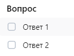
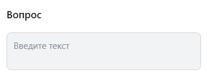

# Содержание
1. [Лид-формы и опросы](#лид-формы-и-опросы)
2. [Валидация](#валидация)
3. [Регистрация и авторизация](#регистрация-и-авторизация)
4. [Настройки](#настройки)

## Лид-формы и опросы
* Вверху страницы есть табы "Лид-формы", "Клиенты YCLIENTS" и "Опросы". Нажатие на табы переключает видимость
  соответствующих вкладок.
### Вкладка "Лид-формы"
* Если нет ни одной лид-формы, то отображаются кнопки "Создать лид-форму" и "Пройти обучение".
* Кнопка "Создать лид-форму". Нажатие приводит к появлению модального окна создания лид-формы.
* Модальное окно создания лид-формы. Кнопка "Отмена". При нажатии модальное окно закрывается и ничего не происходит.
#### Модальное окно создания лид-формы. Первый шаг "Оформление".
  
* Обязательное поле "Название лид-формы". Это название будет отображаться в списке лид-форм после сохранения.
* Обязательное поле "Логотип". Загрузка картинки приводит к появлению логотипа в окне предпросмотра (см. скриншот выше).
* Обязательное поле "Название компании". Изменение названия приводит к соответствующему изменению в окне предпросмотра (см. скриншот выше). Длина - не больше 30 символов.
* Обязательное поле "Заголовок". Изменение названия приводит к соответствующему изменению в окне предпросмотра (см. скриншот выше). Длина - не больше 50 символов.
* Обязательное поле "Описание формы". Изменение названия приводит к соответствующему изменению в окне предпросмотра (см. скриншот выше). Длина - не больше 35 символов.
* Кнопка "Продолжить". При нажатии проверяет заполненность обязательных полей и их валидность. 
Если какое-либо поле не заполнено - под ним появляется надпись "Обязательное поле". 
Если превышена допустимая длина какого-либо поля - под ним появляется надпись "Превышена максимальная длина поля".
В противном случае сохраняет состояние полей и переключается на второй шаг создания лид-формы "Вопросы".

#### Модальное окно создания лид-формы. Второй шаг "Вопросы".
* Кнопка "Добавить вопрос". Нажатие приводит к появлению нового вопроса.  
  
* Вопрос. Обязательное поле "Напишите вопрос". Максимальная длина - 68 символов, при дальнейшей попытке ввода текст обрезается без сообщений об ошибке.
* Вопрос. Кнопка мусорного ведра. Нажатие приводит к удалению вопроса из списка вопросов и из списка вопросов в предпросмотре (см. скриншот ниже).  
  
* Вопрос. Селектор "Тип вопрос". Содержит три пункта: "Выбор одного ответа", "Выбор нескольких ответов" и "Ответ в произвольной форме". 
Выбор первого пункта позволяет пользователю выбрать только один пункт (можно проверить через тип чекбокса в предпросмотре). 
Выбор второго пункта позволяет пользователю выбрать несколько пунктов (можно проверить через тип чекбокса в предпросмотре). 
Выбор третьего пункта позволяет пользователю вписать свой ответ (можно проверить в предпросмотре).  
 

  
* Вопрос. Кнопка "Добавить ответ". Нажатие приводит к появлению нового варианта ответа. Новый вариант ответа должен отображаться в окне предпросмотра. После добавления 7-го варианта ответа кнопка исчезает.
* Вопрос. Вариант ответа. Отображается только при выборе в селекторе "Выбор одного ответа" или "Выбор нескольких ответов". Максимальная длина ответа - 40 символов, при дальнейшем вводе поле обрезается. Введённый вариант ответа отображается в окне предпросмотра.
* Вопрос. Вариант ответа. Кнопка с крестиком. Нажатие приводит к удалению варианта ответа и его исчезновению из окна предпросмотра.
* Контактная информация. Кнопка "Добавить контактные данные". Нажатие приводит к появлению модального окна "Контактная информация".
* Контактная информация. Модальное окно "Контактная информация". Содержит варианты-чекбоксы "Имя", "Электронная почта", "Номер телефона", "Ссылка на соцсеть", "День рождения", "Город" и кнопку "Добавить". 
При нажатии кнопки добавляет в список требуемой контактной информации выбранные варианты. Для каждого из вариантов появляются соответствующие им инпуты в окне предпросмотра (см. скриншот).  
  
* Контактная информация. Элемент списка. Кнопка мусорного ведра. При нажатии элемент исчезает из списка и в окне предпросмотра исчезает инпут, связанный с удалённым вариантом. При удалении всех вариантов появляется сообщение "Минимальное количество полей: 1".  
  
* Кнопка "Продолжить". При нажатии проверяет заполненность всех обязательных полей и наличие хотя бы одной опции контактной информации. 
Если не заполнено название в одном из вопросов - вопрос выделяется красным. 
Если не заполнено хотя бы два варианта ответа (в случае опции одного или нескольких выборов в вопросе) - вопрос выделяется красным. 
Если не выбран ни один пункт контактной информации, то появляется сообщение "Минимальное количество полей: 1".
В противном случае сохраняет состояние полей и переключается на третий шаг создания лид-формы "Результат".

#### Модальное окно создания лид-формы. Третий шаг "Результат".
  
* Поле "Заголовок". Обязательно к заполнению. Максимальная длина - 25. Изменения отображаются в окне предпросмотра (см. скриншот выше).
* Поле "Описание". Не обязательно к заполнению. Максимальная длина - 160. Изменения отображаются в окне предпросмотра (см. скриншот выше).
* Кнопка "Продолжить". При нажатии проверяет, что все введённые поля корректны. 
Если не заполнено поле "Заголовок", то под ним появляется сообщение "Обязательное поле". 
Если какое-либо из полей превышает свою максимально допустимую длину, то под ним(-и) появляется сообщение "Превышена максимальная длина поля".
В противном случае сохраняет состояние полей и переключается на четвертый шаг создания лид-формы "Настройки".

#### Модальное окно создания лид-формы. Четвертый шаг "Настройки".
* Поле "ФИО". Обязательно к заполнению. (!!!) Изменение поля не приводит к изменению контента в окне предпросмотра, т.к. онр не влияет на лид-форму и пользователь его не видит: поле влияет лишь на пользовательское соглашение.
* Поле "Адрес регистрации по месту жительства". Обязательно к заполнению. (!!!) Изменение поля не приводит к изменению контента в окне предпросмотра, т.к. онр не влияет на лид-форму и пользователь его не видит: поле влияет лишь на пользовательское соглашение.
* Кнопка "Сохранить". При нажатии проверяет заполненность обязательных полей.
Если не заполнено какое-либо из обязательных полей, то под ним(-и) появляется надпись "Обязательное поле". 
В противном случае лид-форма сохраняется и она появляется в списке. Название лид-формы в списке должно соответствовать введённому при создании.

* Список лид-форм. Отображается только если есть хотя бы одна лид-форма.
* Список лид-форм. Элемент списка. Кнопка "Редактировать". Отображается только у активных лид-форм. 
Нажатие приводит к появлению модального окна редактирования лид-формы, которое полностью аналогично окну создания с той разницей, что поля на каждом из 4 этапов уже заполнены тем, что было введено.
* Список лид-форм. Элемент списка. Кнопка "Архивировать". Отображается только у активных лид-форм. Нажатие приводит к удалению лид-формы из списка активных и появлению в списке архивированных.
* Список лид-форм. Элемент списка. Кнопка "Восстановить". Отображается только у лид-форм в архиве. Нажатие приводит к удалению лид-формы из списка архивированных и появлению в списке активных.
* Список лид-форм. Выбор папки. Доступны опции "Активные", "В архиве". Выбор опции приводит в фильтрации списка лид-форм.
* Поиск. Поле поиска. При вводе текста в поле список обновляется в соответствии с запросом. Поиск происходит по названию лид-формы.
* Поиск. Поле поиска. Если по запросу ничего не найдено, то список становится пустым и отображается надпись "Ничего не нашлось".
* Кнопка "Пройти обучение". Нажатие приводит к появлению модального окна с вариантами обучения.
* Модальное окно обучения. Кнопка "Смотреть видеоурок от экспертов VK". Нажатие приводит к открытию другого модульного окна с видео.
* Модальное окно обучения. Кнопка "Смотреть курс на обучающей платформе". Нажатие приводит к переходу на [сайт с курсом](https://expert.vk.com/courses/kak-prodvigat-malyi-biznes-v-vk-reklame/).
* Модальное окно обучения. Кнопка "Создать лид-форму с подсказками". Нажатие приводит к появлению модального окна создания лид-формы (см. выше) с подсказками.
* Подсказки. Кнопка "Далее". Нажатие кнопки приводит к появлению следующей подсказки.  
* Подсказки. Кнопка "Назад". Нажатие кнопки приводит к появлению предыдущей подсказки.  
  
* Подсказки. Кнопка с крестиком. Нажатие на этот крестик приводит к появлению модального окна "Прервать обучение?".
* Подсказки. Модальное окно "Прервать обучение?". Кнопка "Прервать" приводит к закрытию модального окна создания лид-формы и пропаданию подсказок.
* Подсказки. Модальное окно "Прервать обучение?". Кнопка "Отмена" приводит к закрытию модального окна и возврату к модальному окну создания лид-формы с активными подсказками.

### Вкладка "Клиенты YCLIENTS"
> Проверки в данном разделе опущены, так как требуют наличия действующего аккаунта на сайте yclients.com

* Кнопка "Перейти в YCLIENTS". Нажатие приводит к переходу на [сайт yclients.com](https://www.yclients.com/).

### Вкладка "Опросы"
* Если нет ни одного опроса, то отображается кнопка "Создать опрос".
* Кнопка "Создать опрос". Нажатие приводит к появлению модального окна создания опроса.
* Модальное окно создания опроса. Кнопка "Отмена". При нажатии модальное окно закрывается и ничего не происходит.

#### Модальное окно создания опроса. Первый шаг "Оформление".
  
* Обязательное поле "Название". Это название будет отображаться в списке опросов после сохранения.
* Обязательное поле "Логотип". Загрузка картинки приводит к появлению логотипа в окне предпросмотра (см. скриншот выше).
* Обязательное поле "Название компании". Изменение названия приводит к соответствующему изменению в окне предпросмотра (см. скриншот выше). Длина - не больше 30 символов.
* Обязательное поле "Заголовок опроса". Изменение названия приводит к соответствующему изменению в окне предпросмотра (см. скриншот выше). Длина - не больше 50 символов.
* Обязательное поле "Описание опроса". Изменение названия приводит к соответствующему изменению в окне предпросмотра (см. скриншот выше). Длина - не больше 350 символов.
* Кнопка "Продолжить". При нажатии проверяет заполненность обязательных полей и их валидность. 
Если какое-либо поле не заполнено - под ним появляется надпись "Обязательное поле". 
Если превышена допустимая длина какого-либо поля - под ним появляется надпись "Превышена максимальная длина поля".
В противном случае сохраняет состояние полей и переключается на второй шаг создания опроса "Вопросы".

#### Модальное окно создания опроса. Второй шаг "Вопросы".
* Кнопка "Добавить вопрос". Нажатие приводит к появлению нового вопроса.  

* Вопрос. Обязательное поле "Текст вопроса". Максимальная длина - 68 символов, при дальнейшей попытке ввода текст обрезается без сообщений об ошибке.
* Вопрос. Кнопка дублирования. Нажатие приводит к дублированию данного вопроса и его вариантов ответа. Также он дублируется в предпросмотре.  
* Вопрос. Кнопка мусорного ведра. Отображается только в том случае, если в списке есть хотя бы ещё один вопрос. 
Нажатие приводит к удалению вопроса из списка вопросов и из списка вопросов в предпросмотре.  
* Вопрос. Селектор "Тип вопрос". Содержит три пункта: "Один из списка", "Несколько из списка", "Ответ в свободной форме" и "Шкала". 
Выбор первого пункта позволяет пользователю выбрать только один пункт (можно проверить через тип чекбокса в предпросмотре). 
Выбор второго пункта позволяет пользователю выбрать несколько пунктов (можно проверить через тип чекбокса в предпросмотре). 
Выбор третьего пункта позволяет пользователю вписать свой ответ (можно проверить в предпросмотре).  
Выбор четвертого пункта позволяет пользователю выбрать ответ от 1 до 10 (можно проверить в предпросмотре).  
 
 
 
  
* Вопрос. Кнопка "Добавить ответ". Нажатие приводит к появлению нового варианта ответа. Новый вариант ответа должен отображаться в окне предпросмотра.
* Вопрос. Вариант ответа. Отображается только при выборе в селекторе "Выбор одного ответа" или "Выбор нескольких ответов". Максимальная длина ответа - 40 символов, при дальнейшем вводе поле обрезается. Введённый вариант ответа отображается в окне предпросмотра.
* Вопрос. Вариант ответа. Кнопка с крестиком. Отображается только в том случае, если у вопроса уже 3 или более вариантов ответа. Нажатие приводит к удалению варианта ответа и его исчезновению из окна предпросмотра.
* Кнопка "Продолжить". При нажатии проверяет заполненность всех обязательных полей. 
Если не заполнено название в одном из вопросов - вопрос выделяется красным. 
Если не заполнено хотя бы два варианта ответа (в случае опции одного или нескольких выборов в вопросе) - вопрос выделяется красным. 
В противном случае сохраняет состояние полей и переключается на третий шаг создания лид-формы "Результат".

#### Модальное окно создания опроса. Третий шаг "Вопросы".
  
* Поле "Заголовок". Обязательно к заполнению. Изменения отображаются в окне предпросмотра. Максимальная длина - 25 символов.
* Поле "Описание". Обязательно к заполнению. Изменения отображаются в окне предпросмотра. Максимальная длина - 160 символов.
* Кнопка "Запустить опрос". При валидности полей модальное окно закрывается, опрос создаётся (можно проверить в списке опросов - должен появиться опрос с тем же названием, которое было введено на первом этапе). 
Если какое-либо из полей не заполнено, то под ним(-и) появляется надпись "Обязательное поле". 
Если какое-либо из полей превышает максимально допустимую длину символов, то под ним(-и) появляется надпись "Превышена максимальная длина поля".

* Список опросов. Отображается только если есть хотя бы один опрос.
* Список опросов. Элемент списка. Кнопка "Редактировать". Отображается только у активных опросов. Нажатие приводит к появлению модального окна редактирования опроса, которое полностью аналогично окну создания с той разницей, что поля в каждой из трех вкладок уже заполнены тем, что было введено ранее.
* Список опросов. Элемент списка. Кнопка "Архивировать". Отображается только у активных опросов. Нажатие приводит к удалению опроса из списка активных и появлению в списке архивированных.
* Список опросов. Элемент списка. Кнопка "Восстановить". Отображается только у опросов в архиве. Нажатие приводит к удалению опроса из списка архивированных и появлению в списке активных.
* Список опросов. Выбор папки. Доступны опции "Активные", "В архиве". Выбор опции приводит в фильтрации списка опросов.
* Поиск. Поле поиска. При вводе текста в поле список обновляется в соответствии с запросом. Поиск происходит по названию опроса.
* Поиск. Поле поиска. Если по запросу ничего не найдено, то список становится пустым и отображается надпись "Ничего не нашлось".

# Валидация
* Email. Ошибка, если в строке < одного или > одного символа `@`.
* Email. Ошибка, если после символа `@` нет хотя бы одного символа `.`
* Email. Ошибка, если до символа `@` нет хотя бы одного символа из множества `[a-zA-Z0-9]`.
* Email. Ошибка, если до символа `@` символы не из множества `[a-zA-Z0-9._-]`.
* Email. Ошибка, если между `@` и последней точкой нет хотя бы одного символа из множества `[a-zA-Zа-яА-Я0-9]` (в отличие от части до символа `@`, здесь допустима кириллица).
* Email. Ошибка, если между `@` и последней точкой есть символы не из `[a-zA-Zа-яА-Я0-9._-]`.
* Email. Ошибка, если после последней точки нет как минимум двух символов из множества `[a-zA-Zа-яА-Я]`.

* Номер телефона. Ошибка, если не начинается с `+`.
* Номер телефона. Ошибка, если содержит символы кроме `+` и цифр.
* Номер телефона. Ошибка, если содержит < 11-ти или > 13-ти цифр.

# Регистрация и авторизация
* [Главная страница](https://ads.vk.com). Хедер. Нажатие на "Перейти в кабинет". Редирект на VK ID, если пользователь не авторизован.
* [Главная страница](https://ads.vk.com). Хедер. Нажатие на "Перейти в кабинет". Редирект в [личный кабинет](https://ads.vk.com/hq/overview), если пользователь авторизован.

* Регистрация. Редирект на страницу регистрации после авторизации в VK ID, если ЛК не создан.
* Регистрация. Переключение языка. На выбор два языка: русский и english.
* Регистрация. Переключение языка. При переключении языка весь текст на текущей странице переводится на выбранный язык.
* Регистрация. Кнопка "Создать новый кабинет". При нажатии происходит редирект на страницу создания ЛК.
* Регистрация. Создание ЛК. Если выбран чекбокс "рекламодатель", то появляются чекбоксы "физ. лицо" и "юр. лицо".
* Регистрация. Создание ЛК. Если выбран чекбокс "агентство", то появляется только один чекбокс "юр. лицо".
* Регистрация. Создание ЛК. Если выбрано "физ. лицо", то появляются поля "ИНН" и "ФИО".
* Регистрация. Создание ЛК. Кнопка создать кабинет. Ошибка при нажатии, если не отмечены обязательные чекбоксы.
* Регистрация. Создание ЛК. Кнопка создать кабинет. Ошибка при нажатии, если не заполнены обязательные поля.
* Регистрация. Создание ЛК. Кнопка создать кабинет. Если все введённые данные валидны, то кабинет создаётся и происходит редирект в [личный кабинет](https://ads.vk.com/hq/overview).
    
# Настройки
## Содержание по вкладкам таббара в настройках
* [Общие](#категория-общие).
* [Уведомления](#категория-уведомления).
* [Права доступа](#категория-права-доступа).
* [История изменений](#категория-история-изменений).

* Боковое меню. Кнопка "Настройки". При нажатии происходит редирект на [соответствующую страницу](https://ads.vk.com/hq/settings).

## Категория "Общие"
* Кнопка "Удалить кабинет". При нажатии открывается модальное окно с подтверждением. При подтверждении кабинет удаляется и происходит редирект на [главную страницу VK ads](https://ads.vk.com/).
* Если на странице произошли изменения, то внизу страницы появляются кнопки "Сохранить" и "Отмена".
* Кнопка "Отмена". При нажатии все поля на странице возвращают своё прошлое состояние.
* Кнопка "Сохранить". При нажатии все поля сохраняют новое состояние, если они валидны (см. проверки ниже).

### Подкатегория "Контакты"
* Поле "Телефон". Если введён [невалидный](#валидация) номер, то при нажатии кнопки "Сохранить" отобразится надпись "некорректный номер телефона".
* Кнопка "Добавить email". При нажатии добавляется новое поле для ввода email.
* Кнопка "Добавить email". Можно создать не более 5 дополнительных почт, затем кнопка блокируется.
* Поле "Email". Если почта не подтверждена, то рядом отображается крестик.
* Поле "Email". Крестик. При нажатии поле удаляется.
* Поле "Email". Если введёна [невалидная](#валидация) почта, то при нажатии кнопки "Сохранить" отобразится надпись "некорректный email адрес".

### Подкатегория "Реквизиты"
* Поле "ФИО". Если ввести невалидное ФИО, то при нажатии "Сохранить" появится уведомление "Некорректные символы. Разрешена только кириллица, дефис и пробел".
* Поле "ИНН". Если ввести невалидный ИНН, который содержит символы помимо цифр, то при нажатии "Сохранить" появится уведомление "Невалидный ИНН".
* Поле "ИНН". Если ввести невалидный ИНН, который имеет длину != 12, то при нажатии "Сохранить" появится уведомление "Длина ИНН должна быть 12 символов".
* Поле "ИНН". Если ввести валидный (12 цифр), но несуществующий ИНН, то при нажатии "Сохранить" появится уведомление "Невалидный ИНН".  
> Для кабинетов, зарегистрированных на юр. лицо, валидность ИНН проверяется иначе. Здесь такие проверки опущены

> ИНН имеет свой определённый формат: последние две цифры являются контрольной суммой. То есть можно придумать и 
> захардкодить такой ИНН, который будет валиден по формату (12 цифр), но иметь невалидную контрольную сумму. Тогда можно
> быть уверенным в том, что в будущем не появится человек \ компания с таким ИНН и тест будет идемпотентным. 
> Подробно: http://www.kholenkov.ru/data-validation/inn/.  
> Вот какой ИНН можно захардкодить: 990000000081
 
### Подкатегория "Интерфейс"
* Поле "Название кабинета". При вводе 256-го в строке символа всё содержимое обрежется по 255 символ включительно.
* Поле "Название кабинета". Если поле пустое, то при сохранении в хедере будет отображаться имя клиента вместо названия кабинета.
* Язык интерфейса. При нажатии на кнопку "Сохранить" весь интерфейс (таббар, боковое меню, главный блок) переводится на выбранный язык. 
* Чекбокс "Распознавать горячие клавиши". Переключение чекбокса не приводит к появлению кнопки "Сохранить", состояние чекбокса запоминается без подтверждения.
* Чекбокс "Распознавать горячие клавиши". Кнопка "Список горячих клавиш". При нажатии открывается модальное окно со списком горячих клавиш.

## Категория "Уведомления"
### Подкатегория "Способы получения"
  
* Чекбоксы. Если ни один из чекбоксов не выбран, то отображается уведомление с надписью "Уведомления отключены".  
  
### Подкатегории "Основные" и "Новости и акции"
* Чекбоксы. Если ни одна из опций способов получения (см. пункт выше) не выбрана, то ни один чекбокс не доступен для выбора.  
  

## Категория "Права доступа"
* Надпись "Доступа к другим кабинетам пока нет". Отображается только в том случае, если у пользователя отсутствует доступ к другим кабинетам.   
  
* Кнопка "Добавить кабинет". При нажатии открывается модальное окно "Добавление кабинета".
* Модальное окно добавления кабинета. Поле "ID аккаунта VK рекламы". Можно вводить только цифры, максимум 10 символов.
* Модальное окно добавления кабинета. Поле "ID аккаунта VK рекламы". При вводе несуществующего ID во время сохранения появится уведомление "Что-то пошло не так".
* Модальное окно добавления кабинета. Поле "ID аккаунта VK рекламы". При вводе ID, которому уже выдан доступ, во время сохранения появится уведомление "Кабинет с таким ID уже добавлен".
* Модальное окно добавления кабинета. Кнопка "Отмена". При нажатии на кнопку окно закрывается, введённые данные теряются.
* Модальное окно добавления кабинета. Кнопка "Сохранить". При нажатии на кнопку окно закрывается, на указанный кабинет приходит уведомление с предложением принять приглашение.
* Список "Имеют доступ к этому кабинету". Отображается только в том случае, если пользователь выдал кому-то права.
* Список "Имеют доступ к этому кабинету". Кнопка удаления пользователя. Нажатие на кнопку приводит к открытию модального окна "Закрыть доступ для кабинета?".
* Модальное окно "Закрыть доступ для кабинета?". Кнопка "Отменить". При нажатии окно закрывается и ничего не происходит.
* Модальное окно "Закрыть доступ для кабинета?". Кнопка "Закрыть доступ". При нажатии окно закрывается и пользователь пропадает из списка.
* Поиск. Изменение содержимого поля приводит к фильтрации списка в соответствии с запросом.
* Поиск. Если по запросу ничего не найдено, то отображается надпись "Ничего не нашлось".

## Категория "История изменений"
> Чтобы в этой категории появились элементы с изменениями, нужно создать рекламную кампанию (сохранение в черновик
не считается), поэтому здесь будет приведён ограниченный список проверок
* Кнопка "Фильтр". При нажатии открывается модальное окно с фильтрами.
* Модальное окно с фильтрами. Список выбора категорий. Выбор любого из пунктов списка меняет список чекбоксов с фильтрами.
* Модальное окно с фильтрами. Поле поиска. При изменении содержимого поля список обновляется в соответствии с запросом.
* Модальное окно с фильтрами. Кнопка "Выбрать всё". При нажатии на кнопку происходит выделение всех чек-боксов в списке.
* Модальное окно с фильтрами. Кнопка "Выбрать всё". Кнопка отображается только в том случае, если ни один чек-бокс не выбран.
* Модальное окно с фильтрами. Кнопка "Сбросить". При нажатии на кнопку происходит снятие флажка на всех чек-боксах в списке.
* Модальное окно с фильтрами. Кнопка "Сбросить". Эта кнопка отображается только в том случае, если выбран хоть один чек-бокс.
* Модальное окно с фильтрами. Кнопка "Отмена". При нажатии на эту кнопку модальное окно закрывается и ничего не происходит.
* Модальное окно с фильтрами. Кнопка "Применить". При нажатии на эту кнопку модальное окно закрывается и выбранные фильтры появляются в списке применяемых.  
  
  
* Кнопка календаря. При нажатии открывается модальное окно с календарём.
* Модальное окно с календарём. Компонент календаря. Компонент календаря работает так же, как и на [странице с созданием кампаний](https://github.com/KristinaBu/homework-3-autumn-2024/blob/main/%D0%9A%D0%B8%D0%B1%D0%B5%D1%80%D0%BA%D0%BE%D1%82%D0%BB%D0%B5%D1%82%D0%BA%D0%B8-%D0%9A%D1%80%D0%B8%D1%81%D1%82%D0%B8%D0%BD%D0%B0-%D0%91%D1%83%D0%B9%D0%B4%D0%B8%D0%BD%D0%B0.md#%D0%BD%D0%B0%D1%81%D1%82%D1%80%D0%BE%D0%B9%D0%BA%D0%B0-%D0%BA%D0%B0%D0%BC%D0%BF%D0%B0%D0%BD%D0%B8%D0%B8)
* Список применяемых фильтров. Нажатие на крестик около выбранного фильтра приводит к удалению фильтра.
* Список применяемых фильтров. Кнопка "Сбросить все". Отображается только при наличии 2 и более фильтров.
* Список применяемых фильтров. Кнопка "Сбросить все". При нажатии все фильтры удаляются
