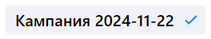

## Валидация

1. Обязательное поле. Если обязательное поле не заполнено, то при нажатии на кнопку "Продолжить" оно подсветится красным и появится надпись "Обязательное поле".
2. Название кампании, группы, объявления. Ошибка, если название состоит из менее 3 символов.
3. Поле ссылки на сайт. Ошибка "Неверный формат URL", если введенный URL в неверном формате(до точки хотя бы один символ из `[a-яА-Яa-zA-Z0-9]`, после точки минимум 2 символа из `[a-яА-Яa-zA-Z]`).
4. Поле ссылки на сайт. Ошибка "Не удалось подгрузить данные ссылки", если введена невалидная ссылка(без домена).

# Кампания

- Страница кампании. Надпись "Создайте первую рекламную кампанию" и кнопка "Создать кампанию", если у пользователя нет рекламных кампаний.
     
- Страница кампании. Кнопка "Создать кампанию". При нажатии открывается [страница создания кампании](https://ads.vk.com/hq/new_create/ad_plan).  

> Страница кампании. Кнопка "Фильтр". Работает аналогично кнопке "Фильтр" в ["Истории изменений"](https://github.com/blackHATred/homework-3-autumn-2024/blob/main/%D0%9A%D0%B8%D0%B1%D0%B5%D1%80%D0%BA%D0%BE%D1%82%D0%BB%D0%B5%D1%82%D0%BA%D0%B8-%D0%90%D0%BB%D0%B5%D0%BA%D1%81%D0%B0%D0%BD%D0%B4%D1%80-%D0%91%D0%B0%D1%82%D0%BE%D0%B2%D0%BA%D0%B8%D0%BD.md#%D0%BA%D0%B0%D1%82%D0%B5%D0%B3%D0%BE%D1%80%D0%B8%D1%8F-%D0%B8%D1%81%D1%82%D0%BE%D1%80%D0%B8%D1%8F-%D0%B8%D0%B7%D0%BC%D0%B5%D0%BD%D0%B5%D0%BD%D0%B8%D0%B9)).

- Страница кампании. Хедер. Поле поиска. Если ввести в поле поиска название кампании, то отобразятся варианты, в названии которых есть введенное слово.
- Страница кампании. Таблица кампаний. Если поставить галочку рядом с названием кампании, появится кнопка "Удалить".
- Страница кампаний. Таблица кампаний. Кнопка "Удалить". Если нажать на кнопку "Удалить", то появится модальное окно с удаления.
- Страница кампаний. Модальное окно удаления. Кнопка "Отмена". Если нажать на кнопку "Отмена", модальное окно закроется.
- Страница кампаний. Модальное окно удаления. Кнопка "Удалить". Если нажать на кнопку "Удалить", кампания удалится.
- Страница кампаний. Кнопка календаря. При нажатии на кнопку календаря появится календарь.
- Страница кампаний. Календарь. Если нажать на временной интервал, то на календаре подсветится соответствующий временной интервал.
- Страница кампаний. Календарь. Два поля ввода временного диапазона. Если ввести в поле даты, то на календаре подсветится диапазон дат, включая введенные.
- Страница кампаний. Календарь. Кнопка "Применить". При нажатии на кнопку "Применить" календарь закроется и на кнопке календаря появится диапазон заданных дат.
- Страница кампаний. Календарь. Кнопка "Отменить". При нажатии на кнопку "Отменить" календарь закроется и на кнопке календаря появится предыдущий диапазон дат.

## Настройка кампании

- Страница создания кампании. Поле названия кампании. Название кампании должно быть [валидным](#валидация).  

- Страница создания кампании. Футер. Кнопка "Продолжить". Если нажать на кнопку "Продолжить", то откроется следующий этап создания кампании.
- Страница создания кампании. Футер. Кнопка "Сохранить как черновик". Если нажать на кнопку "Сохранить как черновик", то кампания сохранится как черновик.
- Страница создания кампании. Футер. Кнопка "Продолжить". Если нажать на кнопку при ошибке валидации, то в футере появится кнопка с числом ошибок.   

- Страница кампании. Кнопка "Целевые действия". При нажатии на кнопку "Целевые действия" откроются варианты целевых действий.
- Страница кампании. Кнопка "Успеваемость и охват". При нажатии на кнопку "Успеваемость и охват" откроются варианты успеваемости и охвата.

## Настойка кампании: Целевые действия

- Целевые действия. Целевое действие "Сайт". Поле "Рекламируемый сайт". Поле должно быть [валидным](#валидация).
- Целевые действия. Целевое действие "Сайт". Поле "Важные отличия от конкурентов". Поле должно быть не более 300 символов.
- Целевые действия. Целевое действие "Сайт". Чекбокс "Оптимизация бюджета кампании". Если выбран этот чекбокс, то появятся дополнительные поля "Стратегия ставок" и "Бюджет".
- Целевые действия. Целевое действие "Сайт". Поле "Бюджет". Максимальная вводимая сумма в поле "Бюджет" должна составлять 13 знаков.
- Целевые действия. Целевое действие "Сайт". Поле "Бюджет". Если вводимая сумма менее 100 рублей, то поле подсветится красным и появится красная надпись "Укажите бюджет не меньше 100₽".
- Целевые действия. Целевое действие "Сайт". Поле "Даты проведения". Если в выпадающем списке выбрано "за все время", то поля "Даты проведения" становятся [обязательными](#валидация).
- Целевые действия. Целевое действие "Сайт". Поле "Даты проведения". При нажатии на поле открывается календарь.
- Целевые действия. Целевое действие "Сайт". Календарь. При нажатии на стрелочку вперед/назад, месяц на календаре сменится на следующий/предыдущий.
- Целевые действия. Целевое действие "Сайт". Календарь. Если нажать на дату, то она появится в поле "Даты проведения".

- Целевые действия. Целевое действие "Каталог товаров". Чекбокс "Объект рекламы". Если выбран "Сайт", то появятся поля "Рекламируемый сайт"(см. [Целевое действие "Сайт"](#настойка-кампании-целевые-действия)), выпадающий список ["Каталог товаров"](#центр-коммерции).   
  
- Целевые действия. Целевое действие "Каталог товаров". Выпадающий список "Каталог товаров". Если у пользователя нет товаров, то в выпадающем списке будет надпись "Ничего не найдено" и кнопка "Создать каталог".
- Целевые действия. Целевое действие "Каталог товаров". Выпадающий список "Каталог товаров". Если нажать на кнопку "Создать каталог", то появится форма для создания [каталога](#центр-коммерции).

Остальные элементы "Каталога товаров" совпадают с элементами из пункта [Целевое действие "Сайт"](#настойка-кампании-целевые-действия).

> Целевые действия. Целевое действие "Каталог товаров". Чекбокс "Объект рекламы". Так как пункты "Мобильное приложение", "Сообщество ВКонтакте", "Магазин на маркетплейсе" требуют взаимодействия с другими сервисами, проверки интеграции маркетплейсов с вк рекламой, тестирование их функционала будет опущено.

## Настройка кампании: Узнаваемость и охват

### Успеваемость и охват "Баннерная реклама"

- Успеваемость и охват. "Баннерная реклама". Чекбокс "Объект рекламы". Если выбран "Сайт", то появятся поле "Рекламируемый сайт"(см. [Целевое действие "Сайт"](#настойка-кампании-целевые-действия)).
- Успеваемость и охват. "Баннерная реклама". Поле "Цена за 1000 показов". Поле должно быть [валидным](#валидация).
- Успеваемость и охват. "Баннерная реклама". Поле "Цена за 1000 показов". Если ввести менее 70 рубля и нажать кнопку "Продолжить", то поле подсветится красным и появится красная надпись "Цена должна быть больше или равна 70 ₽".
- Успеваемость и охват. "Баннерная реклама". Чекбокс "Настройка частоты показов для кампании". Если выбран этот чекбокс, то появятся выпадающие списки "Показов на пользователя" с разной частотой показов.

> Успеваемость и охват. Чекбокс "Объект рекламы". Так как пункты "Мобильное приложение", "Сообщество ВКонтакте" требуют взаимодействия с другими сервисами, тестирование их функционала будет опущено.

### Успеваемость и охват "Видеореклама"

- Успеваемость и охват. "Видеореклама". Поле "Цена за 1000 показов". При выборе формата "Ролик в видео (In-stream)" если ввести менее 240 рублей и нажать кнопку "Продолжить", то поле подсветится красным и появится красная надпись "Цена должна быть больше или равна 240 ₽".

Элементы "Видеорекламы" соответствуют элементам из опции ["Баннерная реклама"](#успеваемость-и-охват-баннерная-реклама).

### Успеваемость и охват "HTML5 баннер"

Элементы соответствуют элементам из опции ["Баннерная реклама"](#успеваемость-и-охват-баннерная-реклама).

### Успеваемость и охват "Премиальное размещение"

- Успеваемость и охват. "Премиальное размещение". Чекбокс "Формат объявления". Если выбран вариант "Билборд", то появится чекбокс "Для каких устройств" с опциями "Все устройства", "Десктопные" и "Мобильные".
- Успеваемость и охват. "Премиальное размещение". Чекбокс "Формат объявления". Если выбран вариант "В Дзене", то появится чекбокс "Для каких устройств" с опциями "Десктопные" и "Мобильные".
- Успеваемость и охват. "Премиальное размещение". Чекбокс "Формат объявления". Если выбран вариант "В Новостях в Дзене", то появится чекбокс "Для каких устройств" с опциями "Все устройства", "Десктопные" и "Мобильные".
- Успеваемость и охват. "Премиальное размещение". Чекбокс "Формат объявления". Если выбран вариант "На весь экран", то появится чекбокс "Для каких устройств" с опцией "Десктопные".
- Успеваемость и охват. "Премиальное размещение". Чекбокс "Формат объявления". Если выбран вариант "240рх * 100%", то появится чекбокс "Для каких устройств" с опцией "Десктопные".

Остальные элементы "Премиального размещения" соответствуют элементам из опции ["Баннерная реклама"](#успеваемость-и-охват-баннерная-реклама).

> Так как целевые действия "Мобильное приложение", "Группа и профиль ОК", "Дзен", "Сообщество и профиль", "Музыка", "VK Mini Apps и игры", "Лид-формы и опросы" "Видео и трансляции", а также успеваемость и охват "Реклама в Дзене", "Запись, видео или клип" связаны с другими сервисами, проверки на их работу будут опущены.

## Группы объявлений

- Страница группы. Поле названия группы. Название группы должно быть [валидным](#валидация).
- Страница группы. Кнопка "Настроить даты проведения". При нажатии на кнопку открываются два поля "Даты проведения группы" (см. поля "Даты проведения" в [целевом действии "Сайт"](#настойка-кампании-целевые-действия)).
- Страница группы. Кнопка "Настроить во время показа". При нажатии на кнопку открывается календарь недель и дней недели.
- Страница группы. Календарь времени показа. Если нажать на пустую ячейку дня, то в ней появится галочка.
- Страница группы. Календарь времени показа. Если нажать на ячейку с галочкой, то галочка исчезнет.
- Страница группы. Календарь времени показа. Если нажать на день недели, то все ячейки этого дня недели заполнятся галочками, если они были пустыми, и наоборот.
- Страница группы. Кнопка "Добавить еще группу". При нажатии на кнопку появится еще одна группа объявлений.
 

- Страница группы. Подгруппа "Регионы показа". Поле для ввода региона, страны или города. Если ввести менее трех символов, то появится надпись "Введите поисковый запрос".
- Страница группы. Подгруппа "Регионы показа". Поле для ввода региона, страны или города. Если ввести слово, которое не встречается в названии региона, то появится надпись "Ничего не нашлось".
- Страница группы. Подгруппа "Регионы показа". Поле для ввода региона, страны или города. Если выбрать регион, то он появится в списке выбранных регионов.
- Страница группы. Подгруппа "Регионы показа". Поле для ввода региона, страны или города. Если нажать на крестик рядом с регионом, то он уберется из списка выбранных регионов.

- Страница группы. Подгруппа "Демография". Выпадающий список "Возрастная маркировка". Если выбрать возрастную маркировку больше, чем верхняя граница возраста, то появится надпись "Указанный возраст меньше выставленной маркировки".
  

> Т.к. остальные подгруппы связаны с функционалом аудиторий и пикселей, они не будут рассмотрены. 

## Объявления

- Страница объявлений. Поле названия объявления. Название объявления должно быть [валидным](#валидация).
- Страница объявлений. Кнопка "Добавить еще объявление". При нажатии на кнопку на боковой панели появится еще одно объявление.
- Страница объявлений. Кнопка "Опубликовать". При нажатии на кнопку при наличии ошибок - их число отобразится в футере.   

> Страница объявлений. Кнопка "Опубликовать". 
> Т.к. публикация требует взаимодействия с платежными сервисами, ее тестирование будет опущено.

# Центр коммерции

- Центр коммерции. Кнопка "Создать каталог". При нажатии на кнопку откроется форма создания [каталога](#создание-каталога).
- Центр коммерции. Поле поиска каталогов. Если ввести в поле поиска название каталога, то появится список каталогов, в названии которых есть введенное слово.
- Центр коммерции. Поле поиска каталогов. Если ввести название несуществующего каталога, то появится надпись "Ничего не нашлось".

### Создание каталога

- Центр коммерции. Форма создания каталога. Поле названия каталога. Название каталога должно быть [валидным](#валидация).
- Центр коммерции. Форма создания каталога. Если выбрать позицию "Вручную", то появится окно загрузки файла фида.
- Центр коммерции. Форма создания каталога. Кнопка "Продолжить". Если поле "Файл фида" не заполнено, то при нажатии на кнопку появится надпись "Обязательное поле".
- Центр коммерции. Форма создания каталога. Кнопка "Продолжить". Если нажать на нее, то создастся каталог.
- Центр коммерции. Форма создания каталога. Кнопка "Отмена". Если нажать на кнопку, то форма закроется.

> Т.к. позиции "Фид или сообщество" и "Маркетплейс" требуют проверки интеграции сообществ вк и маркетплейса, их тестирование будет опущено.
> Окно создания каталога состоит из следующих элементов:

### Страница каталога

- Страница каталога. Товары. Поле поиска каталогов. Если ввести в поле поиска название каталога, то появится список каталогов, в названии которых есть введенное слово.
- Страница каталога. Товары. Кнопка "Добавить товары". Если нажать на кнопку, то откроется модальное окно добавления товара.
- Страница каталога. Товары. Модальное окно добавления товара. Поле "Файл фида". Поле должно быть [валидным](#валидация).
- Страница каталога. Товары. Модальное окно добавления товара. Кнопка "Продолжить". Если нажать на кнопку, то товары добавятся в каталог.
- Страница каталога. Товары. Модальное окно добавления товара. Кнопка "Отмена". Если нажать на кнопку, то модальное окно закроется.
- Страница каталога. Товары. Хедер. Выпадающий список с каталогами. Если выбрать каталог, то откроется страница выбранного каталога.
- Страница каталога. Группы. Если нажать на кнопку "Создать группу", то появится 2 кнопки: "Использовать фильтры" и "Выбрать товары вручную".
- Страница каталога. Группы. Кнопка "Использовать фильтры". При нажатии на кнопку откроется модальное окно с фильтрами.
- Страница каталога. Группы. Модальное окно с фильтрами. Поле "Название группы". Название группы должно быть [валидным](#валидация).
- Страница каталога. Группы. Модальное окно с фильтрами. Кнопка "Добавить фильтр". Если нажать на кнопку, то появится новый фильтр.
- Страница каталога. Группы. Модальное окно с фильтрами. Кнопка "Сохранить". Если нажать на кнопку, то создастся группа.
- Страница каталога. Группы. Модальное окно с фильтрами. Кнопка "Отмена". Если нажать на кнопку, то модальное окно закроется.
- Страница каталога. Группы. Кнопка "Выбрать товары вручную". Если нажать на кнопку, то откроется модальное окно выбор товара.
- Страница каталога. Группы. Модальное окно выбора товара. Поле названия товара. Название товара должно быть [валидным](#валидация).
- Страница каталога. Группы. Модальное окно выбора товара. Поле поиска товаров. Если ввести в поле поиска название товара, то появится список товаров, в названии которых есть введенное слово.
- Страница каталога. Группы. Модальное окно выбора товара. Поле поиска товаров. Если ввести название несуществующего товара, то появится надпись "Ничего не нашлось".
- Страница каталога. Группы. Модальное окно выбора товара. Если нажать на товар, то он добавится в группу.
- Страница каталога. Группы. Модальное окно выбора товара. Кнопка "Сохранить". Если нажать на кнопку, то товар добавится в группу.
- Страница каталога. Группы. Модальное окно выбора товара. Кнопка "Отмена". Если нажать на кнопку, то модальное окно закроется.
- Страница каталога. Группы. Список групп. Поле поиска групп. Если ввести в поле поиска название группы, то появится список групп, в названии которых есть введенное слово.
- Страница каталога. Группы. Список групп. Если нажать на группу, то откроется страница группы.
- Страница каталога. Группы. Группа. Кнопка редактирования. Если нажать на кнопку редактирования, то откроется модальное окно редактирования этой группы.
- Страница каталога. История загрузок. Кнопка "Обновить файл". Если нажать на кнопку, то откроется модальное окно загрузки файла фида (аналогично модальному окну добавления товаров).
