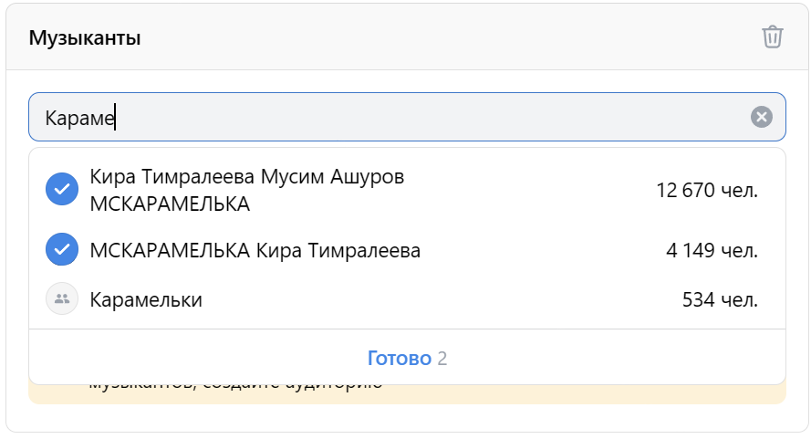
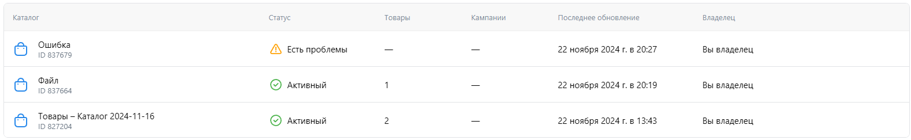

## Валидация

1. Валидация обязательных полей:
  - Если поле обязательно для заполнения, то при нажатии на кнопку "Продолжить" и если поле не заполнено, то оно подсветится красным и появится надпись "Обязательное поле".
2. Валидация названий кампании, группы, объявлений:
  - Название считается валидным, если состоит из 3 и более символов.
  - Пробел считается как символ, если стоит между двумя другими символами.
  - Если название валидное, то иконка галочки рядом с названием становится активной.   
      
  - Если название отредактировано, оно также меняется и в боковой панели со списком кампаний, групп, объявлений.

# Кампания

- Если у пользователя нет рекламных кампаний, то отображается надпись "Создайте первую рекламную кампанию" и кнопка "Создать кампанию".   
  
- Если у пользователя есть рекламные кампании, главная страница состоит из элементов:
  
  - Кнопка "Фильтр" (эта кнопка работает так же, как и в категории ["История изменений"](https://github.com/blackHATred/homework-3-autumn-2024/blob/main/%D0%9A%D0%B8%D0%B1%D0%B5%D1%80%D0%BA%D0%BE%D1%82%D0%BB%D0%B5%D1%82%D0%BA%D0%B8-%D0%90%D0%BB%D0%B5%D0%BA%D1%81%D0%B0%D0%BD%D0%B4%D1%80-%D0%91%D0%B0%D1%82%D0%BE%D0%B2%D0%BA%D0%B8%D0%BD.md#%D0%BA%D0%B0%D1%82%D0%B5%D0%B3%D0%BE%D1%80%D0%B8%D1%8F-%D0%B8%D1%81%D1%82%D0%BE%D1%80%D0%B8%D1%8F-%D0%B8%D0%B7%D0%BC%D0%B5%D0%BD%D0%B5%D0%BD%D0%B8%D0%B9)).
  - Поле поиска.
    - Если ввести в поле поиска название кампании/группы/объявления, то отобразятся варианты, в названии которых есть введенное слово.
    - Если нажать на крестик в поле поиска, то поле очистится.
  - Раздел "Кампании" с элементами:
    - Кнопка "Создать".
    - Таблица кампаний со столбцами:
      - Название кампании.
        - Если нажать на кнопку редактирования рядом с названием, откроется страница с редактированием выбранной кампании.
        - Если поставить галочку рядом с названием кампании, появится кнопка "Удалить" и в разделах "Группы" и "Объявления" число групп и объявлений, связанных с выбранной кампанией.
          - Если нажать на кнопку "Удалить", то появится модальное окно с кнопками "Отмена" и "Удалить".
          - Если нажать на кнопку "Удалить", то кампания удалится.
          - Если нажать на кнопку "Отмена", то модальное окно закроется.
      - Статус.
      - Бюджет, ₽.
      - Целевое действие.
      - ID кампании.
      - Поле "Итого" с числом кампаний в таблице.
    - Кнопка календаря с элементами:
      - Временные интервалы:
        - Сегодня.
          - При выборе это временного интервала на календаре подсвечивается сегодняшняя дата.
        - Вчера.
          - При выборе этого временного интервала на календаре подсвечивается вчерашняя дата.
        - Последние 7 дней
          - При выборе этого временного интервала на календаре подсвечиваются последние 7 дней.
        - Прошлая неделя.
          - При выборе этого временного интервала на календаре подсвечивается прошлая неделя.
        - Этот месяц.
          - При выборе этого временного интервала на календаре подсвечивается текущий месяц.
        - Прошлый месяц.
          - При выборе этого временного интервала на календаре подсвечивается прошлый месяц.
        - Этот квартал.
          - При выборе этого временного интервала на календаре подсвечивается текущий квартал.
        - Прошлый квартал.
          - При выборе этого временного интервала на календаре подсвечивается прошлый квартал.
        - Этот год.
          - При выборе этого временного интервала на календаре подсвечивается текущий год.
        - Последний год.
          - При выборе этого временного интервала на календаре подсвечивается последний год.
      - Два поля ввода временного диапазона.
        - Если ввести в поле даты, то на календаре подсветится диапазон дат, включая введенные.
      - Календарь.
        - Календарь состоит из элементов:
          - Название первого месяца и года, в котором лежит выбранный диапазон.
          - Два месяца: текущий и следующий.
          - Дни недели над таблицей дат.
          - Даты месяца в формате таблицы.
        - Текущая дата в календаре подчеркнута.
        - Если на календаре отметить две даты, то из них составится диапазон.
        - Если нажать на стрелочки вперед/назад, то календарь перейдет на следующий/предыдущий месяц.
      - Кнопка "Применить".
        - При нажатии на кнопку "Применить" календарь закроется и на кнопке календаря появится диапазон заданных дат.
      - Кнопка "Отменить".
        - При нажатии на кнопку "Отменить" календарь закроется и на кнопке календаря появится предыдущий диапазон дат.
    - Кнопка настройки кампании (имеет функционал, аналогичный функционалу [кнопки с шестеренкой](#страница-каталога)).
  - Раздел "Группы".
    - Кнопка "Создать".
    - Таблица групп с элементами:
      - Название группы.
        - Функционал аналогичен функционалу названия кампании.
      - Статус.
      - Бюджет, ₽.
      - ID группы.
      - ID кампании.
      - Поле "Итого" с числом групп в таблице.
    - Кнопка настройки группы (имеет функционал, аналогичный функционалу [кнопки с шестеренкой](#страница-каталога)).
    - Кнопка календаря (имеет функционал, аналогичный функционалу [кнопки календаря](#кампания)).
  - Раздел "Объявления".
    - Кнопка "Создать".
    - Таблица объявлений с элементами:
      - Название объявления.
        - Функционал аналогичен функционалу названия кампании.
      - Статус.
      - ID объявления.
      - ID группы.
      - ID кампании.
      - Поле "Итого" с числом объявлений в таблице.
    - Кнопка настройки объявления (имеет функционал, аналогичный функционалу [кнопки с шестеренкой](#страница-каталога)).
    - Кнопка календаря (имеет функционал, аналогичный функционалу [кнопки календаря](#кампания)).

## Настройка кампании

- При нажатии на кнопку "Создать кампанию" открывается [страница создания кампании](https://ads.vk.com/hq/new_create/ad_plan), которая состоит из таких элементов:
  - Боковая панель, содержащая:
    - Список кампаний пользователя, включая текущую.
    - Итоговый бюджет кампании в рублях.
  - Навбар с этапами создания кампании ("Настройка кампании", "Группы объявлений", "Объявления").
  - Заголовок с названием кампании:
    - При нажатии на название кампании открывается поле для редактирования названия.
    - Название должно быть [валидным](#валидация).
    - При нажатии на иконку с тремя точками в заголовке, появится кнопка "скопировать кампанию":   
      
      - При нажатии на кнопку "скопировать кампанию", откроется блок "Кампания", состоящий из элементов:
        - Выпадающий список с выбором кампаний.
          - Если кампаний нет, то в выпадающем списке будет надпись "Ничего не найдено".    
            
          - Если кампаний есть, то они появятся в выпадающем списке.
        - Кнопка "Отменить копирование".
          - При нажатии на эту кнопку пользователь возвращается к настройке кампании.
  - Разделы [целевые действия](#настойка-кампании-целевые-действия) и [узнаваемость и охват](#настройка-кампании-узнаваемость-и-охват).
    - При нажатии на раздел открывается выпадающий список с вариантами целевых действий и узнаваемости и охвата.
    - При выборе варианта в разделе появляются элементы формы, соответствующие выбранному варианту:
      - При выборе блоков в разделах "целевые действия" и "узнаваемость и охват" в навбаре появляется счетчик лимита объявлений.
      - При наведении на иконку со знаком вопроса рядом с лимитом объявлений появляется поясняющее окно.   
        
    - При наведении на иконку со знаком вопроса рядом с разделами "целевые действия" и "узнаваемость и охват" появляется поясняющее окно рядом с соответствующим разделом, в котором написано, для чего нужен этот раздел.
  - Футер с кнопкой "Продолжить".

## Настойка кампании: Целевые действия

### Целевое действие "Сайт"

- При выборе варианта "Сайт" под вариантами добавятся такие элементы формы:
  - Поле для ввода ссылки на рекламируемый сайт ([Обязательное поле](#валидация)), при вводе которого появляются остальные элементы (см. ниже).
    - Если ввести невалидную ссылку(без домена), то поле подсветится красным и появится красная надпись "Не удалось подгрузить данные ссылки.      
      
    - Если ввести URL в неверном формате (до точки хотя бы один символ из `[a-zA-Z0-9]`, после точки минимум 2 символа из `[a-zA-Z]`), то поле подсветится красным и появится красная надпись "Неверный формат URL".   
      
    - Если ввести URL с пробелами или с заглавными буквами после точки, то он приведется в вид без пробелов и без заглавных букв. При этом первоначально введенный вид будет сохранен в выпадающем списке и приведенный вид будед подписан под ним.   
      
  - Поле "Важные отличия от конкурентов" с ограничением на длину ввода 300 символов, открывается при заполненном поле "Рекламируемый сайт".
    - Вводимый текст обрезается по длине 300 символов и дальше ввод недоступен.
  - Выпадающий список "Целевое действие" с опциями "Клики по рекламе" и "Показы рекламы", открывается при заполненном поле "Рекламируемый сайт".
  - Чекбокс "Учитывать офлайн-конверсии", открывается при заполненном поле "Рекламируемый сайт".
  - Чекбокс "Оптимизация бюджета кампании", открывается при заполненном поле "Рекламируемый сайт". Если выбрать эту опцию, то будут добавлены поля:
    - Выпадающий список "Стратегия вставок" с опциями "Минимальная цена" и "Предельная цена".
    - Если выбрать "Минимальная цена" добавляются элементы:
      - Поле "Бюджет"([Обязательное поле](#валидация)).
        - Максимальная вводимая сумма в поле "Бюджет" должна составлять 13 знаков.
        - Для ввода допускаются только цифры.
        - Если ввести менее 100 рублей и нажать кнопку "Продолжить", то поле подсветится красным и появится красная надпись "Укажите бюджет не меньше 100₽".
      - Выпадающий список с опциями "За день" и "За все время".
    - Если выбрать "Предельная цена" добавляются элементы:
      - Поле "Макс. стоимость клика".
      - Элементы из пункта "Минимальная цена".
  - Два поля "Даты проведения" - начало и конец ([Обязательные поля](#валидация), если в выпадающем списке выбрать "за все время").
    - При нажатии на поле открывается окно календаря, содержащее элементы:
      - Выпадающий список месяца.
      - Выпадающий список года.
      - Кнопки-стрелочки для переключения между месяцами.
      - Даты месяца в формате таблицы.
      - Дни недели над таблицей дат.   
        
    - Текущая дата в календаре подчеркнута.
    - Предыдущие даты (отсчет от текущей даты) в календаре недоступны для выбора.
    - Выбранная дата становится активной.
    - Даты месяца после выбранной даты конца являются неактивными в календаре для даты начала, таким образом нельзя выбрать дату начала позже даты конца.
    - Даты месяца до выбранной даты начала являются неактивными в календаре для даты конца, таким образом нельзя выбрать дату конца раньше даты начала.
    - Если нажать на кнопку-стрелочку вперед/назад, то месяц на календаре сменится на следующий/предыдущий.
- При нажатии на кнопку "Продолжить", если будут незаполненные обязательные поля, в футере появится кнопка с числом ошибок.
- При нажатии на кнопку с числом ошибок появится поясняющее окно со ссылками на незаполненные поля.   
  

### Целевое действие "Каталог товаров"

- При выборе варианта "Каталог товаров" под вариантами добавится Ряд опций с выбором "Объекта рекламы":
1. Если выбрать "Сайт", то появятся поля:
  - Поле "Рекламируемый сайт" (см. [Целевое действие "Сайт"](#целевое-действие-сайт)).
    - Выпадающий список ["Каталог товаров"](#центр-коммерции).
      - Если в каталоге пользователя нет товаров, в выпадающем списке будет надпись "Ничего не найдено" и кнопка "Создать каталог".
      - Если у пользователя есть каталоги, то они появятся в выпадающем списке.   
        
      - Если нажать на кнопку "Создать каталог", то справа выдвинется боковая панель с заголовком "Новый каталог" и формой для создания [каталога](#центр-коммерции).
  - Чекбоксы "Тип кампании":
    - Чекбокс "Привлечение потенциальных клиентов".
    - Чекбокс "Динамический ретаргетинг".
  - Остальные элементы, начиная с выпадающего списка "Целевой действие", совпадают с пунктом [Целевое действие "Сайт"](#целевое-действие-сайт)
2. Если выбрать "Мобильное приложение".
   > Так как этот пункт требует взаимодействия с другими сервисами, тестирование его функционала будет опущено.
3. Если выбрать "Сообщество ВКонтакте".
   > Так как этот пункт требует проверки интеграции вк сообществ, тестирование его функционала будет опущено.
4. Если выбрать "Магазин на маркетплейсе".
   > Так как этот пункт требует проверки интеграции маркетплейсов с вк рекламой, тестирование его функционала будет опущено.

### Целевое действие "Лид-формы и опросы"

- При выборе варианта "Лид-формы и опросы" под вариантами добавятся элементы:
  - Чекбокс "Объект рекламы" с опциями "Лид-форма" и "Опрос".
  - Если выбрать "Лид-форма", появятся элементы:
    - Выпадающий список "Лид-форма" ([Обязательное поле](#валидация)).
      - Если у пользователя нет лид-форм, то в выпадающем списке будет надпись "Ничего не найдено" и кнопка "Создать лид-форму".
      - Если нажать на кнопку "Создать лид-форму", то откроется окно создания лид-формы.
      - Если у пользователя есть лид-формы, они появятся в выпадающем списке и кнопка "Создать лид-форму".   
        
    - Чекбокс "Сплит-тест".
      - Если выбрать эту опцию, то появится еще одно поле "Лид-форма" ([Обязательное поле](#валидация)).
      - Максимально можно включить 3 дополнительные поля "Лид-форма" в сплит-тест.
    - Чекбокс "Целевое действие".
    - Даты проведения (см. [целевое действие "Сайт"](#целевое-действие-сайт)).
  - Если выбрать "Опрос", появятся элементы:
    - Выпадающий список "Форма опроса" ([Обязательное поле](#валидация)).
      - Если у пользователя нет опросов, то в выпадающем списке будет надпись "Ничего не найдено" и кнопка "Создать опрос".
      - Если нажать на кнопку "Создать опрос", то откроется окно создания опроса.
      - Если у пользователя есть опросы, они появятся в выпадающем списке и кнопка "Создать опрос".   
        
    - Чекбокс "Целевое действие".
    - Поле "Количество респондентов" ([Обязательное поле](#валидация)).
      - Если ввести менее 10 нажать кнопку "Продолжить", то поле подсветится красным и появится красная надпись "Количество респондентов должно быть не меньше 10".
    - Поле "Бюджет" (см. [целевое действие "Сайт"](#целевое-действие-сайт)).
      - Под полем выводится информационное сообщение о минимальном бюджете, который рассчитывается исходя из числа респондентов (сумма = число респондентов * 100).
    - Даты проведения (см. [целевое действие "Сайт"](#целевое-действие-сайт)).
    - Информационное сообщение "Кампания остановится автоматически, когда будет достигнуто заданное количество респондентов".

## Настройка кампании: Узнаваемость и охват

### Успеваемость и охват "Баннерная реклама"

- При выборе варианта "Баннерная реклама" под вариантами добавятся элементы:
  - Кнопки "Формат объявления":
    - Кнопка "Все форматы".
    - Кнопка "Новые форматы скоро" (недоступна для выбора).
  - Чекбокс "Объект рекламы" с опциями "Сайт", "Сообщество ВКонтакте", "Мобильное приложение".
  - Выпадающий список "Целевое действие".
  - Поле "Цена за 1000 показов" ([Обязательное поле](#валидация)).
    - Если ввести менее 70 рубля и нажать кнопку "Продолжить", то поле подсветится красным и появится красная надпись "Цена должна быть больше или равна 70 ₽".
  - Чекбокс "Распределение бюджета" с опциями "Равномерное" и "быстрое".
  - Чекбокс "Настройка частоты показов для кампании".
    - Если выбрать эту опцию, то появятся выпадающие списки "Показов на пользователя":
      - Выпадающий список, определяющий число показов.
      - Выпадающий список, определяющий период времени, за который бужет проводиться указанное число показов.
  - Остальные элементы соответствуют элементам из опции "Сайт" в [Целевом действии "Каталог товаров"](#целевое-действие-каталог-товаров), начиная от элемента чекбокс "Оптимизация бюджета кампании":
    - Меняется только выпадающий список "Стратегия ставок" - с опциями "Максимум показов", "Предельная цена", "Фиксированная ставка".

### Успеваемость и охват "Видеореклама"

- При выборе варианта "Баннерная реклама" под вариантами добавятся элементы:
  - Кнопки "Формат объявления":
    - Кнопка "Все видеоформаты".
    - Кнопка "Ролик в видео (In-stream).
    - Кнопка "Новые форматы скоро" (недоступна для выбора).
  - Остальные элементы соответствуют элементам из опции ["Баннерная реклама"](#успеваемость-и-охват-баннерная-реклама), начиная от элемента чекбокс "Объект рекламы".
    - Меняется только поле "Цена за 1000 показов":
      - Если ввести менее 240 рублей и нажать кнопку "Продолжить", то поле подсветится красным и появится красная надпись "Цена должна быть больше или равна 240 ₽".

### Успеваемость и охват "Запись, видео или клип"

- При выборе варианта "Запись, видео или клип" под вариантами добавятся элементы:
  - Кнопки "Что будете рекламировать?":
    - Кнопка "Запись".
    - Кнопка "Клипы".
    - Кнопка "Видео и трансляции".
  - Поле "Рекламируемый объект" (см. пункт 3 в [целевом действии "Каталог товаров"](#целевое-действие-каталог-товаров)).
  - Остальные элементы соответствуют элементам из опции ["Баннерная реклама"](#успеваемость-и-охват-баннерная-реклама), начиная от элемента выпадающий список "Целевое действие".

### Успеваемость и охват "Реклама в дзене"

- При выборе варианта "Реклама в дзене" под вариантами добавятся элементы:
  - Кнопки "Что будете рекламировать?":
    - Кнопка "Статья".
    - Кнопка "Канал".
  - Кнопка "Перейти в Студию" Дзена, которая ведет на страницу [продвижения статьи или канала](https://dzen.ru/profile/editor/id/673901ba393a6401fd3748ee/campaigns).

### Успеваемость и охват "HTML5 баннер"

- При выборе варианта "HTML5 баннер" под вариантами добавятся элементы:
  - Кнопки "Формат баннера":
    - Кнопки "240px * 400px", "100% * 90px", "300px * 600px" для десктопных версий.
    - Кнопки "100% * 300px", "100% * 100px", "300px * 250px" для мобильных версий.
  - Поле "Рекламируемый сайт" (см. [Целевое действие "Сайт"](#целевое-действие-сайт)).
  - Остальные элементы соответствуют элементам из опции ["Баннерная реклама"](#успеваемость-и-охват-баннерная-реклама), начиная от элемента выпадающий список "Целевое действие".
    - Меняется только поле "Цена за 1000 показов":
      - Если ввести менее 150 рублей и нажать кнопку "Продолжить", то поле подсветится красным и появится красная надпись "Цена должна быть больше или равна 150 ₽".

### Успеваемость и охват "Премиальное размещение"

- При выборе варианта "HTML5 баннер" под вариантами добавятся элементы:
  - Кнопки "Формат объявления":
    - Кнопка "Билборд":
      - Чекбокс "Для каких устройств" с опциями "Все устройства", "Десктопные" и "Мобильные".
      - Остальные элементы соответствуют элементам из успеваемости и охвата ["HTML5 баннер"](#успеваемость-и-охват-html5-баннер), начиная от элемента кнопки "Рекламируемый сайт".
        - Меняется только поле "Цена за 1000 показов":
          - Если ввести менее 400 рублей и нажать кнопку "Продолжить", то поле подсветится красным и появится красная надпись "Цена должна быть больше или равна 400 ₽".
    - Кнопка "В Дзене":
      - Чекбокс "Для каких устройств" с опциями "Десктопные" и "Мобильные".
      - Остальные элементы соответствуют элементам из успеваемости и охвата ["HTML5 баннер"](#успеваемость-и-охват-html5-баннер), начиная от элемента кнопки "Что будете рекламировать?".
        - Меняется только поле "Цена за 1000 показов":
          - Если ввести менее 300 рублей и нажать кнопку "Продолжить", то поле подсветится красным и появится красная надпись "Цена должна быть больше или равна 300 ₽".
    - Кнопка "В Новостях в Дзене":
      - Чекбокс "Для каких устройств" с опциями "Все устройства", "Десктопные" и "Мобильные".
      - Остальные элементы соответствуют элементам из успеваемости и охвата ["HTML5 баннер"](#успеваемость-и-охват-html5-баннер), начиная от элемента кнопки "Рекламируемый сайт".
        - Меняется только поле "Цена за 1000 показов":
          - Если ввести менее 250 рублей и нажать кнопку "Продолжить", то поле подсветится красным и появится красная надпись "Цена должна быть больше или равна 250 ₽".
    - Кнопка "На весь экран":
      - Чекбокс "Для каких устройств" с опцией "Десктопные".
      - Остальные элементы соответствуют элементам из успеваемости и охвата ["HTML5 баннер"](#успеваемость-и-охват-html5-баннер), начиная от элемента кнопки "Рекламируемый сайт".
        - Меняется только поле "Цена за 1000 показов":
          - Если ввести менее 300 рублей и нажать кнопку "Продолжить", то поле подсветится красным и появится красная надпись "Цена должна быть больше или равна 300 ₽".
    - Кнопка "240рх * 100%":
      - Все элементы соответствуют элементам из пункта Кнопка "Еа весь экран".

> Так как целевые действия "Мобильное приложение", "Группа и профиль ОК", "Дзен", "Сообщество и профиль", "Музыка", "VK Mini Apps и игры", "Видео и трансляции", а также успеваемость и охват "Реклама в Дзене" связаны с другими сервисами, проверки на их работу будут опущены.

- При нажатии на кнопку "Продолжить" в футере открывается страница создания группы объявлений данной кампании.
  - При переходе на этап "Группы объявлений" предыдущий этап "Настройка кампании" помечается зеленой галочной в хедере, а номер текущего этапа "Группы объявлений" становится синим.

## Группы объявлений

- При переходе на этап "Группы объявлений" открывается страница создания группы объявлений, состоящая из следующих элементов:
  - Название группы:
    - Если нажать на название группы, то появится поле для ввода названия группы.
    - Название должно быть [валидным](#валидация).
    - Если нажать на три точки рядом с названием, то появятся опции:
      - "Дублировать группу".
        - Если нажать на эту кнопку, то на боковой панели будет создана копия группы объявлений.
      - "Удалить группу".
        - Если нажать на эту кнопку, то появится модальное окно с предупреждением о удалении группы объявлений и кнопками "Отмена" и "Удалить".
        - Если нажать на кнопку "Удалить", то группа объявлений будет удалена.
        - Если нажать на кнопку "Отмена", то модальное окно закроется.
      - "Добавить объявление".
        - Если нажать на эту кнопку, то на боковой панели появится [объявление](#объявления) текущей группы.
  - Поле "Стратегия ставок" - недоступно для изменения (установлено на уровне кампании).
  - Кнопка "Настроить даты проведения".
    - При нажатии на кнопку открываются два поля "Даты проведения группы" (см. поля "Даты проведения" в [целевом действии "Сайт"](#целевое-действие-сайт)).
    - Если нажать на крестик рядом с полями, они закрываются.
  - Кнопка "Настроить время показа":
    - При нажатии на кнопку открываются элементы:
      - Кнопки "Мое время", "Будни", "Рабочее", "Выходные", кнопка корзины.
      - Таблица времени показа с номерами недель в столбцах и днями недели в строках.
        - При нажатии на пустую ячейку, в ячейке появляется галочка.
        - При нажатии на ячейку с галочкой, галочка убирается.
        - При нажатии на день недели, строка с этим днем недели заполняется галочками, если она до этого была с пустыми ячейками, и наоборот.
        - При нажатии на номер недели, столбец с этим номером недели заполняется галочками, если он до этого был с пустыми ячейками, и наоборот.
        - При нажатии на кнопку корзины, все галочки убираются.
        - При нажатии на кнопку "Будни", "Рабочее", "Выходные", галочки расставляются в соответствии с выбранными кнопками:
          - "Будни" - галочки ставятся в ячейках с понедельника по пятницу.
          - "Рабочее" - галочки ставятся в ячейках с понедельника по пятницу с 8 по 19 неделю.
          - "Выходные" - галочки ставятся в ячейках с субботы по воскресенье.
          - При остальных вариантах расставления галочек, не подходящих под "Будни", "Рабочее", "Выходные", выделяется кнопка "Мое время".
        - При нажатии на крестик рядом с таблицей, она закрывается.
      - Чекбокс "Учитывать местное время".
      - Чекбокс "Учитывать праздники".
        
  - Чекбокс "Распределение бюджета" с опциями "Равномерное" и "Быстрое" - недоступно для изменения (установлено на уровне кампании).
  - Подгруппы "Регионы показа", "Демография", "Интересы и поведение", "Аудитория", "Параметры URL", "Места размещения", "Дополнительные настройки".
  - Кнопка "Добавить еще группу".
    - Если нажать на кнопку, то на боковой панели появится еще одна группа объявлений.   
      

### Подгруппа "Регионы показа"

- При нажатии на кнопку-стрелочку рядом с названием подгруппы открываются элементы:
  - Кнопки быстрого выбора местоположения:
    - Если нажать на кнопку быстрого выбора, то данная страна, регион или город добавляется в список выбранных регионов и появится надпись, сколько выбрано регионов.
    - Если нажать на крестик рядом с регионом, то он уберется из списка регионов.
    - Если выбрано 2 и более регионов, то появляется кнопка "Очистить все".
    - При нажатии на кнопку "Очистить все" все выбранные регионы убираются из списка.
  - Поле для ввода региона, страны или города:
    - Если ввести менее трех символов, то появится надпись "Введите поисковый запрос".
    - Если ввести слово, которые не встречается в названии региона, то появится надпись "Ничего не нашлось".
    - Если ввести регион, в составе которого есть другие регионы, то рядом с ним в списке будет кнопка "Развернуть".
      - Если нажать на кнопку "Развернуть", то откроется список регионов, входящих в состав выбранного региона.
        
    - Если ввести регион, в составе которого нет других регионов, то рядом с ним будет регион, в состав которого он входит.
    - Если Поставить галочку напротив региона из найденных регионов, то он добавится в список выбранных регионов.
    - Если убрать галочку напротив найденного региона, то он уберется из списка выбранных регионов.
  - Кнопка "Добавить списком":
    - При нажатии на кнопку открывается модальное окно "Добавление списка" с элементами:
      - Поле для ввода региона, страны или города.
      - Кнопка для загрузки файла с регионами.
      - Кнопка "Добавить".
    - Если ввести название региона, страны или города и нажать кнопку "Добавить", то появится надпись "Добавлен 1 регион".
    - Если ввести одно или несколько названий региона, страны или города и нажать кнопку "Добавить", то появится надпись "Добавлено N регионов".
    - Если загрузить файл с регионами и нажать кнопку "Добавить", то появится надпись "Добавлено N регионов", при этом текст из файла появится в поле для ввода региона, страны или города.
      
- Если подгруппа будет в свернутом виде и если у подгруппы выбран регион или регионы, то под названием подгруппы появятся выбранные регионы.
- Если подгруппа будет в свернутом виде и если у подгруппы не выбрано ни одного региона, то под названием подгруппы появится надпись "Не заданы".

### Подгруппа "Демография"

- При нажатии на кнопку-стрелочку рядом с названием подгруппы открываются элементы:
  - Чекбокс "Пол" с опциями "Любой", "Мужской" и "Женский".
  - Два выпадающих списка "Возраст", означающих диапазон целевой аудитории.
  - Выпадающий список "Возрастная маркировка".
    - Если выбрать возрастную маркировку больше, чем верхняя граница возраста, то появится надпись "Указанный возраст меньше выставленной маркировки".
      
  - Чекбокс "Социальная реклама".
- Если подгруппа будет в свернутом виде и если у подгруппы выбраны параметры демографии, то под названием подгруппы появится надпись с введенными параметрами пола и возраста.
- Если подгруппа будет в свернутом виде и если у подгруппы не выбраны параметры демографии, то под названием подгруппы появится надпись "Любой пол, любой вариант".
  

### Подгруппа "Интересы и поведение"

- При нажатии на кнопку-стрелочку рядом с названием подгруппы открываются элементы:   
  
  - Раздел "Интересы", состоящий из элементов:
    - Иконка корзины:
      - При нажатии на иконку корзины удаляются все выбранные интересы и сам раздел сворачивается
    - Поле для ввода названия интереса.
      - Если ввести интерес, который не встречается в списке интересов, то появится надпись "Ничего не найдено".
      - Если выбрать интерес или группу интереса, то он добавится в список выбранных интересов.
      - Если выбрать группу интересов, то из результатов поиска исчезнут интересы, входящие в эту группу.
      - Если нажать на крестик рядом с выбранным интересом, то он уберется из списка выбранных интересов.
    - Кнопка "Добавить исключения", при нажатии на которую появится поле для ввода названия интереса:
      - Правила добавления исключений аналогичны правилам добавления интересов.
      - Если нажать на крестик рядом с полем для ввода названия исключений, то оно закроется.
  - Раздел "Ключевые фразы", состоящий из элементов:
    - Иконка корзины:
      - При нажатии на иконку корзины удаляются все введенные ключевые фразы и сам раздел сворачивается.
    - Поле "Ключевые фразы" для ввода ключевых слов.
      - Если ввести ключевую фразу, которая есть в списке ключевых фраз, то появится кнопка "Показать N похожих", где N - количество похожих ключевых фраз.
      - Если нажать на кнопку "Показать N похожих", то появится список похожих ключевых фраз, состоящий из ключевых фраз, кнопки "Отмена" и кнопки "Добавить все".
        
      - Если нажать на кнопку "Отмена", то список похожих ключевых фраз закроется.
      - Если нажать на кнопку "Добавить все", то все ключевые фразы из списка похожих ключевых фраз добавятся в поле ключевых фраз.
      - Если нажать на кнопку плюс рядом с ключевой фразой, то она добавится в поле ключевых фраз.
      - Слова, введенные на одной строке, считаются за одну ключевую фразу.
      -    
    - Поле "Минус-фразы" для ввода слов, которые не должны встречаться в интересах целевой аудитории.
    - Поле "Период поиска" в днях.
      - Если ввести менее 1 или более 30, то поле подсветится красным и появится надпись "От 1 до 30 дней".
    - Если ввести ключевые фразы в поле "Ключевые фразы", то появится информационное сообщение с предложением создать [аудиторию](#подгруппа-аудитория) с данными ключевыми фразами и кнопкой "Создать аудиторию".
      -  Если нажать на кнопку "Создать аудиторию", то создастся аудитория с данными ключевыми фразами.
  - Раздел "Музыканты", состоящий из элементов:
    - Иконка корзины:
      - При нажатии на иконку корзины удаляются все выбранные музыканты и сам раздел сворачивается.
    - Поле для ввода названия музыканта.
      - Если ввести музыканта, который не встречается в списке музыкантов, то появится надпись "Ничего не нашлось".
      - Если нажать на крестик в углу поля, то оно очистится.
      - Если выбрать 1 или нескольких музыкантов, то их число отобразится рядом с кнопкой "Готово" в списке найденных музыкантов.
      - Если нажать на кнопку "Готово", то выбранные музыканты добавятся в список выбранных музыкантов.
      - Если нажать на крестик рядом с выбранным музыкантом, то он уберется из списка выбранных музыкантов.
      - Если нажать на кнопку "Удалить все", то все выбранные музыканты уберутся из списка.
      - Если выбран хотя бы один музыкант, то появится информационное сообщение с предложением создать [аудиторию](#подгруппа-аудитория) с данными музыкантами и кнопкой "Создать аудиторию".
        - Если нажать на кнопку "Создать аудиторию", то создастся аудитория с данными музыкантами.
          
- Если подгруппа будет в свернутом виде и если у подгруппы выбраны параметры интересов, то под названием подгруппы появится надпись "Интересов выбрано: N", где N - количество выбранных интересов.
- Если подгруппа будет в свернутом виде и если у подгруппы не выбраны параметры интересов, то под названием подгруппы появится надпись "Не заданы".

### Подгруппа "Аудитория"

- При нажатии на кнопку-стрелочку рядом с названием подгруппы открываются элементы:
  - Поле "Пользовательские аудитории" для ввода названия аудитории.
    - При нажатии на стрелочку внутри поля откроется выпадающий список с аудиториями пользователя.
    - Если по запросу не нашлось аудиторий, то появится надпись "Ничего не нашлось".
    - Если нажать на кнопку редактирования рядом с найденной аудиторией, то откроется окно редактирования аудитории (т.к. Аудитории - отдельный раздел VK Рекламы, подробное рассмотрение функционала будет опущено).
    - Если выбрать аудиторию, то она добавится в список выбранных аудиторий.
    - Если нажать на крестик рядом с выбранной аудиторией, то она уберется из списка выбранных аудиторий.
  - Кнопка "Добавить исключения".
    - Функционирует аналогично полю "Пользовательские аудитории".
    - Если нажать на крестик рядом с полем для ввода исключений, то оно закроется.
  - Кнопка "Собирать аудитории".
    - При нажатии на кнопку откроется выпадающий список "Какие действия сохранять", в котором можно выбрать показы, клики и процент просмотров.
    - Если нажать на крестик рядом с выпадающим списком, то он закроется.
    - При выборе одного или нескольких вариантов из выпадающего списке, появляется поле "В какую аудиторию сохранять".
    - Если нажать на крестик рядом с выбранным действием, оно уберется из поля "Какие действия сохранять".
    - Если нажать на кнопку "Добавить аудиторию", появится новый комплект полей "Какие действия сохранять" и "В какую аудиторию сохранять".
- Если подгруппа будет в свернутом виде и если у подгруппы выбраны аудитории, то под названием подгруппы появится надпись "Выбрано N аудиторий", где N - количество аудиторий.
- Если подгруппа будет в свернутом виде и если у подгруппы не выбраны аудитории, то под названием подгруппы появится надпись "Не заданы".

### Подгруппа "Параметры URL"

- При нажатии на кнопку-стрелочку рядом с названием подгруппы открываются элементы:
  - Чекбокс с опциями:
    - "Добавлять UTM-метки автоматически".
      - Если выбрать этот чекбокс, то появится поле с автоматической UTM-меткой, которую нельзя менять.
    - "Добавлять UTM-метки вручную".
      - Если выбрать этот чекбокс, то появится поле для ввода UTM-меток с уже введенной дефолтной UTM-меткой.
    - "Не добавлять UTM-метки".
- Выбранный чекбокс отобразится под названием подгруппы, когда подгруппа будет в свернутом виде.
  - Если выбрать опцию "Добавлять UTM-метки вручную", то появится пользовательская UTM-метка.

### Подгруппа "Места размещения"

- При нажатии на кнопку-стрелочку рядом с названием подгруппы открываются элементы:
  - Чекбокс "Автоматический выбор мест размещения".
    - Если отключить чекбокс, то появится чекбокс "Проекты VK", который нельзя изменить.
- Если подгруппа будет в свернутом виде, то у нее в любом случае будет надпись "Автоматический выбор мест размещения".

### Подгруппа "Дополнительные настройки"

- При нажатии на кнопку-стрелочку рядом с названием подгруппы открываются элементы:
  - Чекбокс "Настройка частоты показов для группы".
    - Если при настройке кампании опция ["Настройка частоты показов для кампании"](#успеваемость-и-охват-баннерная-реклама) была выключена, то она будет недоступна для изменения.
  - Кнопка "Добавить аудит-пиксель".
    - Если нажать на кнопку, то появится поле "Ссылка на аудит-пиксель".
    - Поскольку аудит-пиксель - это инструмент для сбора статистики, который относится к разделу "Сайты", то его функционал будет опущен.

### Информационное окно

- Информационное окно "Целевая аудитория" состоит из таких элементов:
  -  "Целевая аудитория", где отображается, сколько человек входит в целевую аудиторию.
  - Подраздел "Прогноз на 7 дней":
    - "Охват ~N%", где N - процент охвата целевой аудитории, с диапазоном охвата в тысячах человек за 7 дней.
    - Показы в тысячах человек за 7 дней.
    - Количество кликов за 7 дней.   
      
- Если ЦА будет меньше 10 000 человек, то возникнет надпись "Слишком узкая аудитория".   
  

## Объявления

- При переходе на этап "Объявления" открывается страница создания объявления, состоящая из следующих элементов:
  - Название объявления.
    - Если нажать на название объявления, то появится поле для ввода названия объявления.
    - Название должно быть [валидным](#валидация).
    - Если нажать на три точки рядом с названием, то появятся опции:
      - "Дублировать объявление".
        - Если нажать на эту кнопку, то на боковой панели будет создано дубликат объявления.
      - "Удалить объявление".
        - Если нажать на эту кнопку, то появится модальное окно с предупреждением о удалении объявления и кнопками "Отмена" и "Удалить".
        - Если нажать на кнопку "Удалить", то объявление будет удалено.
        - Если нажать на кнопку "Отмена", то модальное окно закроется.
  - Предпросмотр объявления, который содержит
  - Форма объявления, которая содержит элементы:
    - Поле "Логотип", где должен быть логотип рекламы ([Обязательное поле](#валидация)).
    - Поле "Заголовок" ([Обязательное поле](#валидация)).
      - Если ввести более 40 символов, то появится надпись "Превышена максимальная длина поля
    - Поле "Короткое описание" ([Обязательное поле](#валидация)).
      - Если ввести более 90 символов, то появится надпись "Превышена максимальная длина поля".
    - Поле "Длинное описание".
      - Если ввести более 2000 символов, то появится надпись "Превышена максимальная длина поля".
    - Поле "Текст рядом с кнопкой".
    - Поле "Ссылка на сайт" ([Обязательное поле](#валидация)).
    - Выпадающий список "Надпись на кнопке" ([Обязательное поле](#валидация)).
    - Поле "Медиафайлы".
    - Поле "О рекламодателе".
      - Если ввести более 115 символов, то появится надпись "Превышена максимальная длина поля".
  - Кнопка "Добавить еще объявление".
    - Если нажать на кнопку, то на боковой панели появится еще одно объявление.
- В футере отображается кнопка "Опубликовать" 
> Т.к. публикация требует взаимодействия с платежными сервисами, ее тестирование будет опущено.

# Центр коммерции

- При переходе на этап "Центр коммерции" открывается страница, состоящая из элементов:
  - Кнопка "Создать каталог".
    - Если нажать на кнопку, то откроется окно [создания каталога](#создание-каталога).
  - Поле поиска каталогов.
    - Если ввести название каталога, то появится список каталогов, в названии которых есть введенное слово.
    - Если ввести название несуществующего каталога, то появится надпись "Ничего не нашлось".
    - Если нажать на крестик в поле поиска, то оно очистится.
  - Список каталогов, состоящий из столбцов:
    - Каталог - содержит название каталога.
    - Статус - определяет статус "Активный" или "Есть проблемы".
    - Товары - показывает число товаров в каталоге.
    - Последнее обновление - показывает дату последнего обновления каталога.
    - Владелец - показывает владельца каталога.
      

- Если нажать на многоточие рядом с каталогом, то появятся опции:
  - "Настроить каталог".
    - Если нажать на эту кнопку, то откроется окно редактирования каталога, состоящее из элементов:
      - Раздел "Основные":
        - Поле "Название" каталога ([Обязательное поле](#валидация)).
        - Чекбокс "Автоматически удалять UTM-метки".
      - Раздел "Доступы". (Этот раздел работает так же, как и в разделе ["Права доступа"](https://github.com/blackHATred/homework-3-autumn-2024/blob/main/%D0%9A%D0%B8%D0%B1%D0%B5%D1%80%D0%BA%D0%BE%D1%82%D0%BB%D0%B5%D1%82%D0%BA%D0%B8-%D0%90%D0%BB%D0%B5%D0%BA%D1%81%D0%B0%D0%BD%D0%B4%D1%80-%D0%91%D0%B0%D1%82%D0%BE%D0%B2%D0%BA%D0%B8%D0%BD.md#%D0%BA%D0%B0%D1%82%D0%B5%D0%B3%D0%BE%D1%80%D0%B8%D1%8F-%D0%BF%D1%80%D0%B0%D0%B2%D0%B0-%D0%B4%D0%BE%D1%81%D1%82%D1%83%D0%BF%D0%B0)).
      - Кнопка "Сохранить изменения".
        - Если нажать на кнопку, то изменения сохранятся.
      - Кнопка "Отмена".
        - Если нажать на кнопку "Отмена", то окно редактирования каталога закроется без сохранения изменений.
      - Кнопка "Удалить каталог".
        - Если нажать на эту кнопку, то появится модальное окно с предупреждением об удалении каталога и кнопками "Отмена" и "Удалить".
        - Если нажать на кнопку "Удалить", то каталог будет удален.
  - "Удалить каталог".
    - Если нажать на эту кнопку, то появится модальное окно с предупреждением об удалении каталога и кнопками "Отмена" и "Удалить".
    - Если нажать на кнопку "Удалить", то каталог будет удален.

- Если нажать на каталог в списке каталогов, то откроется [страница каталога](#страница-каталога).

### Создание каталога

Окно создания каталога состоит из следующих элементов:
- Поле с названием каталога ([Обязательное поле](#валидация))
- Позиции для каталога:
  - "Фид или сообщество".
    > Так как этот пункт требует проверки интеграции сообществ вк, то он будет опущен.
  - "Маркетплейс".
    > Так как этот пункт требует проверки интеграции маркетплейса и получения API key, то он будет опущен.
  - При нажатии на кнопку "Вручную" появятся элементы:
    - Выпадающий список "Категория фида".
    - Кнопка для скачивания шаблона выбранного фида.
    - Поле "Файл фида" для загрузки заполненного шаблона ([Обязательное поле](#валидация)).
    - Чекбокс "Автоматически удалять UTM-метки"
- Кнопка "Создать каталог".
  - Если создать каталог с названием, которое уже есть, то появится модальное окно "Такой каталог уже есть"
    
  - При успешном создании каталога он появляется в списке каталогов.
- Кнопка "Отмена".
  - При нажатии на кнопку "Отмена" окно создания каталога закрывается.

### Страница каталога

- При переходе на страницу каталога открывается страница, состоящая из элементов:
  - Выпадающий список с каталогами.
    - Если выбрать каталог, то откроется страница каталога.
  - Счетчики товаров.
  - Кнопка "Настройки" каталога.
    - Функционал кнопки аналогичен функционалу кнопки "Настроить каталог" в разделе ["Центр коммерции"](#центр-коммерции).
  - Раздел "Товары", состоящий из элементов:
    
    - Кнопка "Добавить товары" - есть у каталога, созданного вручную.
      - Если нажать на кнопку, то откроется окно добавления товара, состоящее из элементов:
        - Поле "Файл фида" для загрузки файла ([Обязательное поле](#валидация)).
        - Чекбокс с опциями "Обновить каталог" и "Заменить каталог".
        - Кнопки "Продолжить" и "Отмена".
          - Если нажать на кнопку "Добавить", то товары добавятся в каталог.
          - Если нажать на кнопку "Отмена", то окно добавления товара закроется.
    - Кнопка "Рекламировать", которая перенаправляет на страницу [кампании](#настройка-кампании) в раздел целевого действия ["Каталог товаров"](#целевое-действие-каталог-товаров).
    - Поле поиска товаров (функционал аналогичен функционалу поля поиска каталогов).
    - Таблица товаров:
      - Таблица товаров имеет поля:
        - Наличие.
        - Цена
        - Скидка, %.
        - Название товара.
        - Тип.
        - Производитель.
        - Модель.
        - Категория товара.
        - Возрастная группа.
        - Пол.
        - Состояние.
        - Рейтинг.
      - Если нажать на сам товар в таблице, то откроется окно с информацией о товаре из столбцов таблицы.
      - Если поставить галочку напротив товара, то появится кнопка архивации товара.
        - Если нажать на кнопку, то появится модальное окно с предупреждением об архивации товара и кнопками "Отменить" и "Архивировать".
        - Если нажать на кнопку "Архивировать", то товар будет архивирован, и его статус изменится на "В архиве".
        - Если нажать на кнопку "Отменить", то модальное окно закроется.
        - Если выделить архивированный товар, появится кнопка "Восстановить".
          - Если нажать на кнопку, то откроется модальное окно с предупреждением о восстановлении товара и кнопками "Отменить" и "Восстановить".
    - Кнопка шестеренки.
      - Если нажать на кнопку, то появится модальное окно "Настройка таблицы", состоящее из элементов:
        - Поле поиска (функционал аналогичен функционалу поля поиска товаров).
        - Чекбоксы "Информация" с опциями:
          - "Наличие".
          - "Цена".
          - "Скидка, %".
        - Кнопка "Сбросить" рядом с чекбоксами "Информация".
          - Если нажать на кнопку "Сбросить", то чекбоксы "Информация" сбросятся и вместо кнопки "Сбросить" появится кнопка "Выбрать все".
          - Если нажать на кнопку "Выбрать все", то все чекбоксы "Информация" будут выбраны, и вместо кнопки "Выбрать все" появится кнопка "Сбросить".
        - Чекбоксы "Основные метрики" с опциями:
          - "Название товара".
          - "Тип".
          - "Производитель".
          - "Модель".
          - "Категория товара".
          - "Возрастная группа".
          - "Пол".
          - "Состояние".
          - "Рейтинг".
        - Кнопка "Сбросить" рядом с чекбоксами "Основные метрики".
          - Функционал аналогичен функционалу кнопки "Сбросить" рядом с чекбоксами "Информация".
        - Список столбцов таблицы.
          - Если нажать на крестик рядом со столбцом таблицы, то столбец исчезнет из таблицы.
        - Кнопка "Сбросить" рядом со списком столбцов таблицы.
          - Если нажать на кнопку "Сбросить", то все список приведется к исходному виду.
        - Кнопка "Применить".
          - Если нажать на кнопку "Применить", то изменения применятся к таблице товаров.
        - Кнопка "Отмена".
          - Если нажать на кнопку "Отмена", то модальное окно закроется.
  - Раздел "Группы", состоящий из элементов:
    
    - Кнопка "Создать группу".
      - При нажатии на кнопку открывается выпадающий список с вариантами:
        - "Использовать фильтры".
        - "Выбрать товар вручную".
      - Если выбрать опцию "Использовать фильтры", то появится окно создания группы, состоящее из элементов:
        - Поле "Название группы" ([Обязательное поле](#валидация)).
        - Выпадающий список условий с вариантами соответствия "всем условиям" или "хотя бы одному из условий"
        - Выпадающий список "Фильтр" с фильтром по цене, типу и т.д.
        - Выпадающий список "Условие", по которому фильтруются значения.
        - Поле "Значение" для ввода значения фильтра.
        - Кнопка "Добавить фильтр"
          - Если нажать на кнопку, то добавится еще один фильтр.
        - Список товаров, соответствующих фильтрам.
          - Если товаров, соответствующих фильтрам, нет, то появится надпись "Ничего не нашлось".
        - Кнопка "Сохранить".
          - Если нажать на кнопку, то группа создастся.
        - Кнопка "Отмена".
          - Если нажать на кнопку, то окно создания группы закроется.
      - Если выбрать опцию "Выбрать товар вручную", то появится окно создания группы, состоящее из элементов:
        - Поле "Название группы" ([Обязательное поле](#валидация)).
        - Категория "Выбор товаров":
          - Поле поиска товаров.
          - Список имеющихся товаров.
            - Если поставить галочку напротив товара, то он добавится в группу.
          - Кнопка "Добавить списком".
            - Если нажать на кнопку, то появится модальное окно с полем для ввода ID товаров.
            - Если ввести ID товаров, то появится список товаров.
            - Если нажать на кнопку "Добавить в группу", то товары добавятся в группу.
        - Категория "Выбранные":
          - Поле поиска товаров.
          - Список выбранных товаров.
          - Кнопка "Добавить списком".
            - Функционал аналогичен функционалу кнопки "Добавить списком" в категории "Выбор товаров".
    - Поле поиска групп.
    - Список групп.
    - Список всех товаров.
    - Поле поиска товаров (см. [Поле поиска товаров](#страница-каталога)).
  - Раздел "Диагностики":
    - Если проблем нет, то появится надпись "Все хорошо".
    - Если проблемы есть, то появятся элементы:
      - Кнопка "Скачать полный отчет".
      - Кнопка "Проверить снова".
      - Выпадающий список с типом проблем.
  - Раздел "События" (т.к. этот раздел подразумевает наличие пикселя, который относится к разделу "Сайты", то функционал раздела будет опущен).
  - Раздел "История загрузок", состоящий из элементов:
    - Кнопка "Обновить файл" (см. [Кнопка "Обновить каталог"](#страница-каталога)).
    - Таблица с историей загрузок, содержащая столбцы:
      - Статус и дата обновления.
      - Обновлено.
      - Добавлено.
      - Удалено.
      - Ошибки.
      - Предупреждения.

